# NBA 的 2023 MVP 是…

> 原文：<https://towardsdatascience.com/the-nbas-2023-mvp-is-ff78deb85122?source=collection_archive---------56----------------------->

## 用递归线性回归预测 NBA 球员的职业生涯

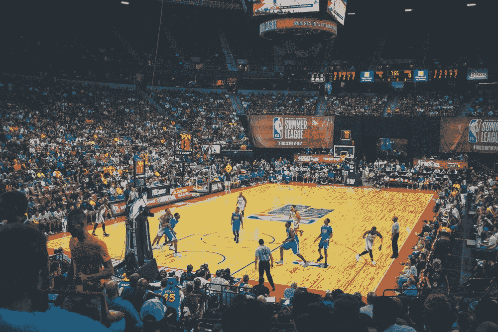

在 [Unsplash](https://unsplash.com/) 上 [NeONBRAND](https://unsplash.com/@neonbrand) 拍摄的照片

作为一个体育迷，有一种无法满足的渴望让我们不停地对未来做出大胆的预测。大规模的工业兴起来挠这个痒，幻想体育和赌博立即浮现在脑海里。此外，当我们在游戏范围内没有可预测的东西时，我们的预测就会超出范围。在最近的超级碗比赛中，人们不仅可以在比赛的 MVP 上下注，还可以在小狗碗 MVP 上下注。很明显我们控制不住自己。说到预测，我和其他人没什么不同。

欢迎来到我的体育主题数据科学系列的第四部分。几周前，我发表了《T4:年龄的资产》，详细描述了为什么 NBA 总经理在 NBA 选秀中觊觎青少年。总的来说，球员通常在二十岁左右快速发展，这可以通过数据清楚地显示出来。

为了将球员发展的概念更进一步，并进入预测领域，我使用我在之前的分析中收集的数据建立了一个模型，用于预测未来 NBA 球员的统计数据。在本文中，我讨论了项目的总体概念、数据准备、模型设计和性能表征。在文章的最后，我会提出我对 NBA 2023 年 MVP 的预测。

复制这个项目所需的所有代码都可以在 [Github](https://github.com/alexmuhr/NBA_Player_Predictions) 上找到。

# 项目概念

这个项目的一般概念是，一个球员过去的表现和年龄预示着他们未来的表现。除非受伤，球员的下个赛季通常会和他们最近的赛季相似。考虑到这一点，可以使用过去几个赛季的统计数据来预测未来的一个赛季。然后，输出预测可以用作预测未来 2 个季节的输入，然后可以用于预测未来 3 个季节，等等。

## 递归模型

我刚才描述的是一个循环模型。递归神经网络由于其学习复杂函数的能力，是目前最流行的递归模型。然而，通过将输出作为输入反馈到模型中，可以使任何类型的回归模型重复出现。这可以通过线性回归、随机森林回归或梯度增强回归等方法来实现。因为 NBA 职业生涯的轨迹相对简单，所以不太复杂的回归模型，例如线性回归，实际上产生了最好的结果。更复杂的模型，如递归神经网络倾向于过度拟合这个问题，这导致一些非常奇怪的预测时，预测多个季节的未来。

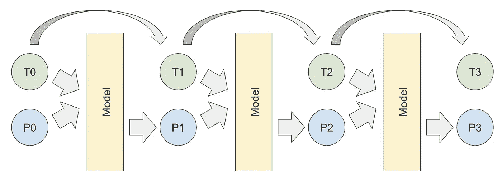

广义递归回归的表示。Pn+1 的预测是通过将最近的预测 Pn 与时间 Tn 相结合并馈入模型进行的。

## 非周期时间序列

关于预测 NBA 球员职业生涯，另一个需要注意的重要事情是，虽然这看起来像是一个典型的时间序列问题，但实际上不是。大多数时间序列都是周期性的，就像农业产出在多年内反复增减，有许多峰值和谷值。另一方面，一个 NBA 球员的职业生涯通常有一个增长期，然后是一个下降期；只有一个山峰，没有山谷。这不是一个周期性的过程。因此，旨在预测周期性数据的时间序列模型在这类问题上显然表现不佳。

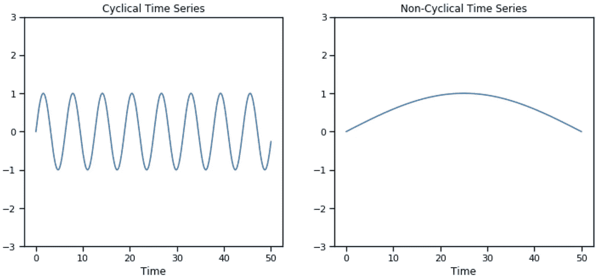

周期性与非周期性时间序列的比较。

## 预测目标和特征选择

对于这个项目，我希望能够预测一个赛季球员所有的传统得分统计。这些预测目标还必须作为模型输入，以产生重复预测。最后，我决定预测以下 13 个特征:2 分命中率，2 分尝试，3 分命中率，3 分尝试，罚球命中率，罚球尝试，防守篮板，进攻篮板，助攻，抢断，盖帽，失误，个人犯规。

上面列出的非百分比特征，也就是计数统计，都被转换为每 36 分钟统计。这有助于平滑数据集，因为许多季节因受伤而缩短。为了将每 36 分钟统计数据的预测转换回总数，训练了一个单独的模型，根据球员过去的分钟数和预测的表现来预测分钟数。

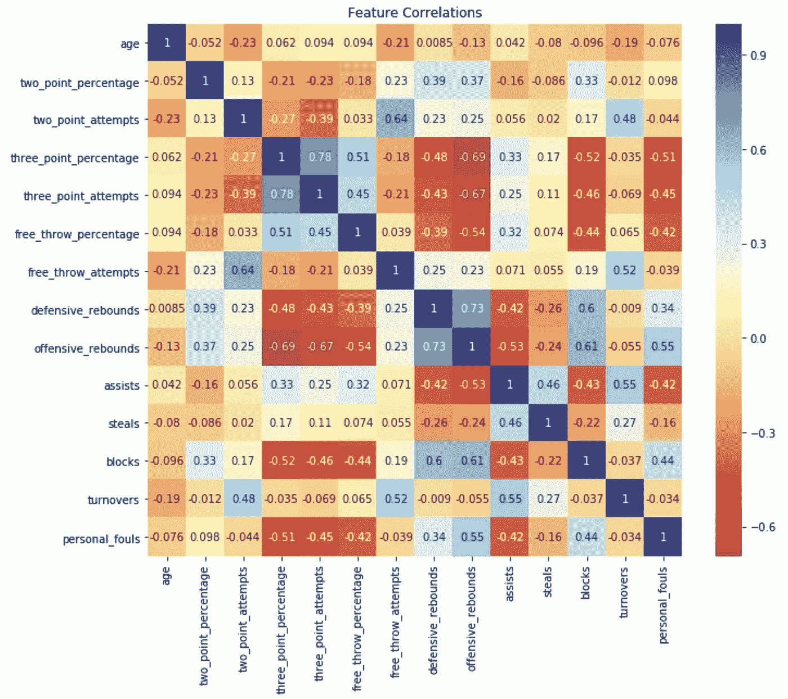

选择作为模型输入/输出的特征之间的相关性。

# 数据准备

与大多数数据科学项目一样，优化预测性能在很大程度上取决于获取质量数据、数据清理和特征工程。以下详细介绍了所使用的大多数数据准备步骤。

## 数据采集

这个项目的数据是从[运动参考 API](https://sportsreference.readthedocs.io/en/stable/) 中收集的，这个 API 之前在这个链接的[文章](/sports-reference-api-intro-dbce09e89e52)中讨论过。本文介绍了如何使用 API 来构建一个全面的 NBA 球员统计数据集。这是用作该项目的起点的同一数据集。该数据集包含过去 20 年中在 NBA 打球的每个球员每个赛季的各种传统和高级统计数据。

这个项目的数据是使用体育参考 API 获取的。

## 数据清理

在训练预测模型之前，需要执行许多数据清理步骤。最明显的是去除由非常小的几分钟样本量组成的季节。这些季节更有可能包含极端的统计异常值。总上场时间少于 400 分钟的赛季被删除。

另一个必要的清洁步骤是考虑低样品量拍摄的情况。例如，你知道伊内斯·坎特在 2013 赛季犹他爵士队的三分球命中率为 100%吗(1 投 1 中)。像这样的数据点，如果不加以考虑，会导致一些关于 3pt 投篮的相当荒谬的预测。在数据集中还有大约 700 个赛季，球员没有投出一个三分球，这些必须被分配一个有限的百分比。实施的解决方案是当样本量较低时，将拍摄百分比限制在某个范围内。

## 特征工程

第一个特征工程步骤是将上场时间转换成所有可能上场时间的比例。对于这一步，我们假设每场比赛的最大可能上场时间是 40 分钟。使用这种假设，上场时间的比例可以很容易地计算如下，(上场时间比例)=(上场时间)/((上场时间)* 40)。这有助于解释因受伤或停摆而缩短的赛季。

应用的第二个特征工程技巧是将 3 个百分点乘以 1.8。结合下述步骤，这有效地将 3 个百分点的模型输出限制在 55.5%，有助于防止模型过度预测 3 个百分点。

在应用上述特征工程步骤后，所有百分比特征、投篮命中率和上场时间比例都使用 [logit](https://en.wikipedia.org/wiki/Logit) 函数转换为对数赔率。实质上，这将任何后续线性回归转换为逻辑回归，并将要素的预测限制在范围(0，1)内。这个技巧在我之前的文章[战胜困难](/beating-the-odds-8d26b1a83f1b)中有更详细的描述。使用 [sigmoid](https://en.wikipedia.org/wiki/Sigmoid_function) 函数可以很容易地将对数几率转换回百分比。

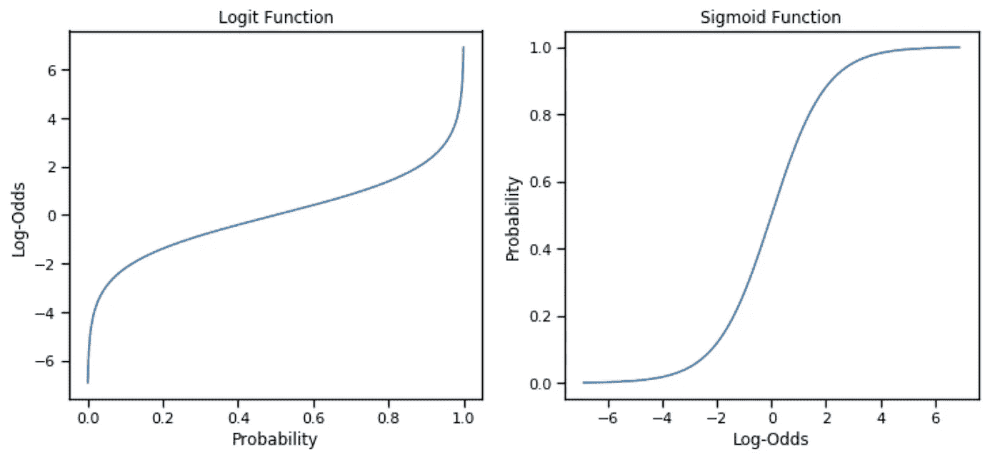

Logit 和 Sigmoid 函数

最后，引入了非线性特征年龄和年龄。这些特征允许递归线性回归模型学习关于年龄的高阶多项式函数，极大地提高了性能。

## 列车测试分离

训练和测试集是根据球员而不是单个赛季来划分的。这是为了评估模型根本没有训练过的球员的长期职业预测。

# 构建模型

## 简化测试

构建递归模型的第一步是测试预测单个特征的各种类型的回归。这是为了给出模型类型的一些指示，该模型类型将很好地用于构建完整的模型。对于这个简化的测试，scikit-learn 的 LinearRegression、RandomForestRegressor 和 GradientBoostedRegressor，以及 tensorflow 中创建的神经网络回归器，用于根据球员的年龄和有限的一组高度相关的过去特征来预测球员的两点尝试。简单的线性回归模型能够在该任务的测试集上获得最佳精度，预测每 36 分钟两次尝试，平均绝对误差为 1.2 次尝试。通过创建一些合成数据，该模型根据年龄对一名统计上平均水平的球员的两分尝试进行了调整。

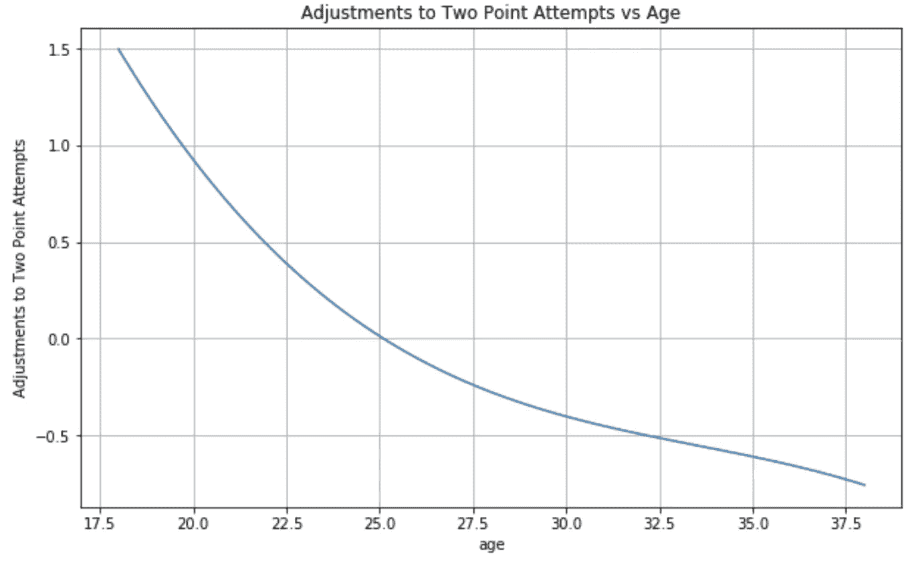

可以看出，这个简单的线性模型预测了 25 岁之前每 36 分钟 2 次投篮尝试的增加，之后投篮尝试预计会减少。还要注意这条曲线的形状，它是通过包含基于年龄的非线性特征而成为可能的。

## 多型号集装箱

完整的循环模型本质上是许多回归的组合，每个回归适合预测 13 个特征中的一个。虽然可以单独创建这些模型中的每一个，但在实践中，这会导致极其混乱的代码。解决方案是定义一个 python 类作为各种模型的容器。这个类在实例化时适合每一个模型，并包含一个从所有 13 个模型一次生成预测的方法。结果是，代码简洁明了。应用该类还使得在使用线性回归的递归模型和使用随机森林回归或梯度增强回归的递归模型之间切换变得简单。

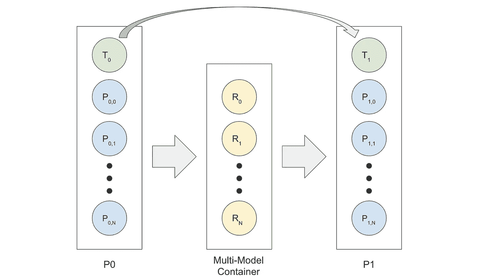

容纳用于预测 N+1 个输出的 N+1 个回归模型的多模型容器的图表。

# 模型评估

## 单一季节评估

评估模型性能的第一步是查看模型对未来一个季度性能的预测程度。因为平均绝对误差相对容易解释，所以选择平均绝对误差(MAE)作为评估标准。为了做到这一点，多模型容器实例中的每个单独的模型都被单独访问和评估。

虽然 MAE 很容易解释，但对于未缩放的数据，跨类别进行比较是相当困难的。很难说 1.2 次两分的平均出手次数比 1.2 次罚球的平均出手次数更好还是更差。一个简单的解决方法是将每个 MAE 除以其在数据集中的类别的标准偏差。这实质上是将 MAE 值转换成 Z 分数，这样就可以更容易地跨类别进行比较。对于使用线性回归对未来一个季节的预测，结果如下所示。这些结果对于随机森林回归因子和梯度增强回归因子来说稍差一些。

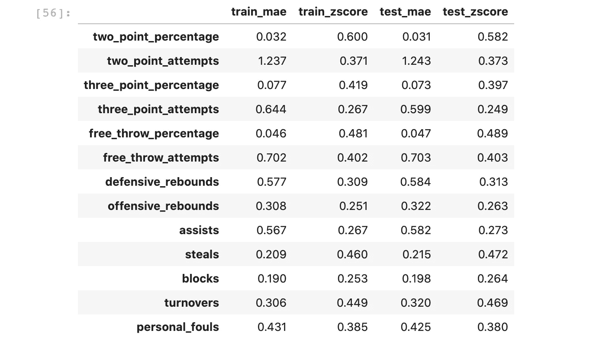

预测未来一个赛季表现的结果。

该表显示，尽管该模型能够在 3%的 MAE 范围内预测两个百分点，但 Z 分数表明该模型在预测这一类别时最困难。为了生成整体模型性能的单个度量，这些 Z 分数在所有类别中相加。这给出了训练集的总分 **4.91** 和测试集的总分 **4.93** 。这里值得注意的是，训练集和测试集之间的性能非常相似，这是一个很好的迹象，表明该模型没有过度适应训练集。

## 全面职业评估

预测未来一个赛季的表现是不错的，但建立一个循环模型的全部意义在于能够做出更长期的预测；对未来 3 年、5 年甚至 10 年性能的预测。为了评估长期预测的性能，递归模型以每个球员的新秀赛季为种子，并以递归方式用于预测该球员职业生涯的每个后续赛季。在训练集和测试集中，球员的平均职业生涯长度是 9.8 个赛季，所以平均来说，该模型用于预测未来的 8.8 个赛季。使用与单季预测相同的技术对结果进行了汇编，如下所示。

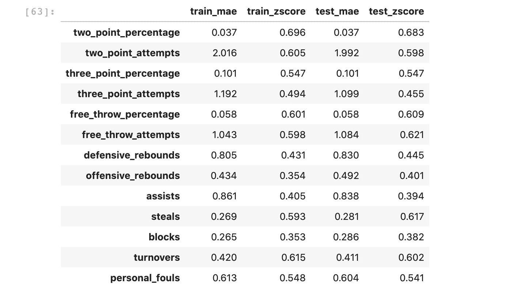

全面职业预测的结果。

在这种情况下，训练集的总 Z 分数为 **6.84** ，测试集的总 Z 分数为 **6.89** 。尽管这些完整职业预测的表现明显更差，但考虑到任务难度的大幅增加，这实际上是一个非常好的结果。

## 预测退化

此外，确定模型的预测如何随时间退化也是令人感兴趣的。这是通过累计预测误差来实现的，而预测误差是基于一个球员的新秀赛季之后多长时间做出的。应用上述相同的技术来生成 MAEs，除以类别的标准偏差，并对每个类别的 Z 分数求和。结果如下所示。

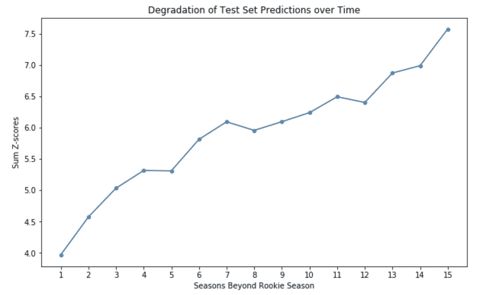

预测误差由球员新秀赛季之外的预测赛季数汇总而成。

# 预测上场时间

有了预测投篮命中率和每 36 分钟统计数据的模型，是时候建立一个预测球员上场时间的模型了。这将允许上面讨论的预测被转换成每场比赛平均和赛季总数的预测。

预测上场时间的模型的开发方式与上面讨论的略有不同。该模型不是使用球员过去的表现来预测当前的上场时间，而是根据当前的表现来进行预测。换句话说，该模型是在当前分钟数由当前绩效决定的假设下设计的。同样清楚的是，之前的上场时间是当前上场时间的最佳预测值，因此该模型也被设计为使用这一特性。除了之前的上场时间，我们发现个人犯规对预测上场时间也有不成比例的巨大影响。各种类型的回归模型被用于预测上场时间，然而再次发现线性回归提供了最好的结果。

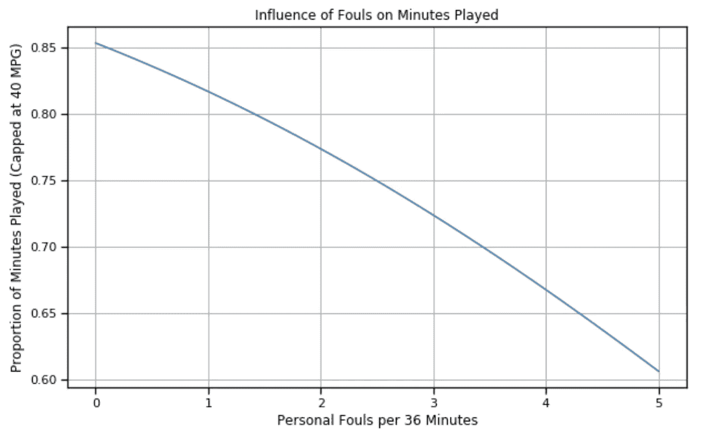

个人犯规对一般球员上场时间的影响。

分钟模型的表现，然后评估个人球员赛季。在这种情况下，模型被输入球员的实际表现，模型预测球员上场时间的比例。在这些情况下，训练集和测试集的 MAE 都是大约 8.5%，相当于每场比赛的 MAE 为 3 分 25 秒。

在此之后，分钟模型在球员的整个职业生涯中进行评估，评估方式与表现模型大致相同。这是通过输入球员在新秀赛季的实际表现，然后预测该球员在随后所有赛季的表现来实现的。然后将每个赛季的预测上场时间与实际上场时间进行比较。在这些情况下，训练集和测试集的 MAE 大约为 10.5%，相当于每场比赛的 MAE 为 4 分 25 秒。这个 MAE 被转换为测试集的 Z 分数 **0.52** ，这表明该模型能够预测分钟以及其他类别。

# 2020 年以后的预测免责声明

在继续之前，有必要考虑一下这个模型的一些偏差。虽然上面讨论的评估为 2020 年以后的预测准确性确定了一个合理的基线，但也应该考虑到 NBA 在团队战略、规则和裁判方面不断发展。今天 NBA 比赛的方式和 20 年前不一样了。例如，今天许多球队采用的防守方案在 2000 年是非法的，直到 2001 年[规则的改变取消了对区域防守的限制](https://www.sun-sentinel.com/news/fl-xpm-2001-04-13-0104121399-story.html)。这里的要点是，这个模型已经在 NBA 篮球最近时代的球员的职业生涯中进行了训练和评估。未来的时代可能会有很大的不同，并导致今天的长期预测比目前的评估更糟糕。

# 把所有的放在一起

有了这个快速的免责声明，让我们找点乐子，对未来做一些大胆的预测。训练集和测试集被合并，并且模型适合合并的数据集。然后以 2020 赛季为种子，将球员表现投射到未来。事不宜迟，你的 2023 NBA 统计领袖是:

## 每场比赛的点数

1.  卢卡·东契奇:33.2 岁
2.  特蕾·杨:31.2 岁
3.  扬尼斯·阿德托昆博:29.9

## 场均篮板

1.  扬尼斯·阿德托昆博:13.7
2.  安德烈·德拉蒙德:12.7
3.  哈桑·怀特塞德:11.9

## 场均助攻数

1.  特蕾·杨:8.8
2.  卢卡·东契奇:8.7
3.  Ja Morant: 7.8

## 2023 年最有价值球员奖将授予…

在每场比赛 38.2 分钟内，每场比赛平均 33.2 分，8.8 个篮板和 8.7 次助攻，以及高效的 49/41/83 投篮命中率之后，你的 2023 年 NBA MVP 是**卢卡·东契奇**！