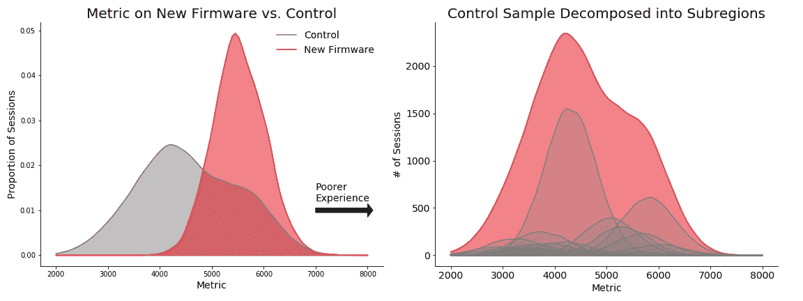

# 网飞数据科学家访谈

> 原文：<https://towardsdatascience.com/the-netflix-data-scientist-interview-35093d4c20aa?source=collection_archive---------0----------------------->

## 网飞数据科学面试问题

图片来自 Netflix.com

网飞是一家总部位于加利福尼亚州洛斯加托斯的流媒体公司，作为最大的被科技颠覆的内容媒体公司，它已经渗透到了文化中。网飞成立于 1997 年，最初是一家 DVD 租赁服务公司，后来扩展到流媒体业务。现在网飞在全球拥有超过 1 . 5 亿付费用户，其中包括 6000 万美国用户。超过 1000 种设备支持流媒体，每月观看约 30 亿小时，每天收集超过 1000 亿次事件的数据。

数据科学是网飞的基因，网飞利用数据科学改善用户体验的方方面面。多年来，网飞一直在利用数据科学作为其内容推荐引擎，来决定制作哪些电影和电视节目，并改善用户体验。

# **网飞的数据科学职位**

网飞数据科学家的角色在很大程度上取决于团队。然而，网飞的一般数据科学家角色跨越了商业分析、统计建模、机器学习和深度学习实施。网飞是一家大型公司，拥有 30 多个不同团队的数据科学家，包括个性化和算法团队、营销分析团队以及产品研究和工具团队，他们的技能范围从基本分析到重型机器学习算法。

## **所需技能**

网飞只雇佣至少有五年相关经验的合格数据科学家。他们的要求非常具体，招聘人员也热衷于为每个工作岗位专门招聘人才。拥有团队中特定角色的特定行业经验会有所帮助。

其他相关资格包括:

*   统计学、计量经济学、计算机科学、物理学或相关定量领域的高级学位(硕士或博士)。
*   5 年以上的相关经验，拥有利用海量数据推动产品创新的良好记录。
*   具有分布式分析处理技术(Spark、SQL、Pig、Presto 或 Hive)的经验，以及在 Python、R、Java 或 Scala 方面的强大编程技能。
*   具有构建真实世界机器学习模型的经验，并具有显著的影响。
*   在 A/B 测试、分析观察数据和建模中使用的深度统计技能。
*   在 Tableau、R Shiny 或 D3 中创建数据产品和仪表板的经验。

## **网飞有哪些数据科学团队？**

在网飞，术语*数据科学*涵盖了与数据科学相关的广泛领域和名称。头衔*数据科学家*由角色和职能组成，从专注于产品分析的数据科学家到数据工程和机器学习职能。

*   **个性化算法**:与产品和工程团队合作，评估性能并优化用于向网飞会员推荐电影、电视节目、艺术品和预告片的个性化算法。
*   **会员 UI 数据科学与工程**:利用定制的机器学习模型，为所有用户优化产品的用户体验。
*   **产品研究和工具:**开发和实施方法以推进网飞的大规模实验。这包括开发数据可视化框架、工具和分析应用程序，为其他团队提供对成员行为和产品性能的洞察。
*   **增长数据科学与工程**:通过围绕关键业务指标构建和设计高度可扩展的数据管道和干净的数据集，专注于扩大用户群。
*   **营销数据科学工程**:创建可靠的分布式数据管道，构建直观的数据产品，为所有非技术团队提供以自助方式跨领域利用数据的方法。

# **面试流程**

图来自[网飞数据科学博客](https://netflixtechblog.com/detecting-performance-anomalies-in-external-firmware-deployments-ed41b1bfcf46)

网飞大学的数据科学面试流程与其他大型科技公司类似。面试过程首先是招聘人员的电话面试，然后是简短的招聘经理面试，然后是技术面试。通过技术筛选后，将安排现场面试。这次面试由两部分组成，6 到 7 个人参加。

## **初始屏幕**

在网飞，最初的筛选是与招聘人员进行 30 分钟的电话交谈。网飞的招聘人员高度专业化，技术性很强。他们的工作是了解你的简历，看看你过去的经历、项目和技能是否符合这个职位。这部分面试的第二点是测试你的一般沟通能力，向你解释这个角色及其背景。

接下来是招聘经理面试。这一次将更多地关注过去的经验，并深入到您在数据科学和机器学习中所做的的更多**技术部分。虽然招聘人员在高层次上了解你的项目，以适应团队，但招聘经理会问你更深入的问题，如**为什么你在一个项目中使用某些算法**或**你如何建立不同的机器学习或分析系统**。**

招聘经理也会告诉你更多关于团队的角色和职责。请注意，网飞在文化和价值观上很重要，你可能会被要求选择一个价值观，并解释它如何最适合你。

> 需要特定技能的面试指南吗？查看我们深入分析的 [***SQL、***](https://www.interviewquery.com/blog-sql-interview-questions/)*[***机器学习***](https://www.interviewquery.com/blog-machine-learning-interview-questions/) ***、P***[***ython***](https://www.interviewquery.com/blog-python-data-science-interview-questions/)**和***

## *****技术屏幕*****

***通过初筛后，面试的下一步就是技术筛选。这种面试通常为 45 分钟，涉及跨 SQL、实验和 ab 测试的技术问题，以及机器学习技术问题。***

*****例题:*****

*   ***你对流环境下的 A/B 测试了解多少？***
*   ***L1 正则化和 L2 正则化有什么区别，比如为什么人们不用 L0.5 正则化？***
*   ***在线和批量梯度下降有什么区别？***
*   ***向利益相关者传达 ML 结果的最佳方式是什么？***

****如果你对更多来自网飞的面试问题感兴趣，请查看* [***上的问题面试查询***](https://www.interviewquery.com/)**和一个视频* [***一个网飞机器学习的模拟面试问题***](https://www.youtube.com/watch?v=12Ry6kGPQVs) ***！*******

# ******现场面试******

****现场面试是面试流程的最后一个阶段，由两部分组成，中间有午餐休息时间。如果你来自其他州，网飞会让你飞到洛杉矶参加现场面试，你会先和招聘人员见面，回顾一下面试。****

****它涉及对 6 或 7 个人的一对一采访，包括数据科学家团队成员、团队经理和产品经理。网飞现场面试结合了**产品、机器学习和各种分析概念**。该访谈将包括围绕产品感觉、统计数据(包括 A/B 测试(假设测试)、SQL 和 [Python 编码](https://www.interviewquery.com/blog-python-data-science-interview-questions/)、实验和度量设计以及文化契合度的问题。如果该角色更专注于工程，请期待更多的机器学习和可能的深度学习面试问题。****

## ****注意事项和提示****

*   ****请记住，面试的目标是评估你如何应用分析概念和机器学习算法和模型来预测用户和内容的价值。温习统计和概率、A/B 测试和实验设计以及回归和分类建模概念的知识。****
*   ****请，请，请**记得阅读网飞文化甲板。**在网飞，文化就是一切，他们创造了独特而著名的工作文化，并在网上转录成 100 多页的幻灯片。****
*   ****网飞文化的核心是建立一支高绩效团队，并让他们在一个能让他们超越自我的环境中成长。这表现为相当大的自由和责任，由自上而下控制有限的经理提供的强大环境，以及奖励优秀员工的薪酬和晋升体系。****
*   ****在工作谈判中，要注意网飞的薪酬待遇非常高。他们雇佣的技术人员的平均工资超过 30 万美元，很多时候几乎都是现金，并有将一部分转换成 rsu 的选择权。这就是为什么他们的面试很难，而且招聘的底线非常高。****
*   ****围绕网飞产品练习案例研究问题。查看如何[赢得数据科学案例研究面试](https://www.interviewquery.com/blog-data-science-case-study-interview/)。****

# ******网飞数据科学面试试题******

*   ****写出使用逻辑回归构建分类器的等式。****
*   ****给定来自网飞的一个月的登录数据，如 account_id、device_id 和关于支付的元数据，您将如何检测支付欺诈？****
*   ****你会如何为我们正在考虑推出的新内容推荐模型设计一个实验？什么样的指标是重要的？****
*   ****编写 SQL 查询来查找两个事件之间的时间差。****
*   ****你如何建立和测试一个指标来比较两个用户的电影/电视节目偏好列表？****
*   ****你如何从五百万个搜索查询中选择一个有代表性的样本？****
*   ****为什么整流线性单位是一个很好的激活函数？****
*   ****如果网飞正在寻求扩大其在亚洲的业务，你可以用哪些因素来评估亚洲市场的规模，网飞可以做些什么来占领这个市场？****
*   ****我们如何用归因模型来衡量营销效果？****
*   ****您如何确定网飞订阅的价格是否真的是消费者的决定因素？****

# ****感谢阅读！****

****如果你喜欢这篇文章，并想了解更多关于网飞的数据科学采访…****

*   ****注册 [**面试查询**](https://www.interviewquery.com/) ，每周在你的收件箱里获得几个数据科学面试问题。****
*   ****查看更多公司面试指南，如 [**Lyft 数据科学家面试**](https://www.interviewquery.com/blog-lyft-data-scientist-interview/) 和 [**Python 数据科学面试问题**](https://www.interviewquery.com/blog-python-data-science-interview-questions/) 。****
*   ****订阅我的 [**Youtube 频道**](https://www.youtube.com/channel/UCcQx1UnmorvmSEZef4X7-6g) 了解更多数据科学访谈。****