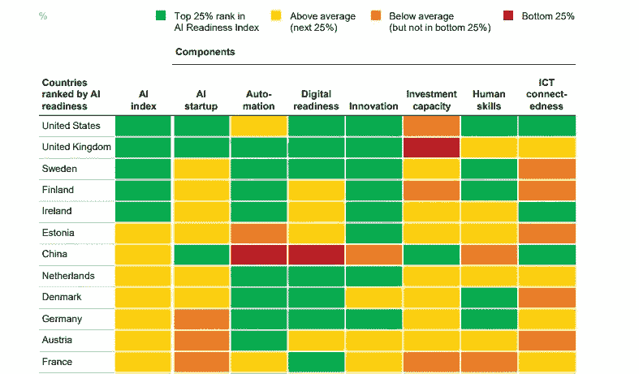

# 荷兰人工智能战略行动计划——简要概述

> 原文：<https://towardsdatascience.com/the-netherlands-strategic-action-plan-for-artificial-intelligence-ai-a-brief-summary-7ceb5dcd0e12?source=collection_archive---------42----------------------->

## 你需要知道的荷兰人工智能国家计划。

2019 年 10 月，在阿姆斯特丹举行的[世界人工智能峰会](https://worldsummit.ai/)大会上，我坐在观众中间，兴奋地看着国务秘书(经济事务部)Mona Keijzer 女士走上舞台，宣布荷兰人工智能联盟最近启动，以及由此产生的 65 个政党的战略性人工智能行动计划。

# 该联盟承诺在未来七年**内投资**20 亿欧元**，以加速荷兰在该领域的潜力并提升其国际形象。**

****

**图片来源:Strategisch acti plan voor artifici le intelligent ie(2019 年 10 月，挪威经济部)**

**凯泽女士似乎对他们在全球范围内竞争的能力相当乐观。这种乐观情绪确实是有道理的，因为一些关键因素让中国准备迎接这样一次飞跃。例如，根据 DHL research 的数据，荷兰是世界上数据连接最紧密的国家之一，除了在高质量研究方面处于欧洲领先地位之外，该国还建立了强大的公私合作伙伴关系(PPP)生态系统。**

**麦肯锡的一份关于欧洲人工智能的报告在人工智能准备程度方面将荷兰排在平均水平之上，自动化、数字化准备程度和创新得分最高，为 25%。**

****

**图表 20 快照—麦肯锡报告:解决欧洲在数字和人工智能方面的差距**

# **一个全面而雄心勃勃的计划:三大轨道**

**人工智能联盟制定了一个每年都要调整的议程。三个轨道是报告的主要重点，有具体的行动要点来指导和支持其执行，并着重强调有关各方必须承担责任并相互合作以实现预期目标。**

# ****途径 1——通过以下方式利用社会&经济机会**:**

*   ****通过公私合作克服社会挑战；**
    *行动包括在医疗保健、国防、农业、食品、能源转型和可持续发展领域以知识和创新合同形式做出的多年期财务承诺。***
*   ****在履行政府任务和职责中使用人工智能；**
    *行动包括启动面向公务员的数字化课程，以掌握政府数字化和计算机化的技能。***
*   **通过有利的商业环境刺激人工智能创业，从大公司到初创企业。
    *行动包括通过区域发展机构增加创新资金和促进国际转移学习(如旧金山/洛杉矶、波士顿/纽约等地的联络官)。)***

# ****途径 2——通过以下方式创造合适的环境**:**

*   ****刺激人工智能研究&NL 的创新；**
    *行动包括创建人工智能实验室和研究中心，并为此寻求与其他欧盟国家的积极合作。***
*   ****提供良好的培训机会；**
    *行动包括通过税收优惠鼓励雇主提供培训机会，以及设立基金促进中小企业的学习文化等。此外，政府将审查学校课程，以实施数字扫盲。***
*   ****为人工智能创新的发展提供可用数据；**
    *行动涉及促进公共部门信息的可再利用性，例如通过 data.overheid.nl，同时牢记数据共享隐私政策。***
*   ****支持高质量的数字连接和基础设施，以实现最佳功能。**
    *行动包括继续提供，并改善基础设施的状态，即有效的 AI 应用的反应速度(延迟)、数据速度和可靠性。***

# ****途径 3——通过以下方式加强道德&合法权利**的基础:**

*   **保护公共价值和人权；
    *行动包括采取监管措施保护用户数据和提高算法决策的准确性。***
*   ****构建可信、可靠的人工智能；这些行动包括让尽可能多的荷兰公司参与人工智能道德准则的试点阶段，以及与欧洲委员会一起撰写一份关于人工智能性别的意见的未来报告。****
*   ****维护开放、竞争的市场，保护消费者权益；**
    *行动包括更好地执行和更新欧盟的消费者保护规则。例如，在此基础上，需要告知消费者个性化价格/价格歧视何时生效。***

**你可以在这里找到报告的完整版本。不幸的是，到目前为止，还没有可用的英文版本，但也正是因为这个原因，这篇文章才可用。**

***如果你觉得这篇文章有用，请不要犹豫，关注* [*我的媒体频道*](https://medium.com/@kytheria) *来了解最新的文章。***