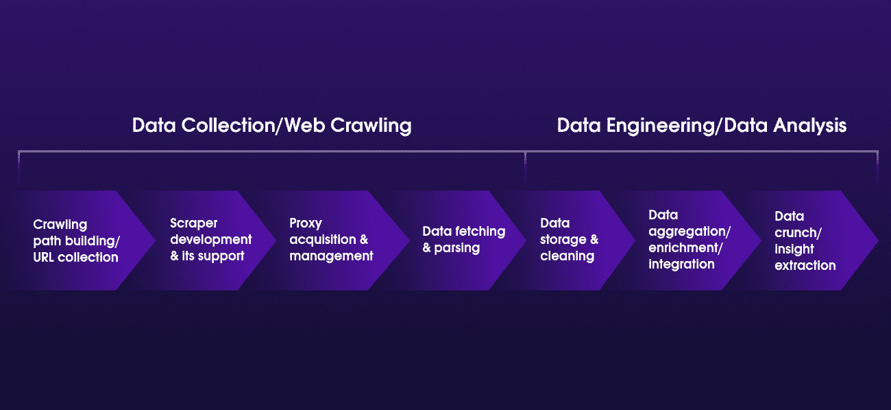
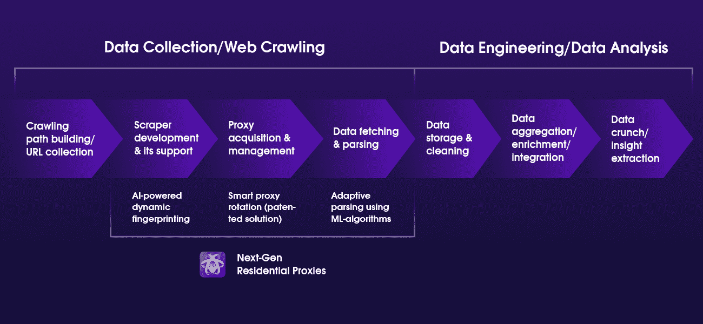

# 人工智能驱动的网络数据收集解决方案的新开端

> 原文：<https://towardsdatascience.com/the-new-beginnings-of-ai-powered-web-data-gathering-solutions-a8e95f5e1d3f?source=collection_archive---------29----------------------->

## **您是否在以传统方式进行大规模数据收集？如果是这样的话，就要在代理基础设施维护上投入大量的时间和精力。**

数据收集包含许多耗时且复杂的活动。这些包括代理管理、数据解析、基础设施管理、克服指纹识别反措施、大规模渲染大量使用 JavaScript 的网站等等。有没有办法自动化这些过程？绝对的。

为大规模数据收集寻找一个更易于管理的解决方案一直是 web 抓取社区中许多人的想法。专家们看到了将 AI(人工智能)和 ML(机器学习)应用于网络抓取的巨大潜力。然而，直到最近，使用人工智能应用程序实现数据收集自动化的行动才开始实施。这并不奇怪，因为随着计算解决方案的进步，人工智能和 ML 算法在大规模应用中变得更加鲁棒。

通过在数据收集中应用人工智能解决方案，我们可以帮助自动化繁琐的手动工作，并确保收集的数据质量更好。为了更好地理解 web 抓取的困难，让我们来看看数据收集的过程，它最大的挑战，以及未来可能缓解和解决上述挑战的解决方案。

# 数据收集:循序渐进

为了更好地理解 web 抓取过程，最好将其可视化为一个价值链:

来源:Oxylabs 的设计团队

正如你所看到的，网页抓取需要四个不同的动作:

1.  爬行路径构建和 URL 收集。
2.  铲运机的发展及其支持。
3.  代理获取和管理。
4.  数据获取和解析。

任何超出这些术语的东西都被认为是数据工程或数据分析的一部分。

通过确定哪些操作属于 web 抓取类别，可以更容易地找到最常见的数据收集挑战。它还让我们看到哪些部分可以在人工智能和 ML 解决方案的帮助下实现自动化和改进。

# 大规模刮削挑战

传统的从网络上收集数据需要大量的治理和质量保证。当然，数据收集带来的困难随着搜集项目的规模而增加。让我们通过查看价值链的活动和分析潜在的问题来更深入地了解一下上述挑战。

## 构建爬行路径并收集 URL

构建爬行路径是数据收集的第一步，也是最重要的一步。简单地说，爬行路径是一个 URL 库，从中提取数据。这里最大的挑战不是你要抓取的网站 URL 的集合，而是获取所有初始目标的必要 URL。这可能意味着如果没有数百个 URL，也有几十个 URL 需要被抓取、解析并识别为对您的案例重要的 URL。

## 铲运机的发展及其维护

制造铲运机会带来一系列全新的问题。这样做时，有许多因素需要注意:

*   选择语言、API、框架等。
*   测试您构建的内容。
*   基础设施管理和维护。
*   克服指纹反措施。
*   大规模渲染大量使用 JavaScript 的网站。

这些只是冰山一角，你会遇到建设一个网页刮刀。还有很多更小更耗时的事情会累积成更大的问题。

## 代理获取和管理

代理管理将是一个挑战，尤其是对那些新的刮擦。在成功抓取一个站点之前，有太多的小错误可以阻止一批代理。代理轮换是一个很好的实践，但是它不能说明所有的问题，并且需要不断地管理和维护基础设施。因此，如果你依赖代理供应商，良好和频繁的沟通将是必要的。

## 数据获取和解析

数据解析是使获取的数据可理解和可用的过程。虽然创建一个解析器听起来很容易，但是它的进一步维护将会带来很大的问题。适应不同的页面格式和网站变化将是一场持续的斗争，需要你的开发团队比你想象的更多的关注。

正如你所看到的，传统的网络抓取带来了许多挑战，需要大量的人力、时间和资源。然而，计算的好的一面是几乎所有的事情都可以自动化。随着人工智能和 ML 驱动的网络抓取的发展，创建面向未来的大规模数据收集成为更现实的解决方案。

# 让网络刮擦面向未来

AI 和 ML 能在哪些方面创新和提高网页抓取？根据 [Oxylabs](https://oxylabs.io/) 下一代住宅代理 AI & ML 顾问委员会成员 Jonas Kubilius 的说法，Jonas kubi lius 是 AI 研究员，Marie Sklodowska-Curie 校友，也是 Three Three 的联合创始人:

*“网页内容中有一些重复出现的模式，比如价格是如何编码和显示的，所以原则上，ML 应该能够学会发现这些模式，并提取相关信息。这里的研究挑战是学习在各种网站上通用的模型，或者可以从一些人类提供的例子中学习的模型。工程挑战是将这些解决方案扩展到现实的网络抓取负载和管道。*

与为每个新网站和 URL 手动开发和管理抓取器代码不同，创建一个人工智能和 ML 驱动的解决方案将简化数据收集管道。这将负责代理池管理、数据解析维护和其他繁琐的工作。

AI 和 ML 驱动的解决方案不仅使开发人员能够构建高度可扩展的数据提取工具，还使数据科学团队能够快速原型化。如果您现有的定制代码出现问题，它也是您现有代码的备份。

# 网络抓取的未来是什么样的

正如我们已经建立的那样，创建快速数据处理管道以及尖端的 ML 技术可以在 web 抓取社区中提供无与伦比的竞争优势。而纵观当今市场，AI 和 ML 在数据采集方面的实施早已开始。

出于这个原因，Oxylabs 正在推出由最新人工智能应用程序驱动的下一代住宅代理。

下一代住宅代理的构建考虑了重型数据检索操作。它们使 web 数据提取没有延迟或错误。该产品与常规代理一样可定制，但同时，它保证了更高的成功率，并且需要更少的维护。除了可重用的 cookies 和 POST 请求之外，还支持自定义头和 IP 粘性。它的主要优点是:

*   100%成功率
*   人工智能支持的动态指纹识别(验证码、阻止和网站变更处理)
*   基于机器学习的 HTML 解析
*   易于集成(像任何其他代理一样)
*   自动重试系统
*   JavaScript 渲染
*   专利代理旋转系统

回到我们之前的网络抓取价值链，你可以看到网络抓取的哪些部分可以通过人工智能和 ML 驱动的下一代住宅代理实现自动化和改进。

来源:Oxylabs 的设计团队

下一代住宅代理解决方案几乎自动化了整个抓取过程，使其成为面向未来的网络抓取的真正有力的竞争对手。

该项目将由 Oxylabs 内部的 ML 工程团队和顾问委员会持续开发和改进， *Jonas Kubilius* 、 *Adi Andrei* 、 *Pujaa Rajan* 和 *Ali Chaudhry* ，专门研究人工智能和 ML 工程领域。

# 包扎

随着 web 抓取项目规模的增加，自动化数据收集成为希望在竞争中保持领先的企业的当务之急。随着近年来人工智能算法的改进，随着计算能力的提高和人才储备的增长，人工智能在许多行业中的实施已经成为可能，包括网络抓取。

建立人工智能和人工智能驱动的数据收集技术在行业中提供了巨大的竞争优势，并节省了大量的时间和资源。这是大规模 web 抓取的新未来，也是面向未来的解决方案开发的良好开端。