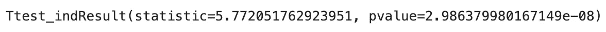
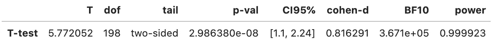
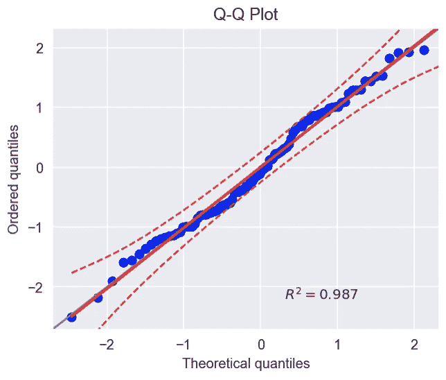
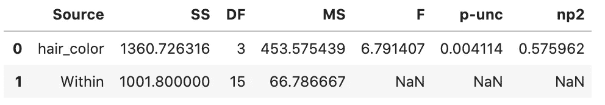
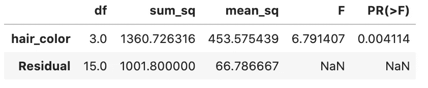
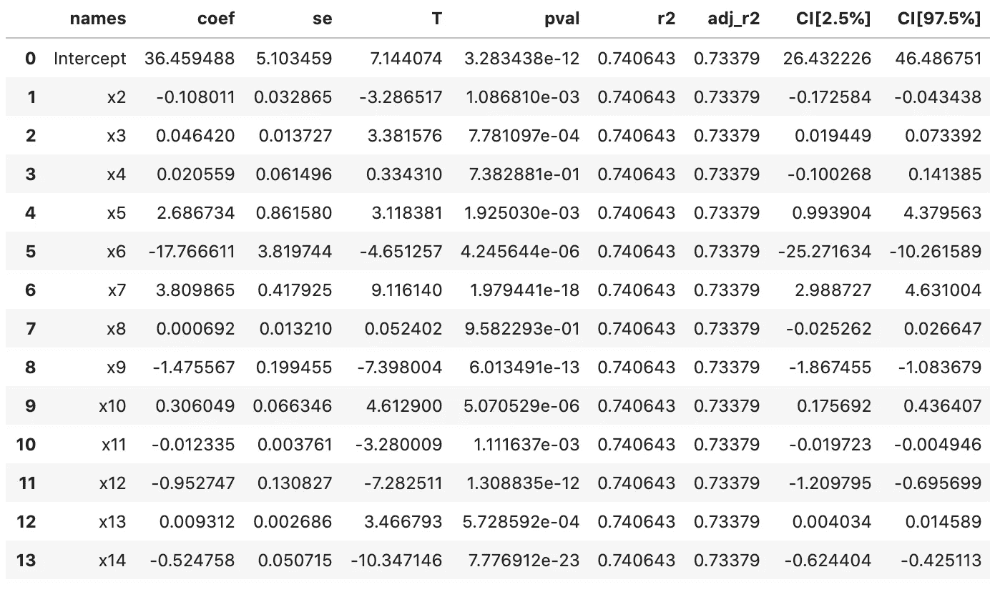
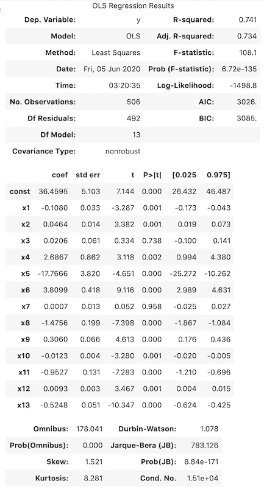

# Python 统计块中的新成员:pingouin

> 原文：<https://towardsdatascience.com/the-new-kid-on-the-statistics-in-python-block-pingouin-6b353a1db57c?source=collection_archive---------8----------------------->


伊恩·帕克在 [Unsplash](https://unsplash.com/s/photos/penguin?utm_source=unsplash&utm_medium=referral&utm_content=creditCopyText) 上拍摄的照片

## 图书馆的快速参观，以及它是如何从老守卫中脱颖而出的

Python 有一些非常成熟的库用于统计分析，其中最大的两个是`statsmodels`和`scipy`。这两个包含了很多(我是说很多)统计函数和类，它们在 99%的情况下会覆盖你所有的用例。那么为什么还会有新的库发布呢？

新来者往往试图填补一个利基市场，或者提供一些现有竞争对手所没有的额外东西。最近，我偶然发现了一个相对较新的图书馆，名为`pingouin`。该库的一些主要功能包括:

*   这个库是用 Python 3 编写的，主要基于`pandas`和`numpy`。直接在`DataFrames`上操作肯定能派上用场，简化工作流程。
*   在编码和生成的输出方面，试图在复杂性和简单性之间取得平衡。在某些情况下，`statsmodels`的输出可能是压倒性的(特别是对于新的数据科学家)，而`scipy`可能有点过于简洁(例如，在 t 检验的情况下，它只报告 t 统计和 p 值)。
*   `pingouin`的很多实现都是从流行的 R 包直接移植过来进行统计分析的。
*   该库提供了一些其他库中没有的新功能，例如计算不同的效果大小并在它们之间进行转换、成对 t 测试和相关性、循环统计等等！


来源:[https://pingouin-stats.org/index.html](https://pingouin-stats.org/index.html)

在本文中，我简要介绍了`pingouin`中一些最流行的功能，并将它们与已经建立的成熟功能进行了比较。

# 设置

首先，我们需要通过运行`pip install pingouin`来安装这个库。然后，我们导入将在本文中使用的所有库。

# 统计功能

在这一部分中，我们探索了`pingouin`中可用的一些功能，同时强调了与其他库相比的不同之处。

## t 检验

可能统计库最流行的用例(或者至少与线性回归相当)是 t-test，它最常用于运行 A/B 测试时的假设检验。

从`scipy`开始，我们通过运行以下命令来计算 t 测试的结果:

```
ttest_ind(x, y)
```

什么会生成以下输出:



在`pingouin`的例子中，我们使用以下语法:

```
pg.ttest(x, y)
```

并接收:



`scipy`仅报告 t 统计和 p 值，而`pingouin`另外报告以下内容:

*   自由度(`dof`)，
*   95%置信区间(`CI95%`)，
*   Cohen's d ( `cohen-d`)测量的效应大小，
*   [贝叶斯因子](https://en.wikipedia.org/wiki/Bayes_factor)，表示支持所考虑假设的证据强度(`BF10`)，
*   统计力量(`power`)。

**注意** : `statsmodels`还包含一个用于计算 t-test 的类(`statsmodels.stats.weightstats.ttest_ind`)，它本质上是对`scipy`的`ttest_ind`的包装，对输入参数做了一些修改。

`pingouin`还包含标准 t 检验的更多变体/扩展，例如:

*   成对 t 检验，
*   曼-惠特尼 U 检验(独立 t 检验的非参数版本)，
*   Wilcoxon 符号秩检验(配对 t 检验的非参数版本)。

## 功率分析

统计库的另一个非常流行的应用是计算 A/B 测试所需的样本量。为此，我们使用功耗分析。如果你对更多细节感兴趣，请参考我的[上一篇文章](/introduction-to-power-analysis-in-python-e7b748dfa26)。

在这个例子中，我们将集中于计算 t-检验所需样本量的情况。但是，您可以轻松地调整代码来计算任何其他组件(显著性水平、功效、效果大小)。

为简单起见，我们将其他 3 个参数固定为一些标准值。

运行代码会生成以下输出:

```
Required sample size (statsmodels): 64
Required sample size (pingouin): 64
```

老实说，对于一个标准的 t-test，在功耗分析方面没有太大的区别。我们还可以定制替代假设的类型(无论是单侧检验[还是双侧检验](/one-tailed-or-two-tailed-test-that-is-the-question-1283387f631c))。值得一提的是，`pingouin`使我们能够为一些测试运行功效分析，这些测试在其他库中是不可用的，例如平衡单向重复测量 ANOVA 或相关性测试。

## 测绘

`pingouin`包含了一些非常好实现的可视化，但是，它们中的大多数都是特定领域的，一般读者可能不会感兴趣(我鼓励你在[文档](https://pingouin-stats.org/api.html#plotting)中看看它们)。

不过，其中一个情节绝对可以派上用场。在我之前的一篇文章中，我描述了如何用 Python 创建 QQ-plots。`pingouin`绝对简化了这个过程，因为我们只用一行代码就可以创建一个非常好的 QQ 图。

```
np.random.seed(42)
x = np.random.normal(size=100)
ax = pg.qqplot(x, dist='norm')
```



更重要的是，`pingouin`自动处理如何显示参考线，而在`statsmodels`的情况下，我们需要通过向`ProbPlot`类的`qqplot`方法提供一个参数来做同样的事情。简化任务的明显例子！

引用`pg.qqplot`的文档:

> 此外，该函数还绘制了数据的最佳拟合线(线性回归),并用决定系数对图进行了注释。

## 方差分析

我们现在将研究如何运行 [ANOVA](https://en.wikipedia.org/wiki/Analysis_of_variance) (方差分析)。为此，我们将使用一个内置的数据集来描述每种发色的疼痛阈值(有趣的想法！).首先，我们加载并稍微转换数据集。

我们删除了一个不必要的列，并用下划线替换了列名中的空格(这将使在`statsmodels`中实现 ANOVA 更容易)。

首先，我们介绍`pingouin`方法。

什么会生成以下输出:



在继续之前，我们应该提到使用`pingouin`的潜在好处:它直接向`pd.DataFrame`添加了一个额外的方法(`anova`)，因此我们可以跳过调用`pg.anova`和指定`data`参数。

为了比较起见，我们也使用`statsmodels`进行 ANOVA。使用这个库，这是一个两步的过程。首先，我们需要拟合 OLS 回归，然后才进行方差分析。



输出非常相似，尽管来自`pingouin`的输出包含一个额外的列，这是作为部分 eta 平方的效应大小度量。

与 t-检验类似，`pingouin`中包含不同的方差分析变量。

## 线性回归

作为最后一个例子，我们考察了最基本的机器学习模型之一——线性回归。为此，我们首先从`scikit-learn`加载著名的波士顿住房数据集:

```
from sklearn.datasets import load_boston
X, y = load_boston(return_X_y=True)
```

**注意** : `scikit-learn`也包含了训练线性回归的类，但是，输出是我所知道的所有 Python 库中最基本的。在某些情况下，这完全没问题。然而，对于 R 来说，我更喜欢更详细的输出，我们很快就会看到。

为了在`pingouin`中拟合一个线性回归模型，我们需要运行下面一行代码。

```
lm = pg.linear_regression(X, y)
lm
```

这再简单不过了！输出如下所示:



表挺大，很详细。就我个人而言，我不认为包括 R2 和调整后的变体在这里有很大的意义，因为它导致了大量的重复。我的猜测是，这样做是为了以`DataFrame`的形式保存输出。或者，我们可以通过设置`as_dataframe=False`来关闭该行为，这将导致创建一个字典。这样，我们额外得到了模型的残差。

关于`pingouin`实现的一件额外的事情是，我们可以提取一个特征重要性的度量，它被表示为“将模型的总𝑅2 划分为单独的𝑅2 贡献”。为了显示它们，我们需要将`relimp`设置为`True`。

是时候前进到`statsmodels`实现了。

代码有点长，因为我们还需要手动将常量(一列 1)添加到包含独立变量的`DataFrame`中。请注意，当使用函数式语法时(如 ANOVA 示例中所用)，这一步不是必需的，但是，在这种情况下，特性和目标需要在一个对象中。

下图显示了在拟合对象上运行`summary`方法的输出:



任何来自 R 的人都会认出这种格式的摘要:)

对我来说，额外的两行代码绝对是值得的，因为输出更加全面，并且经常为我们省去运行一些额外的统计测试或计算一些拟合优度的麻烦。

## 其他有趣的功能

在本文中，我只展示了`pingouin`库的部分功能。一些有趣的功能包括:

*   循环统计的广泛功能，
*   成对的 hocs 后测试，
*   不同的贝叶斯因子，
*   一系列不同的效果尺寸测量和一个在它们之间转换的函数。

还有更多！

# 结论

在本文中，我简要介绍了用于统计分析的新库`pingouin`。我很喜欢作者采取的方法，他们试图尽可能地简化过程(也通过让一些事情在后台自动发生，如为 QQ 图选择最佳参考线或对 t 测试进行校正)，同时尽可能地保持输出的彻底和完整。

虽然我仍然是`statsmodels`总结线性回归输出的方法的粉丝，但我确实发现`pingouin`是一个很好的工具，可以在日常数据科学任务中为我们节省一些时间和麻烦。我很期待看到图书馆是如何随着时间发展的！

您可以在我的 [GitHub](https://github.com/erykml/medium_articles/blob/master/Statistics/pingouin.ipynb) 上找到本文使用的代码。一如既往，我们欢迎任何建设性的反馈。可以在 [Twitter](https://twitter.com/erykml1?source=post_page---------------------------) 或者评论里联系我。

觉得这篇文章有趣？成为一个媒介成员，通过无限制的阅读继续学习。如果你使用[这个链接](https://eryk-lewinson.medium.com/membership)成为会员，你将支持我，不需要你额外付费。提前感谢，再见！