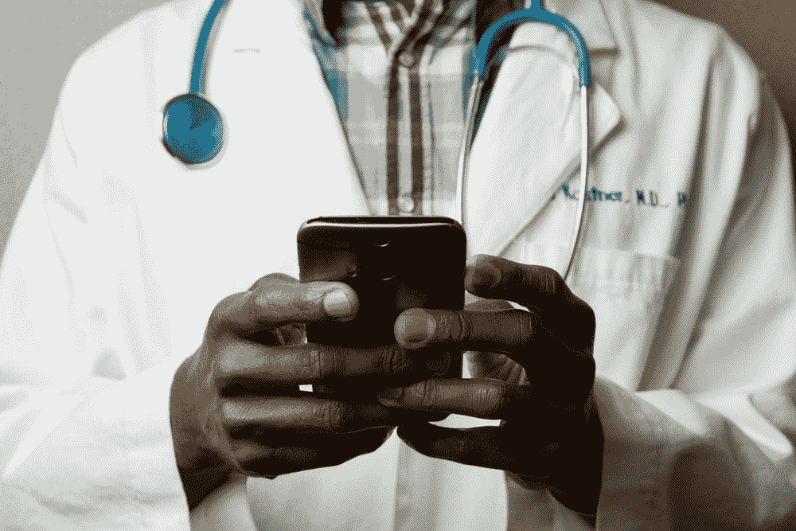

# 人工智能在医学领域的新一轮技术创业浪潮

> 原文：<https://towardsdatascience.com/the-new-wave-of-technological-startup-with-artificial-intelligence-in-medicine-8201b0f1a5bf?source=collection_archive---------56----------------------->

## AIM 创业公司

## 不同的企业及其产品

[国家癌症研究所](https://unsplash.com/@nci?utm_source=unsplash&utm_medium=referral&utm_content=creditCopyText)在 [Unsplash](https://unsplash.com/s/photos/medical?utm_source=unsplash&utm_medium=referral&utm_content=creditCopyText) 上拍摄的照片

医学和技术的快速发展产生了新一波的科学研究和潜在的工业创新。人工智能(AI)是当今技术创新的主导领域，每个行业都有快速增长的潜力:[金融科技](/i-designed-an-ai-system-that-can-predict-academic-dishonesty-with-marginal-accuracy-daf165426aed)、[智能城市](/i-designed-an-ai-system-that-can-predict-academic-dishonesty-with-marginal-accuracy-daf165426aed)以及医药。

> 根据 CB INSIGHTS 的报告，由于新冠肺炎·疫情，到 2020 年第一季度，全球近 500 家人工智能创业公司能够单独筹集 84 亿美元的风险基金。

**据预测，将人工智能技术集成到医疗保健行业中可以使收入增加近 9 倍。**

人工智能和深度学习(DL)在医疗保健行业有多种应用，一些潜在的应用包括:

1医疗数据处理

医疗数据挖掘是许多医疗保健初创公司的另一个潜力。这一点尤为重要，因为在应用于计算算法之前，数据标准化和协调非常重要。

*提供服务的公司或机构:*

***项目基线由 Verily*** 和 ***谷歌健康*** 正在与研究人员合作打造下一代医疗保健工具和服务。

***IBM Watson Health***已经迈出了改进医疗处方分配的先进一步。他们正致力于开发一个数据库系统，可以为任何患者确定正确的药物治疗。这是因为具有相似潜在状况的患者状况的变化。所提出的技术可以主动识别最适合特定患者的概率药物。

***Stratasan*** 参与医疗数据处理，收集、更新和检查任何输入数据的错误。 ***MOS(医疗记录审核)*** 是一家医疗审核服务公司，积极参与审核账单和其他文档。

AI 还用于处理各种冠状病毒文献，以帮助提取有用的生物医学研究信息。 ***新冠肺炎作品集*** 是由美国国立卫生研究院(NIH)发起的，用于跟踪 SAR-CoV-2 文章的相关论文。

2医疗报告分析

它涉及深度学习技术，以提高医疗报告的诊断，如 x 光和核磁共振成像的阅读。该技术旨在通过图像分析对报告做出结论，并可辅以放射科医生的专家咨询。

*提供服务的公司或机构:*

*布法罗大学(UB)正在使用机器学习(ML)来分析高分辨率数字图像中的预测模式。这使得内窥镜能够准确地识别肿瘤部位，并且可以通过咨询放射科医师来补充。*

****斯坦福大学和哈佛医学院*** 都参与了类似的研究技术，开发新的人工智能方法，允许数字图像诊断。*

****cardiology***是一家心脏诊断公司(总部位于法国)，利用人工智能和云技术来识别心脏状况。该公司能够在首轮融资中筹集到 1500 万美元(该公司第一轮重要的风险资本融资)。*

****Gleamer*** 是另一家总部位于欧洲的 AIM 公司，它使用一个工程师和医疗专业人员团队来创建可供放射科医生使用的医疗级人工智能工具。BoneView AI 是他们开发的产品之一，用于将混合骨折的尺寸减少近 30%。*

*3电话筛查/虚拟诊断*

*这利用人工智能医疗筛查为患者提供咨询。它越来越受欢迎，主要是因为它的咨询成本低，方便提供。它主要涉及通过与医生的虚拟咨询和回答一系列相关问题进行在线诊断。*

**提供服务的公司或机构:**

****虚拟诊所*** 和 ***症状*** 就是这个平台的完美例子。随着新冠肺炎的实施，患者更有可能选择在线诊断和咨询。*

****机器医学*** 是一家总部位于欧洲的公司，专门开发用于运动评估的人工智能技术。**凯文**是一个运动评估人工智能工具，利用视频数据采集和基于计算机视觉的分析。*

*医疗保健行业是数据密集型行业，人工智能集成可以减少医疗信息的过载。它还提供了全面理解医疗数据并将其转换为计算知识的范围。*

> *一个主要的挑战和限制包括偶尔不正确的诊断和治疗建议。*

*注册医生和 AIM 技术的合作可以极大地改善当前的医疗保健行业，使医疗保健更加实惠。*

*美国医疗保健市场规模为 3.6 万亿美元，但欧洲的数字医疗保健初创公司也通过筹集约 26 亿美元的资金提供了类似的竞争。科技公司一直在关注和开发 AIM 技术的新浪潮。*