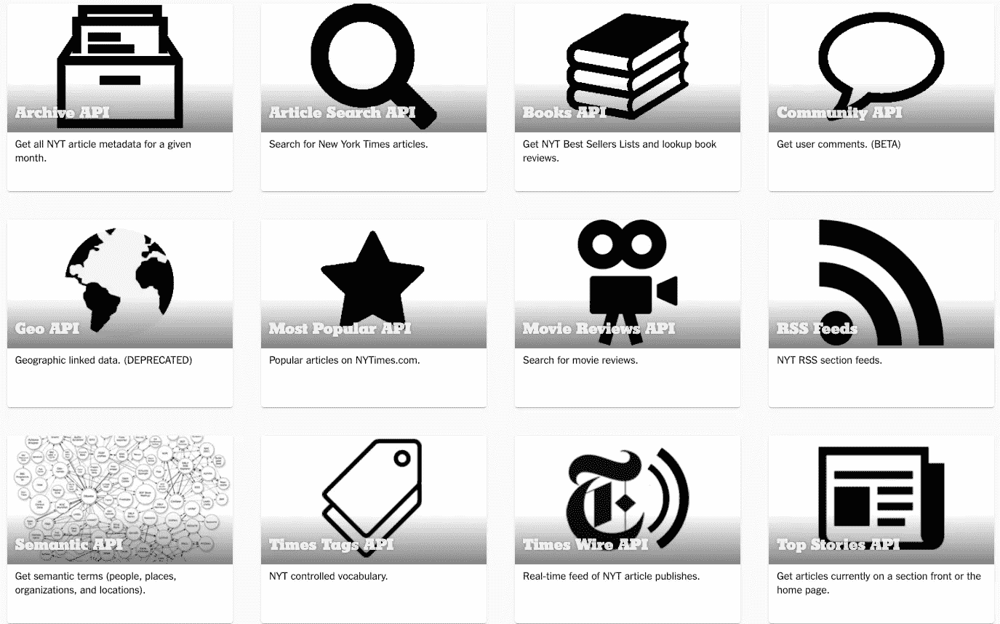

# 分析谷歌云上的实时新闻流

> 原文：<https://towardsdatascience.com/the-new-york-times-newswire-sentiment-analysis-using-google-cloud-4337843b2ae7?source=collection_archive---------72----------------------->

## 一个有趣的关于实时新闻流的 NLP 应用程序

## 《纽约时报》新闻专线—地理和组织层面的情感分析应用

詹·西奥多在 [Unsplash](https://unsplash.com?utm_source=medium&utm_medium=referral) 上的照片

## 方法

自然语言处理有许多有趣的应用。在这里，我们将看看如何处理实时新闻专线，从新闻文章中获取情感，并将其应用于地理和组织级别的标签。这种方法可以扩展到丰富计量经济学数据，以预测正在进行的市场脉搏、公众情绪及其潜在影响。

有许多新闻和媒体流 API 可以提供实时流内容。

其中一个内容丰富的是纽约时报开发者计划。它提供了几种获取新闻文章的方法；这是它在目录上所提供的一切的一瞥。

我们将关注泰晤士报的 API feed 最新的文章一在 NYTimes.com 上发表，它就源源不断地发送出去。

您可以在 https://developer.nytimes.com/accounts/create[注册自己访问流并生成 API 密钥](https://developer.nytimes.com/accounts/create)

## 获取最新文章并作为数据框返回的示例代码

这是新闻流内容的样子(df_page)，我们将分析标题和摘要栏。

## 谷歌云自然语言 API

NLP 已经存在很久了。在 GCP，利用谷歌强大的文本分析算法非常简单。Google Cloud 自然语言 API——它是云中一组强大的机器学习模型。它提供了在没有任何标记或训练数据的情况下进行情感分析、实体分析、语法分析、实体情感分析和文本分类的能力。这些模型是用相对较大的数据集预先训练的，因此用户不需要训练数据集，就可以直接开始使用它。

自然语言 API 由五种不同的服务组成:

**情感分析:**它评估文本中的情感观点，评估内容的积极、中立或消极程度。它返回介于-1.0(负)和 1.0(正)之间的情感分数。它还返回一个从 0 开始一直到无穷大的量级分数；这表明了情感的整体强度。这些分数被给予整个文档以及单个句子。

**实体分析:**它尝试并识别所提供文本中的已知实体(专有名词)，并返回关于它的附加信息。被识别的实体被给予显著性分数(0.0 到 1.0)，这反映了它们与整个文档的相关性。然后，这些实体按类型进行标记，例如:人员、位置、组织。

**语法分析:**
语法分析检查语言结构，将给定文本分解成句子和标记，然后输出语言分析信息。

**实体情感分析:**
这结合了情感分析和实体分析提供的结果，以显示在文本内实体级别上估计的情感。

**文本分类:**
将语料库分类为预定义的类别之一，例如:艺术、商业、健康、科学等。

## 与 GCP 自然语言 API 交互

初始化一个连接，该连接接受文本语料库并返回一个客户机实例以及文档和必要的编码。

与自然语言 API 交互，检索结果并作为字典对象返回

遍历所有文章，调用先前定义的函数，并将所有结果组合到一个数据框中

通过为情感分数的聚集指定属性来获得前十个条目

使用散景生成可视化效果

生成、评分和管理文章数据

获取最高肯定排名文本

正面情绪得分的文本如下:

1.  我们推荐的五样东西(淋浴产品)。
2.  一个虚拟的纽约艺术博览会。
3.  动画电影评论——狼屋

诸如此类。

获取最高负面排名文本

负面情绪得分的文本如下:

1.  特朗普的低支持率
2.  失业率飙升
3.  私募股权没有帮助。
4.  奥巴马称美国缺乏领导力

诸如此类。

获得组织的最高肯定排名

以下组织获得了积极评价:

1.  高古轩画廊

2.太阳剧院

3.很少有其他娱乐场所，如古德曼剧院、迪士尼乐园

诸如此类。

获得组织的最高负面排名

负面情绪与以下新闻文章相关:

1.  j 船员集团破产

2.密歇根州立大学相关判决，

3.新冠肺炎抑郁症相关的文章

诸如此类。

通过地理定位获得最高肯定排名

对地理位置的正面评价，如:

1.  奥地利(淋浴产品)

2.亚特兰大——绘画和壁画故事

3.金县冠状病毒检测试剂盒的研究进展

诸如此类。

通过地理定位获得最高的负面排名

用地理位置评分的负面情绪，例如:

1.  武汉——一本关于冠状病毒的书

2.阿肯色州禁止了一场音乐会

3.查谟和克什米尔当前的问题

诸如此类。

通过实体获得最高的正面排名

对以下实体的正面评价:

1.  艺术
2.  饭店
3.  烹饪
4.  戏院
5.  隔离生活

等等。

按实体获得最高负面排名

负面情绪在以下实体中得分:

1.  一篇关于种族主义的文章
2.  性犯罪的判决和裁定
3.  在这个充满挑战的时代，悲伤和付出得到了回报

还有更多。

## 工作码

所有工作代码都在 GitHub 帐户的以下存储库中提供

 [## romanthnirmal/nytimeswire-sentiment analysis

### 使用谷歌云平台的纽约时报情感分析

github.com](https://github.com/romanthnirmal/nytimeswire-sentimentanalysis) 

交互式笔记本—由 Binder 托管

 [## GitHub:romanthnirmal/nytimeswire-sentiment analysis/master

### 单击运行此交互式环境。来自活页夹项目:可复制、可共享、交互式计算…

mybinder.org](https://mybinder.org/v2/gh/romanthnirmal/nytimeswire-sentimentanalysis/master?filepath=nytwire-gcp.ipynb)