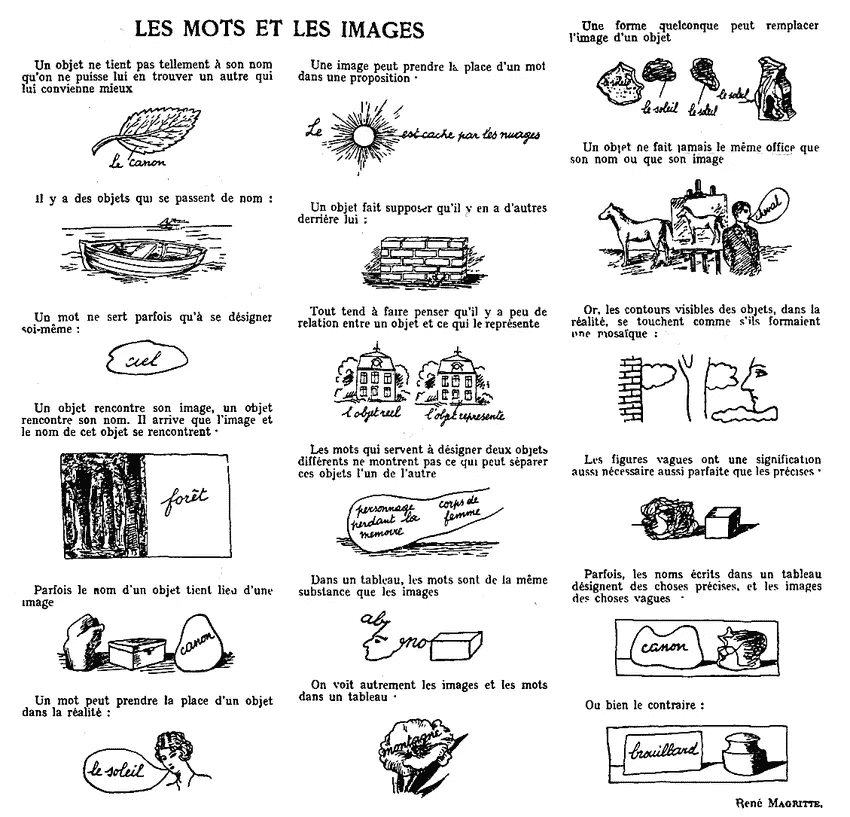
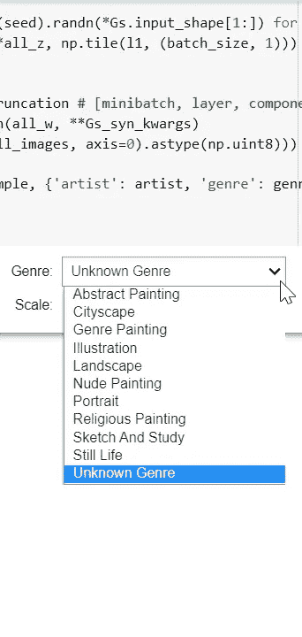
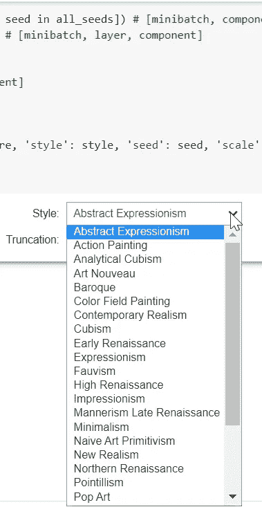
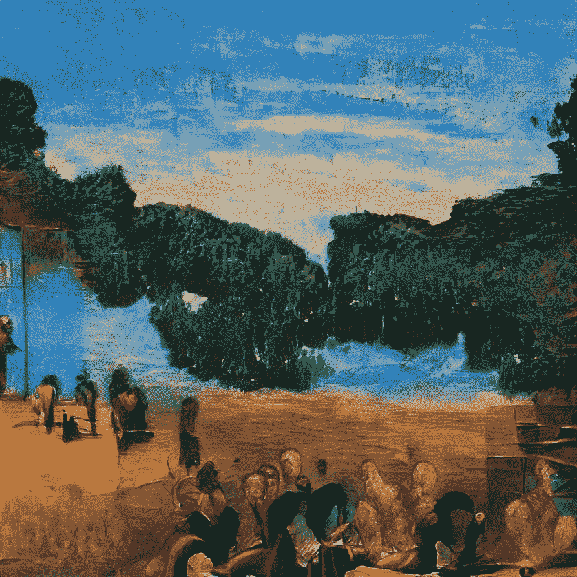
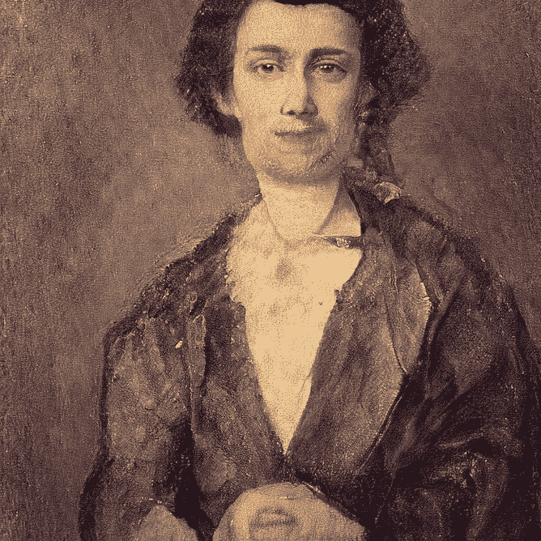

# 数据集的不可背叛性

> 原文：<https://towardsdatascience.com/the-non-treachery-of-dataset-df1f6cbe577e?source=collection_archive---------26----------------------->

## ArtGAN 和 WikiArt:用人工智能创造艺术。用艺术制造 AI。

样本数据集 von WikiArt ( [来源](https://archive.org/details/wikiart-stylegan2-conditional-model))

谓师 *何著名的烟枪。人们为此责备我！但是，你能塞住我的烟斗吗？不，这只是一个表象，不是吗？所以如果我在照片上写“这是一根管子”，那我就是在撒谎！*”——写了**勒内·马格里特**关于他杰出的概念和艺术作品“图像的背叛”。

> 颜后君不是烟斗。

马格里特探索了现实的维度——以及我们的惯例:理想的**一个(烟斗的*概念*)，虚构的**一个(烟斗的*绘画*)，以及真实的**一个(烟斗的*实际*)。他还质疑*什么是真正的*。在他鲜为人知的视觉散文“*Let Mots et les Images*”(“Words and Images”一部符号学巨著)中，他阐述了感知的不同层次，以及他的艺术构思(在不同层次上混合和替换术语、物体和图像):******

电影和图像。勒内·马格里特在 1929 年的《革命现实》中写道。([来源](https://www.researchgate.net/figure/Les-Mots-et-les-images-By-Rene-Magritte-in-a-1929-issue-of-La-Revolution-surrealiste_fig4_306040740))

在数字时代，新的类别出现并加入到这些定义中…但是我们怎么能称人工智能创造的艺术品呢？是一个*概念*吗？一部*小说*？还是已经现实的*？*

*设计师、工程师、AI 艺术家、思想家[萨米姆](https://medium.com/u/f3c8148878e1?source=post_page-----df1f6cbe577e--------------------------------)非常贴切地将[的论述](https://medium.com/@samim/adversarial-machines-998d8362e996)融合在一起:*

*在我们人类发现艺术的地方，人工智能检测为一个物体。*Objet troué*？*

*但是当我们在 Art 上训练 AI 的时候**会发生什么？Android 会对超越梦想的电动绵羊*说些什么？****

*有各种各样的努力让 AI 创造艺术(例如，[一个模型，在 Kaggle](https://medium.com/merzazine/how-to-train-your-artist-cb8f188787b5?source=friends_link&sk=868a3a57d4200faae23c973463645c66) 的 24k 绘画数据集上训练)。*

*人工智能研究员 Chee Seng Chan 和他的同事问了他们自己同样的问题。他们在 [WikiArt](https://www.wikiart.org/) 数据集上训练 CNN，并在 2016 年提交了他们的论文“[颜后君 n'est pas une pipe:美术绘画分类的深度卷积网络](http://web.fsktm.um.edu.my/~cschan/doc/ICIP2016.pdf)”。他们有双重任务:*

> *一方面，我们希望训练一个端到端的深度卷积模型**来研究深度模型在美术绘画分类**问题中的能力。另一方面，我们认为**与物品或人脸识别**相比，美术收藏的分类是一个更具挑战性的问题。这是因为有些艺术品是非具象的，也不是具象的，可能需要**想象力**才能认出它们([来源](http://web.fsktm.um.edu.my/~cschan/doc/ICIP2016.pdf) / [ICIP-16](https://github.com/cs-chan/ArtGAN/tree/master/ICIP-16) )。*

*那么 AI 是否有想象力去识别艺术，一种人类大脑、心脏和手的非具象作品？而 AI 能被启发产生艺术吗？*

## *什么是艺术？*

*他们发现:*

*   ***微调***ImageNet 预训练 CNN* 对 WikiArt 绘画数据集也达到了最好的结果*
*   *由于艺术风格之间的**相似属性而导致的错误分类是可能的***
*   *CNN 可以根据不同艺术家的绘画风格将他们联系在一起*

*所以他们发布了 [ArtGAN](https://github.com/cs-chan/ArtGAN) 来探索 AI 与艺术的关系的可能性，2017 新的研究和改进的 ArtGAN 发表了:[改进的 ArtGAN 用于自然图像和艺术品的条件合成](https://arxiv.org/abs/1708.09533)。*

## *2020 年美好开始:WikiArt*

*基于 ArtGAN，使用条件 WikiArt 模型，并由 StyleGAN2 和 TensorFlow 支持， [Peter Baylies](https://medium.com/u/71258452a7fb?source=post_page-----df1f6cbe577e--------------------------------) 发布了一个新模型:( [GitHub](https://github.com/pbaylies/stylegan2) / [条件模型](https://archive.org/details/wikiart-stylegan2-conditional-model))。*

*他去年开始了他的实验——用这个 twitter 帖子:*

*这个项目的美妙之处也始于合作:不同研究人员的许多努力[被结合在这个模型中。它用它的力量来说服人。](https://github.com/pbaylies/stylegan2)*

*让我们来探索 WikiArt(感谢[多伦·阿德勒](https://medium.com/u/59c46d66b5f1?source=post_page-----df1f6cbe577e--------------------------------)提供并微调 WikiArt 的一个 [**Colab 笔记本**](https://colab.research.google.com/github/Norod/my-colab-experiments/blob/master/WikiArt_Example_Generation_By_Peter_Baylies.ipynb) )。*

## *已故艺术家之间的对话*

*…让他们活着。*

*事实上，该模型是在许多艺术家身上训练的，但是对于流派分类，只选择了其中的一部分:*

> *Wikiart 绘画数据集拥有来自 1000 多位艺术家的 80，000 多幅美术绘画，从 15 世纪到现代。这个数据集包含 27 种不同的风格和 45 种不同的流派。 *[…]* 所有画作都是用于风格分类。同时，只有超过 1500 幅画的 10 个流派被选择用于流派分类，总共大约 65，000 个样本。( [CS 变](http://web.fsktm.um.edu.my/~cschan/doc/ICIP2016.pdf))*

*的确，风格分类是一个复杂的故事，是艺术学者们讨论的对象。*

*   *印象派从哪里(不是“什么时候”)开始？*
*   *是 DADA 还是已经 MERZ 了？*
*   *毕竟:文艺复兴是一个时代，艺术运动，还是社会文化的转变？*

*所有这些问题，即使是人类也无法回答(基于惯例、刻板印象，甚至艺术家的自我表现)。艾也很困惑——它最多能做的，就是区分**艺术家风格**、**描绘对象、**和**艺术运动特征**。*

******

*你可以在这三个类别集之间进行选择，并让人工智能重新创建任务。*

*所以让我们从伦勃朗开始——非常明显的选择。当然，我们得到的，不是你的下一个伦勃朗，而是这位艺术大师的风格:*

****

*左边:伦勃朗的自画像乐队/右边:使用预设生成的图像:伦勃朗/肖像/巴洛克*

*看看人工智能生成的图像中的一笔一画。与伦勃朗的大师之手相比:*

**

*戴贝雷帽翻领自画像(1659)，华盛顿特区国家美术馆*

*这不仅仅是风格的转变。这是更多的东西。伦勃朗作品概述。*

*如果我们抓到宇多川国良…*

****

*左图:由宇多川创作的“人们在暴风雨中撑着雨伞走在海边”/右图:“宇多川”人工智能生成的图像*

*Even if the style is far from original, the composition, the feeling, the mood — all the human shapes, lazy day, 物の哀れ. Already Impressionist touch.*

*完全正确:ArtGAN 无法重建名画(在这种情况下，因为它是在各个艺术时代的庞大数据集上训练的)。它也不能按需创作艺术品。*

*但它能产生不言自明的听觉图像。*

## *重塑艺术家*

*我们也可以问一个亵渎神明的问题:如果？不同风格的艺术家创作？达芬奇作为印象派？文艺复兴时期的梵高？*

*摆弄这些类别，你会得到意想不到的有趣结果。这里只是其中的一部分。*

**********

*彼得·贝利斯的模型提供了更多，包括投影仪，模拟风格的 T2。*

## *是现实吗？*

*是的，它是！与此同时，随着神经网络传递图像，它成为我们现实的一部分。*

## *是艺术吗？*

*你决定吧。在我看来，**这是达达派**意义上的艺术。这是一种破坏性的力量，让我们重新考虑艺术概念中的人的因素。就像在艺术史的所有关键时刻一样:无论是文艺复兴还是历史先锋派。*

# *AI 可以创造艺术。*

**********