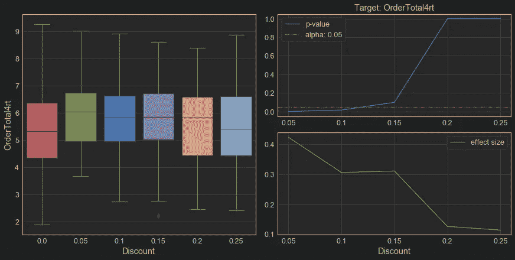
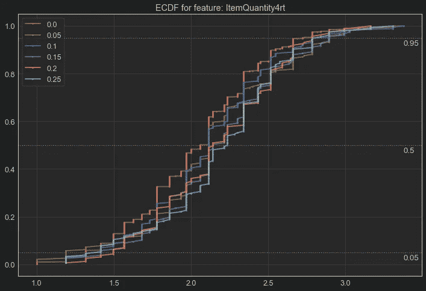
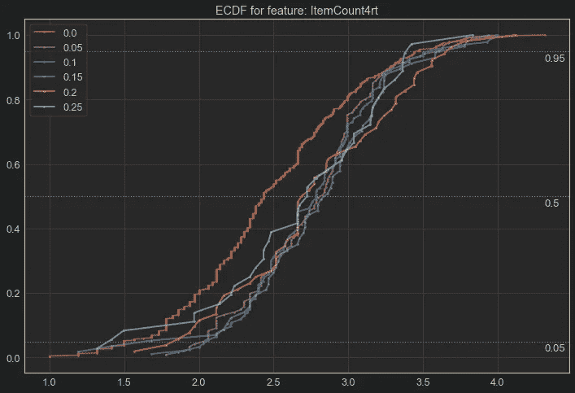
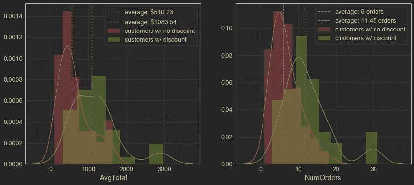
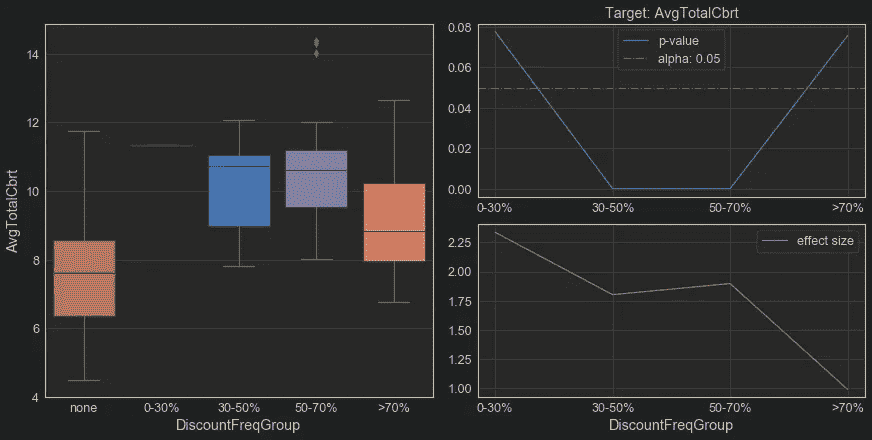
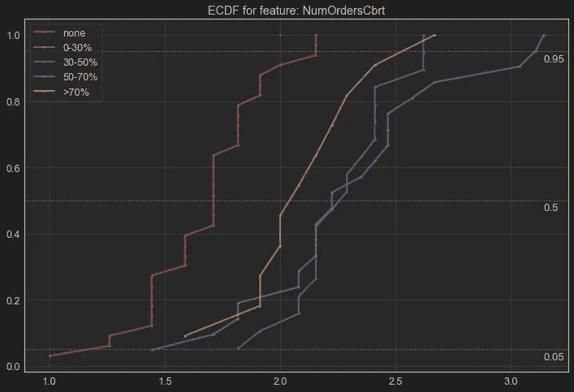
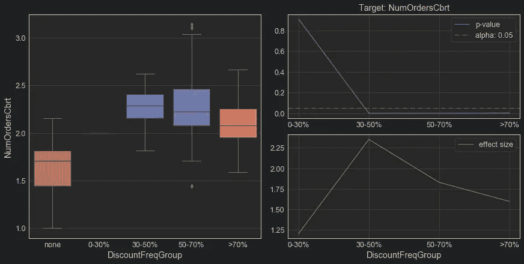

# 罗斯文贸易数据集

> 原文：<https://towardsdatascience.com/the-northwind-traders-dataset-5513bd7b63b0?source=collection_archive---------40----------------------->

(图片由[**es.pngtree.com**](https://es.pngtree.com/freebackground/ocean-freighter_259399.html)**)**

## 研究折扣对顾客行为的影响

*本帖描述的技术工作流程可以在* [*这里*](https://github.com/FoamoftheSea/dsc-mod-3-project-online-ds-sp-000) *的 jupyter 笔记本中找到。*

## 介绍

Northwind Traders 数据集是微软出于教育目的创建的一个玩具数据库。这家虚构的公司向世界各地的零售店批发特色食品。该数据库包含 85 个不同客户在 23 个月内下的 801 个订单的数据，以及关于客户、员工和供应商的补充信息。本研究的目标是从数据中提取见解，从而为公司带来更多收入。有两件事通常对商业有益，一是顾客购买更多的产品，二是更频繁地购买。由于 Northwind Traders 的客户是零售商，对他们来说，订单折扣意味着更高的利润率，可能会刺激购买者并提高客户忠诚度。这项研究试图调查两个问题，因为它们关系到最好地达到这些目标:多大的折扣应该提供，多久应该提供？由于提供更大或更频繁的折扣会对 nt 从订单中获得的利润产生负面影响，因此确定是否存在一个阈值是很重要的，在该阈值时，这种收入损失不再符合所产生的影响。

## 问题 1:提供多少折扣？

为了回答第一个问题，我们研究了折扣对两个指标的影响:订单的总价和订单中订购的商品数量。由于折扣分别应用于订单中的每个项目，因此进行了测试来检测折扣对订单中各个项目数量的影响。个别项目的折扣几乎完全以 5%的增量应用，从 0%到 25%，只有几个杂散值徘徊在 5%左右，四舍五入为 5%，使测试成为一个对照组和五个治疗组。然后，在每个订单的基础上调查折扣的影响，将数据按订单分组。每份订单中所有商品的平均折扣代表该订单的折扣水平。这些平均值根据订单中每个项目的相对数量进行加权。这些平均折扣的范围在 0%到 25%之间，因此为了创建组进行比较，这些值被四舍五入到最接近的 5%增量，除了 0 到 5 之间的任何值被四舍五入到 5，以保持 0%折扣组纯粹是无折扣订单，作为对照组。然后将 5%、10%、15%、20%和 25%的组作为对照进行测试，然后相互比较以进行进一步的分析，其中发现了统计学上显著的效果，正如在每个项目的效果测试中一样。大约 56%的订单没有折扣，使得控制组比其他组大得多。本研究中的所有统计检验都是双尾的。

测试对订单总额的影响，发现只有 5%和 10%组具有统计上显著的积极影响，并且当忽略对照组时，折扣金额和订单总额之间存在负线性关系，这在直觉上是有意义的，因为应用的折扣越大，订单总额将减少得越多。5%组比 10%组具有更大的测量效应(Cohen 的 d 值分别为 0.42 和 0.31)，但是比较测试表明，这两组之间测量的差异可能是由于机会，并且两者都不能声称具有优势。在任何情况下，如果任一组的总订单可以得到相同的结果，5%的折扣是有利的，因为它使公司花费更少。这些结果通过对未转换的目标数据的非参数检验和对第四根转换的目标数据的参数检验得到证实，这满足正态性假设。转化组的分组 ECDF 和测试结果如下所示。

Welch 的 t 检验与对照组(p 值调整为 5 次比较)

在每个项目和每个订单级别上测试了折扣对订购项目数量的影响。再次，非参数和参数方法进行了比较，发现是等效的。对于参数测试的正态性假设，该目标也进行了 4 次根变换。对于每个项目水平，除了 10%组之外，所有组都有统计学上显著的积极影响，其中没有一个与其他组有统计学上的差异。忽略对照组时，在折扣和项目数量之间没有检测到线性关系。这些事情一起表明，提供更大的折扣没有明显的好处，因为有利的效果已经达到 5%。

Welch 的 t 检验与对照组(p 值调整为 5 次比较)

在测试折扣对每个订单的商品数量的影响时，也得出了类似的结论，其中除了 25%组之外的所有组都显示出统计上的积极影响，它们在统计上彼此相似。同样，当忽略对照组时，在折扣和商品数量之间没有检测到线性关系，这意味着没有理由相信将折扣金额提高超过 5%会产生任何显著的好处。请注意该目标变量组的较大效应大小，显著组的 Cohen d > . 5:

韦尔奇 t 检验与对照组(p 值调整为 5 次比较)

## 回答:

在 5%的折扣下，对所有指标的统计显著影响出现，并且没有检测到进一步增加折扣的显著益处。还确定将折扣提高超过 5%会对订单总额产生负面影响。因此，5%的折扣是在不增加不必要的利润成本的情况下产生购买动机和客户忠诚度的正确选择。

## 问题 2:多久提供一次折扣？

在回答第二个问题时，每份订单数据再次按客户分组，以测试客户的折扣频率对他们的平均订单总数和他们在所研究的时间段内下的订单数量的影响。超过一半的顾客在这段时间内从未享受过折扣，而那些享受过折扣的顾客平均花费了两倍的钱。由于不可能知道该公司在折扣优惠中使用了什么决策过程(如果有的话),我们无法知道基于绩效的折扣系统在多大程度上造成了这种可衡量的差异。可以推测，大多数公司会向优先客户提供折扣，但在所研究的指标中，折扣客户和非折扣客户之间有相当多的重叠，这意味着有许多优秀客户从未获得折扣，也有许多不太优秀的客户经常获得折扣。无法确定客户购买行为与提供的平均折扣金额或提供折扣的频率之间的明确关系，因此可以得出这样的结论:如果基于价值的折扣系统存在，它会被宽松地遵循，并且有意义数量的测量效果是提供折扣的结果，而不是相反。

各组之间的重叠显示没有获得折扣的优质客户。

为了比较结果，对原始数据进行了非参数检验，对转换后的数据进行了参数检验，这两种方法对目标变量进行了检验。对于本节中的两个目标，立方根转换产生了令人满意的正常组数据。转换后的变量将显示在下面的视图中。

在调查向客户提供折扣的最佳频率时，客户根据其订单在该时间段内打折的比例进行分组。这包括一个对照组(0%折扣)，然后是 0-30%，30-50%，50-70%和> 70%的治疗组。请注意，只有一个客户属于 0–30%组，因此使用 z 测试来确定该组的 p 值，但更多测试将适用于确定该频率范围的影响。对于已经打折的客户，他们的平均折扣率是订单的 58%。

对于对客户平均总数的影响，测试显示，与对照组相比，30–50%和 50–70%组具有统计上的显著影响。这些影响非常大，Cohen 的 d >1.75。这两个有效组在统计上彼此相似，表明没有必要为顾客提供超过 30-50%的折扣来获得最佳效果。

Welch 的 t 检验与对照组(p 值调整为 4 次比较)

在调查客户在一段时间内下的订单数量的影响时，测试显示，除了单个成员 0–30%组之外，所有处理组都具有相当大的具有统计显著性的积极影响，所有处理组的 Cohen d > 1.5。研究还表明，各组之间没有统计学差异，也没有线性关系，这意味着没有发现将每个客户的频率提高 30–50%有任何益处。

Welch 的 t 检验与对照组(p 值调整为 4 次比较)

考虑到所有客户的平均折扣率为 36%，对提供的所有折扣进行完全重新分配会将所有客户置于理想的折扣频率范围内，而不会增加提供的折扣数量。这可能不如将折扣瞄准更有前景的客户那样实际，但无论哪种情况，都有一个强有力的论点，即一些折扣应该从过度折扣的客户重新分配给一些非折扣客户，以期对他们的购买行为产生有利影响。考虑到与较不频繁折扣的客户群相比，该客户群实际上表现不佳，并且通过将折扣重新分配给以前未折扣的客户，可以降低折扣客户群中 58%的平均折扣率，而不会对客户行为产生不利影响，这似乎是可能的，因为我们的测试表明，对任何给定客户提供 30–50%的订单折扣就足够了。

## 回答:

在 30-50%和 50-70%组的两个目标上都检测到显著的积极效果，在这些组之间没有检测到差异。这意味着为客户提供 30-50%的订单折扣是正确的选择，可以在不增加不必要的利润成本的情况下产生良好的客户行为。

## 结论

这项研究表明，向客户提供折扣对他们的购买行为有显著的积极影响，但超过某一点后，增加折扣的数量或频率不会进一步改善这些影响，只会降低订单的盈利能力。为了培养客户忠诚度和买家激励，Northwind Traders 应该为 30-50%的客户订单提供平均 5%的商品折扣。应根据流动性需求选择要应用折扣的项目。该公司可以通过将折扣从过度折扣、表现不佳的客户重新分配给有希望的非折扣客户，来增加折扣客户的数量，以期改善他们的购买行为。这样，他们也将有机会对事后收集的数据进行未来分析，以便对客户行为进行前后比较。