# 用于物体检测的深度学习算法的基本原理

> 原文：<https://towardsdatascience.com/the-nuts-and-bolts-of-deep-learning-algorithms-for-object-detection-60dfc5e015d4?source=collection_archive---------19----------------------->

*本文原载于* [*数据来自*](https://medium.com/data-from-the-trenches) *。更多喜欢的，请关注我们！*

你刚刚得到一架新的无人机，你想让它超级智能！也许它应该检测工人是否正确佩戴头盔，或者工厂屋顶的裂缝有多大。

在这篇博客文章中，我们将研究对象检测的基本方法(穷举搜索、R-CNN、快速 R-CNN 和更快 R-CNN)，并尝试了解每个模型的技术细节。最精彩的部分？我们将在没有任何公式的情况下完成所有这些工作，让所有经验水平的读者都可以跟着做！

最后，我们将在这篇文章之后发表第二篇文章，深入探讨单次检测器(SSD)网络，看看如何在无人机上进行部署。

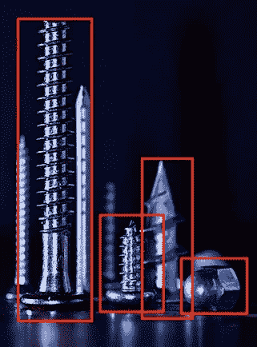

检测螺母和螺栓——感谢克里斯·耶茨(Unsplash)

# 我们探测物体的第一步

## 它是一只鸟吗？它是一架飞机吗？ **—** 图像分类

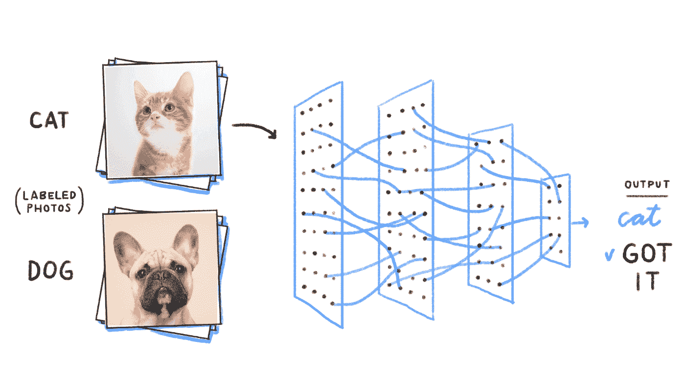

猫？狗？[图像信用](https://becominghuman.ai/building-an-image-classifier-using-deep-learning-in-python-totally-from-a-beginners-perspective-be8dbaf22dd8)

目标检测(或识别)建立在图像分类的基础上。图像分类的任务是——你猜对了——将图像分类(通过如上所示的像素网格)到一个类别中。为了复习图像分类，我们让读者参考[这篇文章](/wtf-is-image-classification-8e78a8235acb)。

对象识别是对图像中的对象进行识别和分类的过程，如下所示:

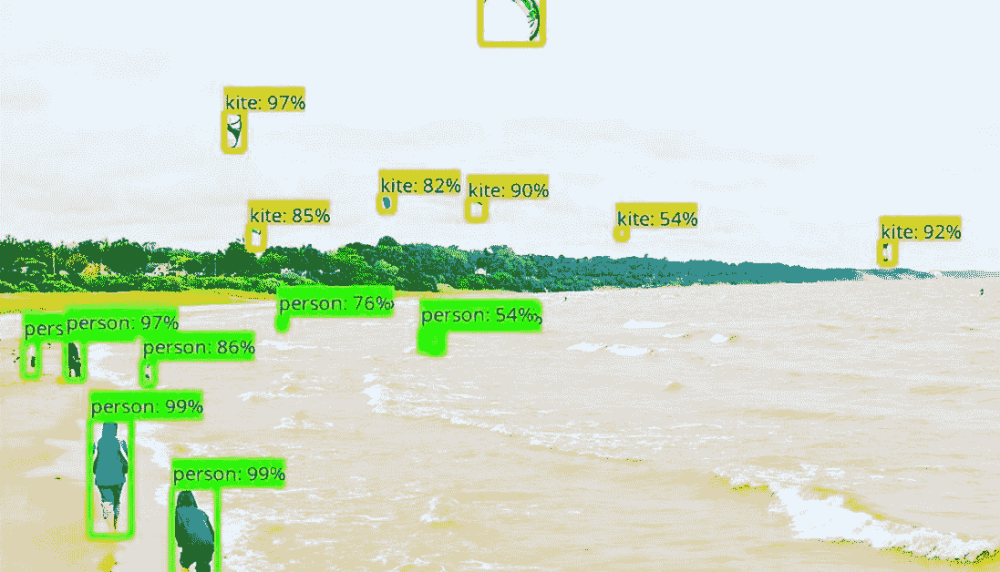

我的风筝在哪里？—图片鸣谢:[迈克尔·麦莉](https://www.flickr.com/photos/mike_miley/)，[原图](https://www.flickr.com/photos/mike_miley/4678754542/in/photolist-88rQHL-88oBVp-88oC2B-88rS6J-88rSqm-88oBLv-88oBC4)。

为了使模型能够学习图像中对象的类别和位置，目标必须是五维标签(类别，x，y，宽度，长度)。

# 物体检测方法的内部工作原理

## 一种计算量很大的方法:穷举搜索

最简单的对象检测方法是对图像的各个子部分使用图像分类器。你可能会问，是哪些？让我们逐一考虑一下:

1.首先，获取您想要对其执行对象检测的图像。

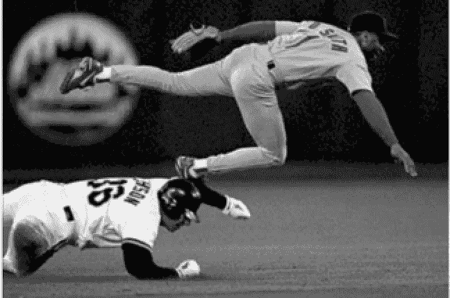

2.然后，将此图像分成不同的部分或“区域”，如下所示:

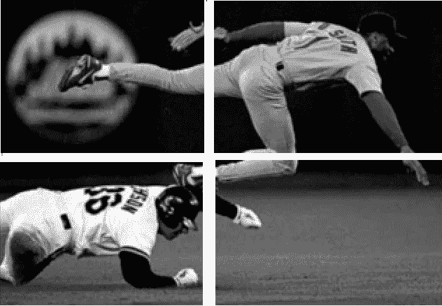

3.将每个区域视为一个单独的图像。

4.使用经典图像分类器对每张图像进行分类。

5.最后，对于已经检测到一个对象的每个区域，将所有图像与预测标签相结合。

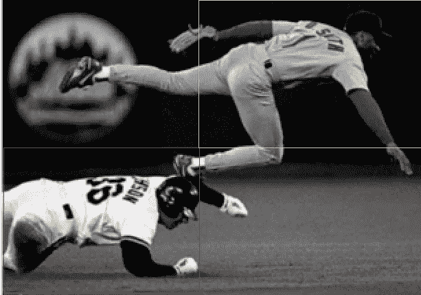

这种方法的一个问题是对象可能具有不同的纵横比和空间位置，这可能导致大量区域的不必要的昂贵计算。它在计算时间方面存在太大的瓶颈，不能用于现实生活中的问题。

## 区域建议方法和选择性搜索

最近的方法是将问题分解为两个任务:首先检测感兴趣的区域，然后执行图像分类以确定每个对象的类别。

第一步通常包括应用**区域提议方法**。这些方法输出可能包含感兴趣对象的边界框。如果在一个区域提议中已经正确地检测到了对象，那么分类器也应该检测到它。这就是为什么这些方法不仅要快，而且要有很高的召回率。

这些方法还使用了一个聪明的架构，其中图像预处理的一部分对于对象检测和分类任务是相同的，这使得它们比简单地链接两个算法更快。最常用的区域提议方法之一是 [**选择性搜索**](https://www.researchgate.net/publication/262270555_Selective_Search_for_Object_Recognition) :

其第一步是应用[**图像分割**](http://cs.brown.edu/people/pfelzens/segment/) ，如下图所示:

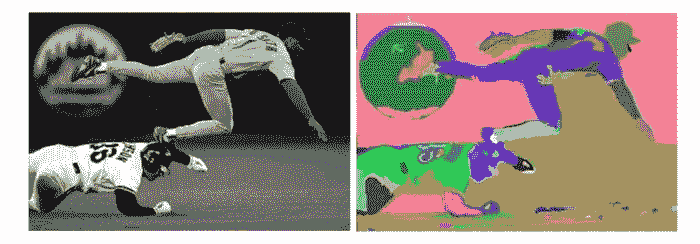

图像分割— [图像信用](http://cs.brown.edu/people/pfelzens/papers/seg-ijcv.pdf)

从图像分割输出中，选择性搜索将依次:

1.  从分割的部分创建边界框，并将它们添加到区域提议列表中。
2.  基于四种相似性类型:颜色、纹理、大小和形状，将几个小的相邻片段组合成较大的片段。
3.  回到第一步，直到该部分覆盖整个图像。

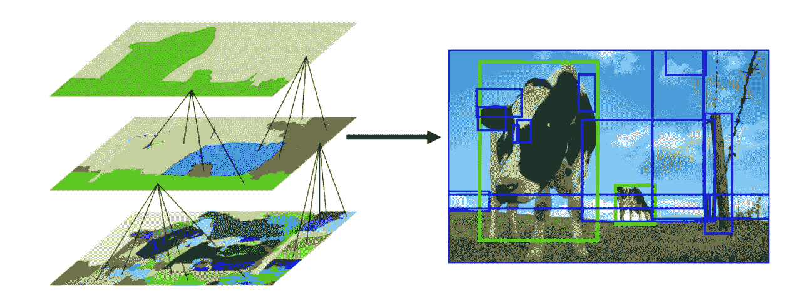

分层分组— [图像信用](http://www.huppelen.nl/publications/selectiveSearchDraft.pdf)

既然我们已经了解了选择性搜索是如何工作的，那么让我们介绍一些利用它的最流行的对象检测算法。

## 第一对象检测算法:R-CNN

[罗斯·吉希克等人](https://arxiv.org/pdf/1311.2524.pdf)。提议的区域 CNN (R-CNN)允许选择性搜索和 CNN 的结合。实际上，对于每个区域提议(论文中的 2000)，一个前向传播通过 CNN 产生一个输出向量。这个向量将被馈送到一个**一对一分类器**(即每类一个分类器，例如一个分类器，其中如果图像是狗，标签= 1，如果不是狗，标签= 0；第二个分类器，其中如果图像是猫，标签= 1，如果不是猫，标签= 0，等等)，**【SVM】**是 R-CNN 使用的分类算法。

但是你如何给地区提案贴标签呢？当然，如果它完全符合我们的基本事实，我们可以将其标记为 1，如果给定的对象根本不存在，我们可以将其标记为 0。如果一个物体的一部分出现在图像中呢？我们应该将区域标记为 0 还是 1？为了确保我们在预测图像时训练我们的分类器在我们实际上可以拥有的区域上(而不仅仅是完美匹配的区域)，我们将查看由选择性搜索和基本事实预测的框在并集 (IoU)上的**交集:**

IoU 是一个指标，由预测框和实际框之间的重叠面积除以它们的联合面积来表示。它奖励成功的像素检测，惩罚假阳性，以防止算法选择整个图像。

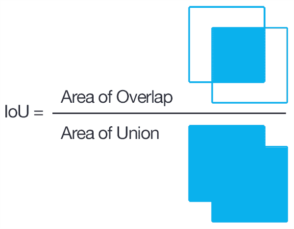

欠条— [图像信用](https://www.pyimagesearch.com/2016/11/07/intersection-over-union-iou-for-object-detection/)

回到我们的 R-CNN 方法，如果 IoU 低于给定阈值(0.3)，那么相关联的标签将是 0。

在对所有区域提议运行分类器之后，R-CNN 提议使用特定于类的 **bbox 回归器**来改进边界框(bbox)。bbox 回归器可以微调边界框边界的位置。例如，如果选择性搜索检测到了一只狗，但只选择了它的一半，则知道狗有四条腿的 bbox 回归器将确保选择整个身体。

同样感谢新的 bbox 回归预测，我们可以使用 [**非最大抑制**](/non-maximum-suppression-nms-93ce178e177c) (NMS)来丢弃重叠的建议。这里的想法是识别和删除同一对象的重叠框。NMS 对每个类别的每个分类分数的建议进行排序，并计算具有最高概率分数的预测框与所有其他预测框(同一类别)的 IoU。然后，如果 IoU 高于给定阈值(例如，0.5)，则它丢弃提议。然后对下一个最佳概率重复这个步骤。

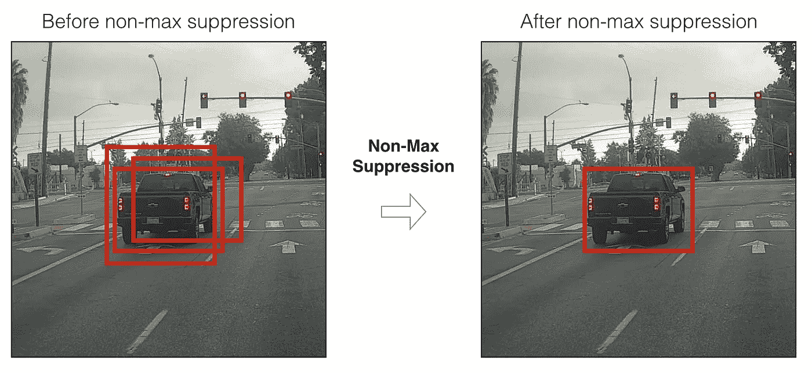

非最大抑制— [图像信用](/non-maximum-suppression-nms-93ce178e177c)

综上所述，R-CNN 遵循以下步骤:

*   从选择性搜索中创建区域建议(即，预测图像中可能包含对象的部分)。
*   通过预先训练的模型运行这些区域，然后通过 SVM 对子图像进行分类。
*   通过边界框预测运行正预测，这允许更好的框精度。
*   在预测消除重叠建议时应用 NMS。

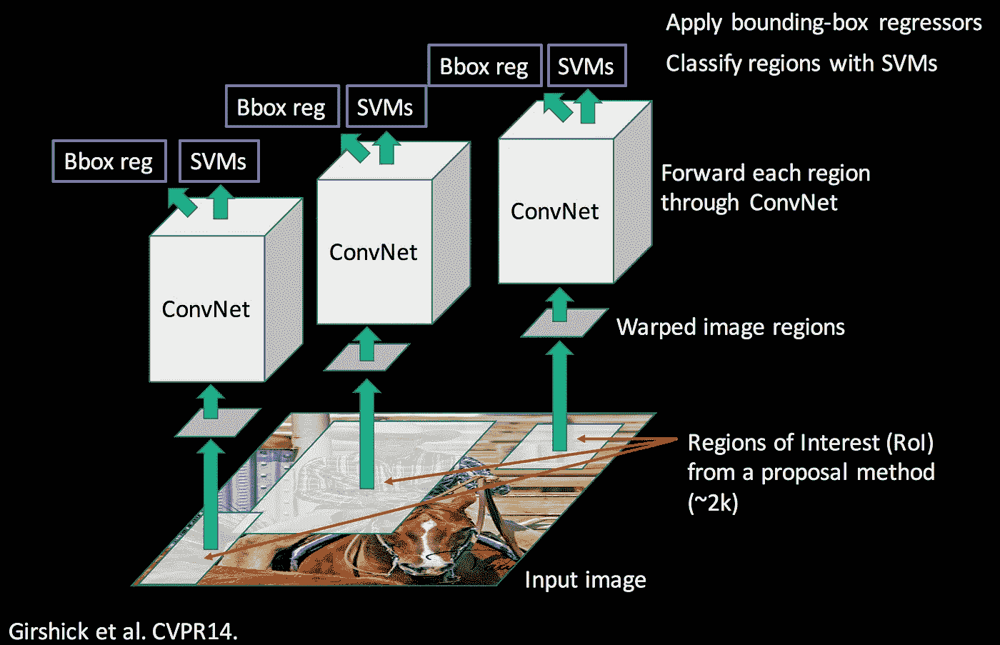

R-CNN 网络— [图片来源](https://ieeexplore.ieee.org/document/6909475)

然而，R-CNN 也有一些问题:

*   这种方法仍然需要对所有的区域提议进行分类，这可能导致计算瓶颈——它不可能用于实时用例。
*   在选择性搜索阶段没有学习发生，这可能导致对于某些类型的数据集的坏的区域建议。

## 边际改进:快速 R-CNN

快速 R-CNN——顾名思义——比 R-CNN 更快。它基于 R-CNN，有两个不同之处:

*   **没有为每个地区的提议向 CNN 发送信息，而是只向 CNN 发送一次**，取整幅图像生成一个卷积特征图(取一个像素矢量，用一个过滤器将其转换成另一个矢量，这将给出一个卷积特征图——你可以在这里找到更多信息)。接下来，使用选择性搜索来识别提议区域，然后使用兴趣池区域( [RoI pooling](/region-of-interest-pooling-f7c637f409af) )层将它们重新整形为固定大小，以便能够用作完全连接层的输入。
*   Fast-RCNN 在其区域建议分类中使用 **softmax 层而不是 SVM** ,这样速度更快，精确度更高。

以下是网络的架构:

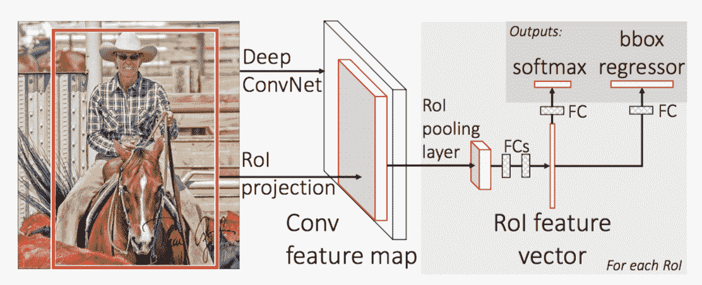

快速 R-CNN 网络— [图片来源](https://arxiv.org/pdf/1504.08083.pdf)

正如我们在下图中看到的，快速 R-CNN 在训练和测试方面比 R-CNN 快得多。然而，由于选择性搜索方法，瓶颈仍然存在。

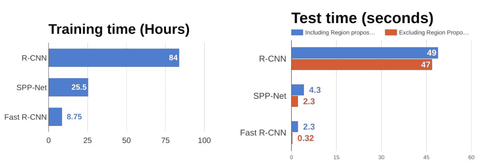

R-CNN vs 快速 R-CNN — [图片来源](/r-cnn-fast-r-cnn-faster-r-cnn-yolo-object-detection-algorithms-36d53571365e)

## R-CNN 能有多快？—更快的 R-CNN

虽然快速 R-CNN 比 R-CNN 快得多，但选择性搜索的瓶颈仍然存在，因为它非常耗时。因此，[任等人](https://arxiv.org/pdf/1506.01497.pdf)。想出了更快的 R-CNN 来解决这个问题，并提出用一个非常小的卷积网络来代替选择性搜索，这个网络叫做**区域提议网络** (RPN)来找到感兴趣的区域。

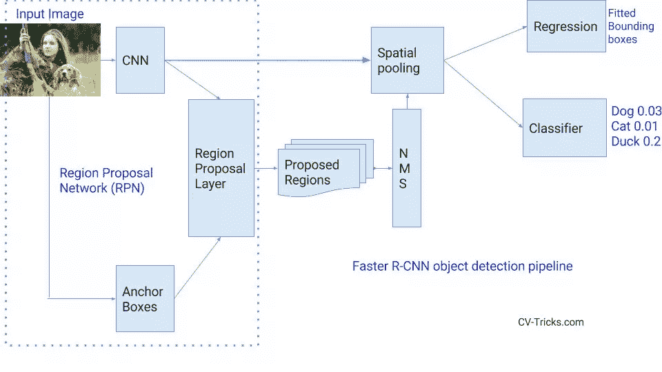

区域提案网— [形象信用](https://cv-tricks.com/)

简而言之，RPN 是一个小型网络，可以直接找到地区提案。

一种简单的方法是创建深度学习模型，该模型输出 x_min、y_min、x_max 和 x_max，以获得一个区域提议的边界框(因此，如果我们想要 2，000 个区域，则输出 8，000 个)。然而，有两个基本问题:

*   这些图像可能有非常不同的大小和比例，因此创建一个正确预测原始坐标的模型可能会很棘手。
*   在我们的预测中有一些坐标排序约束(x_min < x_max, y_min < y_max).

To overcome this, we are going to use **anchors:**

锚点是图像中不同比例和比例的预定义框。例如，对于给定的中心点，我们通常从三组尺寸(例如，64px、128px、256px)和三个不同的宽/高比(1/1、2/1)开始。在这个例子中，对于图像的一个给定像素，我们最终会有九个不同的盒子(盒子的中心)。

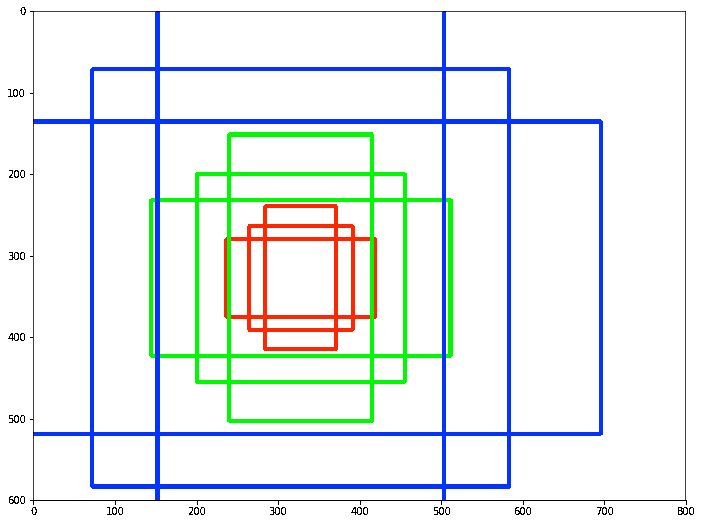

锚点—比率和比例— [图像信用](https://medium.com/@smallfishbigsea/faster-r-cnn-explained-864d4fb7e3f8)

那么一张图片我总共有多少个锚呢？

最重要的是要明白，我们不是要在原始图像上创建锚点，而是在最后一个卷积层的输出特征图上创建锚点。例如，对于 1，000*600 的输入图像，我们每个像素有一个锚点，因此 1，000*600*9 = 5，400，000 个锚点，这是错误的。事实上，因为我们要在特征图上创建它们，所以要考虑子采样率(这是由于卷积层中的步长而导致的输入和输出维度之间的因子减少)。

在我们的例子中，如果我们把这个比率取为 16(像在 VGG16 中)，我们将在特征图的每个空间位置有 9 个锚点，所以“仅仅”大约 20，000 个锚点(5，400，000 / 16)。这意味着输出特征中的两个连续像素对应于输入图像中相距 16 个像素的两个点。注意，这个下采样比是更快的 R-CNN 的可调参数。

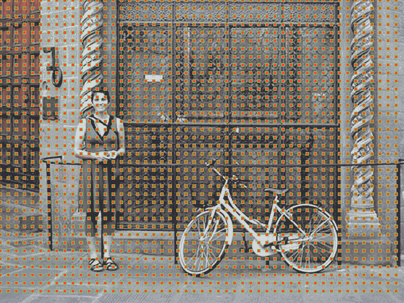

主播中心— [图片来源](https://tryolabs.com/blog/2018/01/18/faster-r-cnn-down-the-rabbit-hole-of-modern-object-detection/)

现在剩下的问题是如何从那 20，000 个主播到 2，000 个区域提案(取与之前相同数量的区域提案)，这是我们 RPN 的目标。

## 如何训练区域提案网络

为了实现这一点，我们希望我们的 RPN 告诉我们一个盒子是否包含一个对象或者是一个背景，以及对象的准确坐标。输出预测是作为背景的概率、作为前景的概率以及δDx、Dy、Dw、Dh，它们是锚和最终提议之间的差异)。

*   首先，我们将移除跨界锚点(即，由于图像的边界而被切割的锚点)，这给我们留下了大约 6000 个图像。
*   如果存在以下两种情况之一，我们需要将锚标记为阳性:

→在所有其他主播中，主播的 IoU 最高，带有地面真相框。

→主播至少有 0.7 的 IoU 带地面真相箱。

*   如果 IoU 小于 0.3，我们需要将我们的锚标为负。
*   我们忽略所有剩余的锚。
*   我们训练二元分类和包围盒回归调整。

最后，关于实现的几点说明:

1.  我们希望在我们的小批量中，正负锚的数量保持平衡。
2.  我们使用多任务损失，这是有意义的，因为我们希望最小化任一损失——错误预测前景或背景的误差，以及我们盒子中的准确性误差。
3.  我们使用来自预训练模型的权重来初始化卷积层。

## 如何使用区域提案网络

*   所有锚点(20，000)都被评分，因此我们得到新的边界框以及它们成为前景(即，成为对象)的概率。
*   使用非最大抑制(参见 R-CNN 部分)
*   提案选择:最后，只保留按分数排序的前 N 个提案(N=2，000，我们回到我们的 2，000 个区域提案)。

像以前的方法一样，我们最终得到了 2000 个建议。尽管看起来更复杂，这个预测步骤比以前的方法更快更准确。

下一步是创建一个类似于快速 R-CNN 的模型(即 RoI 池和一个分类器+ bbox 回归器)，使用 RPN 代替选择性搜索。然而，我们不想完全像以前那样，即接受 2，000 份建议，对它们进行筛选，然后通过预先训练好的基础网络进行传递。相反，**重用现有的卷积特征图**。事实上，使用 RPN 作为建议生成器的优点之一是在 RPN 和主检测器网络之间共享权重和 CNN。

1.  使用预先训练的网络来训练 RPN，然后对其进行微调。
2.  使用预先训练的网络来训练检测器网络，然后进行微调。使用来自 RPN 的建议区域。
3.  RPN 使用第二个模型的权重进行初始化，然后进行微调——这将是我们最终的 RPN 模型。
4.  最后，对检测器网络进行微调(RPN 权重固定)。CNN 的特色地图将在两个网络之间共享(见下图)。

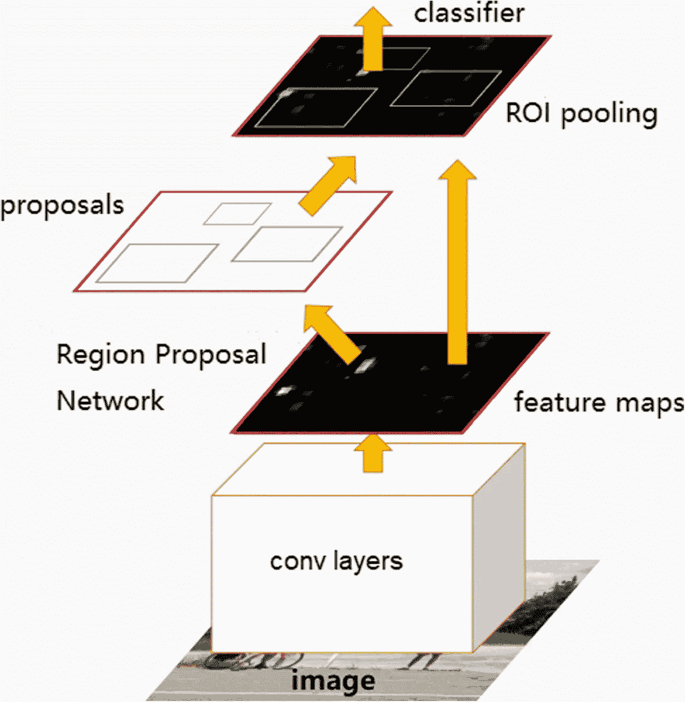

更快的 R-CNN 网络— [图片来源](https://arxiv.org/abs/1506.01497)

综上所述，更快的 R-CNN 比以前的方法更准确，比 Fast-R-CNN 快 10 倍左右，这是一个很大的进步，也是实时评分的开始。

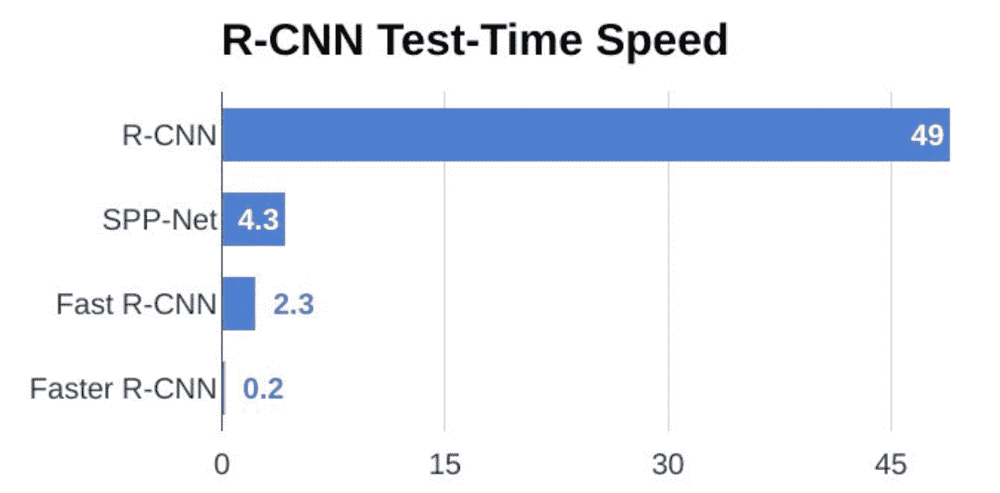

R-CNN vs 快速 R-CNN vs 更快 R-CNN — [图片来源](/r-cnn-fast-r-cnn-faster-r-cnn-yolo-object-detection-algorithms-36d53571365e)

尽管如此，区域提议检测模型对于嵌入式系统来说是不够的，因为这些模型很重，并且对于大多数实时评分情况来说不够快——最后一个例子大约是每秒五幅图像。

在我们的下一篇文章中，我们将讨论更快的方法，如 SSD 和无人机图像检测的真实用例。

我们很高兴能为[数据仓库决策支持系统](https://www.dataiku.com/product/)研究这一主题——查看以下附加资源以了解更多信息:

*   [针对大台库 DSS 项目的对象检测插件](https://www.dataiku.com/product/plugins/object-detection-cpu/)，
*   我们在大台库用目标探测算法赢得了一场北约挑战赛。