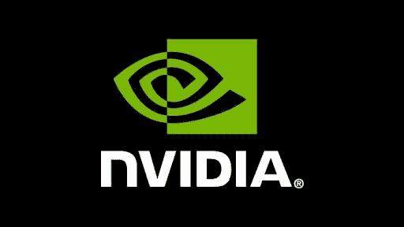

# 英伟达数据科学访谈

> 原文：<https://towardsdatascience.com/the-nvidia-data-science-interview-89023d1054b8?source=collection_archive---------49----------------------->

## 英伟达数据科学面试问题

[英伟达标志](https://nvidianews.nvidia.com/)

NVIDIA 公司是美国科技巨头，总部设在加利福尼亚州的圣克拉拉。NVIDIA 为不断扩大的游戏和专业市场设计图形处理单元(GPU)，并为移动计算和汽车市场设计片上系统单元(SOC)。英伟达的数据科学家在其产品中利用最先进的数据科学技术，最终用于**专业可视化、数据中心、人工智能、虚拟现实和无人驾驶汽车。**

除了是一家数据驱动的公司，NVIDIA 还帮助各行各业的数据科学家(医学、金融、运营等)。)更好地利用他们的数据和增强的性能。借助 RAPIDS(一个运行在 Nvidia GPUs 上的 Nvidia 开源端到端 GPU 加速数据科学库)和 DGX GPU 系列等产品，NVIDIA 为数据科学家、机器学习/深度学习科学家和开发人员提供了完成工作所需的计算能力。[1]

# NVIDIA 的数据科学角色

NVIDIA 数据科学家的角色因具体团队、产品和功能而异。一般来说，NVIDIA 的数据科学家职能和角色可能跨越广泛的数据科学概念，但**主要专注于机器学习和深度学习**。这意味着深入了解在云计算集群上开发解决方案，同时大规模部署 ML 和 DL 模型。

# 所需技能

*   计算机科学，数据科学，电子/计算机工程，物理，数学，其他工程领域的硕士/博士。
*   3 年以上(高级职位 8 年以上)Python、C++软件开发工作或研究经验。
*   对 TensorFlow、PyTorch、XGboost、Scikit-learn 或 Spark 等框架的机器学习/深度学习算法有丰富的经验。
*   精通以下任何一种 C、Python、Scala、SQL、Java 或 C++编程语言的使用。
*   能够在云环境中构建 ETL 管道。
*   能够与跨组织的多个级别和团队紧密合作(工程、产品、销售和营销团队)。
*   有效的口头/书面沟通和技术演示技巧

# 什么样的数据科学角色？

NVIDIA 没有专门的数据科学部门，但有各种各样的数据科学团队，每个团队都有自己独特的流程。有一个数据科学团队在*数据中心工作，*在 RAPIDS 有一个数据团队，还有一个人工智能驱动的汽车团队和软件开发团队。NVIDIA 的数据科学家角色可能略有不同，在某些情况下会重叠。

根据团队的不同，数据科学家的职能可能会从担任**深度学习工程师**延伸到担任专注于计算机视觉的**研究科学家**。

基本职责包括:

*   开发并向客户展示基于 NVIDIA 最新 ML/DL、数据科学软件和硬件技术的解决方案
*   执行深入的分析和优化，以确保 GPU 架构系统的最佳性能。
*   将深度学习解决方案应用于对象检测、分割、视频理解、序列预测、自适应计算、记忆网络、简化精度训练和推理、图形编译器、强化学习、搜索、分布式和联合训练等领域。
*   与主要行业合作伙伴/客户开发人员合作，提供适用于其产品和技术的 ML 解决方案。
*   与工程、产品和销售团队合作，确保客户的设计成功。
*   与客户的数据科学、ML/DL 开发人员和 IT 团队紧密合作。

# 英伟达面试流程

[深度学习开发者指南](https://developer.nvidia.com/deep-learning)

像大多数科技公司一样，NVIDIA 的数据科学招聘流程从招聘的初始电话筛选开始，然后是团队经理的技术电话筛选。完成技术电话筛选后，您将进入现场面试，包括 7 次与招聘经理、团队成员和产品经理的一对一面试(每次持续 30 到 60 分钟)。

# 初始屏幕

这是一个以简历为基础的对人力资源或招聘经理的电话面试。这次面试是探索性的，需要浏览你的简历和过去的相关项目，以确定你是否适合这个职位/团队。

# 技术屏幕

在最初的电话筛选之后，将安排与数据科学家的技术访谈。这个采访时长在 45 到 60 分钟之间，围绕现实生活中的 NVIDIA 问题进行提问。期望深入解释你的机器学习经验，并谈论你可能如何设计 ML 或 DL 系统并扩展该过程。

# 现场面试

现场面试是 NVIDIA 数据科学家招聘流程的最后一个面试阶段。Nvidia 数据科学家的现场面试流程包括 7 轮面试，要么是一对一，要么是由团队成员、团队经理和产品经理组成的面试小组，每轮面试持续 45 到 60 分钟。

这次采访结合了各种数据科学概念，包括数据分析、软件工程、机器学习和英伟达的核心文化和价值观。对于技术问题，考生需要在 NVIDIA 提供的白板或笔记本电脑上进行编码练习。

这次采访中的问题跨越了高级统计概念到深度学习的实施和设计。对于技术方面，记得练习用编译器语言以及 Python 进行编码，还要练习 Tensorflow，Keras，或者其他深度学习框架中关于机器学习算法和编码的问题。

你可以在面试查询上像下面这样练习[机器学习问题:](https://www.interviewquery.com/questions/one-million-lyft-rides)

> *假设我们在西雅图有 100 万次 app rider 旅程。我们希望建立一个模型来预测乘客提出乘车请求后的预计到达时间。*
> 
> *我们如何知道我们是否有足够的数据来创建一个足够准确的模型？*

# 最后的提示

*   有 GPU 开发经验真的很有帮助。这意味着 GPGPU 编程和设计实践，或者在某种数据科学领域为潜在竞争对手工作，如英特尔、AMD 等。
*   NVIDIA 一直在通过他们的 GPU 和芯片开发打破技术壁垒。这通常是通过**雇佣研究人员或学术界以外的人来完成的，这些人在某个技术领域或行业领域建立了思想领导力的记录**。这也意味着他们愿意为此支付一笔不菲的总薪酬。

# 英伟达数据科学面试问题

*   *给定一个时间序列数据集，您将如何检测异常？*
*   *真阳性和假阳性有什么区别？*
*   *在 Tensorflow 中实现梯度下降。*
*   *设计一个从数据集到生产部署的端到端推荐引擎。*
*   写下线性回归的方程式。
*   解释决策树是如何工作的。

# 感谢阅读

*   你可以在[**面试查询**](https://www.interviewquery.com/) 上找到更多英伟达的面试问题
*   查看我的 [**Youtube 频道**](https://www.youtube.com/channel/UCcQx1UnmorvmSEZef4X7-6g) 了解更多数据科学内容、采访和解决问题的技巧&。
*   在面试查询博客上找到更多数据科学面试指南，如 [**谷歌数据科学家面试**](https://www.interviewquery.com/blog-the-google-data-scientist-interview/) 和[**DoorDash 数据科学家面试**](https://www.interviewquery.com/blog-doordash-data-science-interview-questions/) 。

**参考文献**[【1】深度学习 AI](https://www.nvidia.com/en-us/deep-learning-ai/)

【https://www.interviewquery.com】原载于 2020 年 4 月 15 日**。**