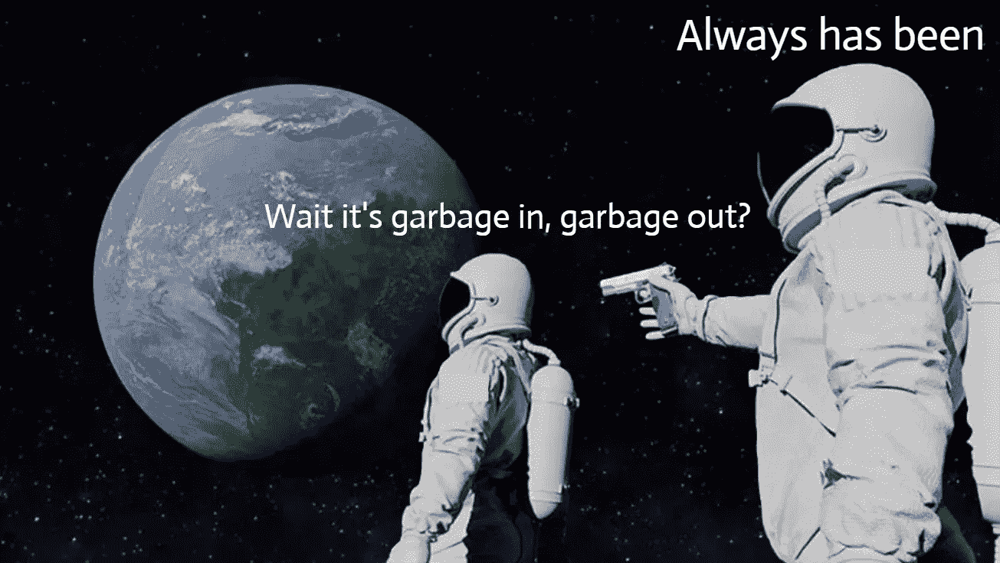

# 在数据科学中，数据质量值得更多的关注

> 原文：<https://towardsdatascience.com/the-one-component-that-deserves-more-attention-in-data-science-22de7b596d83?source=collection_archive---------52----------------------->

## 忘记 PCA，超参数调整和集成算法

约书亚·索蒂诺在 [Unsplash](https://unsplash.com?utm_source=medium&utm_medium=referral) 上拍摄的照片

# 介绍

数据科学、机器学习、人工智能，这些术语充斥着新闻。自动化、新的储蓄或更高的收入、新的功能、市场或技术的承诺让每个人都兴奋不已。其中一些承诺是有根据的，而另一些则仍处于初始阶段或尚未通过概念验证阶段(换句话说，它们只是处于梦遗阶段)。

我们用来提取、转换和加载数据的技术有了重大改进。新的和改进的算法或技术，如 PCA、超参数优化和设计，如神经网络，带来了结果的改善。但是有一个方面没有得到足够的重视，反派小鸭子。如果你习惯于处理数据，你可能已经猜到了。如果不是，接下来你就知道了。让我们开始吧。

# 数据科学中最不受欢迎的一个

除了钱之外，商业和研究的核心是数据。数据是新的石油，还是新的电力取决于你问谁。关键资产。计算机使收集、分享和分析变得容易，现在它是一种战略资产。

但是有一个方面没有得到充分的讨论，那就是它的质量。数量，无论是大数据还是小数据，如果数据质量差，都无所谓。

> 垃圾进，垃圾出

无论你的数据管道有多好，你的清理和训练/测试模型有多好，无论你的假设有多强，或者你的算法有多复杂，如果你的数据不好或者质量差，你的工作都不会有任何价值。那就是著名的“垃圾进，垃圾出”。用成熟的原料是烤不出好蛋糕的。

此流程提供了另一种查看数据质量的方式:

数据质量→信息质量→决策质量→业务成果

nickslicktricks 在 [Reddit](https://www.reddit.com/r/memes/comments/gyp8vo/wake_up_people/) 上的原创模因模板——文章作者对问题进行了调整

# 当我们谈论糟糕的数据时，我们谈论的是什么

要找到坏数据，需要知道要找什么。业界大多定义 6 到 7 个维度来量化数据质量。尽管维度的数量可以根据需要、行业和关注点而变化。

一个简单的缩写将是 **ACCCUT。**我们来回顾一下:

一种精确性。每个数据点都应该有正确的值。例子:正确拼写的名字，真实记录的事件。

C 完整。数据记录应包含所有必需的信息。可选元素是…可选的。示例:姓名&电子邮件是必填项，但实际地址是可选的。

协调一致。任何给定的数据点在整个组织及其所有系统中都应该是相同的。示例:来自客户关系管理工具的记录应该与财务工具相匹配。

C 一致性。数据记录应遵循标准(格式、大小、类型等)。示例:名称、日期格式的规则。

独特性。没有重复。这是防止混淆或使用过期记录的关键。当面对两条数据记录时，你应该选择哪一条？还是没有？这可能是一个两难的选择，也是浪费时间。

寂寞。可用性也可以用作同义词。数据需要在用户需要时可用。示例:对于在线预订网站，期望数据(例如空闲或繁忙的房间)实时更新，以避免混乱、挫折和整体糟糕的用户体验。

> 用成熟的原料是烤不出好蛋糕的。

# 这是怎么发生的？

照片由[艾米丽·莫特](https://unsplash.com/@emilymorter?utm_source=medium&utm_medium=referral)在 [Unsplash](https://unsplash.com?utm_source=medium&utm_medium=referral) 上拍摄

坏数据是一回事，找到原因是另一回事。罪犯可分为两大类:

1.  **系统**

因为我们使用多个系统和软件工具来跟踪和更新我们的记录，所以存在不当集成的可能性。随着时间的推移，这可能会导致记录不完整、创建重复项以及缺乏一致性。数据在平台之间的迁移也是数据恶化的一个原因，比如降级或丢失记录。

虽然平台可能在开始时被适当地集成，但是时间和更新可能会导致它们融合并引起质量问题。人类可能在其中扮演了一个不幸的角色。

2.**人类**

填写输入表单时出现输入错误(容易解决:如果可能，使用下拉列表)，未能遵循指南，现有记录的新条目。误报的数据也可能导致质量差，这可能是由于对要报告的数据缺乏了解造成的，应该清楚地说明期望的是什么，也许通过提供例子。这些错误可能发生在你的同事或顾客身上。

3.**奖励:数据随时间退化**

一开始，数据的质量可能很好，但如果后台发生了一些变化，它可能会变得毫无用处。想象一下，一位客户在没有通知您的情况下申请了更改，这可能是电话、电子邮件、地址。也可能是用于计算给定指标的方法发生了变化。

# 我该怎么办，医生？

[国家癌症研究所](https://unsplash.com/@nci?utm_source=medium&utm_medium=referral)在 [Unsplash](https://unsplash.com?utm_source=medium&utm_medium=referral) 上拍摄的照片

1.  **找出**又名不愉快的发现:首先，找出质量差的地方。这看起来微不足道，但是如果你不知道你的数据的状态，你已经浪费了一些宝贵的时间和资源。要找出质量差的原因，您可以从您的数据提供商处获得信息，例如您公司的另一个部门或您的客户，根据道听途说进行初步怀疑，或者在做功课时发现:通过快速目测数据和/或通过进行探索性数据分析(EDA)，
2.  **定义&报告:**定义损害的程度，尝试有意义地量化它，不同的类别，总结你的发现以便可以报告。定义也意味着找到数据质量差的根源。在下一部分会有更多的介绍。当把你的报告或材料放在一起时，不要忘了展示“不那么糟糕”的部分，以保持高昂的情绪。
3.  **通知:**通知你的利益相关者，但要确保你的团队也已经被通知，以防止内部信息不对称，这样将来与利益相关者的互动就不会显得尴尬。
4.  **获得反馈:**根据你对数据质量差距的报告，你将有望获得一些具体的反馈，比如，你可能会获得绿灯，继续你目前拥有的东西。令人惊讶？可能有一点。如果差距在 1–5%的数据上，或者在不太重要的数据块上，这可以简单地标记为从数据集中删除。另一方面，如果认识到数据的状态是不充分的，那么前面还有一些工作要做。
5.  **返回数据:**既然做出了决定，就可以返回数据矩阵。如果决定继续下去，那么这就是本文的结尾。或者，如果需要“修理东西”,那就是下一部分开始的时候。

# 解决它

这是一个虚构的对话，但你可能会以某种方式遇到。

> “能解决吗？”
> 
> “…”
> 
> “会不会是？”
> 
> “好吧，如果你坚持，那我们就去做吧”。

问题是‘如何去争取，如何解决？’，而且有多个答案。重点将是

1.  第一种解决方案有点粗暴，可能并不总是适合业务环境，它由两个主要支柱组成:

*   **删除不完整的记录**

删除有限列中有数据质量问题的行，或者删除字段中有一个问题或缺少值的所有行。

*   **填写缺失字段**

想想统计插补。存在多种方法，每种方法都有其优点和缺点。通过使用“最频繁”、平均值/中值或用零或某个常数替换来填充或固定。或者，我们可以(通过编程)在相似记录的帮助下完成记录的缺失字段，即 *kNN* 插补，使用不完整数据记录的最近邻。

2.**利用数据质量工具**

根据您的需求，有[多种解决方案](https://www.datamation.com/big-data/10-top-data-quality-tools.html)。诸如重复、不一致的格式、语言或单位等问题很容易被软件标记出来，然后加以纠正。

3.**纠正错误记录**

有缺陷的记录不必一直如此。如果数据质量工具无法提供帮助，人类可以随时提供支持。这既不奇特也不令人愉快，但是人类的输入可以帮助纠正人类(或系统)输入首先弄乱的东西。这应该根据具体情况进行处理，并进行成本效益分析，以确保其合理。

# 可持续性

您已经获得了相当好的数据质量。这真是一段旅程。接下来是什么？

至此，您可能会觉得，尽管有这么多乐趣，但处理这样的质量问题是一个您愿意暂时搁置的过程。为了确保这成为遥远的记忆，可以实施一些保护措施。借助数据治理最佳实践:

*   **随时跟踪您的数据质量**

你很清楚什么是关键。在 KPI 的帮助下监控质量，质量应该会随着时间的推移而提高，如果没有，那么就是出了问题，应该加以解决。如果质量没有提高，寻找根本原因。新的不良记录有哪些例子，它们来自哪里，它们是如何产生的？可能是上游的规则改变或人类输入的重新引入导致了不正确。

*   **监控新添加的数据源或新字段**

应该检查新的数据源，以确保数据质量规则的存在。这些规则还应该与之前设定的标准相匹配。

新的领域应该限制人类方面的误差范围。使用一组有限的选项，例如使用下拉列表，并且只接受完整的记录。

*   **审计您的系统&团队**

如果系统有缺陷，或者团队误解了数据的某些维度或特征，那么糟糕的数据质量将会持续下去。

*   **创建数据质量团队**

因为每个人都很忙，所以有一个致力于数据质量的团队可以确保这个关键资产得到很好的维护。该团队将制定数据治理原则，并关注上述要点。

# 反对忽视低质量数据的理由

如果上述所有内容对资源和时间来说都是太大的负担，那么下面列出了数据质量差的后果:

*   **怀疑**

如果有证据表明一大块数据不可信，那么来自该数据集或工具的任何记录都会被非常怀疑地看待。最终，这种不信任可能会困扰整个组织中的其他数据集或系统，或者导致您的客户对其他一切产生怀疑。

*   **名声**

错误是会发生的，但是如果它们很明显并且不被关注，它不会给你的团队或组织带来好的印象。你的名声会受损。

*   **生产力**

你的团队、客户和你自己都会因为糟糕的数据而浪费时间和资源。他们可能不得不与其他来源交叉核对，打电话给其他部门确认，这可能会对许多人产生多米诺骨牌效应。

*   **决策**

数据可以充当眼睛。由于视力不好，很难四处走动。一个缺乏数据的组织是在盲目地导航，或者有一个阻碍其决策和战略的障碍。把数据留在门口就是相信直觉、个人偏见或个人议程。自担风险。

# 结论

数据是一种关键资产，只要它的质量还过得去。大多数组织会处理数据质量问题，但他们不会永远妨碍业务。使用 KPI 进行频繁监控，限制使用人类使用的“输入字段”,定期测试系统集成可以防止令人不快的意外。如果问题存在，它不会自己消失，尤其是如果它被推到地毯下面。预防比治疗更重要，这样小的不适不会变成严重的偏头痛。

感谢阅读！ [**加入 Medium**](https://medium.com/@maximegodfroid/membership) 完整访问我的所有故事。