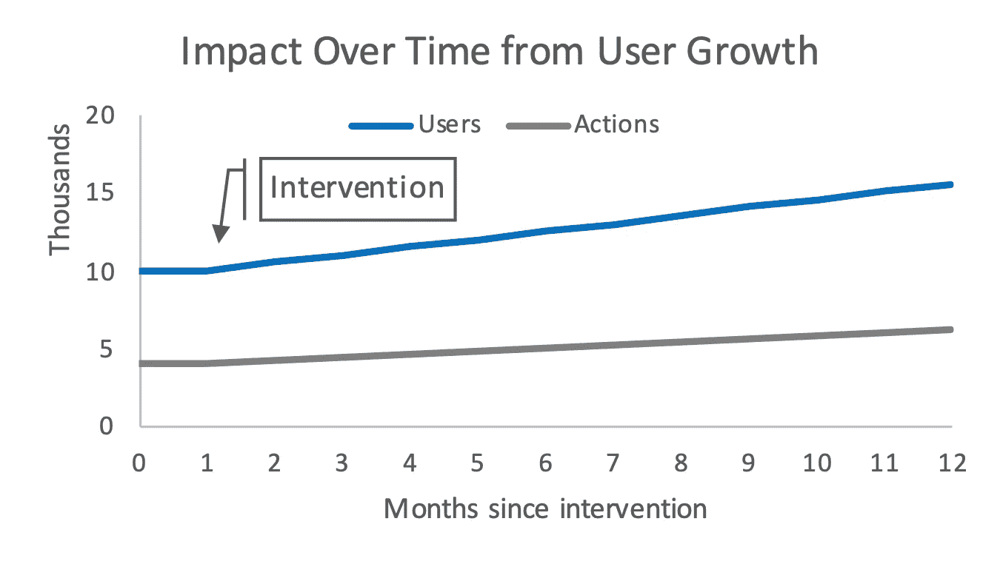
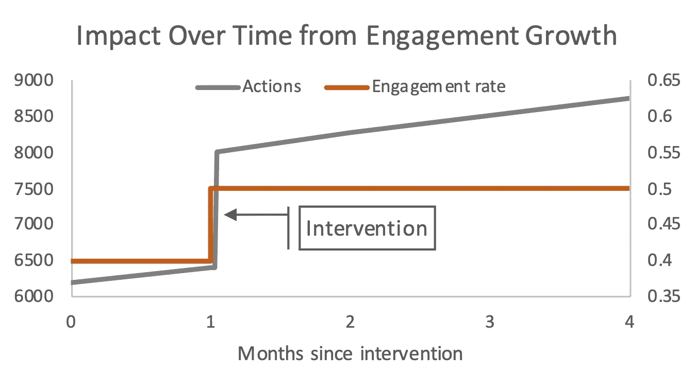
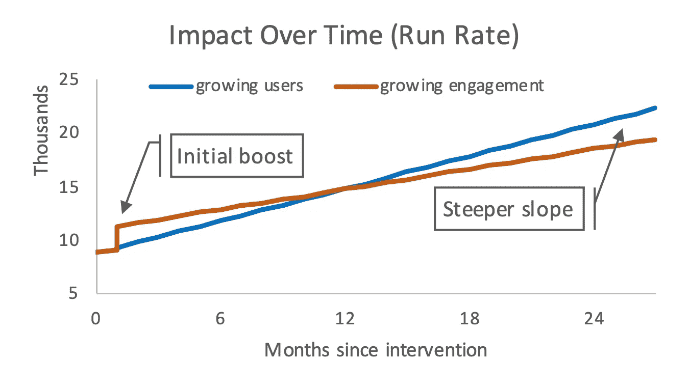
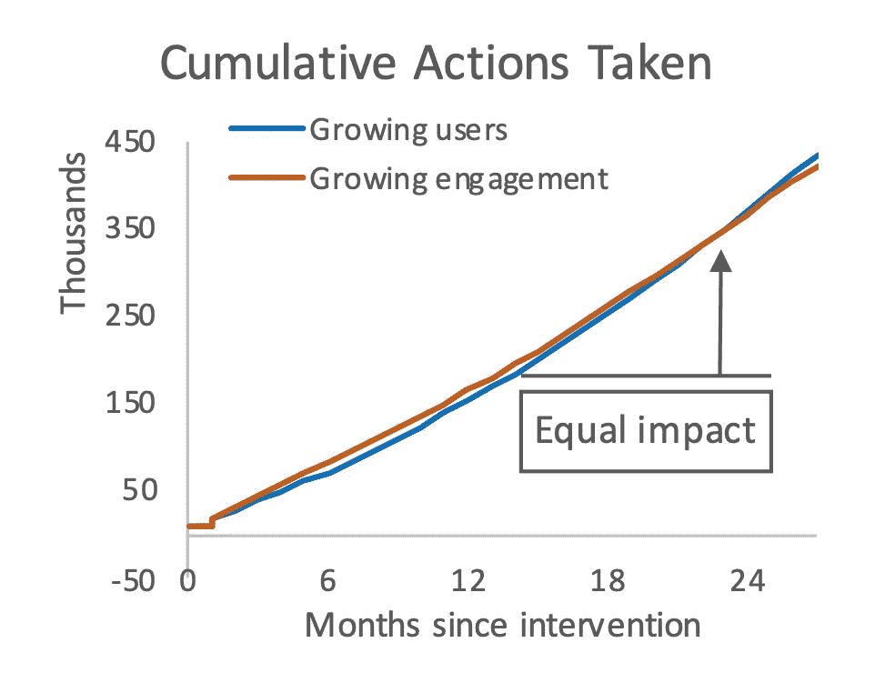
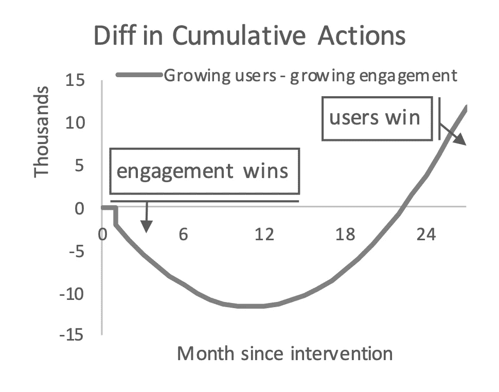

# 一个增长方程

> 原文：<https://towardsdatascience.com/the-one-growth-equation-cd7792e3f699?source=collection_archive---------61----------------------->

## 思考短期和长期增长

背景图片由[艾萨克·史密斯](http://unsplash.com/@isaacmsmith)提供

从数量上理解增长的关键是对事物如何随着时间的推移而增加建立一个坚实的直觉。与其他领域相比，增长最重要的是优化未来价值。这里有一些我经常用来思考一个策略、想法或项目的影响的基本数学。

大多数增长目标可以概括为“让更多的**人**做更多的**事**”通常被称为指标的*将取决于你的策略。社交媒体公司可能会针对每天访问其网站的用户数量进行优化。SaaS 公司可能会优化拥有**订阅**的**公司**的数量。在我们的例子中，LinkedIn 可能想让更多的读者喜欢这篇文章并对其发表评论。这里有一个简单的公式来说明这个概念:*

增长目标=总行动= ***用户*** × ***参与度 _ 比率***

我们有意省略了数学中的许多细节，以关注基础知识。从这个公式中，很明显有两个杠杆来增加总行动。我们可以增加*用户数量*，也可以增加*参与度*(每个用户的行动数量)。虽然这两个概念似乎显而易见，但当时间加入等式时，这两者之间的选择会有非常不同的结果。

# **不断增长的用户**

每个社交网络面临的第一个增长挑战是用户数量的增长。从质量上来说，这意味着我们有很好的产品市场契合度，但没有足够的用户来产生我们想要的影响。

当我们关注不断增长的用户时，我们也会随着时间的推移不断增加行动。下面的图表展示了一个简单的例子，我们从 10，000 个用户开始，每个月增加 500 个新用户。假设敬业度为 0.4 且不变，那么每月的行动数量也呈线性增长。

作者图片

# **不断增长的参与度**

在建立了一个健康的用户增长引擎之后，我们将会重新审视用户参与度。实际上，随着我们用户群的增长，我们会看到参与率下降，因为我们接触到了更广泛、更多样化的受众。当我们提高参与率时会发生什么？

以增加 LinkedIn 用户之间的消息为例。一种策略可能是将消息图标放大以吸引更多用户的注意。假设这样做可以增加 25%的参与度。与用户增长的情况不同，参与度的增加是固定的，不会随着时间的推移而进一步增加。随着参与度的变化，我们将看到行动总数呈阶跃函数式增长。作为奖励，我们也将增加用户增长的未来回报。

作者图片

# **短期与长期增长**

一旦我们建立了一个强大的用户增长引擎，并拥有良好的参与度，事情就会变得更加有趣。让我们以 LinkedIn 的 feed 中的文章评论增加为例。为简单起见，我们将继续使用前两个示例中的数字。如果我们必须在增加 feed 用户(每月+500 个用户，或相当于+100%的用户增长率)和增加评论率(每个用户+0.125 个操作，或相当于+25%的参与率)之间做出选择，哪种策略会对评论数量产生更大的影响？

不幸的是，答案是视情况而定。如前所述，越来越多的参与会对行动产生巨大的推动作用。相比之下，用户的增长会导致行动缓慢而稳定的增加。当我们比较每月的行动时，我们比较的是*运行率*。

作者图片

作者图片

作者图片

为了比较这两种策略产生的评论的累计数量，我们需要把每个月的影响加起来。这大致相当于计算曲线下的面积，或者求积分(对于错过微积分的你们来说)。我们会发现，选择提高参与度将在未来两年产生更多的累积行动。然而，在 2 年后，不断增长的用户将赢得可观。

正如我们从这个简单的例子中看到的，优化用户增长或参与之间的正确决策取决于您希望何时看到回报。我们产品策略的生存可能取决于我们在接下来的几个月里能产生的结果。另一方面，我们也应该警惕过度强调眼前的回报或落后于更多面向未来的竞争对手的风险。最佳增长策略通常包括各种策略的组合。正确的组合将取决于我们现在所处的位置，我们在不久的将来想要达到的位置，当然，还有遥远的未来。

# **高级概念**

你们中的一些人可能会强烈地将增长与指数增长联系在一起，并想知道这在哪里以及如何发生。到目前为止提到的所有概念都导致固定的收益，或者最好的线性增长。指数增长的简单答案是病毒式增长。在下一篇文章中，我们将展示如何利用上述简单的增长方程，并对其进行修改以考虑病毒传播。我们还将看到强大的病毒传播如何导致指数级增长！