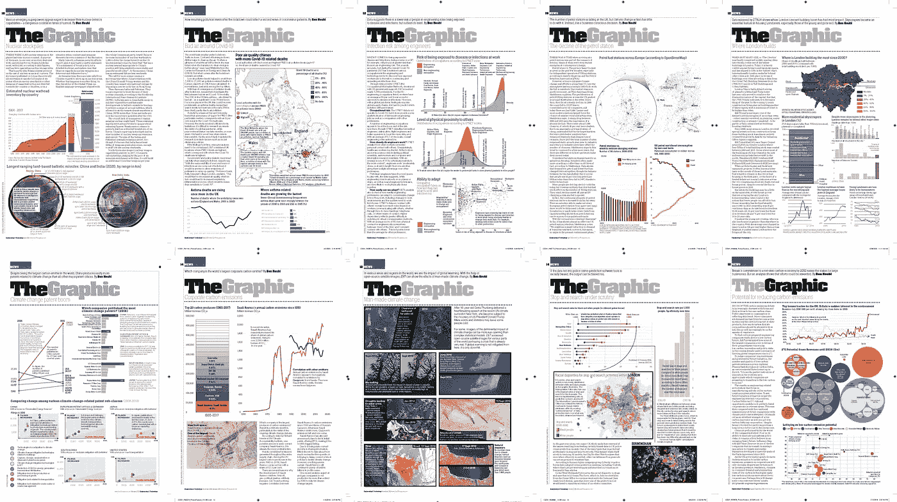
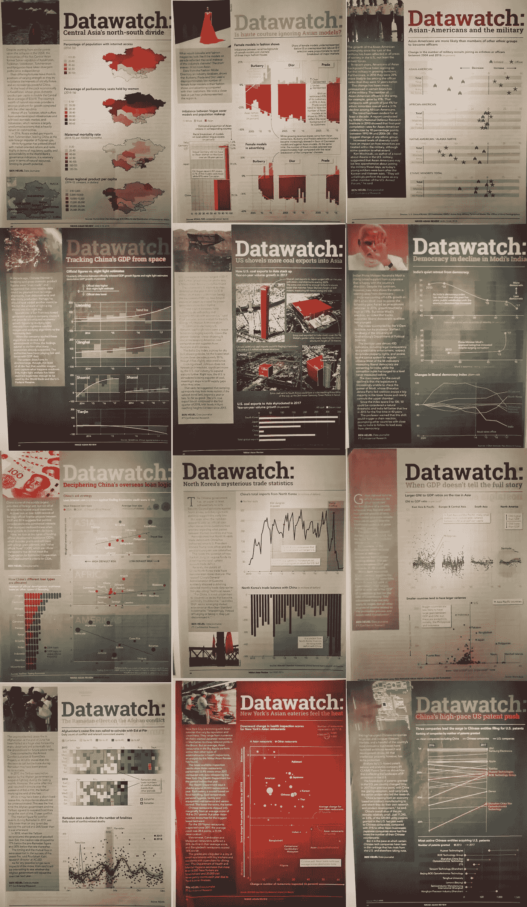

# 一页纸的视觉调查富矿

> 原文：<https://towardsdatascience.com/the-one-page-visual-investigation-bonanza-a4fe6b318b56?source=collection_archive---------59----------------------->

## 一页数据可视化叙述如何增强印刷新闻

一个选择' *TheGraphic* '印刷项目，一个一页的数据新闻专栏(E & T 杂志)

自从我开始为一份印刷杂志运作一个有趣的小副业以来，已经过去一年多了。除了我作为调查记者的日常工作，我还制作了一个名为 *TheGraphic* 的月度数据新闻栏目(它之前就存在了，但我和一位设计师同事灵光一闪，让它变得更加有趣)。

白天，我是一名调查记者。我的故事是长篇大论。它们通常需要几天或几周的研究。因此，这些较短的视觉印刷项目提供了一个令人耳目一新的突破，从长期的东西。到目前为止，反馈大多是积极的。

## 一页数据新闻叙事:利弊

一开始，我发现有一件事有点难以接受，那就是为什么这么多的分析和可视化工作值得一篇只有 400 多字的文章。

但是，我强调，这不应该使你气馁。这些一页纸有很强的冲击力。在社交媒体上，他们经常做得非常好，你的渠道可以从他们那里得到的错误的冲击往往可以像一些长期阅读一样大。对我来说，这些一页纸的视觉调查只是我作为记者工具箱中的另一种媒介。

你可能也注意到了，它们看起来和其他杂志的产出有些相似。[**经济学家**](https://medium.economist.com/a-year-in-graphic-detail-d1825b28e06f) *为其周报* *发布了一页的数据新闻叙事。这个团队雄心勃勃。不可否认，他们设置了相当高的标准。这很好，因为这是你应该追求的复杂程度。**

*不过，给你个警告。如果它一下子达不到这个标准，也不要气馁。如果你是新闻编辑室或杂志编辑团队中想要做这种工作的一个人，这可能会很难。我的建议是:从简单开始。*

***我自己的一套单页视觉调查规则**:*

*   **图形元素的组合，数据驱动论点的证据，挂钩(故事情节)**
*   **一组支持上下文和理解的图形元素(有时这些图表允许读者更详细地钻研数据集的子部分)。**
*   **几乎什么都有:图表、地图、卫星图像、创意插图、3D 插图(没有 3D 饼图)**
*   ***关于图表类型的不该做的事(一句警告):如果使用图表，它们不应该比它们应该有的更复杂。从你想展示的开始，然后考虑图表类型。如果你迷路了，请查看图形指南(如* [*FT 的视觉词汇*](https://ft-interactive.github.io/visual-vocabulary/) *)。那就再查一遍！***
*   ***文案长度:300 到 500 字之间的记叙文。***
*   ***通常(不总是)，我会画一个当前/紧迫新闻事件的链接***

**这些规则是接近你的编辑的一个很好的起点(尽管，记住，规则是要被打破的)。**

## **击败知识有帮助**

**根据我的经验，对你所写的领域多了解一点有助于正确解读数据(当你从事新闻工作时，这总是有用的，但在这种情况下，它可以极大地帮助避免错误解读数据和发现不真实的趋势)。**

**我之前在英国《金融时报》的工作涉及中国。我在日常工作中获得的国家知识有助于每周制作一页的视觉印刷项目。**

## **生产时间**

**许多传统的记者，包括以前的编辑，可能会倾向于低估将一页成功的图文报道整合在一起所需的时间。**

**最初，你可能不得不降低你的雄心。我的建议是:最初，专注于简单的图表类型和直接的数据驱动的结论。稍后，您可以提高支持图形的复杂程度。**

**编辑需要看到你付出的努力是值得的。你可以就这些作品在社交媒体上的表现提供反馈。**

**随着时间的推移，你也会更快地生产它们。现在，我可能只需要几个小时就可以将它们放在一起，并提交 Illustrator 文件和复制到系统中。**

**可能还有其他阻力。如果你的编辑不完全懂数据，一开始可能会很难推销。然后你需要知道如何用甜言蜜语让你的视觉新闻进入编辑的舒适区。**

**我的卖点是，这些较短的数据驱动的叙述只是标准当代新闻武库的另一部分。**

**当你把文章提交给编辑时，确保你的初稿有足够的标记。他们应该很容易理解(而且，如果需要，一旦你得到老板的许可，你可以进一步简化)。**

**[数据可视化专家](https://digiday.com/uk/financial-times-guide-data-visualization/)强调，并不是所有的图形都需要在五秒内理解。我大体上同意这个观点。然而，我要补充的是，如果你的编辑在最初的 20 秒内得到它，那会很有帮助。在你的初稿中给你的编辑足够的指示会有所帮助。**

## **两个重要的元素:图形挂钩(1)和上下文图形(2)**

**在我看来，一页视觉印刷品有两种基本的图形元素。这不是一个标准的规则，如果是的话，我更多的是违反它而不是坚持它。**

**第一个是图形挂钩(1)。它通常是更简单的标准图表类型，通常是条形图或折线图。前五秒钟就能看懂的那种图表。重要的是，它通常不超过一个点。它必须是直截了当和可消费的。这将有助于吸引和吸引不太喜欢图形和图表的读者。**

**第二，有上下文相关的图形元素(2)。这些更复杂，可以显示在某一系列因素、类别或特征上发生了什么。在这里，我通常把事情的角度。页面上通常会有更多的点、条或元素。**

****举个例子:**一个关于气候变化相关专利激增的可视化单页报告。**

**即使你不熟悉这个话题(或某个特定的*图表爱好者】*，你也会明白第一个图表(见下文):有更多的中国专利。简单。**

**然后底部有各种散点图。这是比较复杂的一点。但对于更投入的读者来说，这很有趣。**

**这一群人会花时间和耐心欣赏更复杂的图形。他们可以潜水并探索它们。**

**简而言之，我们努力为各种各样的读者服务。只有 20 秒的和只有几分钟的。**

****

**的确，一些图表形式(散点图、回归线等。)可能更难理解(至少比标准条形图更难理解)。但这不应该阻止你使用它们。**

**辅助图形应该很有趣，像一个迷人的纵横字谜，并提供一种方法让读者以不同的方式消费内容。**

## **简单与复杂的混合**

**正确的组合是一个好的单页图形。重要的是，他们需要讲一个故事。我强调，这不仅仅是钩子的问题。**

## **反复试验**

**如果你在一家印刷杂志工作，每个人都需要时间来适应数据驱动的视觉印刷功能。但是尝试一个循环的程序。我认为对我来说，生产它们在质量和速度上有所不同。**

**此外，考虑过程(你自己能做多少，有多少人帮助/与你合作)。寻求可以合作的盟友。一个充满激情的设计师能帮上忙吗？你能和一个想做更多视觉新闻的热情记者一起工作吗？跨学科的合作很有趣，可以提高产出。不要认为你必须自己做所有的事情。**

## **讲述简短的视觉调查故事**

**对于调查记者来说，仅用一页纸讲述一个好故事可能会令人沮丧。但即使在那里，一页的视觉项目也有它的位置。对于调查性的故事来说,“简短而甜蜜”有时是个不错的选择。**

**《纽约时报》编辑丽贝卡·科比特(Rebecca Corbett)在一次采访中说，调查应该是短期、中期和长期的。“不是所有事情都应该是 18 个月的项目”。即使在《纽约时报》上，短期视觉调查叙事也有其一席之地。如果它们是以一种可消费的形式呈现的，是受欢迎的，是快速生产的，那么它们是否短小精悍又有什么关系呢？**

**2017/18 年，仅仅一年多，我就在 FT 的姐妹杂志《日经亚洲评论》上刊登了名为‘data warch’的每周印刷版。这是一个一页纸的东西，类似于*的 Graphic* 。因为这是我进行调查项目的唯一渠道，那些一页纸成了我事实上的视觉调查专栏。**

**在印刷品中，我只有大约 200 字来讲述一个数据驱动的调查故事。因此，图形需要做繁重的工作。过了一段时间，经过一点训练，用这种格式讲述极其复杂的调查性叙述是可能的。**

**诚然，2000 字、采访、支持性分析和调查性报道本可以制造更多噪音并赢得更多奖项。但就其本身而言，我想读者会同意，它是成功的(见下面的选择)。**

****

***描述:一篇 500 字的调查报道***

**为此，我很享受在英国《金融时报》的时光。总有人会对合作或批准新项目感到兴奋，就像那些。**

**更重要的是，NAR 的工作证明了视觉调查记者有他们的位置，即使他们没有在印刷或网络上获得他们的 5000 字的叙述。**

**此外，如果你能在压力下很好地制作这些数据新闻单页，你就在新闻编辑室赢得了独特的位置。新闻事件可以受益于快节奏的视觉调查。**

**这也让你更难被取代。如果编辑室的特定领域(如数据、图表或记者)出现裁员，你可以展现跨学科的多样化技能(调查、报道、图表)。**

## **如何开始你自己的单页**

**最好以**开始简单的**。如果你是一名编辑，试着鼓励一名记者和图形部门的人合作。有时候你很幸运，两者兼而有之。然后让其他编辑习惯这个想法。我认为变革(或至少是买入或兴趣)必须来自高层。想法可以来自底层(记者、数据部门)。**

**另外，**确保你的助理编辑和事实审查员都在船上**。让他们检查这些一页纸很重要。**

****制作人应该思维年轻**且思想开放(如此渴望学习新的东西，例如，你可能需要学习使用代码或程序来制作这些作品)。**

**你给自己和团队时间去试验。我认为如果有一个循环周期会有所帮助(例如，每月或每周有一个截止日期)。随着时间的推移，这些故事会变得更好，更有雄心。**

**从 [FT 视觉词汇](https://ft-interactive.github.io/visual-vocabulary/)中概述的**基本图形形式**开始。开始的时候，一次只专注于一两点。**

**一页纸的数据叙述是杂志和报纸追赶视觉调查潮流的好方法。不要忘记，你可以在网上以不同的形式运行这些单页程序。它们可以更广泛，包含更长拷贝，或者可以是交互式的。世界是你的。**

**我总的座右铭是:如果其他印刷和网络杂志能在制作它们方面出类拔萃并取得成功，为什么你不能呢？**

**我在《经济学人》的数据柜台工作了一年**