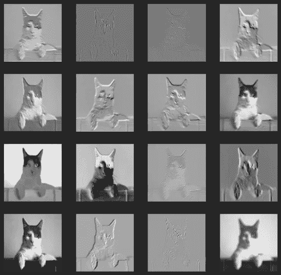
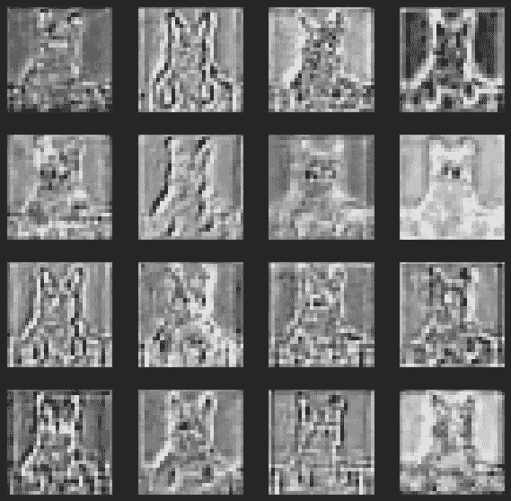

# 你应该知道的一个 PyTorch 把戏

> 原文：<https://towardsdatascience.com/the-one-pytorch-trick-which-you-should-know-2d5e9c1da2ca?source=collection_archive---------9----------------------->


来源:[威利安来自](https://www.pexels.com/@willianwas) [Pexels](https://www.pexels.com/photo/man-in-black-tank-top-skateboarding-wearing-helmet-700953/) 的

## 钩子如何显著改善你的工作流程

如果你以前使用过深度学习，你就会知道调试模型有时真的很难。张量形状不匹配、爆炸梯度和无数其他问题可能会让你大吃一惊。解决这些问题需要在显微镜下观察模型。最基本的方法包括使用 print 语句或引入断点来丢弃`forward()`方法。这些当然不太具有可扩展性，因为它们需要猜测哪里出了问题，而且总体来说非常繁琐。

但是，有一个解决方案:钩子。这些是特定的函数，可以附加到每一层，并在每次使用该层时调用。它们基本上允许您冻结特定模块的向前或向后传递的执行，并处理其输入和输出。

让我们看看他们的行动吧！

# 钩子速成班

因此，钩子只是一个带有预定义签名的可调用对象，它可以注册到任何`nn.Module`对象。当在模块上使用触发方法时(即`forward()`或`backward()`，模块本身及其输入和可能的输出被传递给钩子，在计算进行到下一个模块之前执行。

在 PyTorch 中，您可以将一个钩子注册为

*   向前预瞄(在向前传球之前执行)，
*   向前钩住(在向前传球之后执行)，
*   向后挂钩(在向后传递后执行)。

一开始听起来可能很复杂，所以让我们来看一个具体的例子！

## 示例:保存每个卷积层的输出

假设我们想要检查 ResNet34 架构中每个卷积层的输出。这个任务非常适合钩子。在下一部分中，我将向您展示如何实现这一点。如果你想互动地跟随它，你可以在 https://github.com/cosmic-cortex/pytorch-hooks-tutorial找到附带的 Jupyter 笔记本。

我们的模型定义如下。

创建一个钩子来保存输出非常简单，一个基本的可调用对象就足够了。

`SaveOutput`的一个实例将简单地记录向前传递的输出张量，并将其存储在一个列表中。

可以用`register_forward_hook(hook)`方法注册一个向前的钩子。(对于其他类型的挂钩，我们有`register_backward_hook`和`register_forward_pre_hook`。)这些方法的返回值是钩子句柄，可以用来从模块中移除钩子。

现在，我们将钩子注册到每个卷积层。

当这样做时，钩子将在每个卷积层的每个前向传递之后被调用。为了测试它，我们将使用下面的图像。


照片由[曼加·维托里奇](https://unsplash.com/@madhatterzone?utm_source=medium&utm_medium=referral)在 [Unsplash](https://unsplash.com?utm_source=medium&utm_medium=referral) 拍摄

向前传球:

正如预期的那样，输出被正确存储。

```
>>> len(save_output.outputs)
36
```

通过检查这个列表中的张量，我们可以可视化网络所看到的。



ResNet34 第一层的输出。

出于好奇，我们可以检查一下之后会发生什么。如果我们在网络中走得更深，学习到的特征会变得越来越高。例如，有一个似乎负责检测眼睛的过滤器。



ResNet34 的第 16 卷积层的输出。

# 超越

当然，这只是冰山一角。钩子能做的不仅仅是简单地存储中间层的输出。例如，神经网络修剪，这是一种减少参数数量的技术，[也可以用钩子](https://pytorch.org/tutorials/intermediate/pruning_tutorial.html)来执行。

总而言之，如果你想增强你的工作流，应用钩子是一个非常有用的学习技巧。有了这些，你就能做更多更有效的事情。

[***如果你喜欢把机器学习概念拆开，理解是什么让它们运转，我们有很多共同点。看看我的博客，我经常在那里发表这样的技术文章！***](https://www.tivadardanka.com/blog)