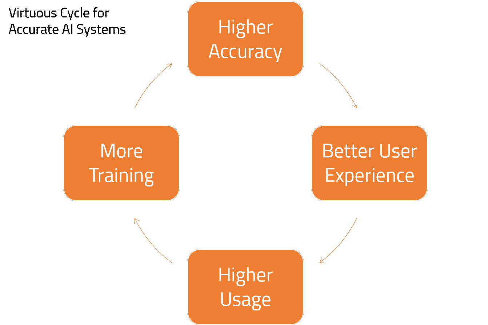

# 仅有的三个可扩展的人工智能创业原型

> 原文：<https://towardsdatascience.com/the-only-three-scalable-ai-startup-archetypes-25054e35f539?source=collection_archive---------32----------------------->

## 传统的 SaaS 商业模式不适用于大多数人工智能初创公司

至少五年来，人工智能一直是初创企业的重中之重。已经投资了数千亿美元，成千上万的企业家和内部企业家——我们这一代最优秀的一些人——已经尝试了不同程度的成功，没有一家纯人工智能公司成功上市。

## 问题是

我们都知道，人工智能不能被包装成一个产品，有些是吃了苦头才知道的。比如说，在 SaaS，衡量一家典型风险投资公司的因素并不适用于人工智能。

1.  首先，一个有用的人工智能必须针对客户和它试图解决的问题的特定数据进行训练。尽管有各种所谓的“预训练”模型的说法，但它们的准确性远不可靠，例如 GPT3。一般来说，AI 是不能轻易复制粘贴的。
2.  那些试图采用特定行业方法、希望利用客户数据进行培训的公司，遇到了数据安全要求这堵难以逾越的墙。例如，大多数企业客户希望供应商在他们的防火墙内安装，有时是在本地安装。
3.  中小企业和消费者愿意分享他们的数据，以换取一些功能，这是 SaaS 的基本承诺。然而，要取得成功，一家人工智能公司必须在他们的算法生效之前注册很多很多用户。早期用户没有主动提供数据的动机。
4.  然后就是确定性行为的问题。假设你注册了一个告诉你‘二加二等于五’的人工智能。没关系。你围绕结果设计你的过程，就像减去一。随着时间的推移，人工智能获得了新的数据，一个晴天变成了“四个”。你现在必须重新设计你的流程。如果因为某种原因它变成了“三”。(有关这方面的更多信息，请参见下面的链接。)
5.  接下来是“行话合规”问题。我记得曾经建议一位企业家，他的解决方案根本不需要人工智能。他坦率地表示反对，“那我怎么筹钱？”我试图解释说，如果他想扩大规模，最好将自己定位为一家 SaaS 公司，但这并没有太大作用。如今，一切都被称为人工智能，这只是混淆了这个领域。

清单还在继续，但让我在这里暂停一下。

 [## 人工智能的信息安全壁垒

### 信息安全挑战被证明是人工智能生态系统的巨大障碍。相反地…

www.darkreading.com](https://www.darkreading.com/threat-intelligence/the-infosec-barrier-to-ai/a/d-id/1338401) 

## 飞向数据

你们中的许多人会记得 2017 年的一幅标志性图像，这幅图像将数据描绘成新的石油。他们一针见血。今天，由于我上面列出的问题，技术在人工智能的业务中几乎无关紧要。在企业领域，公司主要是构建自己的解决方案，并将数据放在胸前。在消费者世界，谷歌和脸书等巨头正在利用他们的数据和人工智能为消费者建立新的服务。对中小企业来说也是如此，但在很大程度上，人工智能对中小企业的服务严重不足。

 [## 世界上最有价值的资源不再是石油，而是数据

### 一种新的商品催生了一个利润丰厚、快速增长的行业，促使反垄断监管机构介入，以限制那些…

www.economist.com](https://www.economist.com/leaders/2017/05/06/the-worlds-most-valuable-resource-is-no-longer-oil-but-data) 

在这一切中，创业公司几乎没有发挥什么作用。甚至连人才都在流向这些大型、数据丰富的公司。《2020 年人工智能的现状》报告给出了有趣的统计数据，说明教授们是如何离开学术界去为谷歌、亚马逊和微软这样的巨头工作的。这种外流和人工智能初创公司从校园中消失之间有着直接的关联。

开创解决方案业务并不丢人。不用说，IBM 或微软在客户关系、现有基础设施和板凳深度方面拥有巨大优势。小型解决方案企业还面临许多其他固有的挑战。尽管如此，创业公司的差异化知识产权还是有一些价值的。风投也显示出对投资解决方案公司持开放态度的迹象，但他们仍在寻找无限可扩展的产品创意。

如果你坚持做产品，只有三个人工智能创业公司的原型能像 SaaS 公司一样扩大规模。

图片由 Laura Ockel 通过 Unsplash 提供

## 滚珠轴承(可替换的人工智能问题)

几乎每台机器——物理机器——都使用一些滚珠轴承。它们有各种尺寸和规格，但基本思想是连接两个相对旋转的部件。设计这种机器的工程师通常根本不担心滚珠轴承。他们只是假设当他们需要时，正确的类型是可用的。

作者图片

AI 创业公司的滚珠轴承原型就是解决一个小问题:1。每个人都有第二。其解决方案可以使用公开可用的数据来训练。示例—处理应收账款、分析合同、营销分析、客户评论处理等。客户将如何使用它的本质特征，以及它背后的人工智能，不会因客户而异。

您可以从用不属于任何客户的数据来证明您的模型开始。在一定的准确度下，你可以吸引更多的客户与你分享他们的数据。即使他们不这样做，这个模型也能很好地工作。查阅[这篇文章](https://medium.com/swlh/a-business-leaders-guide-to-chatbots-22e0b4ac1103?source=friends_link&sk=25c4e4307c16c399924763d801e9bc33)中的“良性循环”可以更好地理解这一点。

## 手册(人工智能数据产品)

虽然滚珠轴承、螺母和螺栓是大多数机器的标准零件，但齿轮却完全不同。工程师可能会自己设计齿轮。为此，他们会进行许多计算和优化。他们还会依赖其他工程师通常发表在论文、手册或指南中的知识。

人工智能创业公司的手册原型是用人工智能创造数据产品。您的目标是通过分析所有关于齿轮的可用数据，并以有用的格式打包，帮助工程师快速找出他们的齿轮。例如，天气服务、医疗保健洞察、预测性维护等。你控制了人工智能，你得到了输入数据，客户只为你的输出付钱。

## 扳手(人工智能工具)

继续工程隐喻，无论我们的工程师在做什么，他们都需要扳手来做。他们对扳手毫不犹豫，却为它和其他类似的工具付了很多钱。

人工智能创业公司的扳手原型是创建工具，以便其他人可以构建人工智能解决方案。想想各种 ML 操作工具、工作台、特征库和 SDK，它们有助于 AI/ ML 的创建、生产和操作。你仍将驾驭人工智能浪潮——我之前谈到过每个人都在试图创造自己的人工智能解决方案。你仍然需要深入理解这些概念。但你不会卖人工智能。几乎所有这些工具都不太智能，这意味着它们不需要定制，并且可以很好地扩展。

如果你的想法不符合这三个原型，并不意味着它没有价值。我希望你只是从一个角度来看这篇文章。最后，你应该追随你的激情，你会找到让它发挥作用的方法。

[*建议接下来:AI 为什么不行？*](https://medium.com/ai-in-plain-english/why-doesnt-ai-work-chat-with-classmates-25f6b130619e?source=friends_link&sk=79c1610b7e9542dc9db74af097a627be)