# 开放城市人工智能挑战赛

> 原文：<https://towardsdatascience.com/the-open-cities-ai-challenge-3d0b35a721cc?source=collection_archive---------15----------------------->

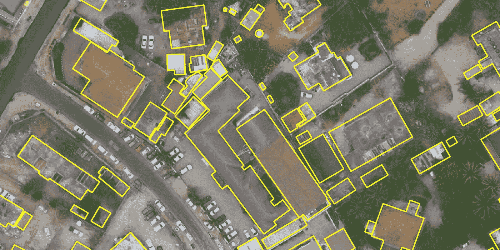

在坦桑尼亚达累斯萨拉姆，由社区制图团队手工标记的建筑足迹覆盖在来自开放城市人工智能挑战赛数据集的高分辨率无人机图像上(黄色轮廓)。

## 从航空影像中分割非洲城市的建筑，并提出负责任的人工智能灾害风险管理理念

*帖子由* [*罗*](https://medium.com/@anthropoco)*[*格雷斯·多尔蒂*](https://www.linkedin.com/in/g-doherty)*[*【尼古拉斯·琼斯】*](https://www.linkedin.com/in/nick-jones-302a945/)*[*维维安·德帕迪约*](https://www.linkedin.com/in/vivien-deparday/) *、GFDRR Labs/世界银行****

# **外卖食品**

**[全球减灾和灾后恢复基金](http://www.gfdrr.org/) (GFDRR)正在与 [Azavea](https://www.azavea.com/) 和 [DrivenData](https://www.drivendata.org/) 合作，推出一个新的数据集和机器学习(ML)竞赛(总奖金为 15，000 美元)，以改善弹性城市规划的地图绘制。为灾害风险管理提供更好的 ML 支持的制图意味着解决在非洲城市环境中应用 ML 的障碍，并在地理空间数据准备中采用最佳做法，以便更容易地使用 ML。竞赛数据集-超过 400 平方公里的高分辨率无人机图像和 79 万个建筑足迹-来自非洲 10 多个城市地区经过本地验证的开源社区制图工作。获奖的解决方案将作为开源工具发布，用于持续的 ML 开发和基准测试。**

**开放城市人工智能挑战赛有两条参赛路线:**

1.  **从无人机图像中对建筑物足迹进行最佳开源语义分割的奖金为 12，000 美元，这些图像可以概括各种各样的非洲城市环境、空间分辨率和成像条件。**
2.  **为负责任的人工智能开发和应用于灾害风险管理的深思熟虑的探索提供 3000 美元的奖金。我们如何改进 ML 系统的创建和使用，以减少偏见，促进公平和道德的使用，清晰地告知决策，并制定保护用户和最终受益者的保障措施？**

**比赛正在进行，将于 2020 年 3 月 16 日结束。[今日加入](http://drivendata.org/competitions/60/building-segmentation-disaster-resilience)！**

# **弹性城市规划的开放数据**

**世界各地的城市正在快速发展，尤其是在非洲——到 2030 年，撒哈拉以南非洲地区的一半人口将生活在城市地区。随着城市人口的增长，他们面临的洪水、侵蚀、地震、沿海风暴和其他灾害对城市规划构成了复杂的挑战。**

**要了解资产和人员如何容易受到这些风险的影响，需要详细、最新的建筑环境地理数据。例如，一栋建筑的特定位置、形状和建筑风格可以告诉我们，它是否会比附近的建筑更容易受到地震或风的破坏。如果我们想要[有效地理解和管理风险](https://understandrisk.org/)，就需要经常、准确和详细地绘制道路、建筑和关键基础设施的地图。但是在数据基础设施不太发达的国家，[传统的城市数据收集方法跟不上](https://www.gfdrr.org/en/feature-story/how-open-cities-changing-way-african-cities-prepare-disaster)日益增长的密度和蔓延。**

**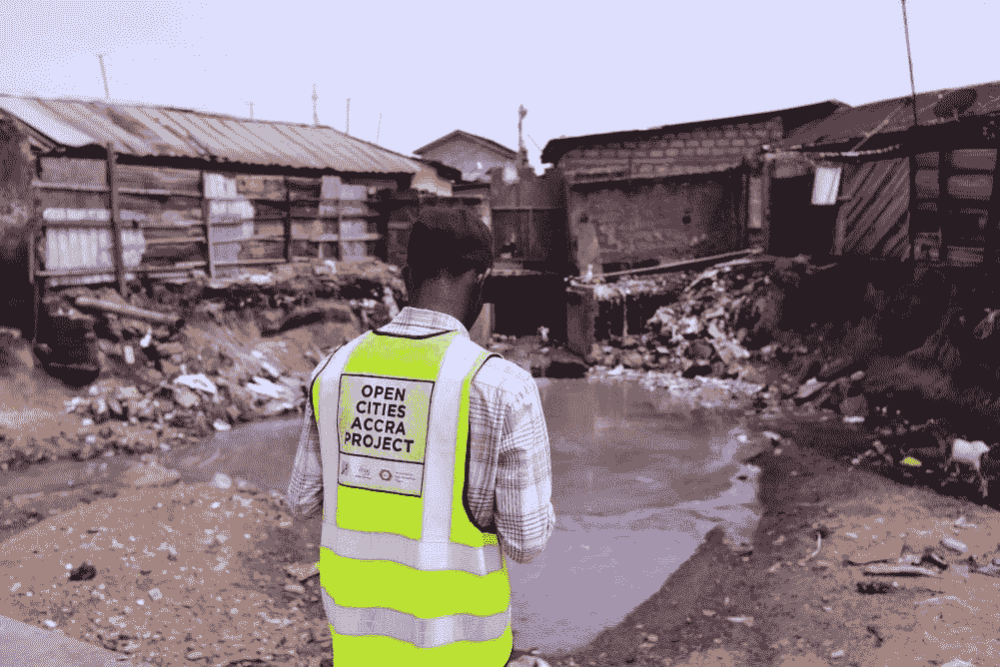**

**一名来自开放城市阿克拉的野外测绘员在加纳阿克拉易发洪水的社区观察积水和垃圾。照片由加布里埃尔·乔·阿木祖提供，[阿木祖乔摄影](https://twitter.com/amuzugabrieljoe)。**

**令人欣慰的是，协作和开放的数据收集实践正在重塑我们绘制城市地图的方式。今天，[当地的地图社区正在为世界上一些最脆弱的社区改进地图](http://blogs.worldbank.org/sustainablecities/rise-local-mapping-communities-for-resilience)——带来最新的和按比例的高度精确和详细的地理数据。[世界银行的 GFDRR](http://www.gfdrr.org/) 支持像[非洲开放城市](https://opencitiesproject.org/)和 [Dar Ramani Huria](http://ramanihuria.org/) 这样的项目，在十几个非洲城市绘制建筑、道路、排水网络等地图，而[桑给巴尔制图计划](http://www.zanzibarmapping.com/)是世界上最大的航空制图活动，使用消费无人机和当地的制图者来制作开放的空间数据，用于群岛的保护和发展。**

**迄今为止，OpenStreetMap 的贡献者已经在非洲大陆上绘制了超过 7000 万条道路和 6 亿个节点。**

**这些社区制图项目收集的数据用于设计支持政府决策的工具和产品。数字化地图被发布到 [OpenStreetMap](https://www.openstreetmap.org/) 上，航空影像被发布到 [OpenAerialMap](https://openaerialmap.org/) 上，在那里它们作为公共数据产品被所有人使用和改进。该运动背后的开源理念和对本地技能建设的重视培养了数字制图、机器人、软件开发和数据科学方面的本地人才网络。**

# **机器学习在制图方面的潜力**

**用于视觉任务的 ML 的进步可以进一步提高绘图质量、速度和成本。最近 ML 应用于地图绘制的例子包括脸书[用于 OpenStreetMap 的人工智能辅助地图绘制工具](https://mapwith.ai/)和微软的国家级自动化建筑足迹提取(在[美国](https://github.com/microsoft/USBuildingFootprints)、[加拿大](https://github.com/microsoft/CanadianBuildingFootprints)、[坦桑尼亚和乌干达](https://github.com/microsoft/Uganda-Tanzania-Building-Footprints))。像 [SpaceNet](https://spacenet.ai/) 和[xfiew 2](https://xview2.org/)这样的竞赛推动了道路、建筑物自动制图和灾后建筑物损害评估的 ML 实践。**

**然而，在非洲灾害风险管理背景下有效应用当前的 ML 绘图解决方案存在障碍。非洲的城市环境在构成和外观上与欧洲、美洲或亚洲城市有很大不同，欧洲、美洲或亚洲城市有更丰富的数据，ML 模型经常在这些数据上进行训练。**

## *****建筑更加密集，形状*** *更加多样，建筑风格和大小可能不太容易被 ML 模型识别，因为 ML 模型在他们的训练中很少或根本看不到这样的例子。***

**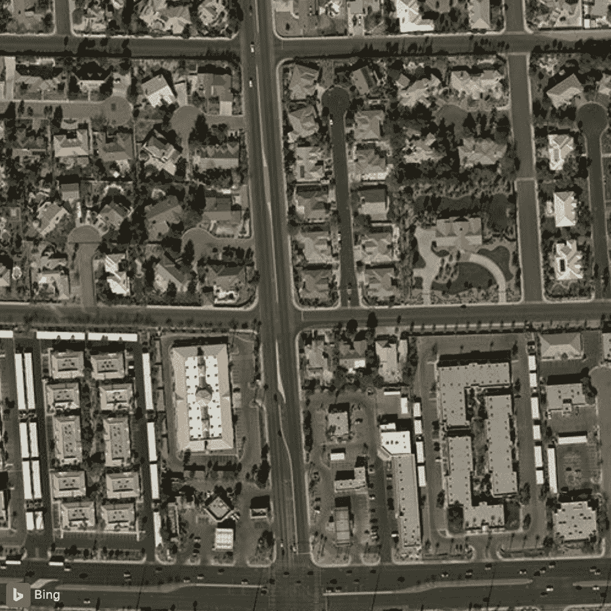****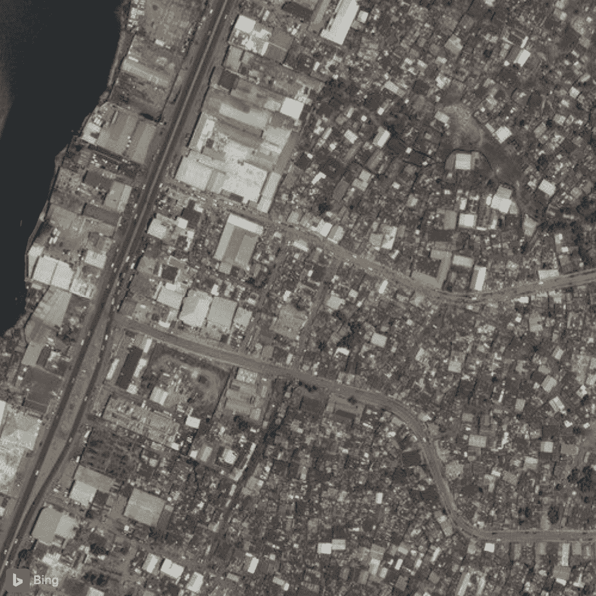**

**以相同的视觉比例比较美国拉斯维加斯(左)和利比里亚蒙罗维亚(右)的城市建筑环境。图片由微软必应地图和 Maxar (DigitalGlobe)提供**

## *****图像由商用无人机在不同的环境条件下以高得多的分辨率收集*** ，需要对通常在较低分辨率上训练的模型进行调整，更加一致地收集和预处理卫星图像。**

**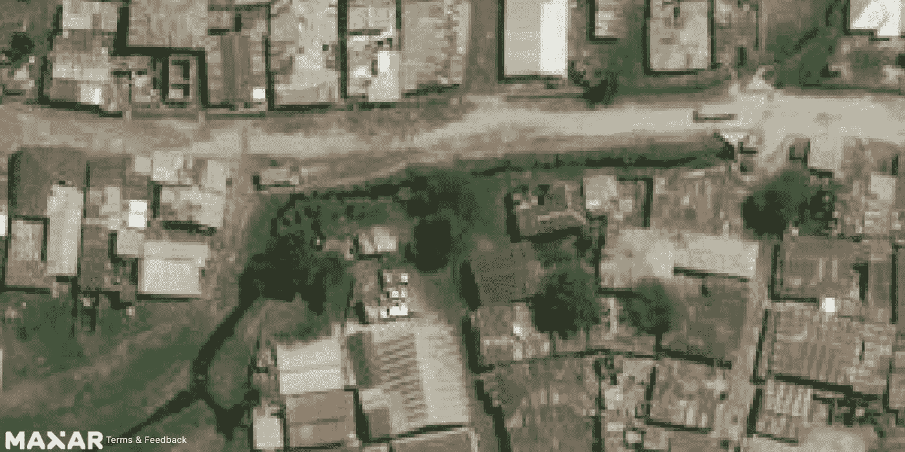****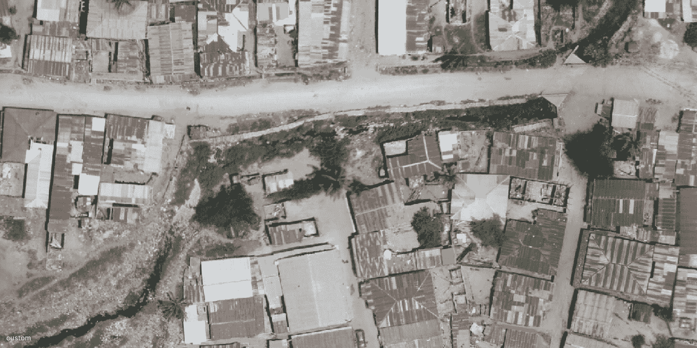**

**比较坦桑尼亚达累斯萨拉姆典型卫星图像分辨率(> 30 厘米/像素，上图)与无人机/航空图像分辨率(3-20 厘米/像素，下图)的城市细节。图像由 Maxar 和 OpenAerialMap 提供。**

## **众包和社区驱动的数据标注在所使用的基础影像图层、工作流、数据模式和质量控制方面可能会有很大不同，需要对更多标注噪声具有鲁棒性的模型。**

**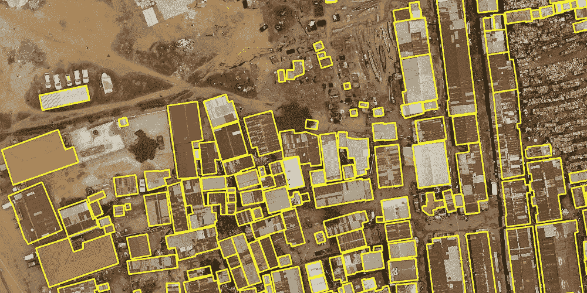****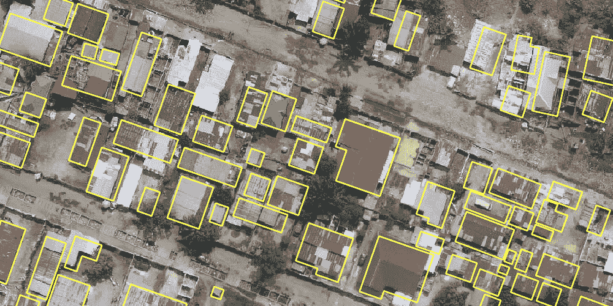**

**手绘建筑物覆盖区标签的质量(对齐和完整性)在图像场景之间或图像场景内可能会有所不同。来自乌干达坎帕拉(左)和刚果民主共和国金沙萨(右)的挑战培训数据集的示例。**

## ****地理空间数据有多种文件格式、大小和模式，这造成了高采用率和知识壁垒，阻碍了它们在机器学习中的使用。****

**现在，在不同的建筑环境中，本地验证的开放地图数据和高分辨率无人机图像越来越丰富。我们如何才能最好地解决这些障碍，并增强机器学习的实践状态，以支持城市发展和降低非洲城市风险的制图？**

# **介绍开放城市人工智能挑战赛**

## **资料组**

**与合作伙伴 [Azavea](https://www.azavea.com/) 和 [DrivenData](https://www.drivendata.org/) 合作，GFDRR 的[实验室团队](https://www.gfdrr.org/en/gfdrr-labs)结合了非洲各地许多参与式制图社区的出色工作，在云原生地理空间数据处理中应用了最佳实践(即使用[云优化地理信息](https://www.cogeo.org/)【COG】和[时空资产目录](https://stacspec.org/)【STAC】)，并尽可能实现标准化，以使数据更容易用于机器学习。其结果是一个新颖、广泛、开放的数据集，包含超过 79 万个建筑足迹和 400 平方公里的无人机图像，以 ML-ready 的形式代表了 10 个不同的非洲城市地区。**

**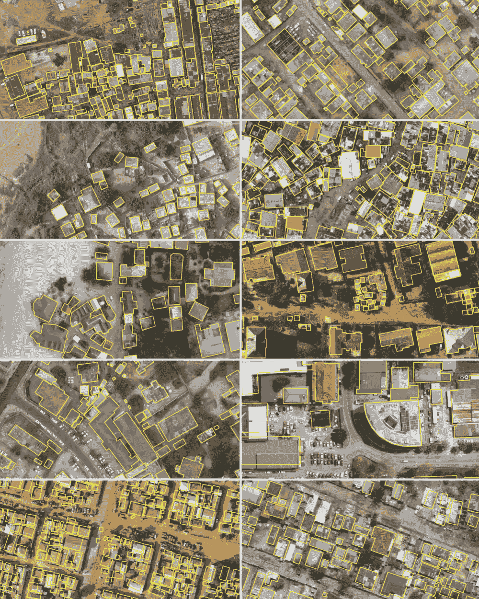**

**对比挑战训练数据集中包含的 10 个非洲城市区域覆盖在无人机影像上的手动标记建筑足迹。**

**将 COG 和 STAC 用于地理空间数据为我们提供了带宽高效、快速和可查询的访问，以标准化格式访问我们的影像和标签。对于可以快速增长到数百千兆字节的地理空间数据，轻松访问文件和索引数据目录尤为重要。它还使我们能够利用 COG 和 STAC 工具的不断增长的生态系统，如 [STAC 浏览器](https://github.com/radiantearth/stac-browser)在网络浏览器中快速可视化和访问任何培训数据资产，尽管单个图像文件高达数 GB，整个数据集总计超过 70 GBs:**

**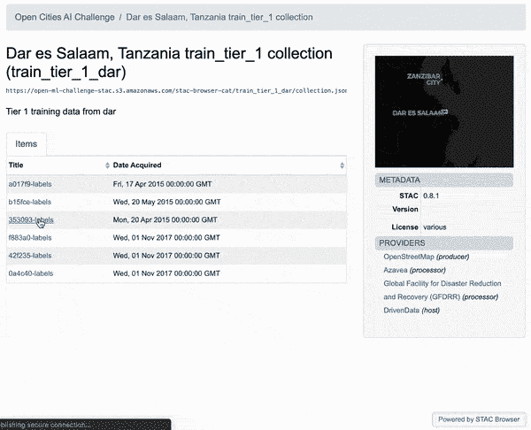**

**使用 STAC 浏览器可视化挑战训练数据集合和资产的动画演示。**

**[PySTAC](https://github.com/azavea/pystac) ，一个由 [Azavea](https://www.azavea.com/) 开发的新 Python 库，使 STAC 用户能够以编程的方式加载、遍历、访问和操作目录中的数据。例如，阅读 STAC 目录:**

```
**train1_cat = Catalog.from_file('https://drivendata-competition-building-segmentation.s3-us-west-1.amazonaws.com/train_tier_1/catalog.json') 
train1_cat.describe()* <Catalog id=train_tier_1>
    * <Collection id=acc>
      * <Item id=665946>
      * <LabelItem id=665946-labels>
      * <Item id=a42435>
      * <LabelItem id=a42435-labels>
      * <Item id=ca041a>
      * <LabelItem id=ca041a-labels>
      * <Item id=d41d81>
      * <LabelItem id=d41d81-labels>
    * <Collection id=mon>
      * <Item id=401175>
      ...**
```

**检查项目的元数据:**

```
**one_item = train1_cat.get_child(id='acc').get_item(id='ca041a')
one_item.to_dict(){
  "assets": {
    "image": {
      "href": "https://drivendata-competition-building-segmentation.s3-us-west-1.amazonaws.com/train_tier_1/acc/ca041a/ca041a.tif",
      "title": "GeoTIFF",
      "type": "image/tiff; application=geotiff; profile=cloud-optimized"
    }
  },
  "bbox": [
    -0.22707525357332697,
    5.585527399115482,
    -0.20581415249279408,
    5.610742610987594
  ],
  "collection": "acc",
  "geometry": {
    "coordinates": [
      [
        [
          -0.2260939759101167,
          5.607821019807083
        ],
        ...
        [
          -0.2260939759101167,
          5.607821019807083
        ]
      ]
    ],
    "type": "Polygon"
  },
  "id": "ca041a",
  "links": [
    {
      "href": "../collection.json",
      "rel": "collection",
      "type": "application/json"
    },
    {
      "href": "https://drivendata-competition-building-segmentation.s3-us-west-1.amazonaws.com/train_tier_1/acc/ca041a/ca041a.json",
      "rel": "self",
      "type": "application/json"
    },
    {
      "href": "../../catalog.json",
      "rel": "root",
      "type": "application/json"
    },
    {
      "href": "../collection.json",
      "rel": "parent",
      "type": "application/json"
    }
  ],
  "properties": {
    "area": "acc",
    "datetime": "2018-11-12 00:00:00Z",
    "license": "CC BY 4.0"
  },
  "stac_version": "0.8.1",
  "type": "Feature"
}**
```

**了解关于数据集和 STAC 资源[的更多信息。](https://www.drivendata.org/competitions/60/building-segmentation-disaster-resilience/page/154/)**

## **竞争**

**伴随数据集的是一个竞争性的机器学习挑战，总奖金为 15，000 美元，以鼓励全球的 ML 专家开发更准确、相关和易于使用的开源解决方案，以支持非洲城市的地图绘制。有两种参与途径:**

## **[**语义分割跟踪**](https://www.drivendata.org/competitions/60/building-segmentation-disaster-resilience/page/151/) **:** 从航空影像中绘制建筑物足迹的最佳开源语义分割模型的奖金为 12，000 美元。**

**机器学习的目标是将每个图像中的每个像素分割(分类)为建筑物或非建筑物，模型性能通过交集/并集度量(也称为 Jaccard 指数)进行评估:**

**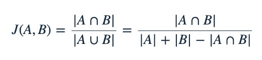**

**语义分割对于制图很有用，因为其像素级输出相对容易直观地解释、验证和使用(例如在建筑表面积的计算中)或作为下游步骤的输入(例如首先分割建筑物，然后对每个分割建筑物的属性进行分类，如其建造状态或屋顶材料)。**

**分段跟踪参与者还必须至少向负责的 AI 跟踪提交一次，才有资格获得 12，000 美元的分段跟踪奖金。**

**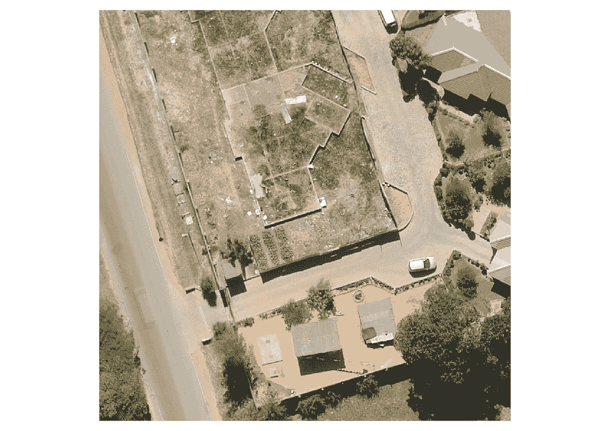****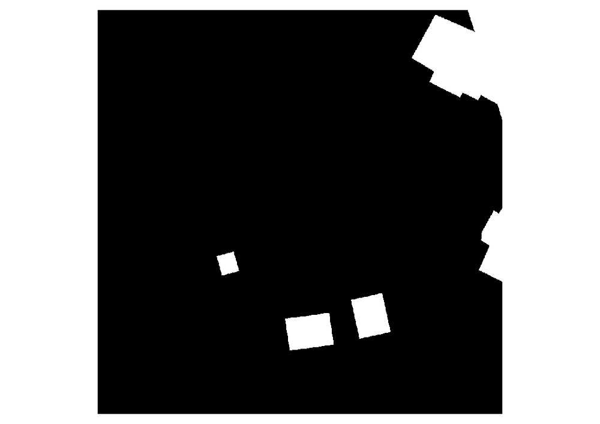**

**挑战数据集中的图像碎片(左)和分割(右)示例。**

## **[**负责任的人工智能赛道**](https://www.drivendata.org/competitions/60/building-segmentation-disaster-resilience/page/152/)**:**【3，000 美元奖金将颁发给将伦理视角应用于灾害风险管理的人工智能系统的设计和使用的最佳创意。**

**通过提供更准确、更快速或更低成本的风险评估方法，ML 可以改善灾害风险管理中的数据应用，特别是在与计算机视觉和地理空间技术相结合时。与此同时，我们迫切需要更好地了解使用核武器的潜在负面或意外后果。随着人们越来越关注在面部识别、刑事司法、医疗保健和其他领域适当和道德地使用 ML 的问题，我们有责任立即提高这些问题的灾难风险。**

**ML 技术在这一领域存在的潜在危害包括但不限于:**

*   **通过在整个机器学习开发管道中存在偏见，延续并加剧社会不平等。**
*   **在脆弱、冲突和暴力环境中，通过组合以前不同的数据集，加剧隐私和安全问题。**
*   **由于数据产品日益复杂，限制了公众参与灾害风险管理的机会。**
*   **降低了专家判断在数据和建模任务中的作用，从而增加了出错或误用的可能性。**
*   **方法、结果或不确定性程度的沟通不充分，增加了误用的机会。**

**ML 从业者和数据科学家处于独特的位置来检查和影响我们工作的道德含义。我们要求挑战参与者考虑在设计和使用灾害风险管理 ML 系统时出现的应用伦理问题。我们如何改进 ML 的创建和应用，以减少偏见，促进公平和道德的使用，清晰地告知决策，并制定保护用户和最终受益者的保障措施？**

**本专题的提交格式非常灵活:参与者可以提交 Jupyter 笔记本、幻灯片、博客、论文、演示、产品模型、推理小说、艺术作品、研究论文或原创研究的综合，或者任何其他最适合你的格式。评委将根据思想性、相关性、创新性和清晰性对提交的作品进行评估。**

# **接下来是什么**

**这一挑战将产生新的公共产品，推进我们应用 ML 了解非洲城市风险的实践状态；这包括新的 ML 性能基准，用于从相关地理区域的航空影像中进行建筑物分割，用于非洲城市制图的顶级解决方案，以及对我们如何负责任地创建和部署用于灾害风险管理的 AI 系统的深入探索。**

**获奖的解决方案将作为开源工具和知识发布，挑战数据集将保持开放的数据资源，用于持续的 ML 开发和基准测试。全球减少灾害风险基金将利用所吸取的经验教训，为在城市制图和规划中使用 ML 的政策和采购策略提供信息。**

# **加入挑战吧！**

**比赛目前持续到**2020 年 3 月 16 日**。还有一个月的时间，我们有充足的时间探索数据并参与其中任何一个专题讲座，但不要拖延，请立即加入:**

## **[**driven data . org/competitions/60/building-segmentation-disaster-resilience**](http://drivendata.org/competitions/60/building-segmentation-disaster-resilience)**

**[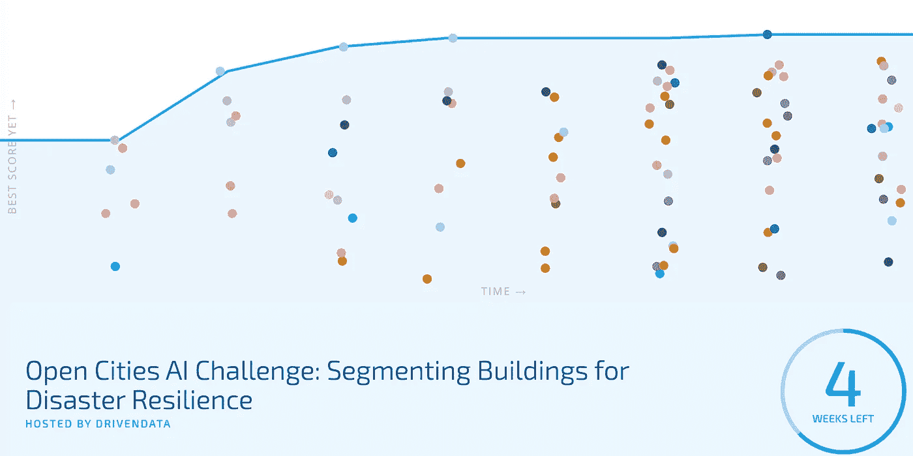](http://drivendata.org/competitions/60/building-segmentation-disaster-resilience)**