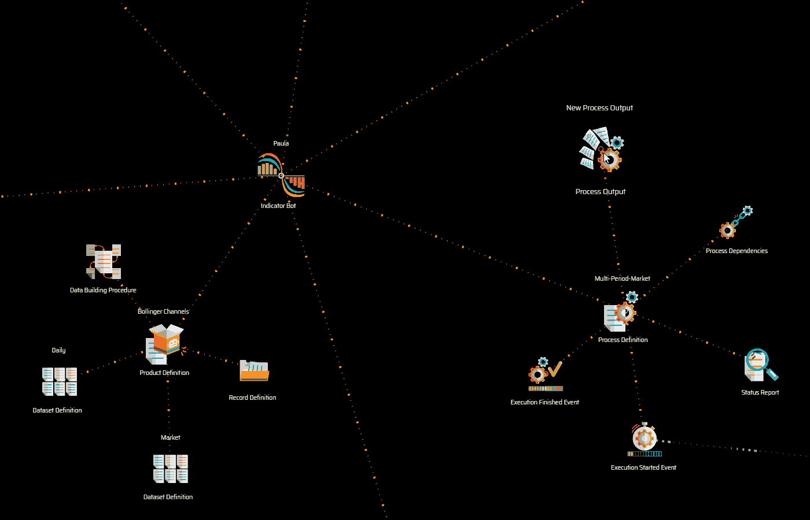
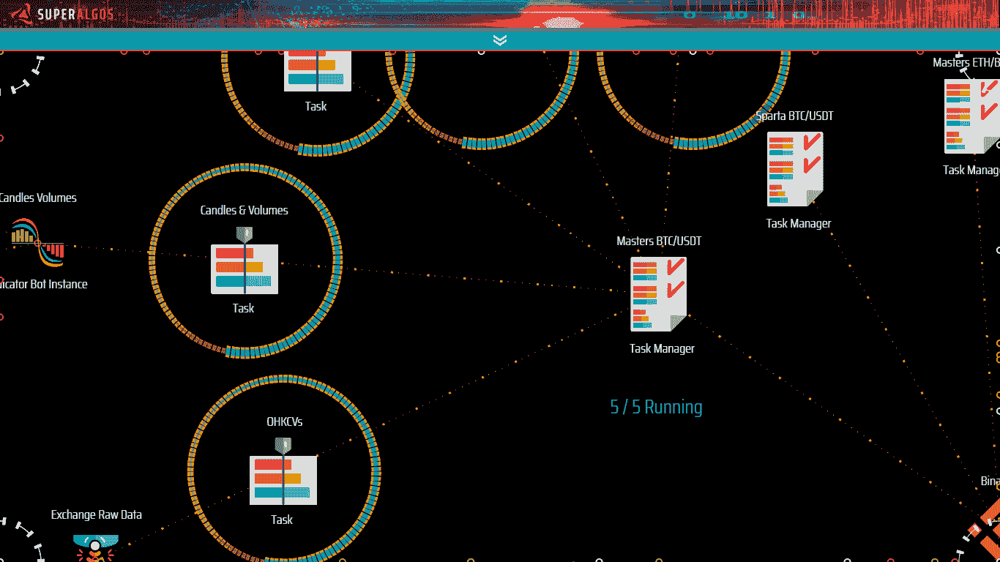
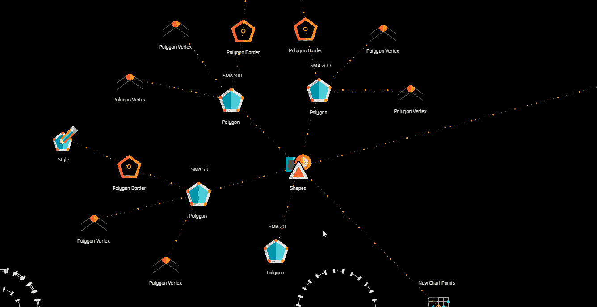
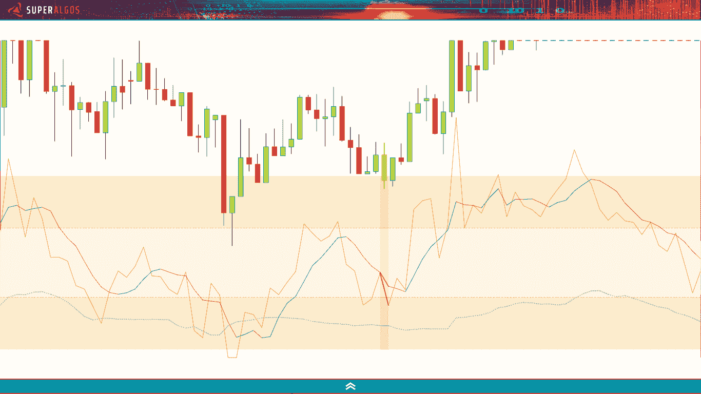
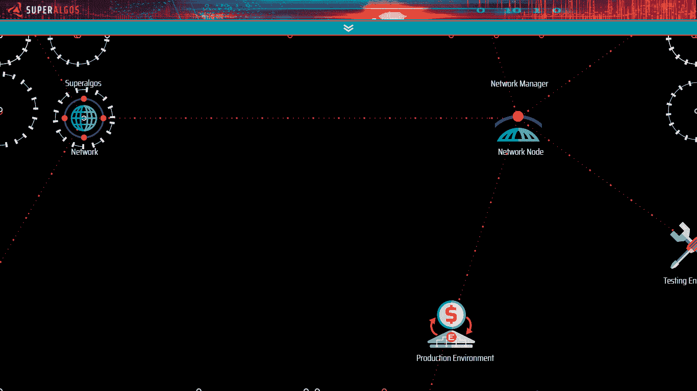

# 秘密市场数据集的开源金矿

> 原文：<https://towardsdatascience.com/the-open-source-goldmine-of-crypto-markets-datasets-43d173e0df33?source=collection_archive---------25----------------------->

## 秘密市场研究

## 如何运行分布式数据挖掘操作，以零成本获取和处理加密市场数据。


图表空间。所有图片由作者提供。

从第一次谈话中，我就应该知道，我即将被拖入另一个长达数年的项目。这一切都要追溯到 2017 年夏天。

我的兄弟路易斯·费尔南多·莫利纳几周来一直在摆弄一个视觉界面，他设想这个界面将成为一种新型交易机器人平台的基础。他坚持认为，能够可视化整个数据集是创造交易智能的核心。

对我来说，*数据可视化*和*交易机器人*出现在同一个句子中似乎有悖直觉。然而，他接下来的声明让这变得很明显…

> 他说，机器人不需要数据可视化，但制造机器人的人类需要。

我一点也不知道我们将在接下来的三年里建立一个巨大的系统！男孩被我拖进了过山车！

我们成立了一家初创公司，组建了一个团队，并在某个时候决定彻底改变计划，转向开源。

总有一天我会写下那个故事…

**但是今天，我写信与数据科学社区分享我们为**[**Superalgos**](https://superalgos.org)**创建的免费和开源数据挖掘基础设施，它可能对从事秘密市场研究、构建交易人工智能或寻找处理数据或运行回溯测试的可视化脚本解决方案的人有用。**

正如社区中的 *quants* 正确指出的那样，基础设施不仅为我们的系统策略提供高质量的技术分析数据集…

> Superalgos 数据挖掘解决了数据科学家的软件和数据工程需求，如提取、收集、清理和存储市场数据，以及一些数据分析需求，如转换、聚合和处理数据。

数据挖掘基础设施是作为一个算法加密交易平台的*信息分支*而建立的，但是，准确地说，它可以处理所有类型的数据，只要添加了正确的传感器。

接下来是我们迄今为止所构建的内容的鸟瞰图，以及您开箱即用的内容，免费，没有广告，没有收集个人信息，没有付费的专业版…只是您下载并在您的机器上运行的优秀的老式开源软件。

# 系统结构

我们希望有一个灵活的视觉环境，降低进入门槛，帮助不太懂技术的用户充分利用系统。同时，我们需要一个强大可靠的后端，配得上任务关键型金融系统。

在最高级别上，系统分为前端 web 应用程序和后端，前者在浏览器上运行动画 HTML5 画布，后者由一组节点 JS 进程组成。

*代码库*随系统一起发布，构成了一个完整的功能开发环境。系统在实际代码上未经编译就运行。

数据矿旨在维持实时数据挖掘和数据处理操作，向交易机器人提供复杂的信息，但也可能用于下载数据和离线处理数据。

# Exchange 连接

早在 2017 年年中，我们就开始单独与食物链顶端的加密交易所 Poloniex 合作。当系统的核心经过几次迭代后，Poloniex 已经在前 20 名中找不到了。

伙计，在秘密世界里事情变化真快！是时候向更多的交流开放游戏了…

加密交换公开了可能随时间发展和改变的 API。如果您必须自己维护不同的连接器，这将是一个长期的挑战。

为了处理多交易所通信，我们实现了 [CCXT 库](https://github.com/ccxt/ccxt)——一个开源的标准化接口，加密货币交易所被邀请遵守该接口。简而言之，该实现允许访问大多数主要的交换。

# 传感器机器人

单个传感器机器人可以与所有支持的加密交换交互，并从任何市场获取数据。数据的完整性和完整性在交易应用程序中至关重要，因此我们在构建防弹传感器方面投入了大量精力。

该传感器下载一分钟蜡烛线的 OHLCV 数据(开盘价、最高价、最低价和收盘价，以及交易量)，并输出一个数据产品，该产品随后被用作其他机器人的输入。

一些交易所还支持下载原始交易和订单数据。

# 指示器机器人

我们借用名称*指示器*来描述一种 bot，因为交易应用程序的主要兴趣是产生技术分析和技术研究。然而，基础设施允许各种计算。

在 Superalgos 中，指示器机器人将其他机器人的数据产品作为输入，应用用户定义的算法对其进行处理，并输出新的数据集。

数据处理逻辑可以嵌套在一个指标内的多个产品定义中，甚至可以跨指标嵌套，从而生成多个数据产品，这些产品可以为下游的其他流程提供数据。

## 视觉定义

指示器机器人可以在可视环境中创建和定义，唯一需要的编码是实际的数据构建过程算法。流程、依赖项、记录、数据集结构等的定义是在可视化脚本界面中完成的。



过程和数据产品的可视化定义

## 数据集结构

指标生成标准化数据集，由高度碎片化的文件组成，数据以 JSON 格式的数组形式存储在每个时间范围内:1、2、3、4、5、10、15、20、30 和 45 分钟；以及 1、2、3、4、6、8、12 和 24 小时。

```
... ,[1586044800000,1586131199999,6339.464,440.893,881.7869310984372],[1586131200000,1586217599999,6440.327,424.904,849.8082144837152],[1586217600000,1586303999999,6530.541,382.382,764.7649354906382], ...
```

文件存储在由`Exchange > Market > Bot > Product > Time Frame`组织的树状文件夹结构中，在时间较短的情况下——为了提高可访问性——文件也按`Year > Month > Day`排序。

# 执行

我们需要一个既能在离线状态下(例如，处理要进行回溯测试的数据)又能在实时交易情况下(需要从交易所获取原始数据，进行实时处理，然后提供给交易机器人)正常工作的执行环境。



机器人也可以在视觉环境中进行管理

在实时数据挖掘操作中，机器人以持续数秒的短脉冲运行，通常间隔一分钟。因为机器人依赖于其他机器人，所以系统跟踪依赖性并协调机器人的顺序执行，以维持从从交换中提取原始数据的时刻到最后一个指示器机器人运行并存储其输出的数据处理链。

# 数据可视化

我已经提到了我们对数据可视化的痴迷！我们希望将强大的数据构建功能与健壮的、用户定义的数据可视化解决方案相集成…因此我们发明了*绘图仪*。

绘图仪是在可视化环境中定义的设备，用于创建整个数据集的可视化表示，无需编码。这是最好的可视化脚本！



绘图仪…最佳视觉脚本！

首先用`[datetime, price]` 坐标定义数据点，然后用这些点定义多边形，这些多边形可能会被赋予图形样式。生成的图形叠加在时间轴上，在时间轴上，您可以分析所有时间范围内所有时间同步的数据集。

该系统允许沿着时间线浏览所有时间范围内的数据，并使所有数据产品作为可以相互叠加的层来提供。它允许创建多个图表，甚至是包含多组图表的多个仪表板。



绘图仪在图表上生成自定义数据可视化

# 分布式数据挖掘

我们希望支持不同的用例，其中一些需要使用过时的或极简的硬件来处理数据，而另一些则需要部署大量资源。



在网络中的节点间移动任务

我们最终将系统设置为在节点网络上分布式运行。这允许建立数据挖掘场，通过集中管理跨多个硬件实时分析多个维度的市场数据。决定您可以完成多少处理的是可用的硬件，而不是软件。

网络配置和挖掘任务在网络中的分布也是从直观的可视化环境中完成的，没有任何编码需求。

每次我开始一个新项目，我知道我的整个世界都会围绕它转上好几年。Superalgos 也不例外。我们是痴迷的人！

我刚刚与你分享的可能是系统中目前打包的功能的五分之一和有待开发的功能的十分之一！

我们很乐意从数据科学社区获得一些反馈，并希望我们迄今为止创建的内容对您有用。

在 [Superalgos 文档网站](https://docs.superalgos.org/)中可以找到入门所需的所有信息。您将找到下载该软件的链接以及引导您完成学习曲线的视频教程。

如果你有任何问题或需要帮助，你可以联系 [Superalgos 社区](https://t.me/superalgoscommunity)，在那里你会找到其他用户、开发者和我自己。

尽情享受吧！