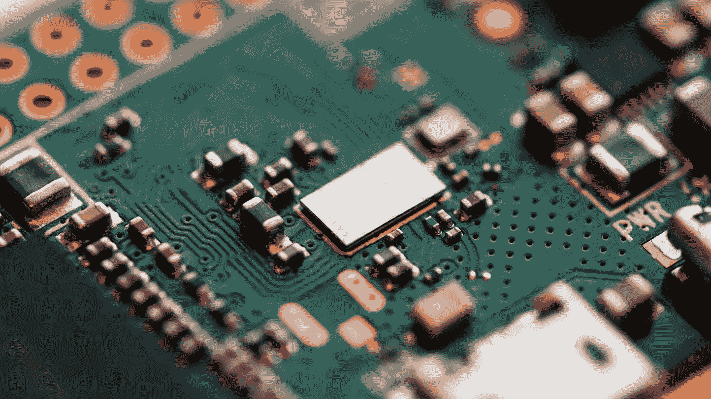
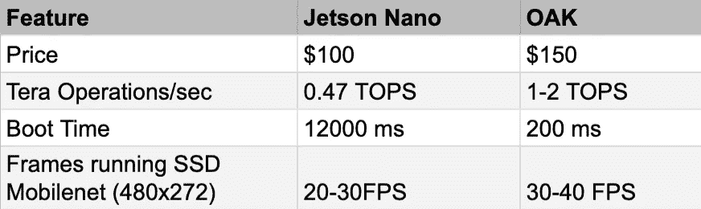

# OpenCV 人工智能工具包就像它看起来一样酷

> 原文：<https://towardsdatascience.com/the-opencv-ai-kit-is-exactly-as-cool-as-it-looks-36ca95959417?source=collection_archive---------29----------------------->

2020 年 7 月 14 日上午 9:00，一个 smol 芯片崩溃登陆 [Kickstarter](https://www.kickstarter.com/projects/opencv/opencv-ai-kit) 现场，引起了瞬间的混乱。

到 9:20，2 万美元的目标已经 100%到位。在 9:55 他们超过了 200%。

截至 8 月 7 日，还有 5 天就到了 85 万美元。

该芯片被称为 **OpenCV AI Kit、**或 **OAK。**

它正在通过使用嵌入式摄像头和开源即插即用软件将人工智能带入大众，从而改变游戏规则。这提高了人工智能最小学习曲线的门槛。

基于[英特尔的 Movidius Myriad X VPU](https://www.intel.com/content/www/us/en/products/processors/movidius-vpu/movidius-myriad-x.html) ，OpenCV 团队释放了大量未受影响的硬件能力，极大地提高了计算性能！

**硬件**

*   OAK-1:单摄像头 4k @ 60fps 模块(45 毫米 x 30mm 毫米)
*   OAK-D:一个带有 4k @ 60fps 相机和立体深度相机的模块

**软件**

*   一个新的 OpenCV OAK 库，用于在设备上实时神经网络处理

# 它能做什么

简而言之:很多。开箱即用的 OAK 使用标准的神经模型，可以对物体、人脸和车辆进行推理。它可以检测文本并运行字符识别。它可以运行深度辅助语义分割、对象跟踪、apriltag 检测、图像过滤和边缘检测等等。

都是实时的。

# 基准

至于 OAK-D 的表现如何，让我们将其与 Jetson Nano 进行比较，Jetson Nano 是一种高性价比的 NVIDIA 套件，用于并行运行神经网络操作。作为一个独立的套件，Nano 非常强大，但 OAK 也有两大优势:

*   如果你有任何空间需求的话，需要很多开销。你需要买一台相机来整合 Nano。
*   Nano 运行的是完整的 Linux 版本。纯嵌入式 OAK 功耗极低，在神经推理方面速度极快。

## 规范

当然，一个完整的 Linux 系统通过额外的功能为您提供了更多的功能，但是由于小型、可负担的实时推理的永久行业限制，OAK 为快速可访问性领域带来了重要的新选择。

当然，快速主流检测的重大意义是扩大全球训练数据库，以提高模型准确性。

# 立体声深度功能

让我们更详细地讨论一下 OAK-D 的空间功能。

该芯片可以在标准 YOLO 检测的背景下运行立体深度融合，以进行 3D 渲染。通常需要大量计算能力和管道同步的立体神经推理现在可以并行运行，并对结果进行三角测量以获得更高的准确性。

难以处理的光障碍，如反射和其他会损害推断准确性和产生安全风险的噪声，大大减少。光盲会导致其他嵌入式摄像头出现多种问题，比如 kinect 的红外检测功能，这使得它在室外的准确性大大降低。

**更多权力游戏:**

*   对现有标准神经网络训练集的数据扩充，如图像扭曲、去扭曲
*   实时无损 12x 720p 角点检测
*   2 个片上神经计算引擎。神经深度的 16 种色调。
*   用于连接优先级的网络芯片链接。

# 包装它

我试图在保持合理简短的同时涵盖重点，但肯定鼓励查看更多信息，如【LUXonis 首席执行官 Brandon Gilles 的这个增强初创公司播客。

在运行 API 时，OAK 具有即时的开箱即用功能。超级灵活的麻省理工学院授权 OpenCV 软件是围绕绝对最小的开销而设计的。正如 Gilles 所说，他们试图使用“可发现性”来允许特性按需出现，但不需要启动任何臃肿的软件。这使得像艺术家这样的创作者只需改变一行就能投入行动。

强大、可扩展、廉价且快速。奥克斯似乎真的有独立功能的完美风暴。我等不及 12 月了！

真的很好奇想听听大家的想法！这种嵌入式功能有这么强大吗？你认为其他芯片公司会推出有竞争力的替代品吗？留言评论！

一如既往，感谢您的阅读！