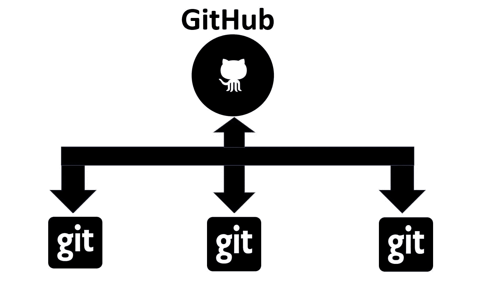
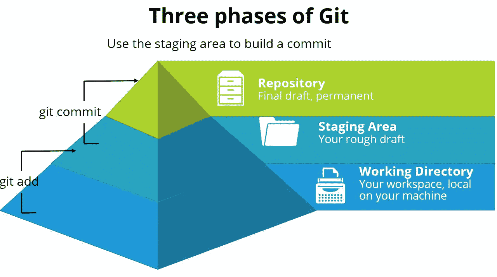

# Git 的最佳备忘单

> 原文：<https://towardsdatascience.com/the-optimal-cheatsheet-for-git-796e9a68b6e7?source=collection_archive---------31----------------------->

## 理解 Git 并涵盖重要和常用的 Git 命令，以便于参考


图片由 [cottonbro](https://www.pexels.com/@cottonbro) 在 [Pexels](https://www.pexels.com/photo/persons-hand-with-purple-manicure-4629622/) 上拍摄

**什么是饭桶？**

**GIT** 是一个 DVS( **分布式版本控制**)，它在软件开发过程中跟踪源代码的变化。它简化了项目协作过程，并跟踪任何文件中的更改。它是一个存储代码的平台，可以由一组程序员在项目的开发阶段并行访问。

我们为什么需要 GIT？

当在项目中工作时，为了避免开发者之间的冲突，我们使用版本控制系统，比如 Git。

**什么是版本控制系统？**

我们在日常生活中使用的版本控制系统的一个简单例子是电子邮件。版本控制系统(VCS)是一个程序(或一组程序)，它跟踪文件集合的变化。一个目标是轻松地召回单个文件或整个项目的早期版本。

使用版本控制系统，您可以:

*   看到所有的变化
*   检索过去的版本
*   创建 ***分支***

版本控制系统有两种类型:

*   **分布式版本控制系统**
*   **集中版本控制系统**

Git 是一个分布式版本控制系统。什么是分布式版本控制系统？

在分布式版本控制系统中，每个用户克隆中央存储库来创建他们自己的个人存储库，其中包括项目的完整历史。

在 DVCS，每一个开发者或客户都有自己的服务器，他们在本地服务器或机器上有整个历史或代码版本及其所有分支的副本。基本上，每个客户端或用户都可以在本地工作并断开连接，这比集中式源代码控制更方便，在集中式源代码控制中，只有一个服务器，所有开发人员都可以在其中报告和进行更改，这就是为什么它被称为分布式的原因。

**Git 的区别& GitHub**



由 [Rahul Pathak](https://medium.com/@rahulpathak1996) 在[媒体](http://medium.com)上拍摄的照片

*   Git 是一个版本控制系统，而 GitHub 是一个代码协作平台！
*   Git 是软件，而 GitHub 是服务
*   Git 安装在本地计算机上，GitHub 托管在 Web 上
*   Git 提供了命令行工具，GitHub 提供了图形界面
*   它可以与各种工具一起使用，或者在您的计算机上本地使用，以帮助您跟踪代码项目中的更改。GitHub 使用 Git 进行版本控制，并为您提供各种出色的协作工具。



拉胡尔·帕塔克在[媒体](http://medium.com)上拍摄的照片


由[拉胡尔·帕塔克](https://medium.com/@rahulpathak1996)在[媒体](http://medium.com)上拍摄的照片

## 最佳 GIT 备忘单:

## ⭐Download 吉特

[GitHub for Windows](https://gitforwindows.org/)
[GitHub for Mac](https://git-scm.com/download/mac)
[GitHub for Linux](https://git-scm.com/download/linux)

⭐ **设置**

**配置所有本地存储库使用的用户信息**

```
git config — global user.name “[firstname lastname]”
```

它设置了一个在查看版本历史时可识别的名称。

```
git config — global user.email “[valid-email]”
```

设置将与每个历史标记关联的电子邮件地址。

```
git config — global color.ui auto
```

为 Git 设置自动命令行颜色，以便于查看。

⭐ **设置&初始化**

**配置用户信息，初始化和克隆存储库**

```
git init 
```

将现有目录初始化为 Git 存储库

```
 git clone [URL] 
```

通过 URL 从托管位置检索整个存储库

⭐ **舞台&快照**

**使用快照和 Git 暂存区**

```
git status 
```

显示工作目录中为下次提交准备的已修改文件。

```
 git add [file] 
```

将文件添加到您的下一次提交(阶段)中。

```
git reset [file] 
```

在保留工作目录中的更改的同时，取消文件登台。

```
git diff 
```

已更改但未登台的内容的差异

```
git diff --staged 
```

已暂存但尚未提交内容之间的差异。

```
git commit -m “[descriptive message]” 
```

将暂存内容提交为新的提交快照。

⭐ **分公司&合并**

**隔离分支中的工作，更改上下文，并集成更改**

```
git branch 
```

列出您的分支当前活动的分支旁边会出现一个*号。

```
 git branch [branch-name] 
```

在当前提交时创建新的分支。

```
git checkout 
```

切换到另一个分支，并将其签出到您的工作目录中。

```
git merge [branch] 
```

将指定分支的历史记录合并到当前历史记录中。

```
git log 
```

显示当前分支历史记录中的所有提交。

⭐ **检查&比较**

**检查日志、差异和对象信息**

```
git log 
```

显示当前活动分支的提交历史记录。

```
git log branchB..branchA 
```

显示分支 A 上不在分支 b 上的提交。

```
git log — follow [file] 
```

显示更改文件的提交，甚至跨重命名。

```
git diff branchB…branchA 
```

显示分支 A 中的内容与分支 b 中的内容的差异。

```
git show [SHA] 
```

以人类可读的格式显示 Git 中的任何对象。

⭐ **跟踪路径变化**

**版本文件删除和路径改变**

```
git rm [file] 
```

从项目中删除该文件，并为提交准备移除。

```
git mv [existing-path] [new-path] 
```

更改现有文件路径并准备移动。

```
git log — stat -M 
```

显示所有提交日志，并指出任何移动的路径。

⭐ **忽略模式**

**防止无意中暂存或提交文件**

```
logs/ .notes pattern*/
```

将具有所需模式的文件另存为。gitignore 使用直接字符串匹配或通配符 globs。

```
git config — global core.excludesfile [file] 
```

系统范围忽略所有本地存储库的模式。

⭐ **分享&更新**

**从另一个存储库检索更新并更新本地存储库**

```
git remote add [alias] [URL] 
```

添加一个 git URL 作为别名。

```
git fetch [alias] 
```

把 Git 遥控器上的所有分支都拿下来。

```
git merge [alias]/[branch] 
```

将远程分支合并到当前分支中，使其保持最新。

```
git push [alias] [branch] 
```

将本地分支提交传输到远程存储库分支。

```
git pull 
```

从跟踪远程分支获取并合并任何提交。

⭐ **改写历史**

**重写分支、更新提交和清除历史**

```
git rebase [branch] 
```

在指定分支之前应用当前分支的任何提交。

```
git reset — hard [commit] 
```

清除临时区域，从指定的提交重写工作树。

⭐ **临时提交**

**临时存储修改过的、被跟踪的文件，以便改变分支**

```
git stash 
```

保存修改和暂存的更改。

```
git stash list 
```

列表堆栈-隐藏文件更改的顺序。

```
git stash pop 
```

从栈顶开始写工作。

```
git stash drop 
```

放弃堆栈顶部的更改。

Git 是给所有人的。这是一个伟大的方式来管理您的文件，这是一个强大的工具。它已经成为这个行业中的一个重要工具，起初看起来似乎很神秘，但是在几个小时内，你将能够掌握这个伟大的工具。

**参考文献**
[**教育@ GitHub**](http://education.github.com)

你也可以参考我的另一篇文章，在那里我有一篇关于 Git
[**Git 的基本命令:一个完整的指南**](/git-a-complete-guide-d49675d02a5d)

你也可以在这里翻翻我的其他文章:
[**拉胡尔·帕塔克**](https://medium.com/@rahulpathak1996)

**非常感谢:)**