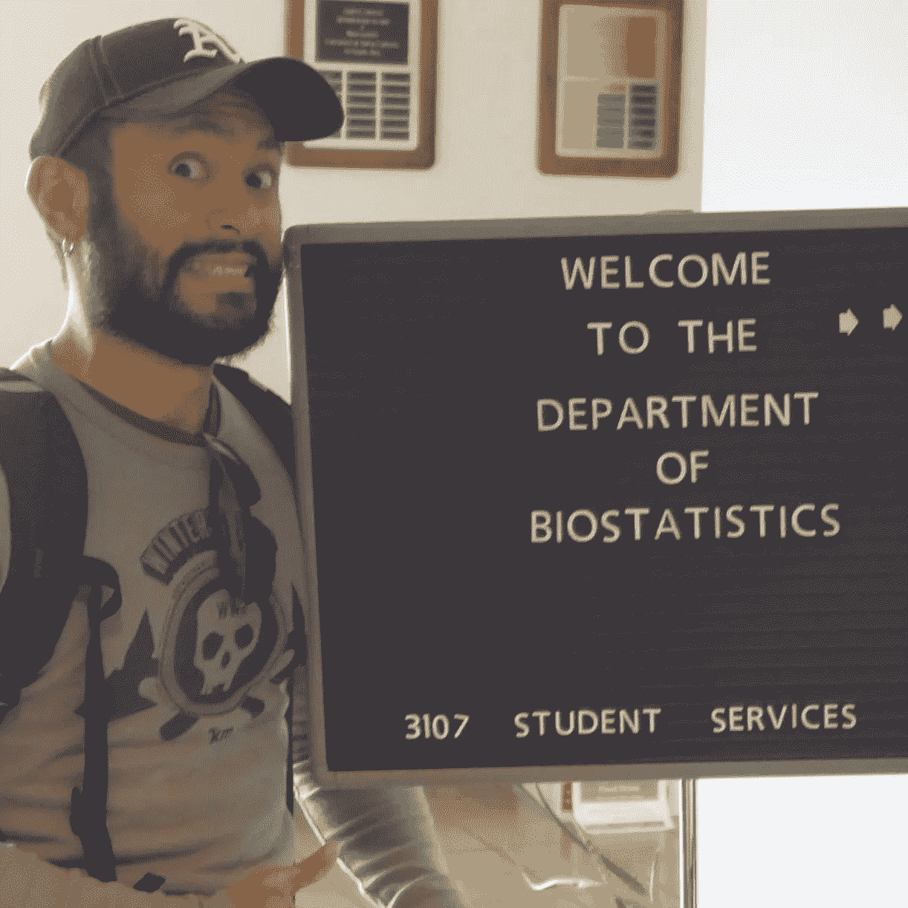

# 在对抗冠状病毒的战斗中被忽视的数据科学家:生物统计学家

> 原文：<https://towardsdatascience.com/the-overlooked-data-scientists-in-the-fight-against-coronavirus-biostatisticians-f90704fe145d?source=collection_archive---------29----------------------->

Eric J. Daza(作者)大约 2014 年在 [Gillings 全球公共卫生学院](https://sph.unc.edu/)的[生物统计系](https://sph.unc.edu/bios/biostatistics/)在[北卡罗来纳大学教堂山](https://www.unc.edu/)。(图片来源:J.P. + J.K .)

> 这正是用科学严谨的生物统计学方法来锤炼数据科学冲刺敏捷性的时候。

流行病学家，特别是传染病专家，是指导数据科学解决方案的终极领域专家，这些解决方案对新型冠状病毒(“冠状病毒”)及其健康影响(即新冠肺炎特征和影响)的人群健康相关方面进行建模或分析。因此，令人鼓舞的是，越来越多的数据科学黑客马拉松和项目正确认识到需要招募流行病学家来指导解决方案的开发。不寻求他们的指导是一个巨大的错误，可能会增加报告统计数据的噪音，从而误导普通人、医院、政策专家和政府下一步该做什么。

但这些人口健康数据科学项目继续在很大程度上忽略了一个关键的自然队友和合作者群体:生物统计学家。

生物统计学家——公共卫生的统计学家——几十年来一直是卫生数据收集和分析的管理者。他们经过专门培训，能够识别和解决人类健康数据分析中出现的问题和并发症。他们深入的以健康为重点的方法培训和经验不仅涵盖统计建模，还包括选择偏差(例如，观察者/报告/检测偏差)、遗漏(即，缺失数据模式)、测量误差、人口统计学、调查抽样、研究设计、数据管理和因果推断(例如，正确处理混杂因素，以真实估计干预效果)。重要的是，生物统计学家接受培训，整合解决这些许多并发症的方法，着眼于有效地咨询和沟通流行病学家和其他卫生研究人员。

> 生物统计学家是公共卫生的原始“全栈”数据科学家。

单独的统计建模既不是统计学也不是生物统计学，只是围绕“减少偏倚”或“平衡偏倚和方差”的数据叙事的一部分。数据科学家可能是统计建模方面的专家，可以补充、增强甚至改进生物统计模型。但是从前面的段落中可以清楚地看到，为什么仅仅这项技能并不能使他们成为生物统计学家。

简而言之，生物统计学家是公共卫生的原始“全栈”数据科学家。

*   他们的可交付成果、产品和解决方案传统上是研究方案、数据收集程序和研究开始时的统计分析计划(理想情况下)，以及贯穿始终的数据管理和分析报告。
*   他们的客户和顾客通常包括流行病学家、其他公共卫生研究人员(如营养、健康行为、环境/职业健康、孕产妇/儿童健康)、政府机构和研究所、临床试验人员以及制药/生物技术和生命科学公司。

上述生物统计学概念(无统计建模)中没有一个被深入地教授给数据科学家——如果有的话。然而，数据科学家擅长巧妙地整合统计建模、软件工程和计算机科学，以提供可扩展的业务或组织解决方案(即，可以在非常大的互连数据集和数据库上非常快速地实施)。相反的观点也成立:如果一个生物统计学家擅长统计建模，这并不自动使他们成为数据科学家。

我非常清楚这些数据科学任务是多么巨大。作为一名医疗数据科学团队中的统计学家，我深深体会到了我的队友每天优化分析和工程流程和管道以满足非常苛刻的期限的技能和耐力。通过我们不断的互动，我内化了如何管理时间限制的平衡，什么是理想的，什么是可以做的。

> 与数据科学博客和社交媒体上发布的令人信服的数据可视化和漂亮的仪表盘相比，预测和潜在的反事实通常更加嘈杂和有偏见。

然而，正如 [Hernán 等人(2019)](https://amstat.tandfonline.com/doi/full/10.1080/09332480.2019.1579578) 所指出的，数据科学家往往来自物理或生命科学背景和领域。这些在很大程度上涉及低噪音数据系统和良好表征的机械关系。即使这样的数据科学家知道公共卫生数据要嘈杂得多，但在比赛完成冲刺或满足最后期限，或击败其他冠状病毒黑客马拉松团队到达终点时，依靠这些简化的假设也是很自然的。数据中的噪音和科学中的不确定性(即，我们对生成数据的机制的理解)都被作为讨厌的因素放在一边，留待以后处理。首先是构建分析工具，这很有意义。

不幸的是，在冠状病毒流行的关键人群水平特征建模中，这些讨厌的因素往往是最重要的，尤其是在早期。例如，这些可能包括易感-暴露-感染-移除(SEIR)模型的参数。因此，如果没有流行病学家和公共卫生方法论专家(如生物统计学家和卫生统计学家)的指导，通常的数据科学过程会严重崩溃。与数据科学博客和社交媒体上发布的令人信服的数据可视化和漂亮的仪表盘(例如，交互式图表和表格)相比，预测和潜在的反事实(即，“无干预”下的结果或反之亦然，视情况而定)通常更加嘈杂和有偏见。

哈佛大学陈廷骅公共卫生学院网上研讨会(新冠肺炎数据科学论坛)最近给想要提供帮助的数据科学家的建议听起来非常有用。以下是我对这条建议的提炼和解释:

1.  **停止试图重新发明 SEIR 车轮。**至少，不要在没有流行病学资质的情况下，在你的博客或其他社交媒体上公开发布你自己的 SEIR 式模型。相反，尝试改善数据收集工作，以帮助更好地估计 SEIR 模型的参数，公共卫生专业人员现在需要帮助。将你的想法提交给这些健康专家进行审查。招募生物统计学家或健康统计学家队友，他们将帮助你正确地做这些事情。他们不仅会帮助你减少偏见，还会指导你如何诚实地向你的健康专家“客户”传达你的解决方案中的噪音和不确定性。参见[怀南茨等人(2020](https://www.medrxiv.org/content/10.1101/2020.03.24.20041020v1) )的一个很好的例子。
2.  利用您独特的专业知识来改善公共卫生基础设施的关键组成部分。例如，创建强大的解决方案来链接消费者数据库、健康记录、地理空间数据和可穿戴设备/应用程序/传感器数据。这些可能有助于改善供应链、医院和临床协调、接触者追踪、疾病监测、病人护理以及精神和身体健康，同时练习社交距离。招募生物统计学家或健康统计学家的队友，帮助处理和减轻选择偏差、遗漏引起的偏差和测量误差；帮助人口统计、调查抽样、研究设计和数据管理；并帮助进行因果推理。这些同事将在您意识不到的建模和部署狂潮中捕捉到重要的分析和建模假设，这些假设会直接影响您的预测，以及基于这些假设做出的生死攸关的决策。

那么，为什么数据科学界没有邀请生物统计学家来帮助对抗冠状病毒呢？

> 我的猜测是，数据科学家倾向于将生物统计学家视为随机控制试验(RCT)统计学家或专家。…这给人一种错误的印象，即数据科学家在进行随机对照试验和其他临床研究时，只需要生物统计学家的输入。

我的猜测是，数据科学家倾向于将生物统计学家视为随机控制试验(RCT)统计学家或专家。这可能是由于生物统计学家在制药、生物技术和生命科学行业的突出地位——至少引起了行业数据科学家的注意。(很多生物统计学家也在学术界工作。)这给人一种错误的印象，即数据科学家在进行 RCT 和其他临床研究时，只需要生物统计学家的输入。

对所有已经在和流行病学家或其他相关公共卫生专家一起工作的数据科学家说:干得好！**现在考虑在你的团队中加入生物统计学家。**现在正是用科学严谨的生物统计学方法来锤炼数据科学冲刺敏捷性的时候。(重要的是，请记住，虽然许多生物统计学家与流行病学家一起工作，但他们通常不能代替流行病学家。)

对于所有想要通过与数据科学家和公共卫生专家合作来帮助抗击冠状病毒的生物统计学家:

1.  准备好以极快的速度进行研究设计和分析，通常是回顾过去。
2.  习惯于必须快速识别、报告和交流隐性分析假设对下游决策和行动的重要性和影响。你通常没有时间去细化它们。
3.  准备在敏捷项目管理系统(例如，Scrum、看板、wikis)中完成所有这些工作。这将有助于您与数据科学家和数据工程师团队成员进行沟通和协调。

采取这些行动可能会帮助你更好地理解和加强在以冠状病毒为重点的数据科学的快速发展的世界中统计预测的通常常见(但隐含)的推论。

有关相关观点，请查看:

*   “统计学在对抗冠状病毒中的作用”

*   “如果我们不适应，数据科学只会对(生物)统计构成威胁”作者 [Jeffrey Leek 博士](https://twitter.com/jtleek)对[简单统计](https://simplystatistics.org/)

 [## 如果我们不适应，数据科学只会对(生物)统计学构成威胁

### 我们之前在这个博客上提到过统计数据需要更好的营销。最近，卡尔·b·提出“…

simplystatistics.org](https://simplystatistics.org/2013/04/15/data-science-only-poses-a-threat-to-biostatistics-if-we-dont-adapt/) 

# 参考

*   新冠肺炎数据科学园区。[https://www . hsph . Harvard . edu/bio statistics/2020/03/新冠肺炎-数据-科学-zoomposium-4-2/](https://www.hsph.harvard.edu/biostatistics/2020/03/covid-19-data-science-zoomposium-4-2/)
*   获得正确因果推理的第二次机会:数据科学任务的分类。机会。2019 年 1 月 2 日；32(1):42–9.[https://amstat . tandfonline . com/doi/full/10.1080/09332480 . 2019 . 1579578](https://amstat.tandfonline.com/doi/full/10.1080/09332480.2019.1579578#.XojTjNNKjVs)
*   Wynants L，Van Calster B，Bonten MM，Collins GS，Debray TP，De Vos M，Haller MC，Heinze G，Moons KG，Riley RD，Schuit E .对新冠肺炎感染诊断和预后预测模型的系统综述和关键评价。medRxiv。2020 年 1 月 1 日。[https://www . medrxiv . org/content/10.1101/2020 . 03 . 24 . 20041020 v1](https://www.medrxiv.org/content/10.1101/2020.03.24.20041020v1)

# 关于作者

Daza 博士是一名生物统计学家和健康数据科学家，而不是流行病学家，他为个性化(n-of-1)数字健康开发因果推断方法。| ericjdaza.com🇵🇭🇺🇸[@埃里克森达扎](http://twitter.com/ericjdaza)linkedin.com/in/ericjdaza | statsof1.org[@ stats of](http://twitter.com/statsof1)[@ fsbiostats](http://twitter.com/fsbiostats)