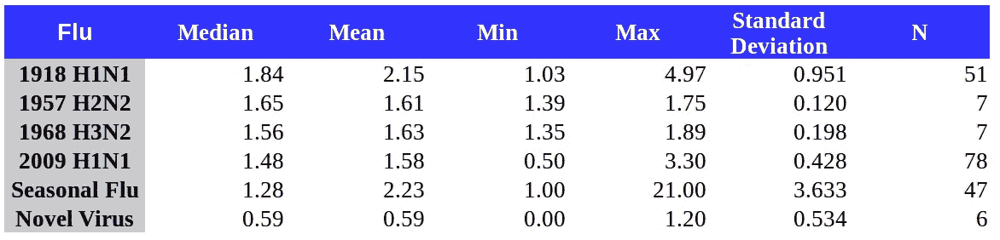
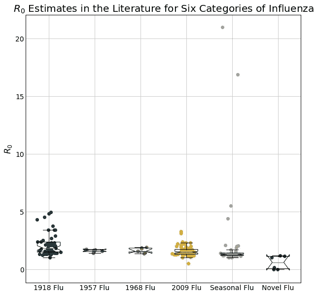
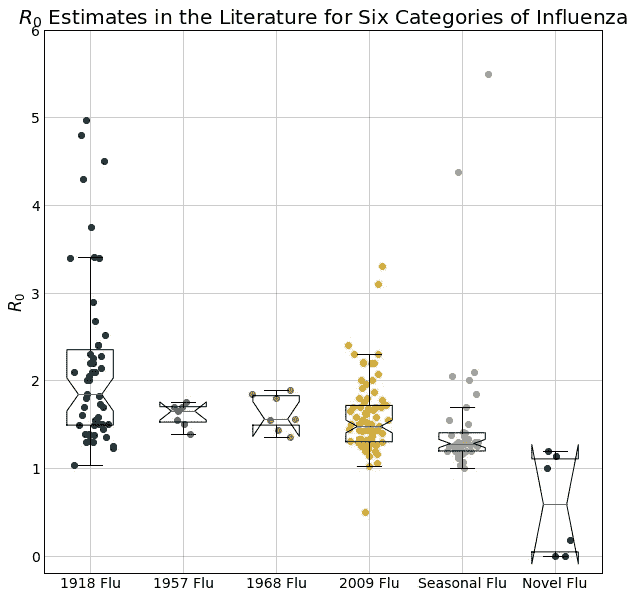
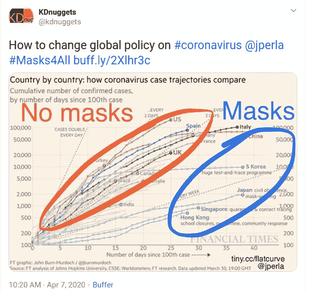

# 不确定性的疫情

> 原文：<https://towardsdatascience.com/the-pandemic-of-uncertainty-4e5cbf1e0f58?source=collection_archive---------60----------------------->

## 新冠肺炎和科学的朦胧进步

本·怀特在 [Unsplash](https://unsplash.com?utm_source=medium&utm_medium=referral) 上的照片

如果科学易于解读，或许在如何最好地处理新冠肺炎危机上，会有更多的共识。但是，唉，许多问题仍然存在。

例如:

我们过了顶峰了吗？我们[把曲线](/social-distancing-to-slow-the-coronavirus-768292f04296)弄平了吗？第二波感染会到来吗？这种疾病比预期的更致命吗？是不是少了？瑞典和日本是怎么回事？中国真的在复苏吗？

任何能够自信地回答这些问题以及更多问题的人要么是在撒谎，要么是被欺骗了，或许两者都有一点(我对*和*很有信心)。

我已经能听到反对的声音，“但是这项研究说…”或者“某某博士说…”或者(我个人最喜欢的)“科学说…”

问题是，目前对这种疾病及其复杂的人群效应知之甚少，无法确定任何事情——这就是为什么早期的模型是“错误的”,并继续被修订(就此而言，模型“错误”或“正确”意味着什么是另一个问题)。而且，科学的进步充满了*不确定性*；理论和假设被暂时搁置，直到有更好的理论将它们扫地出门，或者有更多的数据证实它们。

流行病学的社会科学方面进一步加剧了这一问题，流行病学是一个多学科领域，植根于医学、生物学、经济学和行为科学。这使得在过程的早期得出确定的结论特别具有挑战性，因为人类的决策会影响任何模型的结果，而这些决策无法被精确地建模或预测。这往往会导致模型对其潜在的假设和选择特别敏感。

让我们看一个当前的例子，看看普遍存在的 R0(“R-零”)估计。这个被广泛讨论的数值是一种疾病传播速度的量度。根据经典文本( [Anderson 和 May](https://amzn.to/2YfyOTG) )，“R0 更精确地定义为当一个受感染的个体被引入一个所有人都易感的宿主群体时产生的二次感染的平均数量。”

以季节性流感为例，它的中值 R0 值约为 1.3，这意味着每个感染该疾病的人平均会感染 1.3 人。较高的 R0 值意味着较高的感染率，大于 1 的值通常会导致疫情，而小于 1 的值意味着疾病不会足够快地增殖，最终会灭绝。这看起来很简单，但事实远非如此。

新冠肺炎或任何其他疾病的 R0 不是一个常数，也不是特定病毒或疾病的严格函数。换句话说，流感*可能*具有较低的 R0(在一些社会中，几乎肯定是这样)，或者它*可能*具有较高的 R0。它取决于疾病的性质以及人类对疾病的行为和态度。

例如，如果对着自己的手打喷嚏、握手、从不洗手在文化上是可以接受的，所有这些都发生在一个拥挤在一个小岛上的数千万人口的城市中，那么这个社会中流感的 R0 可能远远高于 1.3。另一方面，如果文化不鼓励亲密的身体接触，期望生病时戴口罩，手要定期消毒，在一个格陵兰人口密度的社会，我们可以期望一个低得多的 R0。此外，这种价值观会随着态度和惯例的改变而改变。

当我在媒体上看到这个值的讨论时，通常给出一个单一的数字。在许多研究中，也提供了一个单一的数字(较好的产生范围和估计值)，好像这是来自高层的*R0，这可能导致一种印象，即这纯粹是一个由疾病发现和提供的值。如果人们对个人卫生、与他人的互动、口罩等方面的态度确实发生了改变——就像他们在新冠肺炎的情况中明显看到的那样，那么 R0 也有望发生改变。会有多大变化？这也不好说，这给一个已经很复杂的模型增加了另一个维度的不确定性。因为我们不知道，我们将不得不做一些假设。*

*最好的作者会为这些假设辩护。但通常，你会经常看到作者遵从其他作者的意见，并引入他们的假设，假设这些其他作者已经充分捍卫了他们自己的假设。毕竟有出版的压力，尤其是在这种情况下。*

*我不想让人觉得我在诋毁学者和研究人员。依靠该领域的其他专家往往是最好的方法，但在有些情况下，一个未经检验或掩盖的假设可能会导致整个领域误入歧途(只要看看描述股票价格的布朗运动假设，就知道过去 20 年对金融和纳税人造成的伤害)。*

*情况变得更糟。*

*这个世界很乱。即使我们可以在群体水平上进行优秀的、可控的实验(我们真的做不到)，也很难从噪音中分离出信号。这可能导致研究人员在试图研究同样复杂的现象时得出截然不同的结论。*

*让我们坚持 R0 的估计，但看看以前的一些流感爆发，我们有更多的文献可以借鉴。*

*[Biggerstaff 等人【2014】](https://bmcinfectdis.biomedcentral.com/articles/10.1186/1471-2334-14-480)撰写了一篇文章，研究了估计四次主要大流行(1918 年西班牙流感、1957 年 H2N2、1968 年 H3N2 和 2009 年 H1N1 猪流感)以及季节性流感和新爆发病例的 R0 值的文献。他们从 1950 年至 2013 年的 111 篇同行评议的学术论文中报告了每种流感类型的 R0 估计值。我总结了以下一些发现。*

**

*R0 估计来自 6 个流感类别的 111 篇论文。数据来自 [Biggerstaff 等人【2014】](https://bmcinfectdis.biomedcentral.com/articles/10.1186/1471-2334-14-480)*

*你可以看到，对于其中的大多数，有一个广泛的数值和一个更大的传播范围，特别是对于有更多研究的疾病。视觉上，我们可以用一个方框图来看看这是什么样子。*

**

*首先出现的是——季节性流感有几项 R0 值超过 15 的研究！这真是高得吓人。这些估计碰巧来自对 1977-78 年流感季节英国一所寄宿学校的研究。这些数值可能如此之高，是因为学校距离较近，缺乏预先存在的免疫力，或者仅仅是因为研究中的样本量相对较小(763 名学生)，使得这些点与其他疫情不同。让我们把注意力集中在其他方面:*

**

*这里值得注意的是，即使有异常值，我们也可以对季节性流感的预期 R0 值相对有信心，因为我们有 47 项研究的数据可以追溯到 19 世纪 90 年代！所以我们大致知道流感是如何表现的。这是否意味着我们将能够预测 2030 年摩尔多瓦的流感死亡和感染人数？*

*不一定。2030 年摩尔多瓦的情况是否更类似于 R0 接近 1、2 或更高的情况？在建立一个模型时，需要考虑很多情况，很难用一个数字来概括。*

*当处理这些类型的动力系统时，这就产生了一些固有的不确定性。参数的选择可以改变一切。*

*一个小组的模型预测的感染人数可能是下一个小组的 10 倍，而且两者都建立在合理的假设上。基于这些值，您甚至可以在一篇论文中看到很大的范围。*

*以《帝国报》为例，该报预测，如果不采取行动，未来两年美国将有 220 万人死亡。它提供了基于 R0 值 2–2.6 的英国敏感性分析。根据 R0 的选择，死亡可能会增加约 2.5 倍！*

*以免你认为流行病学模型总是偏高，[《柳叶刀》](https://www.thelancet.com/journals/langlo/article/PIIS2214-109X(15)00160-6/fulltext)*2015 年的一篇文章讨论了一项对南非 10 个艾滋病毒模型的元研究。所有这些都低估了艾滋病毒的上升，作者问道，“如果我们在南非这个有着丰富数据的环境中得到如此错误的模型预测，那里有十个领先的艾滋病毒流行病学建模小组专注于他们的注意力，我们在哪里可以充满信心地得到正确的预测？”**

**坦率地说，我们对当前疫情的最佳模型是不可靠的。在英国采取行动后，Neil Ferguson(帝国研究的作者)修改了他的模型，预测了 2 万人死于疫情。截至发稿时，英国的总死亡人数不到 3 万。即使是世界上最顶尖的专家也不能确定会发生什么——不确定性太多了。**

**你能做些什么呢？**

**未来总是未知的，但我们无论如何都要过好自己的生活。在所有情况下，权衡缓解的风险和成本是谨慎的，但当风险很高时更是如此。**

**值得庆幸的是，风险通常是不对称的，换句话说，相对于不利因素，预防是廉价的。诸如戴口罩、洗手等缓解措施易于实施，并且相对于成本而言具有很大的益处。**

**这些简单的步骤通常被认为是日本、韩国、香港和新加坡相对成功应对这种疾病的原因。**

****

**[推特:@kdnuggets](https://twitter.com/kdnuggets/status/1247544679601786882)**

**精明地使用这些模型并不是作为一个水晶球，而是作为一种工具来看到不利之处，并相应地减轻自己的风险。有这么多的不确定性，科学和专家们也无能为力。**