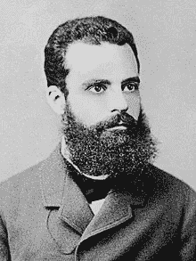
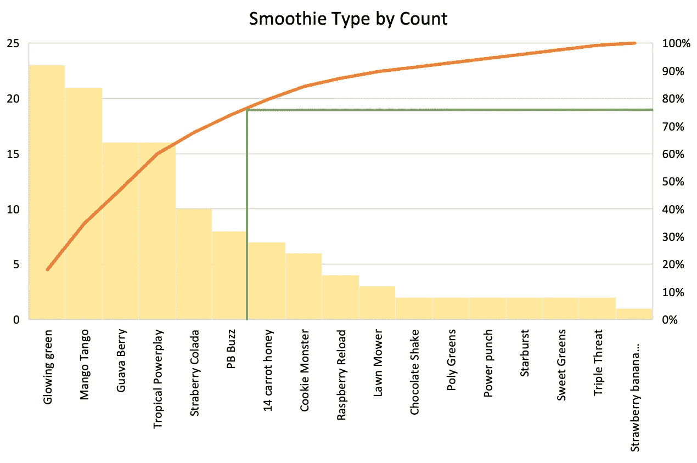
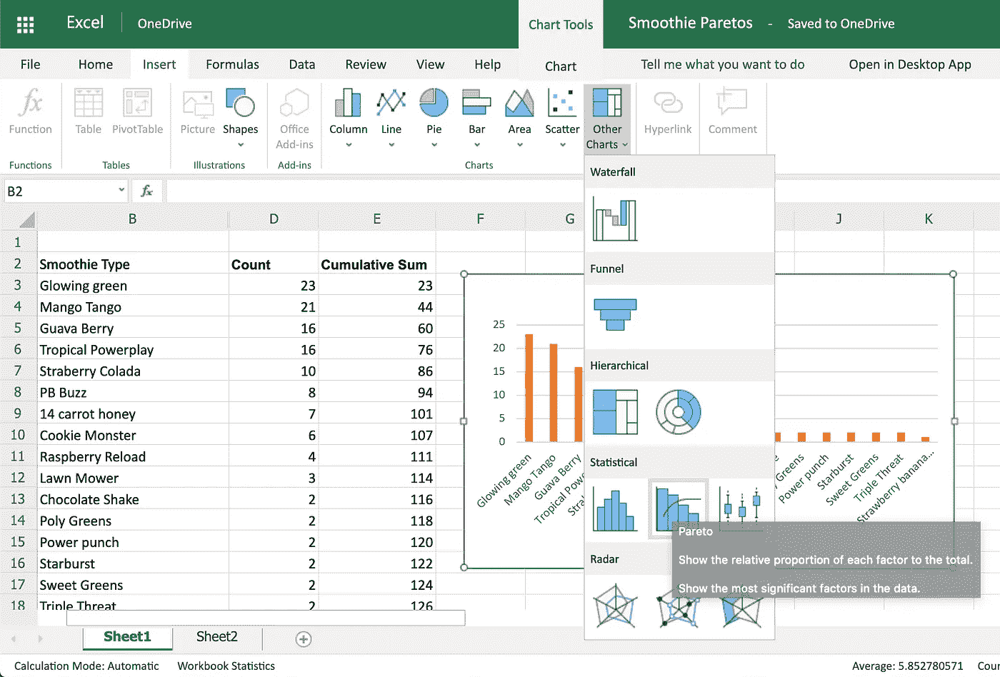

# 帕累托法则是世界第八大奇迹

> 原文：<https://towardsdatascience.com/the-pareto-rule-is-the-8th-wonder-of-the-world-39f8789ee162?source=collection_archive---------61----------------------->

## 为什么 80/20 是(数据分析和时间管理的)黄金法则

我先从一个故事开始这篇文章。

[德乐思教授](https://unsplash.com/@andreasdress?utm_source=medium&utm_medium=referral)在 [Unsplash](https://unsplash.com?utm_source=medium&utm_medium=referral) 上拍照

去年夏天，我在特斯拉的生产优化部门实习。作为一名有抱负的工业工程师，我的任务是“走出去，改善事物。”说起来容易做起来难。

我工作的 Gigafactory 的一个区域有一台巨大的机器，它将电池穿梭于缓冲区，然后进入电池组制造流程的下一步。这台复杂的机器出现了很多问题，导致红灯闪烁和停产。

在和工程师开了几次会，查询了一些数据之后，我了解到了帕累托图的真正价值。这使我们能够专注于最关键的修复(每周)，从而在生产中获得最大收益。这对于一个不断努力提高产量、降低总成本的工厂来说至关重要。

…那么什么是帕累托图呢？很高兴你问了。

## 历史

维尔弗雷多·帕累托(来自[维基百科](https://en.wikipedia.org/wiki/Vilfredo_Pareto)

为什么叫帕累托？它是以意大利经济学家维尔弗雷多·帕累托的名字命名的——多好的名字啊——因为他在 1896 年首次发现了“80/20 效应”。帕累托图是由管理顾问约瑟夫·M·朱兰推广的。巨然是质量和质量管理领域的先驱。

帕累托法则也被称为“关键少数法则”下一节将帮助您理解原因。

## 基础知识

帕累托图被认为是六适马工具，因为它有助于减少过程中的可变性/缺陷。这是阐明(并有希望修复)问题主要原因的有效方法。

主要前提是:80%的结果来自大约 20%的原因。这种 80/20 的比例可以在很多商业场景中找到。

例如，下图是我在质量工程课上的一个学校项目。我们观察了一家浪费材料的校园冰沙店(即成品冰沙放不进杯子)。由于有许多不同的配方，我们没有时间去分析和完善每一个以减少浪费。

所以，我们使用了 80/20 法则，创建了一个帕累托图！如果您对我们创建下面的图表所采取的步骤感兴趣，我已经将它们包含在本文末尾的附录部分中。

在一家真正的奶昔店订购的奶昔的帕累托图(由我拍摄)

右侧 y 轴上方的绿线表示思慕雪计数的累计百分比。它下降到 x 轴，指示构成该累积百分比的思慕雪(即垂直线左侧的条形)。因为在现实生活中没有什么是完美的，所以我尽可能接近 80%，也就是 77%左右。然后，查看 x 轴上的冰沙数量，构成这 77%废物的冰沙数量是 6。6/17 =冰沙总数的 35%。所以，这个分析显示更像一个 77/35 的比率，但它仍然是有用的。

6 思慕雪配方比所有这些配方更容易优化。这样做，我们就有可能消除*商店近 80%的成品浪费*(假设由于缺乏标准测量工具和其他流程变化，每种思慕雪配方都产生了相同的浪费)。

帕累托图让公司成为数据驱动的*和*高效公司。很棒，是吧？

## 应用程序

所以我提到了电动汽车制造和思慕雪制作的应用。帕累托法则的其他更常见的应用是什么？

*   经济学:帕累托观察到意大利 80%的土地被 20%的人口所拥有。
*   计算机科学:微软发现，通过修复报告最多的前 20%的错误，他们可以减少 80%的相关错误和崩溃。[【1】](https://en.wikipedia.org/wiki/Pareto_principle)
*   商业销售:一家公司 80%的销售额来自 20%的客户。[【2】](https://www.investopedia.com/ask/answers/050115/what-are-some-reallife-examples-8020-rule-pareto-principle-practice.asp)
*   项目:一般来说，“前 20%的努力实现了 80%的价值。”[【3】](https://management.simplicable.com/management/new/examples-of-the-pareto-principle)

这个列表当然可以继续下去，如果你仔细想想，这真的是大自然的一个惊人的壮举(因此本文的标题)。

## 结论

现在是时候在你自己的工作场所或个人生活中利用这些强大而简单的图表了。80/20 规则对于任何公司来说都是一个很棒的管理工具，它还可以改进数据分析项目的业务案例或业务应用程序。

由 [Austin Distel](https://unsplash.com/@austindistel?utm_source=medium&utm_medium=referral) 在 [Unsplash](https://unsplash.com?utm_source=medium&utm_medium=referral) 上拍摄的照片

## 附录

在 Excel 中创建帕累托图的步骤:

1.  按降序对数据进行排序。

2.为降序数据创建累积百分比列(公式为该行的累积总和/第一列的总和)。

3.用降序数据列创建条形图。

4.右键单击图表并选择“更改系列图表类型”从菜单中选择“组合”

5.对于包含降序计数的系列(在我的示例中为思慕雪计数)，选择图表类型“簇状柱形图”对于累计百分比列，选择图表类型“折线图”最后，选中折线图旁边的“副轴”框。

如果您有最新版本的 Excel，您可以简单地突出显示您的降序计数列，然后单击“统计”图表菜单下的帕累托图(见下面的截图)。

新的排列图 Excel 选项(我摄)