# 从最大似然估计到隐马尔可夫模型

> 原文：<https://towardsdatascience.com/the-path-from-maximum-likelihood-estimation-to-hidden-markov-models-61aba5ba901c?source=collection_archive---------15----------------------->

如果你认为你很了解一个话题，试着解释给别人听。如果你能解释清楚，那么你就真正理解了这个主题。

因此，在这篇文章中，我将尽可能全面地解释什么是隐马尔可夫模型。为此，我还需要描述一些主题，如最大似然估计(MLE)、马尔可夫链、向前向后算法和 Baum-Welch 算法。

在深入研究之前，我们需要问自己的第一个问题是:**学习分布有帮助吗？**当然！以朴素贝叶斯为例。

然而，朴素贝叶斯处于监督学习的保护伞之下。**我们能在无监督学习上做些什么？**

# **生成模型:**

假设分布 *D* 具有某种已知的形式。

分布的一些参数是未知的，我们的**目标**是**根据一些样本 *S~D* 找到这些参数**

应用生成模型可以更好地分类、推断(参数可以告诉我们关于数据的故事)、隐马尔可夫模型等。

*例:* 我们来考虑一下伯努利分布: *θ ∈ [0，1]，D _θ=伯努利(θ)。* 现在我们来考虑一个样本 *S=(x_1，…，x_n)* **如何从 S 估计θ？我们稍后会回答这个问题。**

# **最大似然估计:**

最大可能性已经在过去的许多帖子中讨论过了。即便如此，为了这篇文章的完整性，我将提供(我认为是)一个相对简单的解释。

**最大似然估计** (MLE)是一种基于观测数据集估计分布参数的方法。

首先，我们需要定义这个问题:

*   分布 *D_θ*
*   样本 *S=(x_1，…，x_n)*
*   参数空间——我们分布的参数可能值的集合
    例 1:伯努利分布*θ=【0，1】*
    例 2:高斯分布*θ=****ℝ⋅ℝ+***

由于实际的θ未知，我们希望使用 *S* 来估算θ。换句话说，我们想要检查对于每个*θ’∈θ，从 *D_θ* 生成 *S* 的概率。*

**MLE 背后的直觉如下:**
选择*θ”*，这将使数据集 *S* 相对于分布 *D_θ* 最不令人惊讶。换句话说，目标是找到尽可能接近真实分布参数 *θ* 的*θ】*。

让我们用公式表示离散密度的定义:

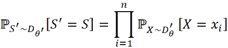

因为使用对数总和要容易得多，所以让我们对等式应用 log:

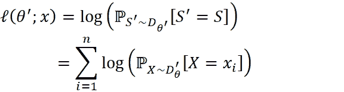

**θ'相对于 S 的对数似然**

使用该表达式，我们可以将**最大似然估计值**定义为使对数似然最大化的θ*:

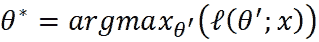

***回到我们的伯努利例子:***

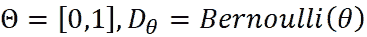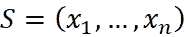

计算可能性:

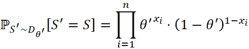

计算对数似然性:

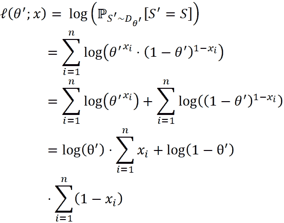

现在，为了找到 MLE，我们将对表达式求微分，并与零进行比较:

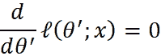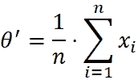

意思是——我们的 MLE 是 S 中所有点的平均值，如果你仔细想想，这是有意义的。

现在我们知道什么是最大似然，我们甚至看到了如何计算它的例子。

然而，由于不是所有的分布都有封闭形式的解，我们需要一种方法来有效地估计最大似然估计。

这可以通过**期望最大化(EM)** 算法有效地完成。该算法使用迭代过程在具有潜在变量的统计模型中执行最大似然估计。

# 马尔可夫链:

让我们定义一个有限马尔可夫链:

给定 n 个状态:

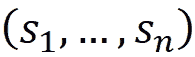

其中 n 是有限的，并且初始起始状态 *S_0* (固定的或从初始分布中提取的)，我们可以将转换定义为从当前状态 *S_t* 移动到下一个状态 *S_(t+1)* 。

马尔可夫链中的转移必须满足马尔可夫性质:

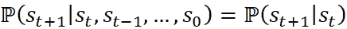

换句话说，马尔可夫链是描述序列的随机模型，其中对于 1≤t≤n， *S_t* 的概率仅取决于 *S_(t-1)的概率*

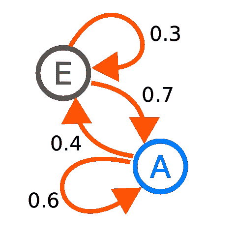

**来源:**[https://en . Wikipedia . org/wiki/Markov _ chain #/media/File:Markov Kate _ 01 . SVG](https://en.wikipedia.org/wiki/Markov_chain#/media/File:Markovkate_01.svg)

# **隐马尔可夫模型:**

现在我们知道什么是马尔可夫链，我们可以定义隐马尔可夫模型。

隐马尔可夫模型(HMM)是一种模型，其中除了马尔可夫状态序列之外，我们还有一个输出序列。

HMM 可以用以下公式描述:

*   **状态数 *m* 状态数**
*   初始状态分布:

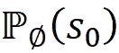

*   转换模型(记住马尔可夫属性):

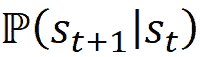

*   输出(排放)模型:

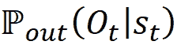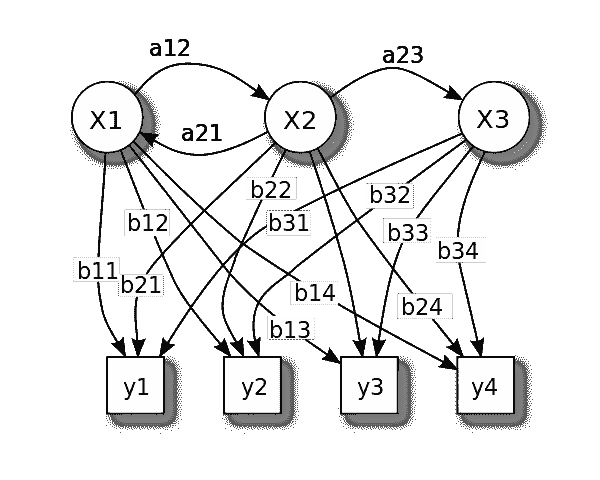

**来源:**[https://en . Wikipedia . org/wiki/Hidden _ Markov _ model #/media/File:hiddenmarkovmodel . SVG](https://en.wikipedia.org/wiki/Hidden_Markov_model#/media/File:HiddenMarkovModel.svg)

HMM 是一种潜在变量模型，我们只能观察模型的输出:

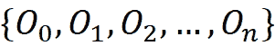

而状态序列对我们是“隐藏”的。

我们将解决该领域的两个基本问题:

1.  学习—如何学习 HMM 模型
2.  评估-如何评估输出序列相对于给定模型的概率

# **评价:**

我们的目标是评估一个已知序列的概率:

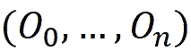

关于经过训练的 HMM 模型。

使用初始状态分布、转移模型和输出模型来描述 HMM 模型。

*先试试* —我们可以用一种天真的方式，通过把所有隐藏状态序列的概率相加来评估概率。

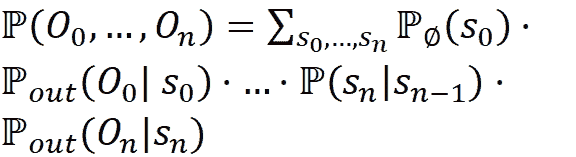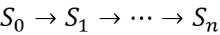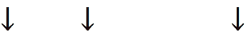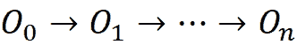

这将花费我们成倍的时间。不太好。但是你不要担心，我们可以利用模型的结构在多项式时间内计算出这个概率！

*第二次尝试* —

## 向前向后算法

该算法利用动态规划的思想在多项式时间内解决评价问题。从它的名字我们可以假设它以一种向前向后的方式(分而治之)在序列上工作。

**远期概率:**

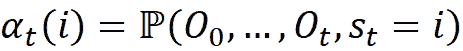

这意味着 *α_t(i)* 表示我们观察到序列 *O_0，…，O_t* 的概率，并且在 *t* 位置，隐藏状态是 *s_t=i.*

现在，通过将 *α_t(i)除以所有α_t(j ),我们得到:*

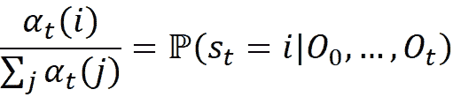

我们可以使用 HMM 概率以如下方式定义 *α_t(i)* :

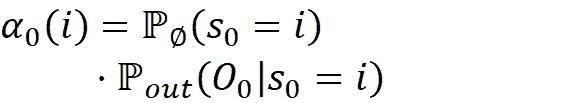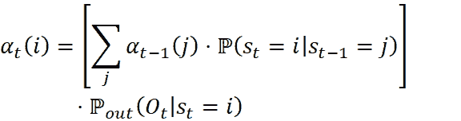

**后向概率:**

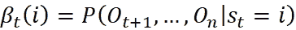

也就是说给定当前状态，从状态 I 得到未来事件 O_(t+1)，…，O_n 的概率是多少。

我们可以使用 HMM 概率以如下方式定义β_t(i ):

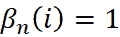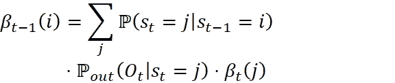

使用αt，βt，我们现在可以评估后验概率:

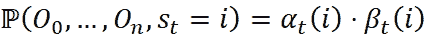

现在，我们需要计算的是

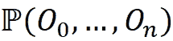

对任意的 *t=0，…，n* 在时间 *t* 对所有可能的状态求和

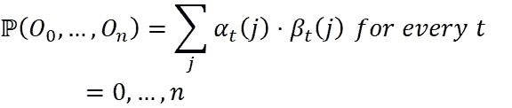

前向-后向算法求解 O(n⋅ m 中的评估，其中 *m* 是隐藏状态的数量。

# **学习:**

现在我们知道了如何基于给定的模型来评估序列的概率，接下来我们将学习如何使用输出序列来估计 HMM 概率。

换句话说，我们希望估计:初始概率，转移概率和输出概率。

你可能会问自己，为什么我们不能用最大似然估计？这个问题问得好，但是只有一个问题 HMM 的找 MLE 是 NP 难的！

但是不用担心，我们会使用 Baum-Welch 算法，这是我们之前提到的期望最大化(EM)算法的一个特例。

鲍姆-韦尔奇算法的一般思想如下:

当观察一个输出序列 ***S*** 时，假设我们有 HMM 概率，我们可以估计隐藏状态。另一方面，给定隐藏状态，我们可以估计 HMM 概率。我们将在两者之间交替进行。

在深入研究该算法之前，我们先定义以下内容:

从前向后算法中回忆αt，βt。

让我们定义两个新的概率γ_t(i)，ξ_t(i):

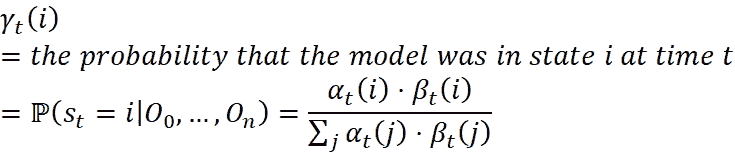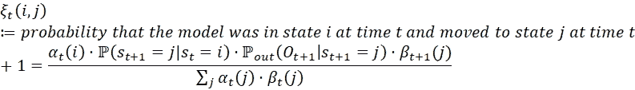

我们现在可以描述 Baum-Welch 算法的伪代码(对于离散情况):
给定 L 个序列的形式:

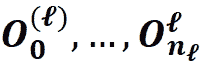

**重复直到收敛:**

1.  **E 步骤:**计算隐藏状态的后验概率。
    计算:γ_t(i)，ξ_t(i)对于所有序列，I，j，t=0，…，n_𝔩
2.  **M 步:**根据 E 步的后验概率计算 HMM 模型概率。

初始概率:

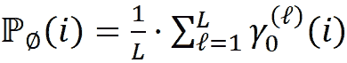

转移概率:

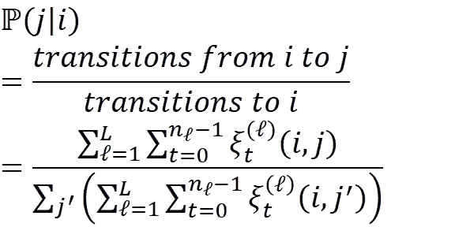

输出概率:

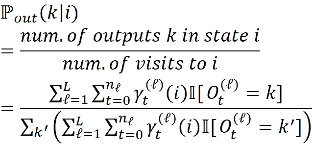

算法描述基于 https://www . cs . bgu . AC . il/~ inabd 191/wiki . files/lecture 20 _ 讲义. pdf

一直持续到收敛。

我们在这里没有讨论的一个话题是推理问题，我们如何根据观察序列找到最可能的隐藏状态序列。

# 总结:

*   ***我们学习了什么是最大似然估计，以及如何在特定情况下计算它***

*   *****我们简单介绍了一下马尔可夫链*****
*   *****我们学习了如何定义 HMM 模型，如何使用 Baum-Welch 算法估计模型参数，以及如何评估给定模型下输出序列的概率*****

**现在你(希望)知道什么是最大似然估计，如何计算，当计算最大似然估计是 NP-hard 时你能做什么，如何训练 HMM 模型，以及如何基于给定的模型评估输出序列。**