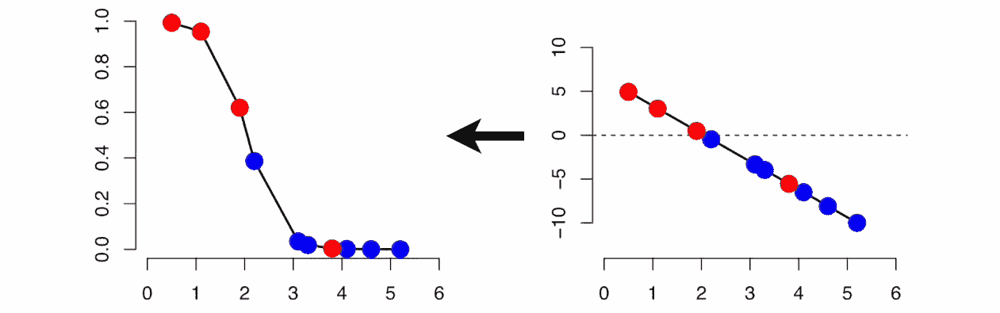

# 使用逻辑回归进行分类的完美方法

> 原文：<https://towardsdatascience.com/the-perfect-recipe-for-classification-using-logistic-regression-f8648e267592?source=collection_archive---------3----------------------->


图片由来自 [Pixabay](https://pixabay.com/?utm_source=link-attribution&utm_medium=referral&utm_campaign=image&utm_content=2964231) 的[斯蒂芬·凯勒](https://pixabay.com/users/kellepics-4893063/?utm_source=link-attribution&utm_medium=referral&utm_campaign=image&utm_content=2964231)拍摄

## 用逻辑回归解决分类问题

监督学习是机器学习的重要组成部分。当要预测的变量是分类变量时，使用分类技术。分类问题的一个常见例子是试图在三种不同的种类中对鸢尾花进行分类。

Logistic 回归是机器学习从统计学领域借用的一种分类技术。逻辑回归是一种用于分析数据集的统计方法，其中有一个或多个决定结果的独立变量。使用逻辑回归的目的是找到描述因变量和自变量之间关系的最佳拟合模型。

在这篇文章中，我们将首先从理论上探讨什么是逻辑回归，然后我们将建立我们的第一个分类模型。但是在开始写这篇文章之前，我建议你看一下我的[上一篇文章](/getting-started-with-the-basics-of-machine-learning-35954a94e961)，借助机器学习，了解一下分类问题到底是什么

# **为什么不是线性回归:**

考虑一个场景，其中我们需要对特定类型的癌症是否是恶性的进行分类。如果我们对这个问题使用线性回归，则需要设置一个阈值，基于该阈值可以进行分类，因为线性回归返回连续值。



图片来自 [Gfycat](http://gfycat.com)

但是在实际类别是恶性的情况下，预测的连续值是 0.4。假设阈值为 0.5，数据点将被分类为非恶性，这可能导致严重的后果。因此，可以推断线性回归不适用于分类问题，因为它是无界的，并且预测值是连续的，而不是概率性的。

将预测概率转换为类别标签的决定由称为**阈值**的参数决定。高于该阈值的值表示一个类别，而低于该阈值的值表示另一个类别。


图片来自 [Freepik](http://freepik.com)

不仅如此，线性回归对不平衡数据也非常敏感，因为它试图通过最小化误差(直线和实际值之间的距离)来拟合直线。结果可以推断，线性回归更适合于回归问题，而不适合于分类问题，这使得逻辑回归成为可能。

# **逻辑回归:**

逻辑回归是机器学习中使用的一种分类技术。它使用逻辑函数来模拟因变量。因变量本质上是二分法的，即可能只有两种可能的类别(例如:癌症是恶性的还是非恶性的)。因此，在处理二进制数据时使用这种技术。


图片来自 [Gfycat](http://gfycat.com)

## **逻辑回归的类型:**

尽管通常用于预测二元目标变量，但逻辑回归可以扩展并进一步分类为三种不同类型，如下所述:

1.  **二项式**:目标变量只能有两种可能的类型。**例如**。:预测邮件是否为垃圾邮件。
2.  **多项式**:目标变量有三种或三种以上可能类型，可能没有任何数量意义。**例如**。:预测疾病。
3.  **序数**:目标变量有有序的类别。**例如**。:网络系列评分从 1 到 5。

在逻辑回归中，为了将预测值映射到概率，使用了 sigmoid 函数。该函数将任何实数值映射为 0 到 1 之间的另一个值。这个函数在每一点都有一个非负导数，并且只有一个拐点。


图片来自 [Freepik](https://www.freepik.com/free-photos-vectors/computer)

## **成本函数**

成本函数是一个数学公式，用于量化预测值和期望值之间的误差。简而言之，成本函数是衡量模型在估计 x 和 y 之间关系的能力方面有多错误的标准。成本函数返回的值被称为**成本**或**损失**或简称为**误差**。对于逻辑回归，成本函数由以下等式给出:


这个负函数是因为我们在训练的时候，需要通过最小化损失函数来最大化概率。假设样本是从完全独立的分布中抽取的，降低成本将增加最大似然。

现在你对什么是逻辑回归有了一个概念，我们现在将建立我们自己的逻辑回归模型。这个分类模型的代码和其他资源可以在[这里](https://github.com/ashwinraj-in/MachineLearningRecipes/blob/master/LogisticRegression.ipynb)找到。

## **第一步:导入所需的库**

我们的第一步是导入构建模型所需的库。没有必要在一个地方导入所有的库。首先，我们将导入**熊猫**和 **Numpy** 库。


图片来自 [Freepik](https://www.freepik.com/vectors/home)

一旦导入了这些库，我们的下一步将是获取数据集并将数据加载到我们的笔记本中。我们将在这个例子中使用的数据集是关于心脏病的。

```
*#Import the Libraries and read the data into a Pandas DataFrame*import pandas as pd
import numpy as npdf = pd.read_csv("framingham_heart_disease.csv")
df.head()
```

熊猫图书馆用于访问数据。 **read_csv** 函数输入格式的数据。csv 进入熊猫数据框。

**head()** 函数用于显示数据帧的前几条记录。默认情况下，该函数显示前五条记录，但是可以通过输入所需的值来显示任意数量的记录。

## **步骤 2:清理数据集**

数据清理是通过识别不完整、不正确或不相关的数据部分，然后替换、修改或删除粗略数据，来检测和纠正表或数据库中损坏或不准确的记录的过程。


图片来自 [Freepik](http://freepik.com)

可以使用 **isnull** 函数检测数据集的缺失值。这些缺少值的记录要么被删除，要么用记录的平均值填充。然而，输入近似值可能会在模型中引入**方差**和/或**偏差**。

**偏差**误差是学习算法中错误假设产生的误差。高偏差会导致算法错过特征和目标输出之间的相关关系，从而导致**欠拟合**。

```
*#Handling missing data*series = pd.isnull(df['cigsPerDay'])
```

另一方面，**方差**是由于模型对训练集中的小波动的敏感性而引起的误差。高方差会导致算法对训练数据中的这些波动进行建模，从而导致模型的**过拟合**。


图片作者[作者](http://ashwinraj-in.medium.com)

在本例中，我们还注意到数据集的某些特征(如教育)在决定输出时不起作用。此类特征应在构建模型前删除。

```
#*Dropping unwanted columns*data = df.drop(['currentSmoker','education'], axis = 'columns')
cigs = data['cigsPerDay']cig = cigs.mean()
integer_value = math.floor(cig)
cigs.fillna(integer_value, inplace = True)
data.dropna( axis = 0, inplace = True)
```

像 CigsPerDay 这样的某些特征已经表明这个人是吸烟者，因此 CurrentSmoker 列实际上是没有用的。

## **步骤 3:分析数据集**

既然我们的数据集是干净的，没有不规则性，下一步将为心脏病高风险人群和心脏病低风险人群创建两个独立的数据框架。

这一步也可以称为**特征工程**。另一个重要的步骤是可视化数据，因为它非常有助于确定选择哪些特征可以产生最佳结果..

```
*#Analyzing The Dataset*Heart_Attack = data[data.TenYearCHD == 1]
No_Heart_Attack = data[data.TenYearCHD == 0]final = data.drop(['diaBP','BMI','heartRate'], axis = 'columns')
```

特征工程的另一个重要步骤是**缩放数据**，因为逻辑回归对数据是否被缩放很敏感。如果数据没有缩放，模型可能会认为 3000 克大于 5 千克，这可能会导致错误的预测。


图片来自 [Freepik](https://www.google.com/url?sa=i&url=https%3A%2F%2Fwww.freepik.es%2Fvector-premium%2Filustracion-plana-concepto-analisis-personas_9129785.htm&psig=AOvVaw07h75tnxakMHNjTI66uSWc&ust=1605153658370000&source=images&cd=vfe&ved=0CAMQjB1qFwoTCOCFp8fN-ewCFQAAAAAdAAAAABAh)

在本例中，我还删除了**【diaBP】【身体质量指数】和【心率】的值，因为它们与十年一次的值相似。**

## ****步骤 4:准备模型****

**既然我们已经清理了数据并选择了有效的特征，我们就可以根据我们的训练数据来拟合模型了。为此，我们首先需要将数据集分成具有给定随机状态**的训练和测试数据，以便每次执行程序时输出保持不变。在这个例子中，随机状态是 99。****

```
*#Preparing the model*from sklearn.model_selection import train_test_split
X_train, X_test, y_train, y_test = train_test_split(X,y, test_size = 0.20, random_state = 99)from sklearn.linear_model import LogisticRegression
model = LogisticRegression()model.fit(X_train, y_train)
model.score(X_test,y_test)
```

**完成后，从 **sklearn.linear_model** 导入 LogisticRegression，并根据训练数据拟合回归方程。可以通过计算**模型得分**来评估模型的性能。**

**在本例中，该模型的准确率为 85.6%。**混淆矩阵**也是总结预测模型性能的好技术。其中有两种可能的预测类别——阳性和阴性。**

****

**图片由[作者](http://ashwinraj-in.medium.com)**

**混淆矩阵可以进一步用于确定各种重要的度量，包括**准确度**、 **ROC 得分**、**精确度**、 **F 得分**等。**

# ****逻辑回归的优势****

**逻辑回归是解决分类问题最有效的技术之一。使用逻辑回归的一些优势如下所述。**

1.  **逻辑回归更容易实现、解释，并且训练起来非常有效。它对未知记录的分类速度非常快。**
2.  **当数据集是线性可分的时，它表现得很好。**
3.  **它可以将模型系数解释为特征重要性的指标。**

****

**图片由 [Gfycat](http://gfycat.com) 提供**

# ****Logistic 回归的缺点****

**尽管广泛使用，逻辑回归也有一些限制，如下所述:**

1.  **它构建了线性边界。逻辑回归需要独立变量与对数概率线性相关。**
2.  **逻辑回归的主要限制是因变量和自变量之间的线性假设。**
3.  **更强大和紧凑的算法，如神经网络，可以轻松胜过这种算法。**

# **总结你学到的东西**

**为了总结我们在本文中学到的东西，首先我们讨论了什么是逻辑回归，以及如何用它来建立分类模型。然后，我们讨论了各种不同类型的逻辑回归、其成本函数和用于评估分类模型性能的指标。**

**然后，我们动手体验了该算法，构建了我们自己的分类模型。为了支持我们的学习，我们还讨论了这种技术的优点和缺点。**

**至此，我们已经到了这篇文章的结尾。我希望这篇文章能够帮助你对什么是逻辑回归以及何时在你的机器学习之旅中使用它有一个坚实的理解。如果你有任何问题，或者如果你认为我犯了任何错误，请随时与我联系！您可以通过[电子邮件](http://rajashwin733@gmail.com)或 [LinkedIn](https://www.linkedin.com/in/rajashwin/) 与我联系。快乐学习！**