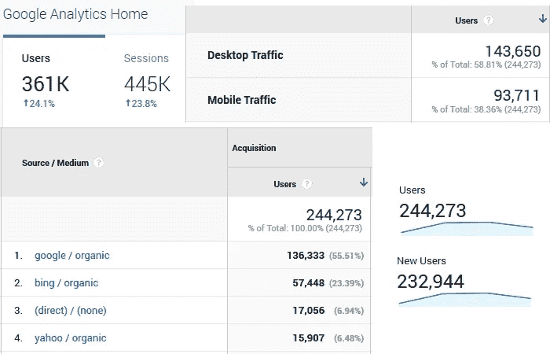
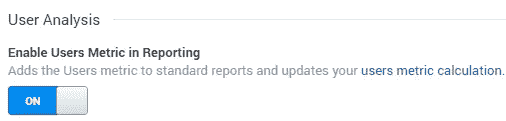
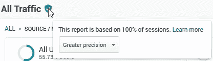
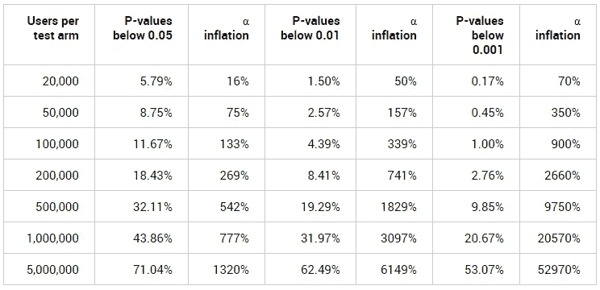
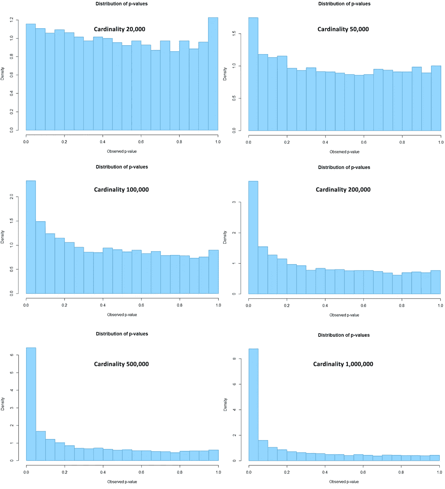
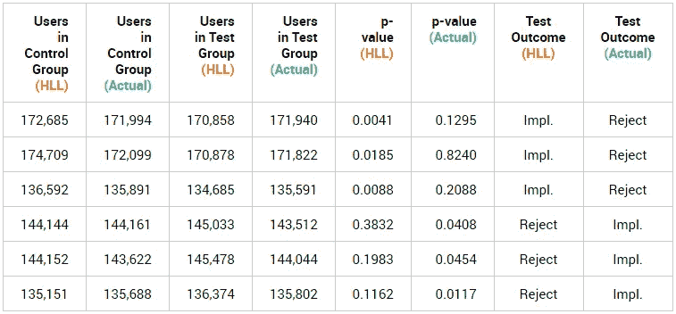
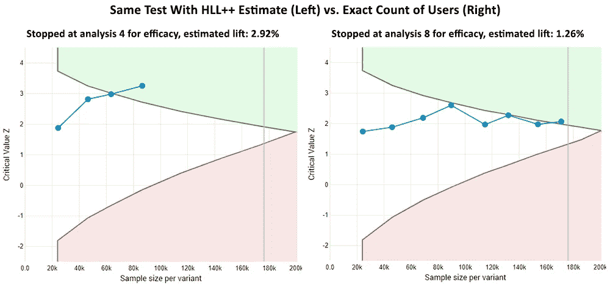
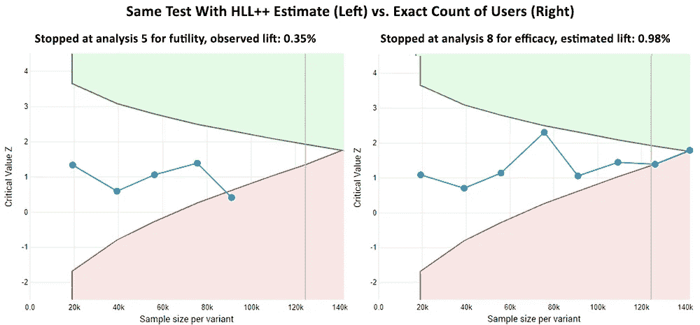
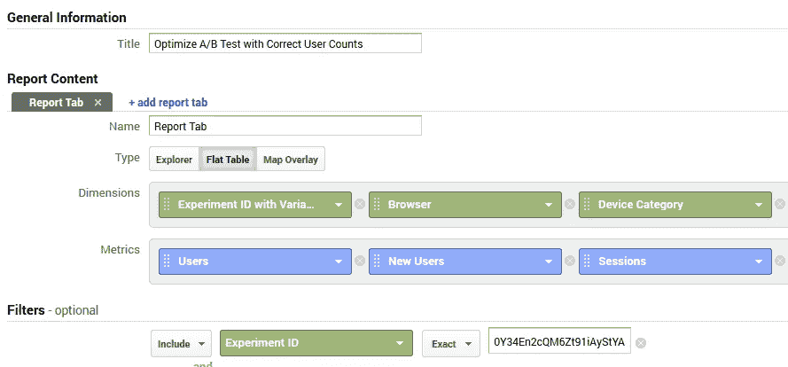

# 在 A/B 测试中使用 Google Analytics 用户计数的风险

> 原文：<https://towardsdatascience.com/the-perils-of-using-google-analytics-user-counts-in-a-b-testing-e50b5dfc5f6c?source=collection_archive---------51----------------------->

如今，许多分析师、营销人员、产品经理、UX 和 CRO 的专业人士都依赖 Google Analytics、Adobe Analytics 或类似工具提供的**用户计数**来执行各种统计分析。这种分析可能涉及统计假设检验和 A/B 检验的估计部分，也可能包括回归和预测模型(LTV、流失等)。).如果你是他们中的一员，**做好准备**，因为这篇文章将揭示一些关于这些用户数量的惊人“秘密”。

**我不会轻易说“秘密”。**尽管我有多年的谷歌分析经验，但我只是最近才意识到我在这里分享的是什么，所以我认为“秘密”是当之无愧的。当涉及到在 A/B 测试中使用 GA 用户数量时，GA 用户数量的真正本质的含义是巨大的。可能还有其他统计分析。哦，就我有限的理解，Adobe Analytics 的用户似乎也不能幸免。所以抓紧你们的帽子，让我们开始吧。

# 谷歌分析中显示的用户数量不是用户计数

对于越来越多的谷歌分析用户来说，上述情况是真实的。在所有各种谷歌分析报告中显示的用户数量**并不是在任何给定的时间范围内在网站上执行操作的用户数量**的精确计数。说得专业一点——他们*没有显示*GA 会话日志中存在的唯一 cookies 浏览器/GA 客户端 id 的数量。

相反，这些报告中显示的用户数量是对真实用户数量的**概率估计。**

*谷歌分析报告中报告的用户数量示例(图片由作者提供)*

这意味着显示的数字几乎不可避免地会偏离真实的计数一个可变的百分比。故意的。无论你做什么，如果某个开关被设置为开(见下文)，你就不能在谷歌分析界面或 API 中得到一个真实的计数。人们得到的都是近似值。

# 怎么会这样呢？

这一事实在官方文档中有所提及，该文档在某个时间点进行了更新，以反映 2017 年发生的变化:

> *2017 年初，Google Analytics 开始更新对用户和活跃用户指标的计算，以更高效地统计用户，具有高准确度和低错误率(通常低于 2%)。*
> 
> *“*如何根据用户指标识别用户”，分析帮助

属性设置屏幕中这种看似无害的切换是在以前的用户数量计算(精确计数)和使用近似值的新计算之间切换的方式:

*谷歌分析界面中的用户指标切换(图片由作者提供)*

默认情况下，新的谷歌分析属性的**开关是打开的(与文档所述相反)。这也是许多用户在过去几年中一直关注的事情，因为它在大多数分析报告中提供了更有用的(与其他选项-会话相比)用户指标。在各种谷歌分析属性中，用户计数处理的缓慢变化可能是几乎没有人注意到的原因，包括我自己，直到最近。**

以上也意味着:

# 没有抽样的报告可能包含估计值，而不是精确计数

在我看来，低于 100%抽样的报告是我期望在 GA 报告中看到概率估计而不是原始计数的唯一情况。当分析需要通过超过 500，000 个会话来生成临时报告时，会出现不到 100%的采样。预定义报告明显不受此限制。

*(图片作者)*

只要我看到绿色盾牌图标，我就确信我看到的数据包含精确的计数，因此准确到不受任何实施问题和通常的跟踪障碍影响的程度。

但是，现在只有当“在报告中启用用户指标”开关设置为关闭时，这种情况才成立。如果该属性已经手动或默认设置为 ON，则上述直觉变得不正确，因为**即使对 100%的会话进行采样，并且即使在预定义的报告中，用户数量也不是精确的计数。**

如下文所述，这具有重要的意义。但是首先，为了在报告中考虑用户指标，牺牲了多少准确性？

# 分析中显示的用户数量有多准确？

虽然文档指出，在用户分析打开的情况下，估计用户计数的错误率通常小于 2%，但通过了解更多有关 Google Analytics 所采用的算法，可以获得更准确的图像。

Analytics 360(以前的 Google Analytics Premium)是一个付费的分析版本，允许通过 Google BigQuery 访问原始数据。BigQuery 允许从原始命中数据中获得用户的准确计数，或者指示引擎使用基于 [HyperLogLog++算法](https://en.wikipedia.org/wiki/HyperLogLog)的概率估计来进行基数估计。使用 HyperLogLog++ (HLL++)估算提取的数字与 Analytics 用户界面中显示的用户数量相匹配。Patryk Buczyński 在[和](https://www.linkedin.com/pulse/oh-my-big-query-ga-numbers-different-patryk-buczy%C5%84ski/)[在](https://adswerve.com/blog/why-google-analytics-users-dont-match-bigquery-users/)描述了这一点。一位知情的谷歌员工在电子邮件中也向我证实了使用 HyperLogLog (HLL)的消息。

在 Patryk Buczyński 的文章中，Google Analytics 使用的精度参数估计为 14。这意味着，如 BigQuery 文档[所述，对于 68%的估计，它的准确度为 0.41%，对于 95%的估计，准确度为 0.81%，对于 99%的估计，准确度为 1.22%。这相当于用 16 位寄存器初始化的 HLL 的精度。](https://cloud.google.com/bigquery/docs/reference/standard-sql/hll_functions)

对于 99%的估计值，上述精度转化为高达 **2%相对误差的绝对值，这正是上述分析文档中规定的典型*误差率限值。***

为了形象化这个错误的大小，假设有一个网站在工作日每天接收 200，000 个用户，在周末接收 100，000 个用户。下面是对这些数字进行精确计数后的用户趋势的比较，以及这些数字与随机生成的相同真实计数的超对数估计值的比较:

*将精确的用户数与 HyperLogLog++中的基数估计值进行比较(图片由作者提供)*

对于 99%的估计值来说，最大 2%的误差可能听起来没什么大不了的，而且在上图中也看起来不像。事实证明，这种印象远非正确。

# 对 A/B 测试结果的准确性有哪些影响？

首先，简要回顾一下在线控制实验的成功标准。我在不止一个场合说过，大多数 A/B 测试应该基于基于用户的指标，理想的是每个用户的平均收入。基于用户而不是基于会话的指标意味着:

*   其结果在解释上不那么模糊，并且对决策有更大的影响。
*   与基于会话或页面浏览量的指标不同，基于用户的指标尽可能接近[独立观察](https://www.analytics-toolkit.com/glossary/independent-observation/)，这是许多统计测试中的一个关键假设，因此提高了统计的有效性。

基于会话的指标暂且不谈，让我们采用最简单的基于用户的指标:某种基于用户的转换率，比如基于用户的订阅率。

如果在一次测试中每支队伍的**用户少于 12，000 人**，那么统计数据将在很大程度上保持不受影响，因为 HyperLogLog++算法在这些水平上实现了极高的准确性。当超过每个测试组的用户数量时，情况就不同了，用户越多，情况就越糟。

以下是超级对数++基数估计对统计分析准确性的[影响的模拟结果](http://blog.analytics-toolkit.com/2020/the-effect-of-using-cardinality-estimates-like-hyperloglog-in-statistical-analyses/):

HyperLogLog++基数估计对统计分析影响的模拟结果*(图片由作者提供)*

**用户每测试臂** **P 值低于 0.05** **α膨胀** **P 值低于 0.01** **α膨胀** **P 值低于 0.001** **α膨胀**

如果没有来自 HyperLogLog 的影响，则“P 值低于 0.05”列中的所有数字应该为 5%或更低，“P 值低于 0.01”列中的所有数字应该为 1%或更低，“P 值低于 0.001”列中的所有值应该为 0.1%或更低。事实远非如此，而且随着样本量的增加，差异也会增加。

**α通货膨胀**栏显示了差异的百分比。也就是说，仅仅凭借使用谷歌分析 HLL++用户计数，他们的不确定性估计会偏离多少:如果阈值为 0.05，不确定性会增加 16%到 13 倍(相当于 95%的置信度)，如果阈值为 0.001，不确定性会增加 70%到 53 倍(相当于 99.9%的置信度)。

下图直观地展示了相同的数据。这六个图表是来自 10，000 个 [A/A 测试](https://www.analytics-toolkit.com/glossary/a-a-test/)的 [p 值](https://www.analytics-toolkit.com/glossary/p-value/)分布。如果一切正常，它们应该都包含接近均匀分布的图。相反，请注意随着每臂样本量(基数)的增加，分布变得多么偏斜:

*来自 HLL++ A/A 测试的比例 p 值的绝对差异(图片由作者提供)*

尽管 2%的相对误差看似无害的 99%的误差幅度，但它对统计估计的有效性有**严重的影响**。名义上保证 5%的 I 型错误率可能最终是 100%的实际错误率，并且基数足够大。类似地，95%置信区间的覆盖范围将从名义上的 95%减少到实际的 0%。贝叶斯估计也好不到哪里去，类似的效果也可能适用于其他类型的统计分析。

相比之下，这相当于一个非常频繁的[偷看结果](https://www.analytics-toolkit.com/glossary/peeking/)意图停止([等待显著性](http://blog.analytics-toolkit.com/2017/the-bane-of-ab-testing-reaching-statistical-significance/))，但不同于偷看，来自 HLL++估计的效果实际上是无限的。

以上意味着**在用户分析开关打开的情况下，任何具有适当样本量的 A/B 测试(依赖于从 Google Analytics 属性中提取的基于用户的指标)的结果都会完全受损。**

要更全面地了解使用 HyperLogLog++和类似基数估计的效果，请阅读[整篇文章](http://blog.analytics-toolkit.com/2020/the-effect-of-using-cardinality-estimates-like-hyperloglog-in-statistical-analyses/)。

鉴于上述情况，我相信所有关心使用 Google Analytics 数据进行统计测试和评估的人都应该对获得准确的用户数感兴趣，而不是概率性的评估。

# 对 A/B 测试结果的影响示例

在这里，我给出了两个真实世界的数据例子，来说明使用评估可以对实验指标做些什么。

*对 A/B 测试结果的影响示例(图片由作者提供)*

**在一批二十个测试中，上面的六个测试通过使用精确计数而不是分析提供的基数估计，完全逆转了结果**。Impl，”代表实施干预。剩下的 14 个没有，但被改动的程度较小。显然，点估计和区间估计也会受到类似的影响。应当注意的是，前三项测试也未通过其 [SRM 检查](https://www.gigacalculator.com/calculators/sample-ratio-mismatch-calculator.php)，而后三项则未通过。

上述统计结果来自简单的固定样本分析。在实践中，经常使用顺序分析来代替，因此这里有两个用户计数估计和精确用户计数的示例(单击查看完整大小的图像)。

*敏捷 AB 测试示例——相同的结果，不同的估计值(p 值、lift、CI)(图片由作者提供)*

*敏捷 AB 测试示例——不同的结果和评估(图片由作者提供)*

在第一个示例中，基数估计数据的测试很早就停止了，虽然在这种情况下实际数据的结果是相同的，但由于较高的不确定性(较低的观察到的和估计的提升，较低的 p 值，不同的置信区间界限)，它来得较晚，并且统计估计是不同的。

在第二个例子中，当使用 HLL++估计时，测试提前停止，并且无效(观察到低于期望的统计显著结果的概率)。它在最后一个可能的时间停止了，带来了相反的结果，自然也带来了不同的估计。

# 用估计值代替用户数的广泛影响

我知道很多本土系统**依赖谷歌分析**来存储数据，然后进行统计分析。有些完全由 JavaScript 驱动，而有些则使用服务器端系统来交付测试体验。一些从业者可能会使用类似 Google Optimize 这样的工具来运行测试，使用 Google Analytics 来存储数据，然后分别进行分析(这种方法也是我建议的一种运行 A/B 测试的[经济实惠的方式](http://blog.analytics-toolkit.com/2018/affordable-ab-testing-google-optimize-data-agile-statistics/))。

最重要的是，即使是使用其他系统进行实验和存储测试数据的 CRO & UX 从业者，也经常会用 GA 中的片段分析来补充主分析。在进行这种分析的范围内，它们实际上面临相同的问题。

此外，虽然本文讨论的重点是 Google Analytics，但其他平台可能会使用相同或更差的基数估计算法。例如， **Adobe Analytics** 使用 HyperLogLog，其实现方式为 95%的估计提供高达 5%的误差。这将导致比 Google Analytics 用户更糟糕的结果，如果他们实际上使用的是裸机 HyperLogLog 而不是 HyperLogLog++，那么即使每只手臂的用户少于 12，000 人的测试也可能会遇到严重的统计有效性问题。如果在 Adobe Target A/B 测试软件中使用相同的系统，结果会更加直接。

采用基数估计代替精确计数的更广泛的后果是，过去几年中，未知但可能相当大量的 A/B 测试以及可能使用 Google Analytics 用户数据进行的其他统计分析**如果样本量足够大，就会受到彻底的损害**。这同样适用于依赖 Adobe Analytics 数据(可能还有 Adobe Target 数据)的测试。

根据此类实验得出的决策数量以及每个案例中的利害关系，这种**可能会转化为严重的累积损害**。包括这样一个事实，即所做的一些决策将对未来产生深远的影响，以及作为元分析的一部分的持续影响和指导未来发展的“成功”模式的集合，累积的潜在损害可能比迄今为止发生的损害高几倍。

# 如何在 Universal Analytics 中获得准确的用户数？

鉴于以上所述，如果 Google Analytics 用户数将用于任何类型的统计分析，例如用于 A/B 测试目的的细分(例如，自定义维度包含用户被分配的测试 ID 和变量)，恢复这些用户数的准确性是非常重要的。不幸的是，这既不容易也不是没有代价的。

在这里，我提供了实现这一目标的四个步骤:

1.  **步骤 1:** 从管理>属性>属性设置中关闭“启用报告中的用户指标”切换。
2.  **第 2 步:**准备一个自定义报告，键入 Flat Table，其中第一维是包含实验 ID 和变量 ID 的维度(例如，一个自定义维度，或用于优化实验的内置“带有变量的实验 ID”维度)。第二个维度应该是浏览器，第三个维度应该是设备类别。对于度量，选择用户、新用户和会话。基于主维度添加一个包含过滤器，以便它与您将从中提取数据的实验 ID 和变量完全匹配。
3.  **步骤 3:** 加载报告并选择合适的日期范围。从“显示行”表下拉列表中选择比显示的行数更多的行。在报告顶部选择导出，然后选择最适合你的选项(我估计你不会想要 PDF 格式的)。
4.  **步骤 4:** 打开生成的电子表格，获得每个测试变量或其他感兴趣的细分市场的用户总数。

*示例自定义报告配置，用于分析中的准确用户计数(按作者分类的图片)*

对于要分析的每个区段或测试，需要单独的自定义报告，或者您需要不断编辑报告的过滤器设置。

完成上述操作后，可以重新打开开关，直到下一次。也就是说，除非使用 API 自动提取数据，在这种情况下，需要将其永久设置为 OFF。如果在任何给定时间都有多人在访问分析报告，那么切换也不会很好…将切换移动到视图级别似乎可以解决很多问题，但这不是任何最终用户都可以做到的。

事实上，API 提取是由控制 UI 报告的同一个开关控制的，这使得 HyperLogLog 问题成为一个大问题，即使对于技术上有能力的团队来说，他们还没有足够的钱来负担 Analytics 360。选择是放弃 UI 中的用户数据，以便通过使用 API 保持足够的准确性。

# 关于 Google Analytics 4 的说明

随着 **Google Analytics 4** 刚刚推出，现在可以选择将原始分析数据导出到 BigQuery，但这显然会带来自己的成本和开发资源。另一方面，GA4 中目前没有自定义报告，也没有可以打开或关闭 HLL 估计的开关。由于版本 4 仍在推出，我还没有将其中的数据与等效的 UA 属性进行比较，以找出其中的用户计数是如何计算的(我在文档中找不到任何关于此事的信息)。

随着更多信息的出现，我可能会在不久的将来更新这一部分来反映事情的状态。

# 外卖食品

任何 Google Analytics 报告中显示的用户数量不应用于 A/B 测试统计分析，如果每个测试组超过 12，000 个用户，并且该属性的“在报告中启用用户指标”设置为 on，因为这些数字是概率估计值，而不是精确计数。由此引入的误差高达 99%的估计值的 2%,但即使如此，它的大小对任何统计估计值的有效性都有严重的负面影响，因此使任何测试结果无效。

视情况而定，标称和实际误差率、覆盖率等之间的差异。相当于前者的许多倍。测试中的数据越多，统计估计就越糟糕。对于 Adobe Analytics 用户来说，情况似乎更糟。

如果你使用谷歌分析用户进行任何类型的 A/B 测试，你需要**确保使用原始计数，而不是超对数概率估计**。不幸的是，对于大多数用户来说，从 Universal Analytics 获得准确的用户数似乎是不必要的困难。在谷歌分析 4 中，这甚至不是一个选项。Adobe Analytics 和许多其他软件产品(包括内部开发的软件)的用户可能处于类似的情况。

*最初在 Analytics-Toolkit.com 博客上发表为* [*《在 A/B 测试中使用谷歌分析用户数的危险》*](http://blog.analytics-toolkit.com/2020/the-perils-of-using-google-analytics-user-counts-in-a-b-testing/)*2020 年 10 月 19 日。*