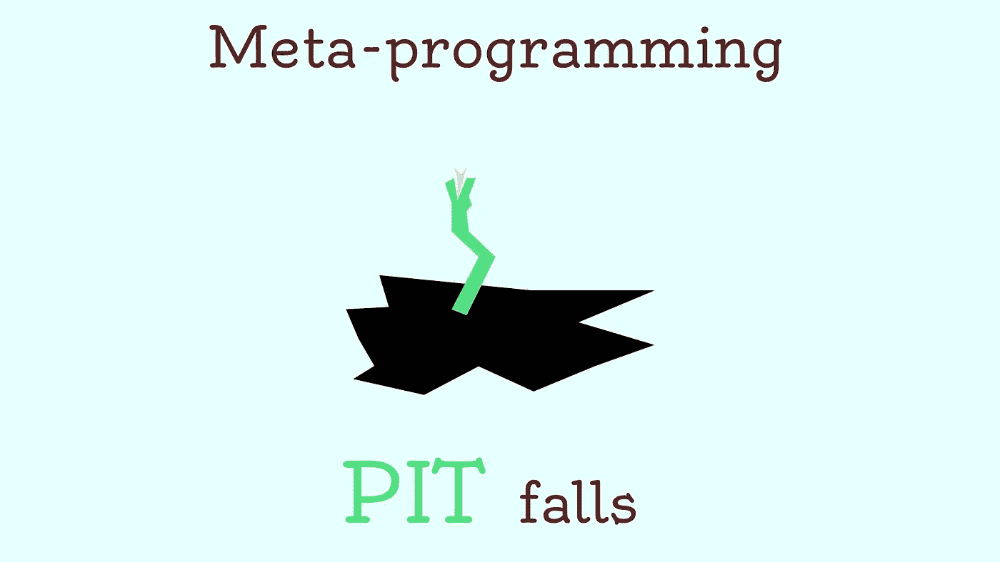
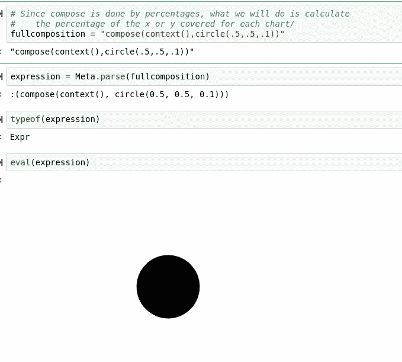
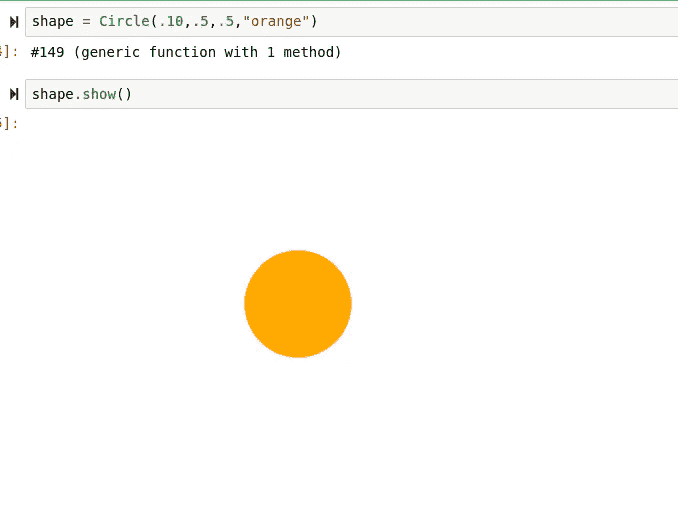
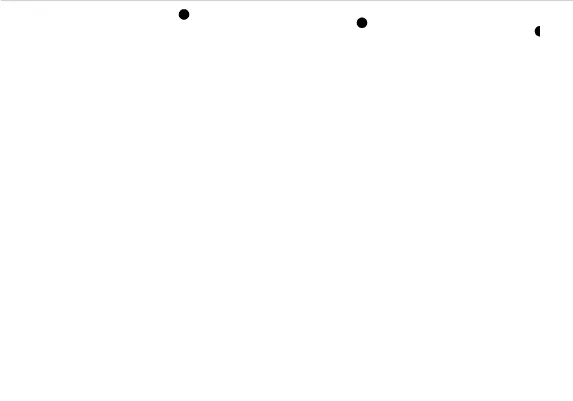
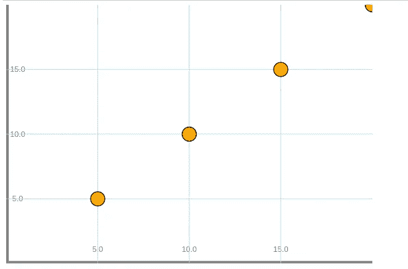

# 元编程的陷阱

> 原文：<https://towardsdatascience.com/the-pitfalls-of-meta-programming-944d3a36331c?source=collection_archive---------64----------------------->

## 元编程时可能遇到的问题和需要注意的事情。



# 介绍

当处理代码时，在代码和数据之间保持完全独立的关系通常是乏味的。当然，数据需要由代码来存储和操作，但是如果代码本身随着数据而变化，那么就很难提供一个适用于所有场景的解决方案。每当操纵数据的函数本身需要是动态的时，这种情况就会进一步加剧。元编程是一种编程技术，它允许程序员将代码用作数据，将数据用作代码。如果使用得当，它可以非常有效地用少得多的代码获得大量结果。

考虑下面的例子，Hone.jl。在我个人看来，Hone.jl 是一个很好的例子，它很好地运用了元编程，以更简单的方式完成了一项任务。我们可以使用以下代码创建一个包含名为 Compose.jl 的库的圆:

```
compose(context(),circle(.5,.5,.1))
```

这将在上下文中返回一个漂亮的圆圈，就像这样:


我们还可以做的另一件事是将代码作为字符串解析成表达式，并对其求值:



恭喜，我们刚刚成功地进行了元编程。虽然像这样的元编程是避免某些状态问题的好方法，但是这些代码本身几乎没有用处。然而，每当这个表达式被用作对象中的数据时，事情就变得非常有趣了。

```
function Circle(diameter,x,y,fillin)
    composition = compose(context(), circle(x,y,diameter), fill(fillin))
   #     "compose(context(),circle(.5,.5,.1))
    tag = string("circle(",string(x),",",string(y),",",string(diameter),")")
    tree() = introspect(composition)
    show() = composition
    update() =  tag = string("circle(",string(x),",",string(y),",",string(diameter),")")
    (test)->(show;composition;tree;tag;x;y)
end
```

如您所见，我们使用所提供的参数组装标签，然后将所有内容放入我们的新类型中。这个类型被 Julia 认为是一个不安全的类型，所以实际上不会被命名为任何东西，只是知道该类型是用(test)->声明并返回的。现在我们可以这样做，例如:



当然，这不是元编程，因为我们只是调用与标签分开创建的 composition 来显示图形。然而，一旦我们开始使用其他函数的标签，事情就变得有趣多了。

```
using Base.Threads
function plot(x,y,shape)
   topx = maximum(x)
    topy = maximum(y)
    x = [z = z / topx for z in x]
    y = [z = z / topx for z in x]
    expression = string("compose(context(),")
    for (i, w) in zip(x, y)
        shape.update(i,w)
        exp = shape.tag
        expression = string(expression,string(exp))
    end
    expression = Meta.parse(string(expression, ")"))
    eval(expression)
end
```

上面的函数为一个 zip 循环中的 X 和 Y 数组中的每个点添加了一个标签“expression”。然后对表达式进行解析和求值，让我们看看这是怎么回事。



只是为了好玩，这里有一个由元标签以完全相同的方式组合在一起创建的完整组合:



当然，如果你想查看来源，它在这里:

[](https://github.com/emmettgb/Hone.jl) [## emmettgb/Hone.jl

### 简单的面向对象的图形模块化库，GitHub 是超过 5000 万开发者的家园…

github.com](https://github.com/emmettgb/Hone.jl) 

# 元编程的好处

既然我们已经看到了元编程在解决问题中的应用，我们终于可以了解元编程的优点和缺点了。在谈到元编程的负面影响之前，让我先解释一下我为什么喜欢它，以及为什么我用它来磨练。

## 可展开的

因为元数据既可以是代码也可以是数据，所以它可以为将来的扩展和修改提供很大的空间。如果所有的操作都离不开元数据，那么添加更多代码所需要做的就是添加更多的元数据。回到 Hone.jl 示例，我们需要做的就是允许用户添加一个定制的图例，例如，有一个输入参数和一个将它添加到表达式的语句。或者，这也可以通过遍历一系列特性来完成，就像最新版本的 Hone.jl 所做的那样。

## 表演

例如，计算机要跟踪 Hone.jl 屏幕上绘制的各种不同的东西需要做大量的工作。我们不是将散点图中的所有点分配给单个变量，然后将这些变量存储在内存中，以后再访问它们，而是将它们的信息放入一个串联的字符串中。这有助于减少从注册表和内存来回移动和跳转的阻力，这反过来肯定有助于提高性能。

## 较少代码

虽然元编程在短期内可能要费力得多，但从长远来看，它确实是值得的，可以用来自动化大量的代码编写。如果期望的结果由许多小部分组成，这一点尤其正确。这方面的一个很好的例子是在超文本中，一种算法扫描一串元信息，让它知道如何解释所写的内容。

# 元编程的陷阱

虽然元编程肯定是一个非常有用的工具，但它肯定有一些重要的缺点。在很大程度上，您将能够解决在使用元编程技术时可能遇到的许多缺陷和问题，但是，其中一些问题在使用该技术时几乎是无法避免的。

## 安全性

就可扩展性而言，安全性始终是最优先考虑的问题。任何时候你将一个字符串作为代码来执行，都是相当不安全的，作为一个使用元编程的程序员，你至少应该意识到这一点。幸运的是，许多语言对元执行使用不同的状态，这使得这变得无关紧要。我肯定会说元编程要注意的一个是 Python。Python 可能是执行字符串最糟糕的语言之一。也就是说，Python 有自己独特的元编程系统，该系统利用了 decorators，如果您希望在 Python 中使用元编程，这绝对是一个好方法。谢天谢地，不久前我写了一篇文章详细介绍了这一点，如果你有兴趣做这样的事情，你可以看看:

[](/pythonic-metaprogramming-with-metaclasses-19b0df1e1760) [## 具有元类的 Pythonic 元编程

### 你的装饰和元类生存指南。

towardsdatascience.com](/pythonic-metaprogramming-with-metaclasses-19b0df1e1760) 

## 例外

元编程最痛苦的事情之一可能是遇到解析错误。每当一个字符串不能被解析时，得到一些非常意外的输出是很常见的。如果您已经关注 Hone.jl 的开发有一段时间了，那么您可能已经读到过一些我亲眼目睹的内容。例如，我遇到过这样一种情况，两个表达式因为缺少一个逗号而相乘。结果，我得到一个解析错误，告诉我没有匹配的方法

```
:*, (method, method)
```

实际上，我当然没有试图增加方法，但是这当然被解析器假定了，每当我试图计算表达式时，就会产生这个可怕的错误。

## 看不见的虫子

异常中缺乏一致性的结果是遇到看不见的错误的可能性。这些都是小问题，当许多标签堆叠在一起时，可能会出现这些问题。不用说，每当同时处理许多不同的标签并遇到一些奇怪的事情时，很难诊断出到底是什么导致了您的问题。解决这个问题的唯一确定的方法通常是在解析标签之前将其打印出来，然后进行校对。

> 相信我，这一点都不好玩。

## 用线串

如果有人曾经说过将代码放入字符串意味着添加许多正则表达式，那么他们可能是正确的！正则表达式可能是一个非常复杂的问题，有时它肯定不会完全按照您的预期工作。记住；你所有的代码都是字符串，所以任何语法上的问题都会立刻变得更加复杂。

# 结论

虽然元编程肯定是一个神奇的工具，可以让你做一些你甚至认为不可能的事情，但它也不是没有缺点。元编程有很多问题，特别是在一些编程语言中，它可能会也可能不会成为解决您的特定问题的一个选项。当然，就像在神奇的代码世界中的任何事情一样，它大部分是情境性的。有些情况下，安全性可能是最高优先级，有些情况下，安全性在优先级列表中可能非常低。对于跟踪 bug、测试和处理正则表达式也是如此。总之，我真的很喜欢元编程，但是我认为任何想要接近它的人都应该清楚什么时候他们可能想要使用它，什么时候不应该接触它。元编程有很多很好的应用，但其中最有说服力的实际上是程序员自己，比如 Hone.jl 的例子。