# 新冠肺炎的政治和经济前景

> 原文：<https://towardsdatascience.com/the-political-and-economic-perspective-of-covid-19-c35c046ceffc?source=collection_archive---------21----------------------->

## 一些数据和想法告诉我们可能的发展方向

我们大多数人都没有经历过类似现在的情况。在接下来的几周内，世界上许多国家的学校、大学、商店、酒吧、餐馆和其他娱乐设施都将关闭。随着航班和火车被取消，边境被关闭，[宵禁被讨论](https://thehill.com/homenews/administration/487799-white-house-disputes-talk-of-national-curfew)和整个[封锁](https://www.theguardian.com/world/2020/mar/16/coronavirus-spain-takes-over-private-healthcare-amid-more-european-lockdowns)的引入，我们的行动越来越受到限制。当然，所有这些都是为了一个很好的理由:减缓新型冠状病毒的传播。

似乎我们的生活即将停止并发生巨大变化。这些限制正在对我们的经济造成损害，并对政治产生重大影响。在这篇文章中，我将看一些图表来描述经济和政治(特别是在美国)已经发生的事情，以及这对未来可能意味着什么。请记住，今年 11 月美国将举行总统选举。

*注意:这篇博文应被视为一种观点，而非预测。*

# 新冠肺炎的威胁有多严重？

毫无疑问，这是对整个世界人口的严重威胁。这篇文章很好地阐述了为什么我们必须今天就采取行动，否则许多人将会死亡，全球的医疗保健系统将会崩溃。新病例呈指数增长，在意大利、伊朗、韩国和中国等一些国家呈爆炸式增长。然而，美国、德国、法国、西班牙和其他国家只比受影响更严重的国家落后几天。

直到 3 月 16 日，中国的确诊病例比其他所有国家的总和还要多。然而，中国完全关闭公共生活有助于拉平增长率。各大洲的许多其他国家正在对其公民采取类似的限制。

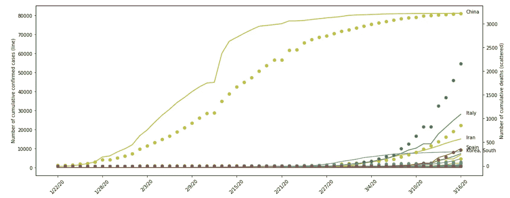

确诊病例(直线)和死亡率(分散)相互对照。来源:朱莉娅·尼库尔斯基，数据来自约翰·霍普金斯大学。

意大利是病例数第二高的国家，并且仍在呈指数增长，其次是伊朗、西班牙、韩国和德国。这张图也显示了 T2 医疗系统在应对新冠肺炎疫情时遇到的困难。这是其他国家的前兆，这些国家与意大利有着相同的轨迹，只是落后了几天。

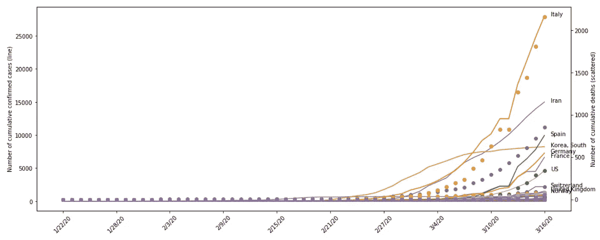

确诊病例(线)和死亡率(分散)相互标绘，不包括中国。来源:茱莉亚·尼库尔斯基，数据来自[约翰·霍普金斯大学](https://github.com/CSSEGISandData/COVID-19)。

# 新闻里在谈论什么？

几乎不可能忽略目前正在进行的疫情。所有关于新冠肺炎的更新都淹没了其他与疫情无关的内容。其中之一是民主党初选和 11 月大选的竞选活动。

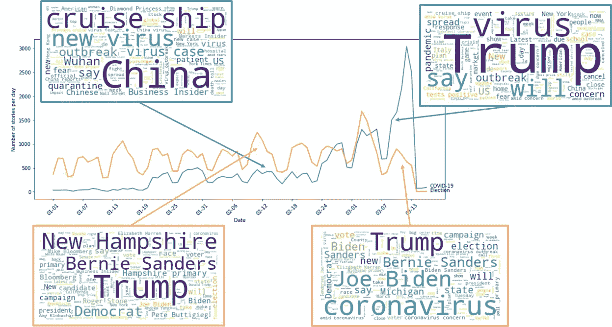

该图描绘了选举相关新闻(橙色)和新冠肺炎新闻(蓝色)每天的新闻报道数量。词云显示了美国数字媒体和报纸在二月中旬和三月中旬关于这些话题谈论最多的词。来源:朱莉娅·尼库尔斯基，数据来自[媒体云](https://explorer.mediacloud.org/#/Home)。

上图显示了美国数字媒体和报纸上发布的关于新冠肺炎和选举相关新闻(美国)的新闻故事的发展。在二月底，新冠肺炎新闻报道的数量首次超过了选举新闻报道的数量，这甚至发生在超级星期二之前！除此之外，冠状病毒的新闻报道数量激增。

有趣的是，这些新闻报道中讨论的事情是如何随着时间的推移而变化的。虽然在 2 月中旬，选举新闻报道中的主要关注点是新罕布什尔州的初选、伯尼·桑德斯、民主党和特朗普，但在 3 月中旬，这种关注转移到了特朗普、乔·拜登和冠状病毒。二月中旬到三月中旬，新冠肺炎相关新闻的话题也发生了变化。虽然大多数故事围绕着二月份搁浅的游轮、中国局势和“新病毒”，但这在三月中旬变成了特朗普的行动成为关注的焦点。

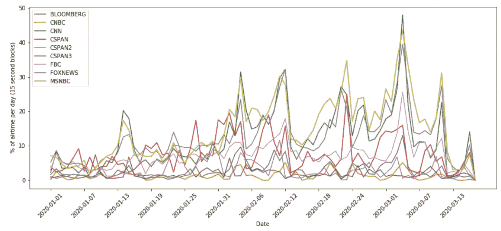

每天花在选举相关新闻上的时间百分比。广播时间以 15 秒为单位。用于搜索的关键词有:拜登、桑德斯、沃伦、克洛布查尔、Buttigieg、加巴德、初选、党团会议、选举。资料来源:Julia Nikulski，数据来自 GDELT 项目。

电视新闻以同样的方式从报道与选举相关的话题(党团会议、初选、民主党总统候选人等)转移开来。)几乎 50%的播出时间增加了冠状病毒的覆盖范围。截至上周，三大有线新闻频道(CNN、MSNBC、福克斯新闻)在病毒爆发上花费了近 20%的播出时间。

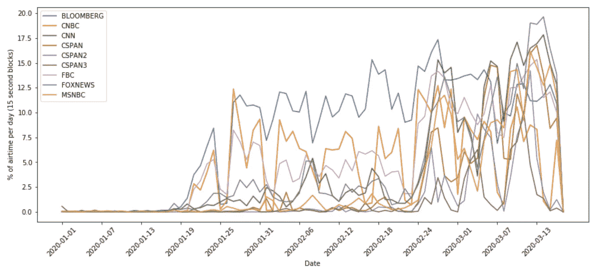

每天花在新冠肺炎相关新闻上的时间百分比。广播时间以 15 秒为单位。用于搜索的关键词是:新冠肺炎、冠状病毒、病毒、冠状病毒。资料来源:Julia Nikulski，数据来自[GDELT 项目](https://blog.gdeltproject.org/gdelt-2-0-television-api-debuts/)。

有趣的是，在所有新闻频道中，福克斯新闻花了最多的时间讨论疫情。与其他媒体不同的是，福克斯新闻对川普与新冠肺炎的关系没有 T4 那么多批评。那里的报道可能会极大地影响不同党派的美国人如何看待冠状病毒的威胁(下文将详细介绍)。

# 经济反应如何？

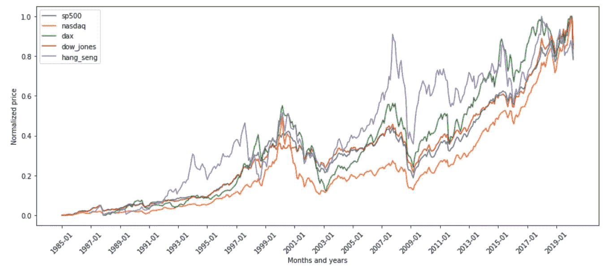

从 1984 年至今标准普尔 500、纳斯达克、DAX、道琼斯和恒生指数的价格发展。来源:朱莉娅·尼库尔斯基，数据来自雅虎财经。

至少可以说，不太好。与过去 35 年的经济衰退和股票损失相比，标准普尔 500、纳斯达克、道琼斯、DAX 和恒生指数只是处于熊市的开始。

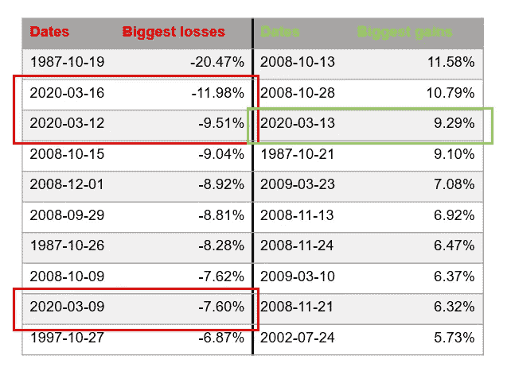

标准普尔 500 过去 35 年的 10 大损失和 10 大收益。来源:朱莉娅·尼库尔斯基，数据来自雅虎财经。

就标准普尔 500 过去 35 年来的最大每日损失和收益而言，2020 年 3 月 16 日仅次于 1987 年的黑色星期一。其第三大毁灭性的一天是 2020 年 3 月 12 日。然而，由于当前形势的不确定性和每日更新，损失在第二天几乎完全恢复，使得 2020 年 3 月 13 日成为第三高的涨幅。更重要的是:所有其他日期，无论是亏损还是盈利，都处于严重的经济衰退之中，这表明我们可能也会陷入更长时间的衰退。

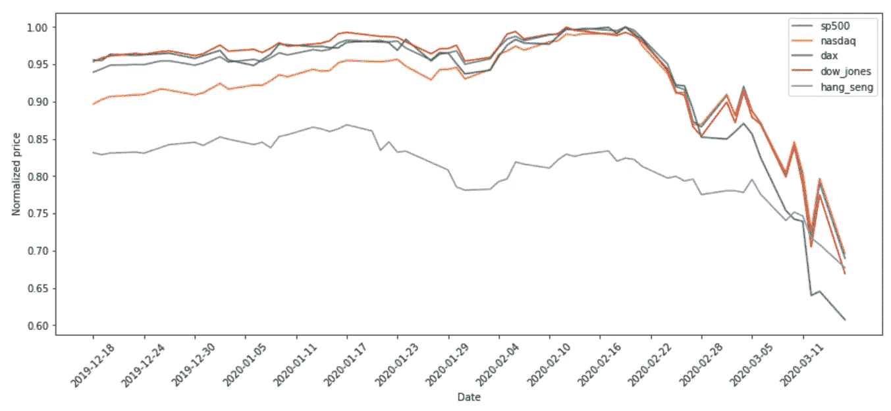

标准普尔 500、纳斯达克、DAX、道琼斯和恒生指数在过去三个月的价格发展。来源:朱莉娅·尼库尔斯基，数据来自雅虎财经。

更仔细地观察过去 3 个月的发展，从 2 月中旬开始，所有这些指数的总体下降趋势变得明显。在绘制确诊病例数和指数价格时，有明显的负相关关系。

中国大量的确诊病例掩盖了其他国家病例的发展。2 月中旬后，中国设法拉平了曲线。但是大约在那个时候，标准普尔 500 指数和 DAX 指数开始下跌。

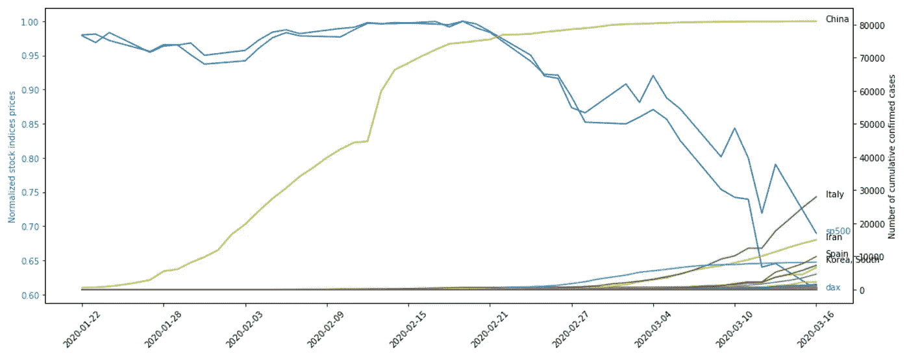

图表描述了与全球确诊新冠肺炎病例上升相比，德国 DAX 指数和标准普尔 500 指数的价格发展。来源:茱莉亚·尼库尔斯基，数据来自[雅虎财经](https://finance.yahoo.com/)和[约翰·霍普金斯大学](https://github.com/CSSEGISandData/COVID-19)。

不包括中国表明，在 2 月中旬，韩国的病例开始上升，关于[被检疫的游轮](https://www.bbc.com/news/world-asia-china-51524460)(2 月 15 日后出现在图表最底部的紫色水平线)的新闻得到了越来越多的关注。

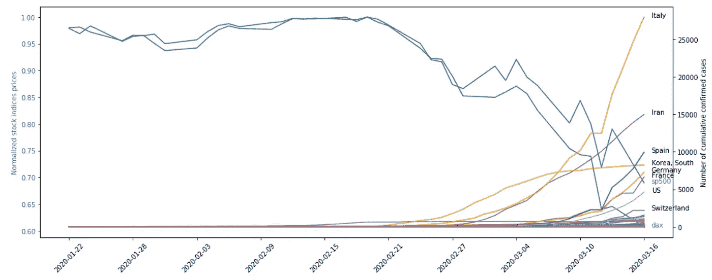

该图描述了德国 DAX 指数和标准普尔 500 指数的价格发展，并与全球(不包括中国)确诊新冠肺炎病例的上升进行了比较。来源:朱莉娅·尼库尔斯基，数据来自雅虎财经和约翰·霍普金斯大学。

《市场观察》上有一篇关于道琼斯指数发展的精彩文章，文章展示了经济陷入衰退后，道琼斯指数的复苏需要多长时间。它花了 25 年时间来弥补大萧条的损失，花了 16 年时间从 20 世纪 70 年代和 80 年代的经济和政治动荡中复苏，花了 6 年时间来恢复 2008 年金融危机期间失去的东西。目前，我们仍处于熊市的开端，所以我们不知道股市何时会好转，也不知道需要多长时间才能收复失地。但是[监管者认为](https://edition.cnn.com/2020/03/15/investing/stock-futures-global/index.html)下降趋势将持续数周。

[周日晚上，美联储将利率下调至接近 0 %的水平，试图安抚投资者。然而，投资者并不认为这是信心的表现。纽约证券交易所开盘后第二天就停止了交易，因为标准普尔 500 指数下跌超过 7%。](https://edition.cnn.com/2020/03/15/economy/federal-reserve/index.html)

与 2008 年金融危机的不同之处在于，我们正在应对一场健康危机。超国家、国家和地方政府采取的任何措施都旨在避免全球卫生保健系统的灾难性崩溃。然而，在短期和中期，这些限制会立即影响公司的底线，导致失业。

世界各国正试图通过对经济的紧急刺激方案，甚至对公民的直接现金支付(如川普政府所宣布的)来减轻打击。所有迹象都表明经济衰退。但问题是它会停留多久。一些人希望会有一个[快速反弹](https://www.politico.com/news/2020/03/16/trump-faces-1929-save-economy-133053)，但是没有确定性。看看中国就知道，复苏可能需要比预期更长的时间。

# 今年不是有选举吗？

今年 11 月，美国确实有地方、州、国会和总统选举。新闻大量报道了民主党总统初选，然而，自二月底以来，人们的注意力已经转向新冠肺炎。[竞选集会被取消](https://www.politico.com/news/2020/03/11/trump-cancel-campaign-events-coronavirus-126693)，[辩论在没有观众的情况下播出](https://edition.cnn.com/2020/03/15/politics/who-won-the-debate/index.html)甚至[一些州的初选也被重新安排](https://edition.cnn.com/2020/03/16/politics/ohio-primary/index.html)到稍后的日期，以避免病毒的进一步传播。

从历史上看，经济衰退时期的总统连任竞选是艰难的，当经济萎缩时，现任总统连任的机会就会减少。这将意味着，如果经济将陷入持续数月的衰退，特朗普再执政 4 年的机会正在减少。[吉米·卡特(Jimmy Carter)在长达数月的经济衰退中输掉了连任竞选，奥巴马在 2008 年的金融危机中获胜，希拉里在 1992 年击败乔治·h·w·布什(George H. W. Bush)的部分原因是一年半前结束的经济衰退。](https://eu.usatoday.com/story/money/2020/03/13/coronavirus-can-economy-predict-next-president-trump-election-2020/5030457002/)

虽然经济是选举的一个很好的预测因素，而且[的这篇文章](https://www.vox.com/policy-and-politics/2020/3/17/21175200/trump-economy-reelection-2020-presidential-election-coronavirus)认为，2020 年前两个季度的衰退可能会导致特朗普失败(考虑到他的选举人团优势)，但在特朗普时代，预测结果可能会更复杂。

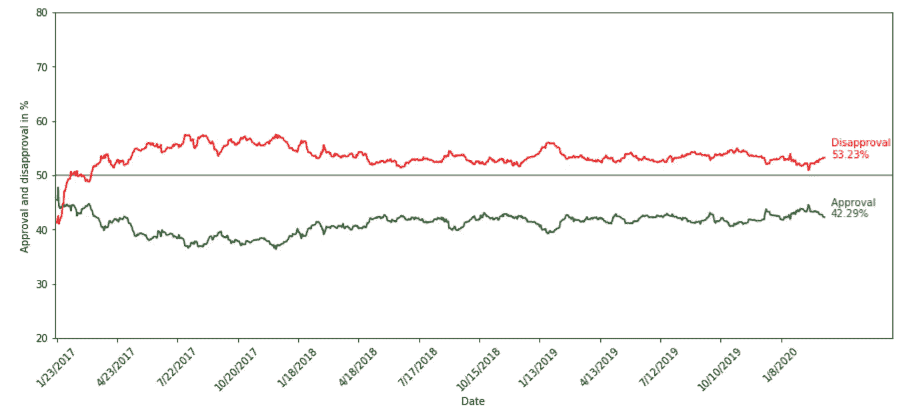

特朗普总统任期内的支持率。资料来源:Julia Nikulski 基于来自[fivethirtyeeight](https://projects.fivethirtyeight.com/trump-approval-ratings/)的数据和图表。

他的总体支持率从来都不是很高，大约在 30%到 40%之间。然而，它们一直是稳定的。无论是被[弹劾](https://edition.cnn.com/2020/02/06/politics/donald-trump-impeachment-election-2020/index.html)，因[支持白人至上主义者](https://www.vox.com/2019/4/26/18517980/trump-unite-the-right-racism-defense-charlottesville)而被公开谴责，还是因[空袭索莱马尼](https://edition.cnn.com/2020/01/03/politics/us-reaction-quds-force-qasem-suleimani/index.html)而被自己的政党批评，都没有太大的变化。

此外，这些评级掩盖了对他的表现的高度党派分歧。他有一个非常忠诚的基础，就像有一些非常忠诚的永远不会出牌的人一样。在当前的冠状病毒危机中也可以观察到这种分歧。根据三月第一周进行的由[五月三十八日](https://fivethirtyeight.com/features/how-concerned-are-americans-about-coronavirus-so-far/)汇总的民意调查，共和党人高度赞同川普抗击疫情的措施，而民主党人则强烈反对。

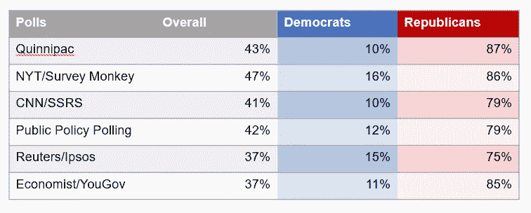

在调查受访者中，对特朗普处理冠状病毒疫情的方式表示一定程度或强烈赞同的比例。资料来源:Julia Nikulski 基于来自[fivethirtyeeight](https://fivethirtyeight.com/features/how-concerned-are-americans-about-coronavirus-so-far/)的数据和图表。

此外，我们早些时候在描述冠状病毒电视报道的图表中看到，福克斯新闻花了很多时间报道这个话题。但是这个网络的政治评论员淡化了恐惧，表明回声室并不局限于脸书。在社交媒体、假新闻和高度党派分歧的时代，经济可能仍然是选举的决定性因素。然而，把所有的牌都押在经济上不一定会导致民主党总统候选人获胜。

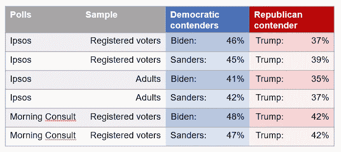

调查受访者会为每个阵容中的哪些候选人投票。资料来源:Julia Nikulski 基于 [FiveThirtyEight](https://fivethirtyeight.com/features/how-concerned-are-americans-about-coronavirus-so-far/) 的数据和图表。

上述调查没有显示的是选举人团将如何影响最终的选举结果。此外，川普已经开始听取他的顾问们的意见，比如安东尼·福奇医生。在否认病毒的威胁不起作用后，他现在提议向经济注入数十亿美元现金，以避免经济下滑。所有这些都可能影响选民最终如何评判特朗普在 11 月投票中的表现。

# 结论

从上述图表和数据中得出的想法当然只是对当前形势的一种解释，当前形势非常不稳定，每天都有新的、改变日常生活的信息发布。经济和政治正在适应冠状病毒创造的新环境，经济是否会进入衰退，衰退会持续多长时间和多严重，以及这是否会导致白宫发生变化，仍有待观察。

这篇文章中使用的所有图表和数据都可以在我的 [GitHub](https://github.com/julianikulski/covid-19) 上获得。

你想在媒体上阅读更多高质量的故事吗？考虑注册一个支持我和其他媒体作者的会员。

 [## 通过我的推荐链接加入 Medium-Julia Nikulski

### 作为一个媒体会员，你的会员费的一部分会给你阅读的作家，你可以完全接触到每一个故事…

medium.com](https://medium.com/@julia.nikulski/membership) 

想读一些与我们当前严峻的现实无关的东西吗？查看我关于**用不同的机器学习算法预测自行车共享数据的时间序列的文章。**

 [## 基于 AdaBoost、随机森林和 XGBoost 的时间序列预测

### 我们能从不能给我们很好预测结果的数据科学项目中学到什么

towardsdatascience.com](/go-highly-accurate-or-go-home-61828afb0b13)