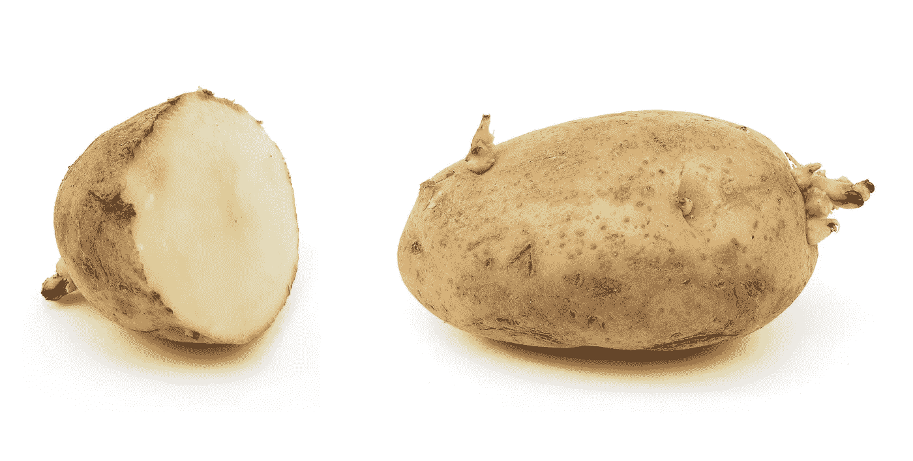

# 土豆列车——使用 Python 处理极大数量和任意精度的二项式概率

> 原文：<https://towardsdatascience.com/the-potato-train-using-python-with-extremely-large-numbers-and-arbitrary-precision-for-binomial-68213de30b87?source=collection_archive---------41----------------------->

数学很难，我们去购物吧——当然是为了辅导课。我真希望在尝试用 Python 做一些涉及极大数字的事情(n 的大值的二项式概率)和我的代码开始崩溃之前，我已经阅读了这篇教程。

但是等等，我听到你说，Python 可以处理任意大的数字，只受 RAM 大小的限制。当然，只要这些都是整数。现在，为了更好地衡量，尝试混合一些浮点值，事情开始崩溃。在 vanilla Python 中，任意大的数字混合任意精确的浮点数并不好玩。

让我们尝试在计算二项式分布时逐渐增加 Python 中整数运算的需求，看看会发生什么。

欢迎来到…

# 土豆火车

这是冷战时代。在遥远的冰封之地，有一个非常大的工业中心。那里寸草不生，所以工人们只能靠食物维生。偶尔会有一列满载土豆的火车到站。


现在，这是硬东西——我们正在谈论暴风雪和风暴——所以土豆被损坏了。事实是，在每次运输中，有 20%到达车站的土豆是坏的。

好了，轮到你做晚饭了，所以带上一个又大又重的包去车站吧。20 个土豆足够你们队吃了。但是现在已经熄灯了，一片漆黑，领导已经明智地把所有的精力都分配到工厂去完成配额，所以你只能盲目地随意采摘土豆。

你挑选的所有土豆都是好的几率有多大？只有一个土豆是坏的几率有多大？还是 2 坏，还是 3 坏？还是都不好？(这肯定会毁了晚餐)

或者也许同志们说:*“瞧，我们都知道是怎么回事，只是这次尽量不要挑超过 4 个坏土豆。20 个中最多 4 个坏就可以了。我们会活下来的。越少越好。多了就不好了。”*你的团队这次不会吃悲伤的晚餐的可能性有多大？



这就是你遇到你的死敌的地方:

# 二项式分布

有一个非常大的 A 型或 b 型对象堆。A 型对象在堆中的分数是 p，其中 0 < = p < = 1；剩下的都是 b 型，从那堆里面，你挑 n 个对象，n 比整堆的大小小很多。在你挑选的 n 个物体中，k 是 A 型的几率有多大？

换句话说，你从一列土豆中挑出 n=20 个土豆，其中 p=0.2(或 20%)是坏的。你挑出来的 k 个土豆(k 在 0 到 20 之间)坏的几率有多大？

这是概率的公式:


许多 Stats 101 书籍会给你某种证明(见最后的学分)。我只做土豆，所以我们继续吧。

但在此之前，请注意公式中的阶乘。阶乘可以很快变得很大。这将扭转过来，并在以后的代码中很好地咬我们。

但还不是时候。我们会慢慢开始，先用小数字。相信我，我是个工程师。一切都会好的——暂时如此。

# 我们来编码吧！

打开你的 Jupyter 笔记本，跟我来。让我们进口好东西:

实现概率公式:

并计算所有 k 值的概率:

让我们看看结果:

```
print(df)
     probability
0   1.152922e-02
1   5.764608e-02
2   1.369094e-01
3   2.053641e-01
4   2.181994e-01
5   1.745595e-01
6   1.090997e-01
7   5.454985e-02
8   2.216088e-02
9   7.386959e-03
10  2.031414e-03
11  4.616849e-04
12  8.656592e-05
13  1.331783e-05
14  1.664729e-06
15  1.664729e-07
16  1.300570e-08
17  7.650410e-10
18  3.187671e-11
19  8.388608e-13
20  1.048576e-14
```

所有土豆都是好的概率大概是 1%。只有 1 个土豆坏的概率在 5%左右；认为 2 个土豆坏的占 14%；三个坏土豆是 21%，四个坏土豆是 22%，从那以后就开始走下坡路了——17%，11%，等等。所有的土豆都是坏的是不太可能的——1000 亿分之一。

累积概率如何——4 个或更少的土豆是坏的？是队友问的。让我们看看:

```
dfcs = df.cumsum()
dfcs.rename(columns={'probability': 'cumulative probability'}, inplace=True)
print(dfcs)
    cumulative probability
0                 0.011529
1                 0.069175
2                 0.206085
3                 0.411449
4                 0.629648
5                 0.804208
6                 0.913307
7                 0.967857
8                 0.990018
9                 0.997405
10                0.999437
11                0.999898
12                0.999985
13                0.999998
14                1.000000
15                1.000000
16                1.000000
17                1.000000
18                1.000000
19                1.000000
20                1.000000
```

有 63%的可能性，只有 4 个或更少的土豆是坏的。几乎三分之二的情况下，你的队友会觉得晚餐是最不可接受的。嘿，可能会更糟。

但是眼见为实，让我们画出所有 k 值的概率。代码:

```
df.plot(figsize=(16,9))
dfcs.plot(figsize=(16,9))
```

和图像结果:


# 情节(的腰围)变粗了

但是，唉，这并不是它的结束。你做饭做得这么好，现在他们想让你为工厂的整个精密模具部门做饭。这是一群团队，你认为每个人需要 200 个土豆。因此，抓住生产工具，在这种情况下是几个麻袋，找个人来帮助你，然后前往火车站。

那是 n=200，所以大概 40 个或者更少的坏土豆对同志们来说是可以接受的，假设所有的团队都像你一样。让我们看看可能性有多大。

更改代码中 n 的值，然后重新运行它。这就是事情变坏的地方，就像火车上的许多土豆一样:

```
---------------------------------------------------------------------------
OverflowError                             Traceback (most recent call last)
<ipython-input-4-c84b1e23a65f> in <module>
      7 # compute probabilities for all k
      8 for k in tqdm(range(n + 1)):
----> 9     df.loc[k] = bin_prob(n, p, k)<ipython-input-3-60f4e81371ca> in bin_prob(n, p, k)
      1 def bin_prob(n, p, k):
----> 2     arr = math.factorial(n) / math.factorial(k) / math.factorial(n - k)
      3     bp = arr * (p ** k) * ((1 - p) ** (n - k))
      4     return bpOverflowError: integer division result too large for a float
```

啊，是的。我们在计算 200！在那里，有 375 个数字(不是开玩笑)。/操作符想把事情当做 float 来处理，Python 在那个范围内做不到 float。

但是等等，//运算符也做除法(地板除法，够近了)，把一切都当做整数类型来处理。Python 对整数的唯一限制是 RAM 的大小。那两个除法在那个公式里无论如何都是整数(想想为什么)，所以用//代替也没问题。让我们在 n=200 时再试一次:

它非常好用:


40 个或更少的土豆变坏的几率约为 54%。这很粗略，但是嘿，你是去工作的，不是去享受美食的，所以坚强点，同志。

# 工业规模马铃薯种植

有时我们会失败。有时我们会成功。有时候，就像他们在东欧集团常说的，我们太成功了。

尽管土豆烂了，你的厨艺还是很棒，现在你得为整个工厂做晚饭了。对许多饥饿的工人来说，这相当于 2000 个土豆。带上你的队友，跳上卡车，开到火车站。为了祖国的荣耀。

你从火车上带回来的赏金中，400 个或者更少的土豆会是坏的几率有多大？更改代码，使 n=2000，然后再次运行它。结果相当令人难过:

```
---------------------------------------------------------------------------
OverflowError                             Traceback (most recent call last)
<ipython-input-5-d85e2d80093f> in <module>
      7 # compute probabilities for all k
      8 for k in tqdm(range(n + 1)):
----> 9     df.loc[k] = bin_prob(n, p, k)<ipython-input-4-88c12493fe27> in bin_prob(n, p, k)
      1 def bin_prob(n, p, k):
      2     arr = math.factorial(n) // math.factorial(k) // math.factorial(n - k)
----> 3     bp = arr * (p ** k) * ((1 - p) ** (n - k))
      4     return bpOverflowError: int too large to convert to float
```

我们正在尝试计算 2000！在那里。那个号码有 5736 个数字。在普通 Python 中，您无法解决这个问题。这个整数很好，但是你必须让它和 float 一起运行，而普通 Python 在这个范围内不支持 float。

[小数](https://docs.python.org/3.0/library/decimal.html)来救场。它可以处理任意数量的数据。默认情况下，它的工作精度为 28 位，但是您可以根据需要将其更改为任意值，在某些情况下，它确实会动态更改。

```
import decimal
print(decimal.getcontext())
Context(prec=28,
        rounding=ROUND_HALF_EVEN,
        Emin=-999999,
        Emax=999999,
        capitals=1,
        clamp=0,
        flags=[],
        traps=[InvalidOperation, DivisionByZero, Overflow]
)
```

它甚至嵌入了一些数学函数，所以 int(decimal。上下文()。幂(2，3))是 2 = 8。在处理格式时，您可能需要将格式转换成十进制，然后再转换回常规的 float 或 int，但这对于消除大小限制来说是很小的代价。只是要记住它比普通的数学图书馆慢一点，所以只有在紧急情况下才打碎这个玻璃。

让我们来修正我们的函数:

我们用 Decimal()包装所有内容的原因是我们在处理浮点值；如果这些参数是整数，ctx.power()会直接接受它们。最后，在我们返回它之前，我们把十进制格式转换成浮点数。

哇，这有用吗:


400 个或更少的土豆变坏的概率是 51%。也许你不会为整个工厂做饭太久。

# 到无限和更远

十进制很牛逼。我已经把它提高到 n=20000。它花了 10 分钟完成，单线程，但它做了工作。此时，您可能希望切换到多处理。

# 源代码

如果你想看 Jupyter 的笔记本，里面有本教程的全部代码，[这里有](https://github.com/FlorinAndrei/misc/blob/master/ch14_binomial_probability.ipynb)。

# 捷径

当然，您总是可以导入 scipy 并使用库函数进行相同的计算…

```
import scipy.stats as ss
n, p, k = 2000, 0.2, 40
ss.binom.cdf(k, n, p)
```

…这将为您提供上面艰难计算出的相同的累积概率(如果您想要普通概率而不是累积概率，请使用 pmf()而不是 cdf())。

但这不是重点——重点是展示 Python 如何处理专业库之外的大量数据，并在此过程中探索一些统计数据。

# 信用

[《统计学的基本实践》，第 8 版，作者摩尔、诺茨和弗利格纳](https://www.macmillanlearning.com/college/us/product/Basic-Practice-of-Statistics/p/1319042570)。

非本人制作的图片来源:

[](https://www.deviantart.com/jpachl/art/Soviet-diesel-power-807993256) [## 苏联柴油动力由 jpachl 对 DeviantArt

### 1986 年夏天，一列由苏联制造的 M62 发动机(东德 120 级)为首的货运列车正在等待…

www.deviantart.com](https://www.deviantart.com/jpachl/art/Soviet-diesel-power-807993256) [](https://en.wikipedia.org/wiki/Potato) [## 马铃薯

### 马铃薯是一种原产于美洲的块根蔬菜，是马铃薯的淀粉块茎，也是一种植物…

en.wikipedia.org](https://en.wikipedia.org/wiki/Potato)