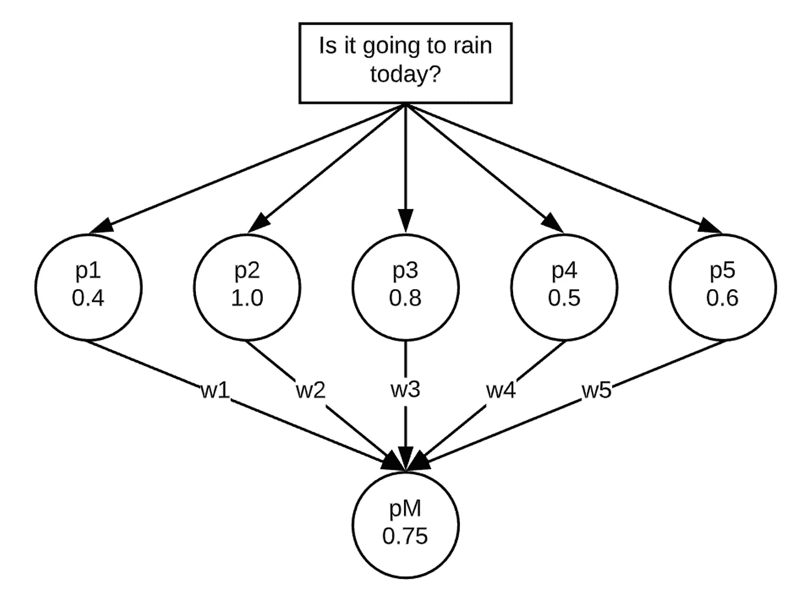
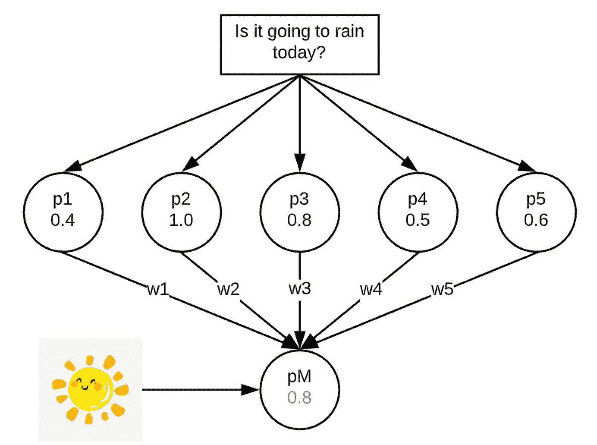
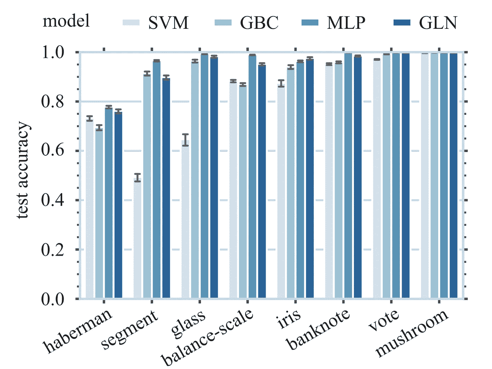

# 门控线性网络在线学习的潜力

> 原文：<https://towardsdatascience.com/the-potential-of-gated-linear-networks-for-online-learning-70ca5ea073a?source=collection_archive---------37----------------------->

## DeepMind 最近的一份出版物对样本高效在线学习提出了一个有趣的新观点。

门开着，进来吧。(照片由[Á·加萨·德品内](https://unsplash.com/@agathadepine?utm_source=unsplash&utm_medium=referral&utm_content=creditCopyText)在 [Unsplash](https://unsplash.com/?utm_source=unsplash&utm_medium=referral&utm_content=creditCopyText) 上拍摄)

现代深度学习系统的两个最大缺点是它们对数据的渴望程度和训练时间([我在看着你 GPT-3](https://lambdalabs.com/blog/demystifying-gpt-3/) )。这些系统在训练时可以访问它们的所有数据，并且在它们的许多学习时期中多次重新访问每条数据。因此，当你将这些技术应用于在线学习时，毫不奇怪它们并没有真正起作用。

当在“离线设置”(即针对多个时期的静态数据)中训练的模型被部署到现实世界中时，它们无法利用新看到的数据，因为它们的参数被冻结，这意味着它们不再学习。如果底层数据分布不变，这是没问题的，但在现实世界中通常不是这样。考虑零售推荐:一个项目的受欢迎程度会随着时间的推移而消长，这意味着一个静态的系统将提供不一致和过时的推荐。一种解决方案是定期用收集到的所有新数据重新训练系统，但现实世界与模型所学之间仍有差距。

另一方面，在线学习系统从每一段数据中顺序学习，因此可以更快地适应变化(并且不必重新部署)。这代表了与离线学习完全不同的学习场景。DeepMind 最近的一项技术，[门控线性网络](https://deepmind.com/research/publications/Gated-Linear-Networks)，提出了一种新的在线学习方法，可以与等效的离线学习技术相媲美。

# 门控线性网络有什么不同？

> 门控线性网络最酷的一点是网络中的每个神经元都可以单独预测目标。

在神经网络分类器中，神经元按层排列，较浅的层向较深的层提供输入。为了学习，预测的结果(即最终网络输出的损失)通过[反向传播](https://brilliant.org/wiki/backpropagation/#:~:text=Backpropagation%2C%20short%20for%20%22backward%20propagation,to%20the%20neural%20network's%20weights.)通过网络向上传回，并且每个神经元被稍微调整以减少这种损失。网络的前向传递产生预测，后向传递更新网络以(有希望地)提高性能。正如 DeepMind 的[门控线性网络](https://arxiv.org/pdf/1910.01526.pdf)论文中所说:

> 反向传播长期以来一直是事实上的信用分配技术，是诸如卷积神经网络和多层感知器(MLPs)之类的流行神经网络架构的成功训练的基础。

关于门控线性网络(GLNs)的一个有趣的事情是，它们不使用反向传播。虽然反向传播在允许网络学习“高度抽象的特定任务特征”方面是有效的，但训练这些系统的过程需要许多时期和大量数据。从训练过程中去除反向传播克服了这些问题，这意味着 GLN 可以在数据集的单次传递中进行训练，使其适合在线学习。

然而，在不使用反向传播的情况下，网络(即最终层)的预测误差如何返回到网络的较浅层？GLN 的酷之处在于网络中的每个神经元**都单独预测目标。这意味着你可以选取网络中的任何一个神经元，并将其输出解释为最终预测。例如，如果你正在对猫(0)和狗(1)进行训练，而一个 GLN 神经元预测 0.9，那么它非常有信心这个特定的输入是一只狗——**并且你可以对网络中的任何神经元进行训练！**相比之下，如果没有网络的上下文，常规神经网络中神经元的输出是没有意义的；只有最后一层神经元的输出实际上与预测目标有任何关联。**

当 GLN 中的每个神经元预测目标时，它们可以在本地进行训练，而无需通过网络传回任何信息。给定一些输入信息，神经元进行预测，将其与输出标签进行比较，并更新其权重，而不依赖于最终的网络输出。尽管如此，神经元仍然是分层排列的；浅层神经元的输出形成了深层神经元的输入。网络的前向传递与传统神经网络基本相同，只是后向传递发生了变化。

# 在门控线性网络神经元内部

GLN 中的一个神经元产生一个二元事件的概率预测。这样做的内部机制使用**门控几何混合**:一种将一组不同的概率预测组合成单个预测的方法。为了理解引擎盖下到底发生了什么，我们必须首先理解门控几何混合。

天气预测的几何混合——你相信谁会告诉你带把伞？

假设你醒来想知道当天晚些时候是否会下雨，但是你并不真正相信任何单一的信息来源([从什么时候开始气象员可以预测天气了？](https://www.youtube.com/watch?v=m0dBjFTLo0Y))。你可以查看各种天气预报来源:气象局、你的室友、[、你最喜欢的古代天气知识](https://www.metoffice.gov.uk/weather/learn-about/weather/how-weather-works/red-sky-at-night)——他们都会给出不同的预报，你对每个来源的信任程度也不同。几何混合是一种数学模型，它允许你将不同的概率预测组合成一个单一的预测，因此你可以决定是否带一把伞去工作(除非你被困在家里工作)。每个信息源可以基于其可靠性而被不同地加权；如果输入源确实不正确，几何混合甚至允许负权重。

在某些条件下，一些天气来源可能比平时更可靠，而另一些则不那么可靠。如果早上天气晴朗，你的室友可能会有一种不可思议的正确预测下午天气的能力。这是门控几何混合的*门控*部分:在给定一些其他数据(称为边信息)的情况下，改变输入数据的权重。输入数据是相同的，但是你改变了每个信息源的权重，从而得到不同的结果。

你更信任你的室友，因为现在天气晴朗，而且你可以更准确地预测当天下午是否会下雨。

所以在内部，GLN 中的神经元正在执行门控几何混合。它结合先前神经元的预测，并使用由一条附加边信息确定的一组权重，产生自己的单个预测。网络的最后一层仅由单个神经元组成，这提供了网络的整体预测。网络中的每个神经元通过将自己的预测与目标标签进行比较来更新其几何混合权重，通知它哪些输入源更可靠并且将来应该被信任。

# 大局

如果我们再次缩小来考虑整个网络，就有可能拼凑出 GLN 是如何做出预测的。它需要从一些初始的基本预测开始，以输入到网络中；这些通常只是输入数据的简单转换。然后，网络的每一层开始进行预测，这些预测可以输入到后续的层中，每一层都有希望做出比前一层更好的预测。边信息允许神经元切换它们当前使用的权重集，以更适合当前的上下文。

GLN 的表现与流行的离线学习方法的比较。(来源 [DeepMind](https://arxiv.org/pdf/1910.01526.pdf) )

DeepMind 在一些不同的数据集上将他们的 Gln 与现有的机器学习技术进行了比较。在这些实验中，GLNs 仅被训练一个时期(即，仅一遍数据)，而其他系统被训练 100 个时期。尽管每段数据只看一次，GLNs 的性能与其他技术相当，证明了它们的样本效率和用于在线学习的潜力。

## 我目前正在编写门控线性网络的 Python 实现，以便用它们进行实验；期待在不久的将来会有更多关于它们如何工作的讨论和更好的细节！