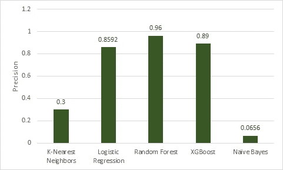
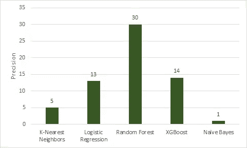
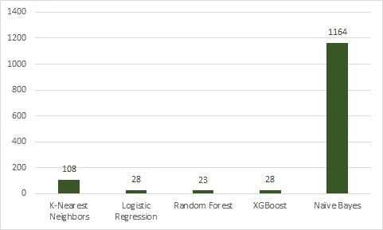

# 算法群体的力量。

> 原文：<https://towardsdatascience.com/the-power-of-algorithmic-crowds-be930baf2139?source=collection_archive---------39----------------------->

## 数字是有力量的…甚至对于机器学习算法也是如此。

罗布·柯伦在 [Unsplash](https://unsplash.com/s/photos/crowd?utm_source=unsplash&utm_medium=referral&utm_content=creditCopyText) 上的照片

# 介绍

在詹姆斯·苏洛维耶茨基(James Surowiecki)的《群体的智慧》(The Wisdom of Crowds)一书中，可以找到关于群体力量的最引人入胜的历史例子之一。在该书中，一个由工程师、海洋学家、打捞人员和数学家组成的团队被要求对可能在哪里找到某艘沉没的潜艇“蝎子号”(Scorpion)做出最佳估计(海军没有足够的人力来搜索整个区域，需要更具体的猜测)。就个人而言，这些猜测非常不准确，但是**小组的综合平均猜测距离沉没潜艇的实际位置只有 220 米！**

事实反复证明，得出一个估计值的最好方法是询问许多不同背景的人——越多越好。我们如何将这一社会学概念应用于机器学习？

# 集成学习

集合模型只是模型的集合，这些模型被平均以提供“群体的猜测”正如人类有偏见一样，模型也带有固有的假设和偏见。**在几个模型中取平均值几乎可以保证减少误差。**

# 数据

对于这个例子，我使用了来自 Kaggle 的一些[信用卡欺诈数据。第一项工作是选择一个评估标准。我注意到有一个**巨大的类别不平衡** (99.8%的数据被标记为正常交易量，另外 0.2%是欺诈性交易)，因此准确性指标不在考虑范围内。对于这类问题，最好选择精度，召回，或者 F1 的分数。为了简单起见，我选择了精确。](https://www.kaggle.com/mlg-ulb/creditcardfraud)

# 模特们

看了一下数据后，我训练了五个模型:K-最近邻、逻辑回归、随机森林、XGBoost 和朴素贝叶斯。每一次之后我得到的精度如下表所示。

五种不同算法的精度。

显然，朴素贝叶斯和 KNN 分类器并不理想，但其他三个做得相当好。**我们使用单个模型的最大精度是 0.96。记住这个数字。**

# 民主(几乎)

将这些输出转化为“类似人群”格式的方法之一是让每个模型根据其收到的答案进行投票。本质上，如果随机森林算法预测为 0，它会投“0”如果所有其他算法都预测 1，它们都会投“1”这意味着最终的结果是四个 1 和一个 0。在这种情况下，最终输出将是 1。

我使用了一个“加权投票模型”，其中表现最好的**模型拥有最多的票数**。下面的图表详细说明了我给每个算法投了多少票。

给每个算法的投票。

这些数字是由每个模型的相对精度决定的。现在让他们投票吧！

# 结果呢

运行投票方法后，我收到了以下结果:

预测值:0，实际值:0 → 56，868(真负值)

预测:1，实际:0 → 2(假阳性)

预测:0，实际:1 → 21(假阴性)

预测:1，实际:1 → 71(真阴性)

**这转化为 0.973 的精度！**请注意，对于该数据，假阴性是代价最高的结果，因为这意味着交易是欺诈性的，但我们的模型预测是正常的交易。

为了证明群体比个人更好，这里有一个图表，显示了每个算法被群体正确“投票否决”的次数(即一个算法投票不正确，但其他算法投票正确，因此“投票否决”了第一个算法)。

个人失误但群体成功的事件。

正如所料，我们的朴素贝叶斯模型被否决的次数最多，但即使是随机森林也被其他算法正确否决了 23 次！**朴素贝叶斯模型也在投票中胜出，所以即使它不是表现最好的，它仍然是有用的。**

# 结论

使用集成方法的好处包括将糟糕的模型变成重要的投票。这种方法几乎没有缺点，应该是每个数据科学家的工具箱中的一项。使用超参数优化可以获得更好的结果，但是我在这个例子中只使用了股票模型。

如果你喜欢这篇文章，你可以关注我以获得更多类似的内容。感谢阅读！