# 使用 PyMC3 估计贝叶斯推理的能力

> 原文：<https://towardsdatascience.com/the-power-of-bayesian-inference-estimated-using-pymc3-6357e3af7f1f?source=collection_archive---------32----------------------->

## [内部 AI](https://towardsdatascience.com/inside-ai/home)

如果您因为贝叶斯回归的复杂性而避开了它，那么本文将展示如何在 Python 中将简单的 MCMC 贝叶斯推理应用于带有异常值的线性数据，使用线性回归和高斯随机游走先验，测试关于正态与 Student-T 先验分布的观测误差的假设，并与普通最小二乘法进行比较。

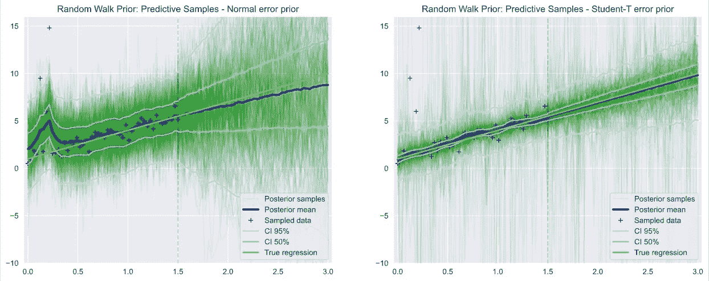

*Ref:*[Jupyter 笔记本](http://www.appliedmachinelearning.ai/assets/pymc3_glm.html) *和* [*GitHub 资源库*](https://github.com/marcusrichards/pymc3_bayesian_regression)

贝叶斯方法的美妙之处在于，它们能够根据对模型参数行为的先验*预期，生成衍生模型质量的概率估计。我们得到的不是单点解，而是每个解都有指定概率的分布。*对数据行为的先验*预期被公式化为一组*先验*，即模型参数的概率分布。*

以下场景基于 Thomas Wiecki 的精彩文章“GLM:稳健的线性回归”,探索了 Python 库 PyMC3 作为使用 Python 中的马尔可夫链蒙特卡罗(MCMC)方法对数据建模的方法，并讨论了派生的贝叶斯模型的预测能力。考虑了不同的先验，包括正态、Student-T、Gamma 和 Gaussian 随机游走，目的是使用广义线性模型(GLM)和采用非参数方法对样本数据进行建模，从估算的先验直接估计观测数据。

## 抽样资料

我们的样本数据生成为一个简单的线性模型，具有给定的截距和斜率，并在每个观测值中添加了一个额外的随机高斯噪声项。为了使任务有趣，少量的离群值被添加到与真实线性模型没有代数关系的分布中。我们的目标是尽可能接近地模拟观察到的线性模型，对异常值和观察误差项的破坏具有最大可能的鲁棒性。

## 正常与学生-T 优先

我们比较了基于正态和 Student-T 观察误差先验的模型。Wiecki 表明，由于分布具有较长的尾部，Student-T 先验在处理异常值方面优于正态分布，传达了异常值不应被视为完全意外的概念。

## 真实线性模型和普通最小二乘(OLS)回归

我们从 y=ax+b+epsilon 形式的模拟观察数据集开始，噪声项 epsilon 来自正态分布。这里，我们 1)根据“真实”线性模型，在 0 到 1.5 的范围内创建观察值，2)添加测试异常值，3)将 x 轴从 1.5 扩展到 3.0，这样我们就可以测试我们的模型在该区域的预测能力。

在预测区域中，我们使用了 ***numpy。MaskedArray()***

可视化模拟数据以及真实回归线和普通最小二乘回归非常有用。

Seaborn 库允许我们绘制这个 directly⁴图，我们还可以设置一个'**健壮的**'标志来计算回归线，同时去除离群值的权重。

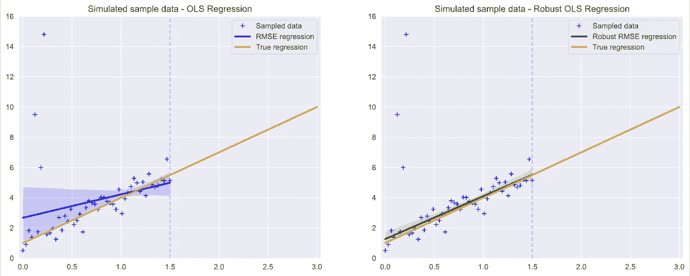

样本点图、真实回归线、普通最小二乘回归(OLS)和稳健 OLS。

## PyMC3 贝叶斯回归

F 按照 Wiecki 的例子，我们可以在 PyMC3 中创建线性回归模型(GLM)，从 y(x)=***‘y ~ x’***生成线性模型。

为了测试**稳健**回归的概念，我们创建了两个模型，一个基于观测误差的正态先验，另一个基于 Student-T 分布，我们预计其受异常值的影响较小。

***pymc 3 . sample()***方法允许我们对条件先验进行采样。在正常模型的情况下，默认先验将用于ε中的截距、斜率和标准差。在 Student-T 模型的情况下，先验将用于截距、斜率和 lam⁷.

运行这两个模型创建了 ***trace*** 对象，这些对象包含在所有链上为每个模型采样的一族后验概率，以观察结果为条件，从中我们可以绘制各个 glm 回归线。

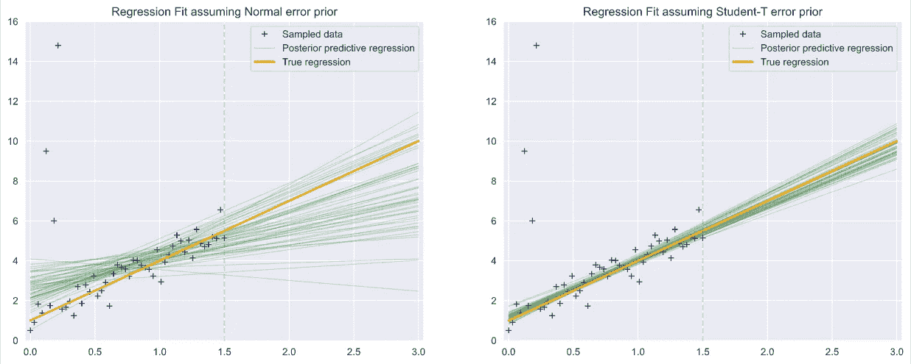

样本点图、真实回归线和贝叶斯线性模型，具有正态和学生 T 先验

## 正态与学生 T 误差分布的比较

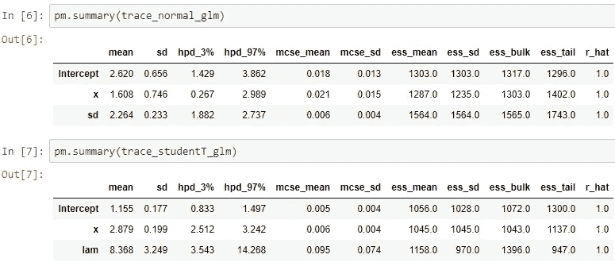

参数分布的汇总可以从***pymc 3 . summary(trace)***中获得，我们在这里看到，来自 Student-T 先验的截距为 **1.155** ，斜率为 **2.879。**因此比正常先验更接近于 **1，3** 的期望值，这给出了截距 **2.620** ，斜率 **1.608** 。

## Student-T 误差分布的细化

从上面的图中可以清楚地看出，我们已经通过使用 Student-T 先验改进了回归，但是我们希望通过改进 Student-T 自由度参数来做得更好。

**模型:**正态模型的标准偏差先验分布是一个半柯西分布，一个具有一个⁴自由度的正域 Student-T，它反映了我们之前的模型。

我们还需要构建一个新的 Student-T 模型，其中除了参数化 glm 之外，我们还在自由度参数 ***nu*** 上创建一个先验。

*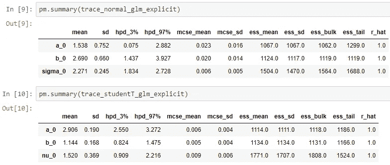*

***结果:**从 ***总结(迹)*** 我们可以看到，从 Student-T 误差分布得到的截距改进为 **1.144** ，斜率 **2.906** 相对于之前的结果 **1.155** ，斜率 **2.879** 。*

***可视化可信区间:**拟合线性模型并获得每个样本的截距和斜率后，我们可以计算出*轴上每一点的期望 ***y(* x)** ，然后使用***numpy . percentile()***将这些样本聚合到可信区间中(CI)⁹在 ***x*** )。**

**当所有马尔可夫链的所有值都保存在跟踪对象中时，我们可以将采样的条件先验的平均值、50%和 95%的可信区间可视化。下面清楚地说明了 Student-T 模型的可信区间与真实回归的接近程度。**

***在本文的后面，我们考虑一个非参数模型，该模型遵循线性趋势线，同时对观测值的波动进行建模，这可以传达我们可能希望保留的局部信息。***

**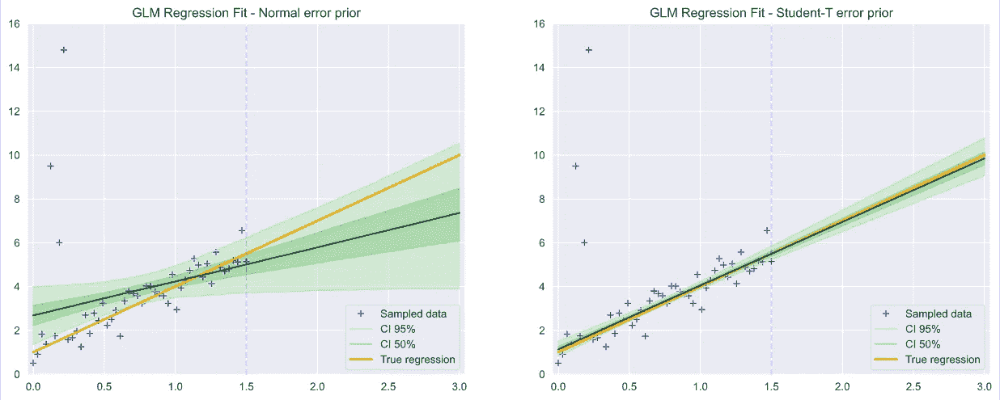**

**具有正态和学生 T 先验的贝叶斯线性模型的可信区间图**

## **后验预测能力**

**B ayesian 推理通过寻求对参数化先验概率分布的修改来工作，以最大化先验参数上观察数据的似然函数。**

**那么，在样本数据缺失的地区，预期后验概率会发生什么变化呢？我们应该发现，考虑到误差项引起的波动，后验预测遵循回归线。**

## **模拟未观测数据**

**我们已经创建了一个***y _ 预测的*** 观察值阵列，该阵列在区域 1.5 到 3 中被屏蔽，表明这些是 ***未观察到的*** 样本。PyMC3 添加这些缺失的观察值作为新的先验值， ***y_missing*** *，*，并计算整个样本空间的后验分布。**

**用这个扩展的样本空间重新运行上述模型产生了现在包括估算的观察值的统计数据。**

**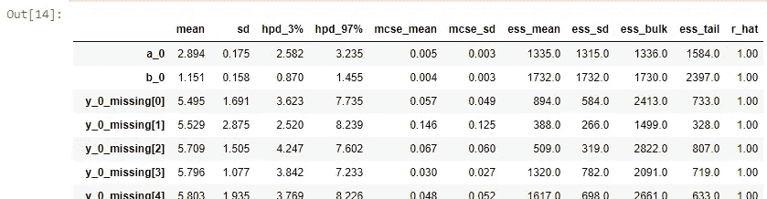**

**当我们运行这个模型时，我们在 ***摘要*** 中不仅看到 a0、b0、nu0 的先验，还看到所有缺失的 y，如 y_0_missing。**

**推断出预测样本观测值的全部范围后，我们可以绘制这些后验均值以及可信区间。**

**我们在下面看到，推断的观察值已经很好地符合预期的线性模型。**

**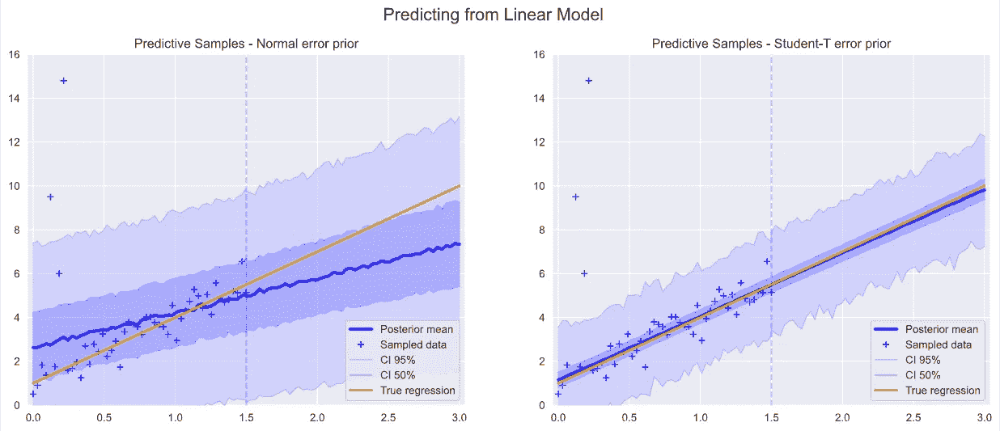**

**具有正态和 Student-T 先验的贝叶斯线性模型的预测样本图**

## **非参数推理模型**

**验证了线性模型之后，如果我们能够用非参数模型对这些样本观察值进行建模，那就太好了。在非参数模型中，我们无需寻找截距和斜率参数，而是尝试使用样本空间中每个数据点的先验信息直接对观察数据进行建模。**

## **非平稳数据和随机游走先验**

**非参数模型的简单假设是数据是稳定的，因此每个数据点的观察样本不会以系统的方式呈现趋势。**

**但是真实世界的数据确实经常趋向于，或者至少受到相邻数据点的平滑要求的约束，因此先验的选择是至关重要的。**

**在我们的方案中，数据是不稳定的，因为它在 x 上有一个明显的趋势。如果我们对我们的观测值使用简单的高斯先验，那么即使在用观测数据进行调节之后，只要我们进入未观测区域，预测的观测值就会迅速返回到它们的先验均值。**

**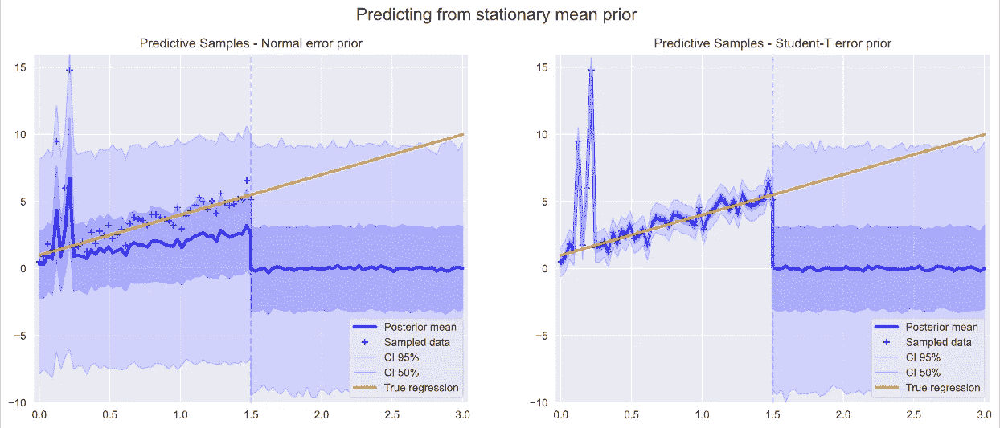**

**y 上具有平稳先验的非参数模型的预测样本图，适用于正态和 Student-T 先验**

## **高斯随机游走先验**

**G 高斯随机游走先验为我们提供了对非平稳数据建模的能力，因为它基于之前的数据点状态加上一个随机游走步骤来估计一个可观测值。PyMC3 实现还允许我们模拟一个漂移参数，该参数为每个随机行走步骤添加一个固定的标量。**

**在这两个推理模型中，我们使用了单个标量漂移参数，在这种情况下，该参数相当于数据在漂移方向上的斜率。**

**重要的是，数据(包括异常值)以相等的样本步长正确排序，因为先验将在数据建模中假设这种行为。由于这个原因，离群值被**插入**到 x 数组的索引点，**而不是**被附加为(x，y)。**

**下面我们运行两个模型，第一个模型的漂移参数设置为零，导致最后一个观测点的静态线，第二个模型的漂移是从数据中推断出来的。**

**可以看出，这个最终模型非常好地拟合了线性趋势，特别是在使用受异常值影响较小的 Student-T 先验时。**

**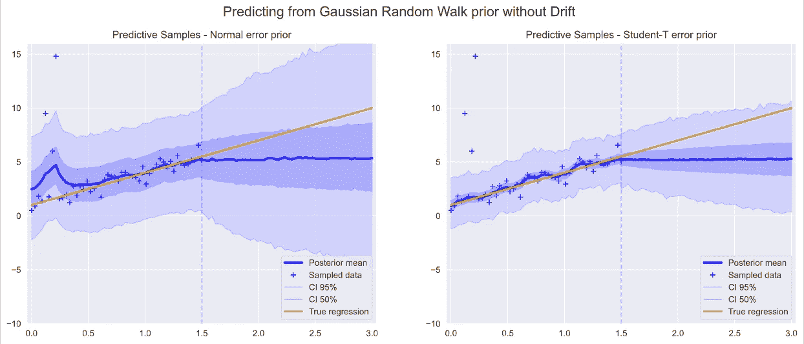**

**对于正态和 Student-T 先验，在 y 上无漂移的随机游走的非参数模型的后验均值图**

**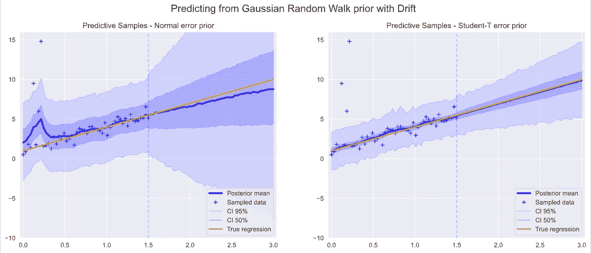**

**对于正态和 Student-T 先验，在 y 上随机游走的非参数模型的后验均值图**

## **绘制高斯随机游走后验样本**

**此外，我们现在可以看到局部扰动中的异常值对线性的影响。**

**下面我们来看一些实际的随机漫步样本。**

**我们不应该期望任何特定的路径接近样本数据的实际预测路径。从这个意义上说，这是一个真正的随机方法，因为我们的结果是从采样路径的统计平均值得出的，而不是从任何特定的样本路径得出的。**

**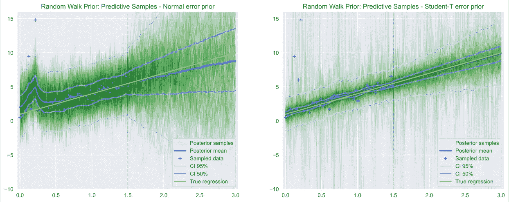**

**具有 y 上漂移先验的随机游走的非参数模型的预测样本图，适用于正态和学生 T 先验**

## **异常值对随机游走预测后验概率的影响**

**已经看到异常值对后验均值的影响，我们推测预测样本的噪声可能是由于异常值引起的随机游走的扰动。**

**为了测试这一点，我们在这里删除了异常值，并重新运行相同的两个预测模型。**

**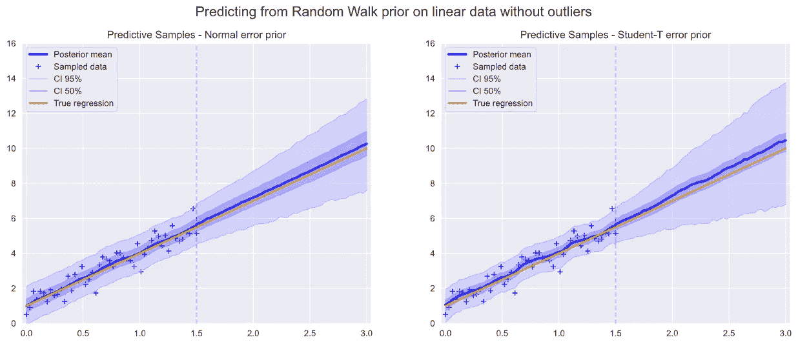**

**无异常值数据的预测后验均值图，具有 y 上的漂移先验的随机游走，用于正态和学生 T 先验**

**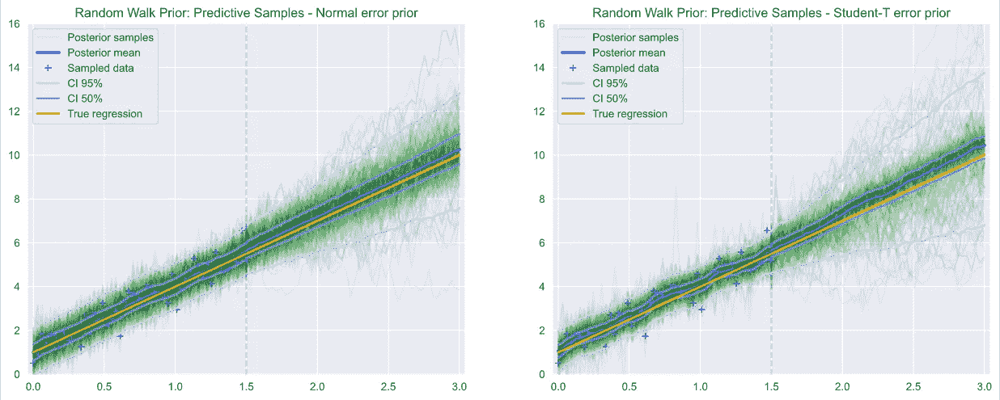**

**无异常值数据的预测样本图，具有 y 上的漂移先验的随机游走，用于正态和学生 T 先验**

**可以看出，预测样本要干净得多，在随机游走样本中具有非常紧密的可信区间和小得多的偏差。这给了我们信心，对于正确的模型，高斯随机游走是非平稳模型拟合的良好条件先验。**

# **结论**

**本文的目的是展示使用 PyMC3 进行贝叶斯学习的简单性和强大功能，希望我们已经:**

*   **表明在稳健线性回归中，Student-T 误差先验比正态先验表现更好；**
*   **证明了在 Student-T 误差先验上改进的自由度提高了对回归线的拟合；**
*   **显示了我们可以快速和容易地绘制线性回归和非参数模型的后验样本的置信区间；**
*   **证明了使用具有漂移的高斯随机游走的非参数模型可以预测未观测区域中的线性模型，同时允许我们可能想要保留的观测数据中的模型局部波动；**
*   **研究了高斯随机游走先验，并表明其混沌行为允许其探索广泛的样本空间，同时不妨碍其生成平滑的预测后验均值。**

**感谢阅读，请随时添加评论或更正。完整的源代码可以在 [Jupyter 笔记本](http://www.appliedmachinelearning.ai/assets/pymc3_glm.html)和 [GitHub 资源库](https://github.com/marcusrichards/pymc3_bayesian_regression)中找到。**

# **参考**

**[1] T .威茨基， [GLM:稳健线性回归](https://docs.pymc.io/notebooks/GLM-robust.html) (2018)，PyMC3**

**[2] J. Salvatier1，T. Wiecki，C. Fonnesbeck，[使用 PyMC3 在 Python 中进行概率编程](https://pdfs.semanticscholar.org/8085/b60ce1771647f11ccc4728397275b502f359.pdf) (2016)，PeerJ 计算机科学**

**[3] J. Salvatier1，C. Fonnesbeck，T. Wiecki， [GLM:具有异常值检测的稳健回归](https://pymc3-testing.readthedocs.io/en/rtd-docs/notebooks/GLM-robust-with-outlier-detection.html) (2016)，PyMC3**

**[4] M. Waskom，[seaborn . reg plot](https://seaborn.pydata.org/generated/seaborn.regplot.html)(2012–2020)，seaborn.pydata**

**[5] J. Jones，M. Mastanduno，T. Larsen，机器学习与统计:何时使用每一个—healtc care . ai([https://healthcare.ai/Machine-Learning-vs-Statistics-use/](https://healthcare.ai/machine-learning-versus-statistics-use/))，health care . ai**

**[6]达林，[线性回归 vs 贝叶斯回归](https://educationalresearchtechniques.com/2017/10/18/linear-regression-vs-bayesian-regression/) (2017)，教育研究技术**

**[7] PyMC3 开发团队，[连续发行](https://docs.pymc.io/api/distributions/continuous.html#pymc3.distributions.continuous.StudentT) (2018)，PyMC3 API**

**[8] A. Gelman，[学生最佳实践-T 优先](https://statmodeling.stat.columbia.edu/2015/05/17/) (2015)，统计建模，因果推断**

**[9] [贝叶斯可信区间](https://en.wikipedia.org/wiki/Credible_interval) (2020)，维基百科**

**[10] PyMC3 开发团队，[推断抽样](https://docs.pymc.io/api/inference.html) (2018)，PyMC3 API**

**[11] P. Orbanz，Y. W. Teh，[贝叶斯非参数模型](https://www.stats.ox.ac.uk/~teh/research/npbayes/OrbTeh2010a.pdf) (2010)，牛津大学统计系**

**[12] T .约尔达诺娃，[平稳和非平稳过程介绍](https://www.investopedia.com/articles/trading/07/stationary.asp) (2020)，Investopedia**

**[13] A. Gelman，[优先选择建议](https://github.com/stan-dev/stan/wiki/Prior-Choice-Recommendations) (2020)，斯坦-dev/斯坦**

**[14] Hiro，[贝叶斯回归使用 PyMC3](https://h1ros.github.io/posts/bayesian-regression-using-pymc3/) (2019)**

**[15] Paul， [PYMC3 贝叶斯预测锥](https://stackoverflow.com/questions/45828517/pymc3-bayesian-prediction-cones) (2017)堆栈溢出**