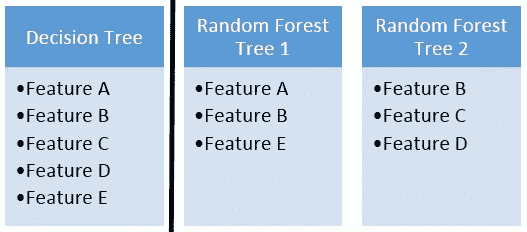

# 机器学习中集成方法的力量

> 原文：<https://towardsdatascience.com/the-power-of-ensemble-methods-in-machine-learning-7ddd28d7d8e6?source=collection_archive---------38----------------------->

## 如何通过装袋和增压来提升性能

[张阳](https://unsplash.com/@iamchang?utm_source=unsplash&utm_medium=referral&utm_content=creditCopyText)在 [Unsplash](https://unsplash.com/s/photos/group?utm_source=unsplash&utm_medium=referral&utm_content=creditCopyText) 上的照片

一般来说，在团队中工作的人比个人更有可能表现得更好。群体的一个优势是他们能够从许多不同的角度来完成一项任务，而这对于个人来说是不可能的。我们没有意识到的问题可能会被同事发现。分组的优势也适用于机器学习模型。我们可以通过对个别弱学习者进行分组来创建一个健壮的、高度精确的模型。在机器学习领域，**集成方法**用于组合基础估计器(即弱学习器)。两种类型的集成方法是**平均**(例如 bagging)和**增强**(例如梯度增强、AdaBoost)。

集成方法不仅提高了性能，而且降低了过拟合的风险。考虑一个评估产品性能的人。一个人可能过于关注某个特定的特征或细节，因此无法提供一个很好的概括评价。另一方面，如果一群人评估产品，每个人可能会关注不同的功能或细节。因此，我们降低了过于关注一个特性的风险。最后我们会有一个比较概括的评价。类似地，集成方法导致良好的一般化模型，从而降低过拟合的风险。

# **装袋**

打包意味着聚合几个弱学习者的预测。我们可以把它想成**平行**结合弱学习者。将几个弱学习者的预测平均值作为整体预测。最常见的使用 bagging 方法的算法是**随机森林**。

随机森林的基本估计器是决策树，它通过反复提问来划分数据。随机森林是由多个决策树结合 bagging 方法构建的。如果用于分类问题，总体预测基于从每个决策树接收的结果的多数投票。对于回归，叶节点的预测是该叶中目标值的平均值。随机森林回归取决策树结果的平均值。

随机森林的成功高度依赖于使用不相关的决策树。如果我们使用相同或非常相似的树，总体结果将不会比单个决策树的结果有太大的不同。随机森林通过**自举**和**特征随机性**实现不相关的决策树。

**bootstrapping**是从带有替换的训练数据中随机选取样本。它们被称为 bootstrap 样本。下图清楚地解释了这一过程:

[图源](https://www.researchgate.net/figure/An-example-of-bootstrap-sampling-Since-objects-are-subsampled-with-replacement-some_fig2_322179244)

**特征随机性**通过为随机森林中的每个决策树随机选择特征来实现。随机森林中每棵树使用的特征数量可通过 **max_features** 参数控制。

特征随机性

自助样本和特征随机性为随机森林模型提供了不相关的树。

超参数是学习算法的关键部分，它影响模型的性能和准确性。随机森林的两个关键超参数是 **max_depth** 和 **n_estimators。**

**max_depth:** 一棵树的最大深度。树的深度从 0 开始(即根节点上的深度为零)。如果未指定，模型会一直拆分，直到所有叶子都是纯的，或者直到所有叶子包含的样本数少于 min_samples_split。过度增加深度会产生过度配合的风险。

**n_estimators:** 代表一个森林中的树木数量。在一定程度上，随着森林中树木数量的增加，结果会变得更好。然而，在某个点之后，添加额外的树不会改进模型。请记住，添加额外的树总是意味着更多的计算时间。

# **助推**

Boosting 就是把**系列的几个弱学习者组合起来。我们最终从许多顺序连接的弱学习者中得到一个强学习者。梯度增强决策树(GBDT)是最常用的集成学习算法之一。像在随机森林中一样，GBDT 中的弱学习器(或基估计器)是决策树。然而，组合决策树的方式是不同的。**

梯度提升算法以这样的方式顺序地组合弱学习器，即每个新的学习器适合于来自前一步骤的残差，从而改进模型。最终的模型汇总了每一步的结果，从而形成了一个强学习者。**梯度提升决策树**算法使用决策树作为弱学习器。损失函数用于检测残差。例如，均方误差(MSE)可用于回归任务，对数损失(log loss)可用于分类任务。值得注意的是，当添加新的树时，模型中现有的树不会改变。添加的决策树符合当前模型的残差。

梯度推进决策树

**学习率**和 **n 估计量**是梯度推进决策树的两个关键超参数。学习率，表示为α，简单地表示模型学习的速度。每增加一棵树都会修改整个模型。修改的幅度由学习速率控制。

学习率越低，模型学习越慢。较慢的学习速率的优点是模型变得更加健壮和通用。在统计学习中，学习速度慢的模型表现更好。但是，慢慢的学习是要付出代价的。训练模型需要更多的时间，这就引出了另一个重要的超参数。 **n_estimator** 是模型中使用的树的数量。如果学习率低，我们需要更多的树来训练模型。然而，我们需要非常小心地选择树的数量。使用太多的树会产生过度适应的高风险。

# **关于过拟合的说明**

随机森林和梯度推进决策树之间的一个关键区别是模型中使用的树的数量。增加随机森林中的树木数量不会导致过度拟合。在某个点之后，模型的准确性不会因为添加更多的树而增加，但是也不会因为添加过多的树而受到负面影响。由于计算原因，您仍然不希望添加不必要数量的树，但是没有与随机森林中的树的数量相关联的过度拟合的风险。

然而，梯度推进决策树中的树的数量在过度拟合方面非常关键。添加太多的树会导致过度拟合，所以在某个时候停止添加树是很重要的。

感谢您的阅读。如果您有任何反馈，请告诉我。