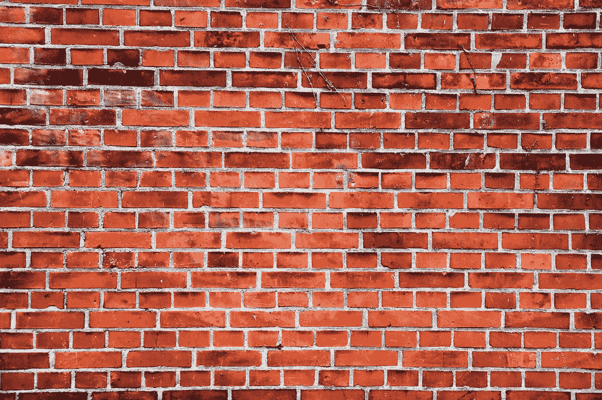
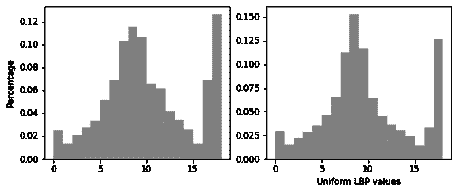

# (本地二进制)模式的力量

> 原文：<https://towardsdatascience.com/the-power-of-local-binary-patterns-3134178af1c7?source=collection_archive---------20----------------------->

图片由 [Unsplash](http://unsplash.com) 上的 [H Heyerlein](https://unsplash.com/@heyerlein) 拍摄

## [实践教程](https://towardsdatascience.com/tagged/hands-on-tutorials)

## 无监督贝叶斯推理(降低维度和挖掘特征)

(**左**摄于 [Unsplash](http://unsplash.com) 上的[布拉德利·布里斯特](https://unsplash.com/@bradley_brister))

# 基于边缘和纹理的聚类

你能说出这些图像之间的区别吗？简单对吗？我敢肯定，你们中熟悉经典机器学习方法的人可以很快找到一种分类算法来自动完成这一过程。

但是当我们没有任何标签的时候呢？希望对你们中的一些人来说，一些新奇的无监督聚类算法浮现在脑海中。但是，当我们在计算病理学或其他形式的复杂医学图像分析领域工作时，我们如何在 13 英寸的 MacBook Pro 上实现数百张 2GB 以上的图像呢(正如我目前正在尝试的)？

谢天谢地，有一大堆令人兴奋和有用的技术来帮助我们实现这一点！

在这个系列中，无监督贝叶斯推理(降低维度和挖掘特征)，我们将探索一系列无监督贝叶斯统计模型，这些模型相当于三重威胁的机器学习:

降维

特征抽出

使聚集

不确定性量化

好吧，有四个，但是四重威胁听起来不太一样…

但是我们可以把前两者结合起来。

看，已经学会如何降维了！

所以，事不宜迟，让我们进入我们的第一篇文章 **: *局部二元模式*** (或者 LBP，为了节省我们的时间)令人难以置信的力量在于它能够区分纹理和地形的微小差异，识别关键特征，然后我们可以用这些特征区分相同类型的图像——不需要费力的标记。

在本文中，我们将涵盖 LBP 背后的关键概念；这个惊人简单的算法所具有的力量；以及我们可以从其实施中获得的许多巨大好处。

LBP 的目标是通过检测边缘、拐角、凸起或平坦区域以及硬线条来编码图像的几何特征；允许我们生成图像或图像组的特征向量表示。

通过对图像之间或给定未知类别的单个图像的共性进行编码，我们允许将它们的特征与另一个图像的特征进行比较。通过这种比较，我们可以确定我们的目标图像和看不见的图像之间的相似程度，并且可以计算所呈现的图像与目标图像具有相同种类或类型的概率。

虽然相当简单，当然也不是什么新东西(它最早是在 2002 年发明的)，但这种无监督学习方法能够仅使用最少的数据来区分惊人相似的图像(具有显著的准确性)。作为一个额外的好处，这是在不需要训练模型的情况下实现的(无论如何在传统意义上)。简单地构建一个比较表示就足以使用这种技术。幸运的是，对于我们这些不太熟悉矢量化表示的人来说，这些表示可以用一种更加用户友好的方式显示:直方图。

为了解释为什么会这样，让我们更深入地研究 LBP 是如何工作的。

LBP 可以分为 4 个关键步骤:

简单化

二元化

概率密度函数计算

(上述功能的)比较

# ***简化***

在我们开始创建 LBP 之前，我们首先需要简化我们的图像。这是我们的数据预处理步骤。本质上，这是我们降维的第一步，它允许我们的算法纯粹关注亮度的局部差异，而不是担心任何其他潜在的特征。

因此，我们首先将我们的图像转换成单通道(通常是灰度)表示(见下文)。这创建了我们的“窗口”,我们可以为其创建 LBP 特征向量来表示图像。

对我们的每个目标图像(代表我们的类型或组的图像)以及我们的输入图像都这样做是很重要的。最棒的是，我们可以处理给定类型或组的单个代表性图像，允许我们以无监督的方式对小数据集的输入进行分类。

# 二元化

接下来，我们计算相对局部亮度变化。这允许我们基于亮度创建每个像素的局部、低维、二进制表示。

对于我们窗口中的每个像素，我们从其局部“邻域”中取出 *k* 个周围像素，并依次与中心像素进行比较，顺时针或逆时针移动。方向和起点无关紧要，只要我们坚持一个方向，依次对每个像素进行计算。对于每次比较，我们输出二进制值 0 或 1，这取决于中心像素的强度(标量值)是大于还是小于(分别)比较像素。这形成了一个 *k* 位的二进制值，然后可以转换成一个基数为 10 的数；为该给定像素形成新的强度。我们重复这一过程，直到每个像素都有一个新的像素强度，表示相对于其邻居的累积局部强度(其中强度值的范围从 0–2^*k*)。这给我们留下了原始图像的降维 LBP 表示。

在实践中，我们首先定义我们的 LBP 参数。这包括设置我们的单元格大小、半径和比较点数( *k* )。我们的单元格大小指的是任意的像素大小，我们可以用它来进一步分割我们的窗口。然后，可以在每个单元上独立地使用上述计算，而不是在整个窗口上。这允许更快和更有效地并行处理图像，并且还提供了使用重叠单元区域来拾取局部模式的可能性，如果我们使用整个窗口来计算 LBP，则局部模式可能会被过于严格地划分。作为标准，我们将单元格大小设置为 16x16 像素(任意)。

半径定义了当生成 LBP 表示时，对于图像中的每个中心像素，我们从其采样我们的比较像素的邻域的大小(即，它是每个比较像素将远离中心像素的像素数)。这准确地定义了我们所说的“本地”的含义。

最后，我们的 *k* 值指的是我们邻域内要采样的点的数量。通常，这是 8，从而为每个像素生成 8 位值；留下我们的最终像素强度值在 0 和 255 之间的范围(2^8).

幸运的是，Scikit-Image 有一个我们可以借用的简单方便的实现，它抽象了这些技术细节:

一旦我们为窗口中的每个细胞生成了 k 位 LBP 表示，我们就可以将它们组合起来形成我们的特征向量。

## 培训补充说明:

这里生成的二进制模式实际上有两种类型:均匀的和不均匀的。这些指的是二进制数在十进制转换之前产生的模式。

当我们说“一致”时，我们是说二进制数在整个模式中最多包含两个值变化(0-1 或 1-0)(例如，11001111、1111110、00011000 和 00111110 是一个字节数据的潜在示例)。相比较而言，(也许并不奇怪)其他一切都是不一致的。

但是我们究竟为什么要关心一个二进制数的变化次数呢？尤其是当我们只使用它来计算基数为 10 的恭维？

很高兴你问了。你看，这种二进制模式的美妙之处在于，它保留了每个像素的局部亮度，以这种方式，编码信息变得旋转不变。这意味着当我们计算我们的 LBP 时，不管图像的方向如何，我们将最终获得相同的 PDF(我们的 LBP 的特征向量表示)。

相比之下，任何不一致的模式都不能产生相同的 PDF，无论方向如何。因此，我们将冒着将相同的图像编码为不同输入的风险，通过使用这些不同的特征模式；可能会破坏我们模型的完整性。

# PDF 计算

现在，回到手头的任务！

那么，我们如何将我们的 LBP 图像表示转换成更有用的东西(老实说，更容易理解)？

当然，我们把它们转换成特征向量！本质上，我们创建一个直方图。这是我们稍微偏离贝叶斯统计的部分，并从我们的常客表亲那里借用了一个老把戏。没错，你猜对了，我们要统计特征。我们以直方图的形式绘制这些结果，连接来自每个单元的 LBP 表示以创建窗口级特征向量表示。同样，在 Scikit-Image 表示法中，大部分都是从我们这里抽象出来的。

作者图片

现在我们有了低维的局部特征表示，我们可以选择将它们用作强大分类器的可轻松训练的输入，如支持向量机或极端学习模型(请关注关于这些的文章),或者我们可以探索这些特征向量，以发现表征我们图像的重要潜在几何特征。

或者，我们现在有能力进行无标签分类(或聚类)，具有不确定性分类的额外好处。

# 比较

最后但同样重要的是，你们一直在等待的部分，是时候 Kullback-Leibler 散度:D(p，q)了。这意味着，分布 q(我们的样本分布)与样本 p(我们的目标分布)相差多少。贝叶斯统计模型的精髓。如果有一件事你需要知道，对于这个系列，对于任何未来学习贝叶斯统计建模，它是 KL 散度(从现在开始被称为 KLD)。

这种强大的贝叶斯算法允许我们比较两个概率密度或质量函数(或者本质上，任何一对分布)，创建一个新的概率分布来解释它们之间的关系。这就告诉我们分布‘q’中的数据点有多大可能来自相同的基础分布‘p’。

然而，需要注意的是，KLD 是不可交换的(它并不能确定 p 是 q 的可能性有多大，只能确定 q 是 p 的可能性有多大)——即 D(p，q) ≠ D(q，p)。

我将继续发表一篇关于这个关键概念的更详细的文章，但是现在重要的是你要理解这个算法想要达到的目的。对于那些现在迫切需要更多具体细节的人，请参见下面的基本 Scikit-Image 实现:

## 所以…

正如你所看到的，LBP 允许我们生成图像的低维表示，强调局部地形特征。通过比较无标签图像的关键视觉特征，这些可用于对无标签图像进行分类，以确定每幅图像从同一群体中取样的概率。

这为我们提供了许多重要的好处:

我们可以创建图像的低维表示，这些图像可以用作更复杂模型的输入向量，现在将更容易分析这些模型(更低的输入复杂度意味着对模型复杂度和计算要求的需求降低)

我们现在有了一种计算简单的高维图像特征提取方法(潜在地减少了存储内存需求)

我们有一个非常精确的分类器，可以在几秒钟内创建和使用(计算效率高，内存需求最小)

我们有一个概率分类器，它为我们提供了真正的可能性，而不是严格强加的类别，并为我们提供了一种不确定性量化的方法

我们可以根据我们想要识别的目标的例子对看不见的图像进行分类，而不需要冗长乏味的标记工作

最后，如果这些术语中的任何一个对你来说看起来复杂或令人困惑，请不要惊慌。虽然旨在让机器学习和统计新手获得 LBPs 中正在发生的事情的“要点”,但我特意为那些想尝试概率建模和维度缩减技术的人提供了一些更复杂的细节。

我将很快发布一系列关于贝叶斯统计和更简单的机器学习方法的文章，在这些文章中，我们将更深入地了解本系列中提到的更基本的元素。如果您有任何问题，请随时联系我们。

为阅读干杯，下一篇文章再见。

# 参考

LBP 方法的所有功劳和它的使用的细节去下面详述的原始论文。LBP 代码实现的所有功劳归于 Scikit-Image

[1]t .奥贾拉和 m .皮蒂凯宁，1999 年。基于特征分布的无监督纹理分割。*模式识别*， *32* (3)，第 477–486 页。

[2]茨韦塔纳·奥贾拉和茨韦塔纳·皮蒂凯宁和马恩帕，2002 年。基于局部二值模式的多分辨率灰度和旋转不变纹理分类。 *IEEE 模式分析与机器智能汇刊*， *24* (7)，第 971–987 页。