# 数学独创性的力量

> 原文：<https://towardsdatascience.com/the-power-of-mathematical-ingenuity-49c7b6cfe05e?source=collection_archive---------23----------------------->

## 用于倾斜校正、文本倒置、旋转分类、单应性和应用数学的对象搜索的计算机视觉

“纯数学方法解决视觉问题的日子已经一去不复返了，现在人工智能已经开始涉足了”——这可能是深度学习实践者最容易误导的想法之一，他们忘记了传统的计算机视觉技术。如果你是其中之一，那么这里有一个让你重新思考的尝试。

许多“在边缘上运行”的计算机视觉算法使用传统数学，而不是计算和存储密集型神经网络。考虑一下，我们有包含文本内容的**扫描图像**。让我们把人工智能放在一边，解决扫描图像中的经典问题**,即。倾斜、旋转和文本倒置，**确定性。**特征匹配&物体搜索**也使用数学魔法，进一步激励你。

下面所有案例分析的源代码都可以在[**这里**](https://github.com/AdroitAnandAI/Computer-Vision-Math-Magic-vs-AI) **找到。**

# **文本倒置**

从图像中识别倒置的文本字体是一项艰巨的任务。颠倒扫描文件时，可能会发生反转**。**即使在旋转或倾斜校正后，文件也可能会反转，**因为 90+θ的旋转被检测为 90-θ，或-90-θ被检测为-90+θ。因此，文本倒置是一个常见的问题，但是很难识别。**

让我们来看看如何用数学公式表示反演。

**方法一:双峰**

1.  **将像素投影到 y 轴上**。每一行将导致一个峰值，事实上，由于英文字符的形状，有两个峰值。

2.**与高斯滤波器**卷积以平滑噪声。

3.**计算峰**(线)的分数，子峰在右侧。

下图说明了这种方法

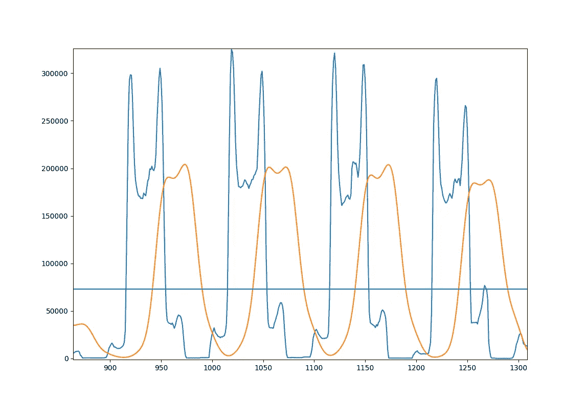

蓝色:原装。橙色:平滑。线条:平滑投影的平均值。

如果文本是大写字母或其他语言，上述方法**将不起作用，因为“双峰逻辑”可能会出错。**

另一个解决问题的数值方法是利用字体形状，如*“水填充技术”【1】*，或者用数学方法表示字符形状，如下所示。我们可以使用形状上下文和对数直方图来数学描述任何形状。这些尝试证明了**“数学独创性”是解决各种问题的有效方法。**

****方法 2:使用 Log-Bin 直方图形成上下文****

**a.**使用 EAST 从图像中找到文本边界框**。{下面}**

**b.**边框内的裁剪图像**和**应用 Canny** 边缘检测。**

**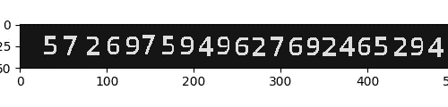**

**裁剪图像**

**c.以字母数字作为基本输入的虚拟图像。从步骤(b)中的基本输入和图像中找到每个字符周围的边界框。**执行步骤{d}-{h}找出字符对之间的最佳对应关系。****

**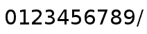**

**现在，把数字图像作为基本输入**

**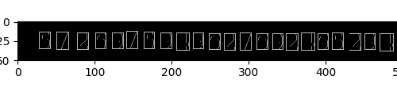**

**裁剪图像上的字符边界框**

**d.从每个字符形状的边缘元素中随机抽取 N 个点。**

**e.构建一个**新的形状描述符——形状上下文。**一个点的形状上下文捕获了其他形状点相对位置的分布，因此**总结了全局形状。****

**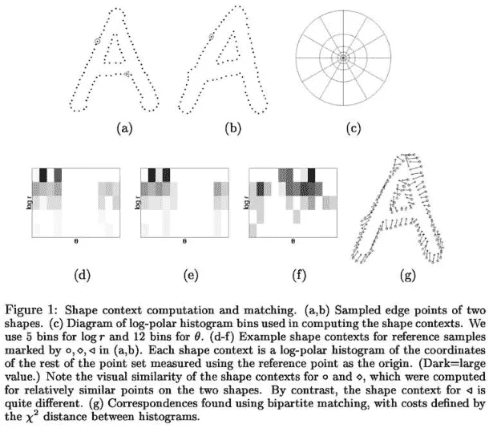****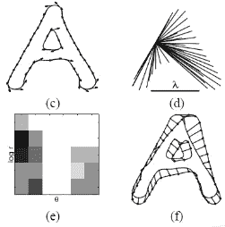**

**对数极坐标系统中的形状上下文**

**f.**使用皮尔森卡方检验**或余弦距离比较对数极坐标直方图。**

**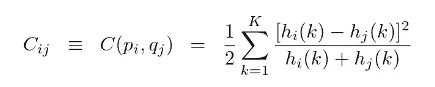**

**h.**为基础图像中的每个边界框找到距离最小的数字**。**对每个包围盒的成本值求和，找出适马(**φ**)。****

**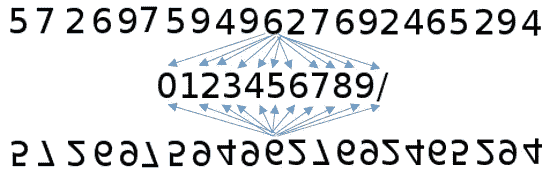**

**将每个数字与基图像中每个数字的形状进行比较**

**I .反转来自步骤(b) **的裁剪图像，并进行步骤{d}-{h}以计算适马(**φ’**)。比较适马值以了解文本反转。****

> ****如果适马(**φ**)<适马(**φ’**)****
> 
> ****然后输入图像是直立的****
> 
> ****否则输入图像被翻转****

**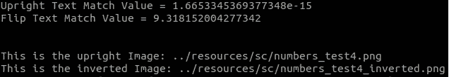**

**文本反转代码的输出**

****东(一种高效准确的场景文字检测器)****

**图像中的文本内容可以使用 EAST 算法进行本地化。**

**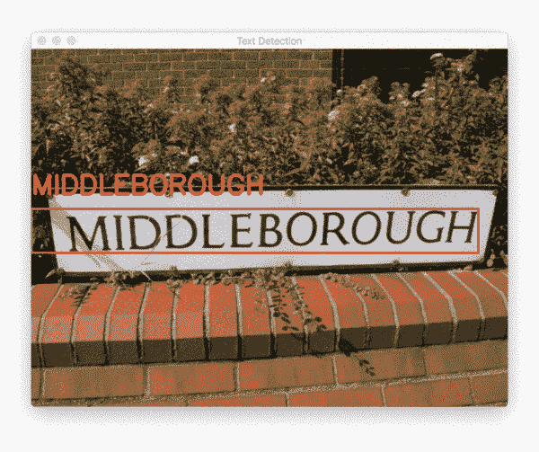**

**自然场景上的东方文字检测([礼貌](https://www.pyimagesearch.com/2018/09/17/opencv-ocr-and-text-recognition-with-tesseract/))**

**同样，我们可以使用 math-hack 来定位图像中的文本**，而不是使用基于人工智能的 EAST 算法**。**你可以找到像素的 y 投影的连续局部最小值，从而找到对应于图像中线分离的连续波谷**。找到一行后，您可以从步骤(b)开始运行方法 2。**

**无论字体大小写或语言如何，上述方法都有效**。****

# ****歪斜校正****

**大多数扫描的文件是歪斜的。因此，在送入 OCR 或甚至显示之前，需要消除图像的倾斜。**

****方法 1:迭代投影****

1.  **将图像从-10 度旋转到+10 度。**

**2.计算所有像素在 y 轴上的投影。**

**3.计算**像素的入射密度。****

**4.将旋转角度步进 0.5 度，并重复步骤 2、3**

**5.求像素入射密度最大的角度**θ**。**

**上述算法的**缺点是:****

**a.迭代计算增加了**时间复杂度。****

**b.**由于步长大小，潜在误差**为 0.5 度。**

**大多数情况下，扫描文件为表格格式或包含线条的表格数据或线条的**点分布**(由于扫描或打印质量不足，扫描图像中的线条可能不连续)。因此，问题归结为**“给定一个点扩散作为输入，我们是否可以计算直线和****θ？”****

****方法 2:霍夫变换峰值****

1.  **读取倾斜的图像并进行谨慎的边缘检测**

**2.**霍夫空间=调用霍夫变换(边缘检测图像)****

**3.在霍夫空间变换(累加器矩阵)中寻找最大值**

**4.使用**斜率的切线**找到显著线的**θ****

****

**5.计算斜率的中间值，**θ'****

**6.将图像旋转**θ’****

## ****霍夫变换****

*   **直线可以用等式来表示，**ρ= Xcos+Ysin，**
    其中(X，Y)表示该点，(φ，ρ)表示法线距离原点的角度和距离。**
*   **如果我们认为(X，Y)为常数，那么 **ρ依赖于****
*   **于是，**我们会得到一条对应于点(X，Y)的(ρ，φ)平面上的正弦曲线。****
*   **对应每个像素，在(ρ，c)平面画正弦曲线。**
*   **对应于代表直线边缘的像素的**正弦曲线将在(ρ，φ)平面的特定点相交。****
*   ****交点给出了常数(ρ，φ)**，使用该常数我们可以在(X，Y)平面上绘制实际的直线。这里 0<180 度< 180 度。**
*   **我们可以用同样的方法来检测高维特征。**
*   **对于圆，a、b、r 应该被参数化为霍夫空间，从而将复杂度增加到 3 维。**

**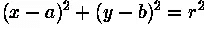**

**霍夫空间中的正弦曲线投票数组可以如下图所示。**

**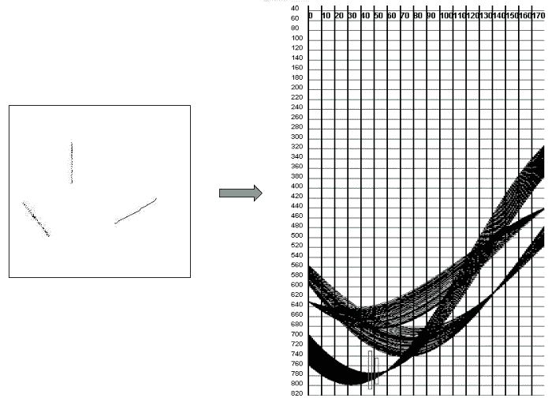**

**投票阵列的霍夫空间可视化**

**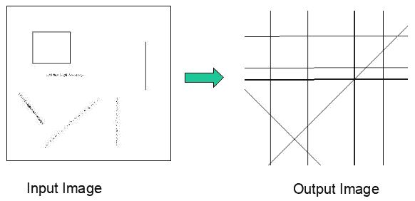**

**从正弦曲线交点重建直线**

****去歪斜源代码:****

****去歪斜输出:****

**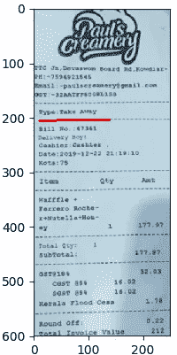**

**检测到斜角:-0.881403996582**

**请注意上图计算倾斜角度的准确性。在迭代方法中，角度θ的**误差**可能是**【步长/2】，**更不用说**巨大的迭代计算成本了。****

**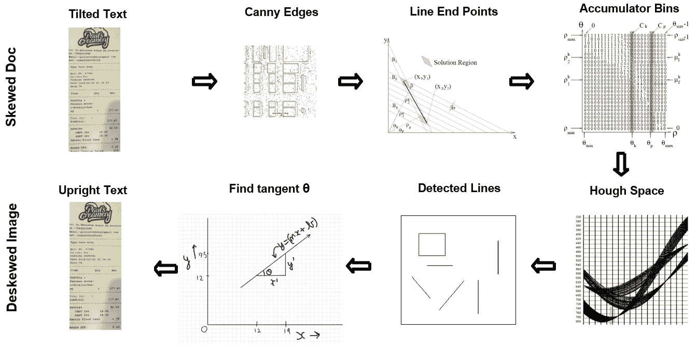**

**去偏斜流水线的功能工作流程**

****注意**:如果扫描的文档不包含您的情况下的线条点扩散，那么**运行上述峰值算法**来查找文本周围的边界框。包围盒的水平边缘的角度θ对应于偏斜度。**

# ****旋转分类****

**旋转是扫描图像中的常见问题。扫描时，文档可以旋转 90°或更多。**

**可以使用如下 CNN 模型将图像分为 4 个象限。但是为什么要加载神经网络，当你可以用算术方法解决它的时候？此外，即使在象限旋转之后，图像也可能保持倾斜。**

**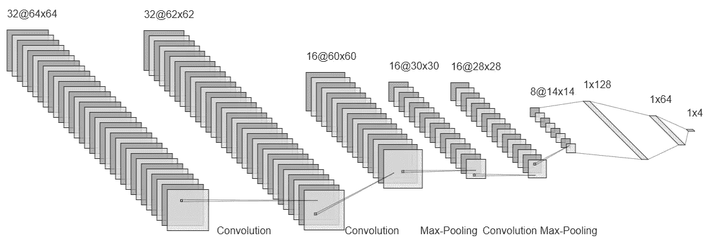**

**四象限分类的 CNN 模型**

****可以用上面的歪斜校正代码求θ，旋转。**唯一的缺点是，90+θ的旋转可能被检测为 90-θ，而-90-θ可能被检测为-90+θ。**因此，一旦旋转，图像就会翻转！****

****原因**:如果旋转 90-θ而不是 90+θ，那么**

> **(90-Θ) + (90+Θ) = 180°**

****解决方案**:要解决上述问题，**只要把去歪斜的图像传递给文本反转码，如果认为有必要，就把它翻转过来**。**

# ****单应****

**比方说**你想在一个包含多个对象的更大的图像中找到一个对象(模板)。我们可以使用带有注释的查询图像的对象检测模型，如 SSD 或 YOLO，来训练要找到的不同类别的对象。但是，我们如何使用简单的数学在更大的图像中找到并定位一个对象呢？****

**我们可以使用单应来寻找点对应，并将坐标从一个角度转换到另一个角度。单应性是一种变换(3×3 矩阵)，它将一幅图像中的点映射到另一幅图像中的相应点。**

**这些是你可以遵循的步骤。**

1.  **首先，打开模板图像和要匹配的图像。**
2.  **从两幅输入图像中查找所有特征。**
3.  **创建一个 ORB 关键点检测器，它比 SIFT 和 SURF 计算量小。**
4.  **使用 orb 检测器找到关键点及其描述符。**
5.  **创建描述符的匹配，然后根据距离对它们进行排序。**
6.  **用 cv2.drawMatchesKnn 画出所有 k 个最佳匹配。**
7.  **从两幅图像中提取匹配的关键点。**
8.  **求单应矩阵，做透视变换**

****源代码:****

****匹配输出:****

**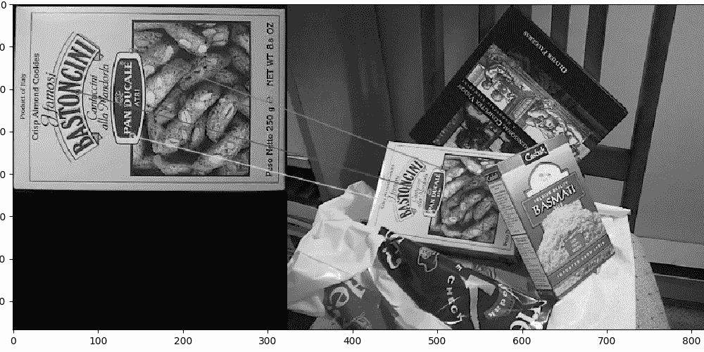**

**找出匹配点对应关系**

**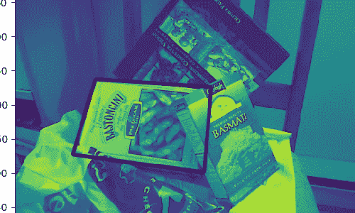**

**透视变换后的对象定位(黑色矩形)**

**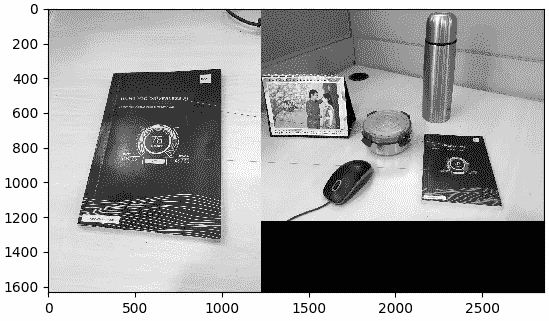**

**在我的书桌上发现了一本书的要点对应**

# ****对象搜索****

**比方说，你需要从一组图像中找到一个物体。你可以使用人工智能模型，因为它是图像分类的经典案例。但是，我们能用传统数学来做这个吗？以下是如何…**

1.  **读取要搜索的对象的图像(查询图像)**
2.  **进行 Canny 边缘检测，并找到轮廓周围的包围盒。**
3.  ****随机抽取“n”个随机点**来描述图像内部的形状。**
4.  ****迭代**，获取输入文件夹中的所有图片。**
5.  **对每张图片执行步骤 2 和 3。**
6.  ****计算“查询图像”的随机形状点与文件夹中每个图像的形状点的相关值**。**
7.  **找到具有最小相关值的**图像。此图像包含您正在搜索的对象的最接近匹配。****

****

**相关方程:u 和 v 是要比较的向量**

**上述等式从概念上**将相关性表示为平均值**附近偏差的相似性。因此，分子表示分布相似性，分母量化 L2 范数以进行归一化。**

****输入图像和查询对象****

**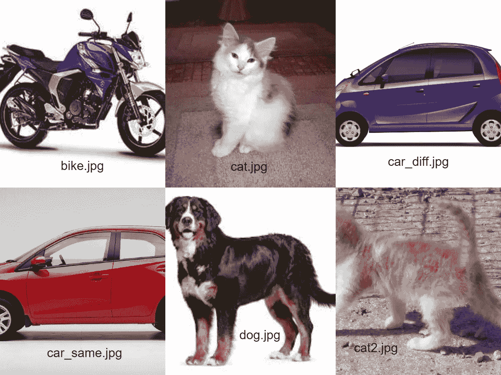**

**不同物体的图像作为输入**

****

**查询图片:小型化分段车**

**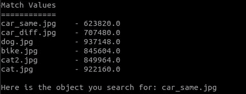**

**输出:输入图像与查询图像的匹配值比较**

**请注意，具有相似形状的不同汽车(紫色)具有第二接近的匹配值，就在红色汽车之后。与其他形状的相关距离明显更大。因此，你可以看到形状匹配是有效的。**

**请注意**相关值不会为 0，即使是相同的图像，因为随机采样点是为了描述形状**。有其他方法**来描述形状而不需要随机采样**但是形状匹配的时间复杂度会变得更高。其中一种称为**转向功能**的方法描述如下。**

**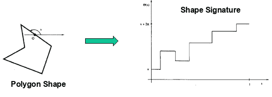**

**左转时增加，右转时减少。边长=曲线长度。**

**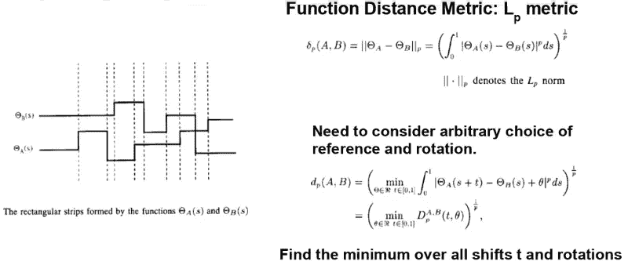**

**求最小 Lp 范数来度量旋转不变曲线的相似性**

**以上所有案例分析的源代码都可以在 [**这里**](https://github.com/AdroitAnandAI/Computer-Vision-Math-Magic-vs-AI) **找到。****

# **结论**

**从上面的案例研究中，你可以看到确定性解决方案比迭代或基于人工智能的解决方案更精确，计算量更小。虽然人工智能可以在许多复杂的任务中表现出色，但谨慎的做法是尝试基于数学的解决方案，并将人工智能作为最后手段。你不需要大锤来敲碎坚果。如果上面的阅读激发了你去欣赏传统技术的美，那么它就达到了目的。**

*****如有任何疑问或建议，可在此*** 联系我**

***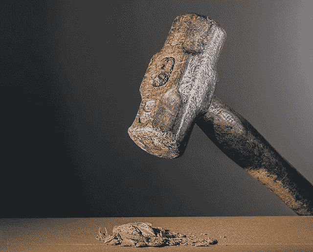***

# *****参考文献*****

*****[1]文本文档图像中的反转检测。** Hamid Pilevar，A. G. Ramakrishnan，电气工程系医学智能和语言工程实验室，**印度科学研究所，Bangalore (JCIS，2006 年)*****

*****[2]形状上下文:一种新的用于形状匹配和物体识别的描述符。塞尔日·贝隆吉、吉滕德拉·马利克和扬·普济查。加州大学伯克利分校电气工程和计算机科学系****(NIPS 2000)*********

*****【3】****利用形状上下文进行形状匹配和物体识别。塞尔日·贝隆吉、吉坦德拉·马利克和扬·普济查。**加州大学柏克莱分校计算机科学系(PAMI 2002 年)*******

*****【4】**[https://medium . com/machine-learning-world/shape-context-descriptor-and-fast-characters-recognition-c 031 EAC 726 f 9](https://medium.com/machine-learning-world/shape-context-descriptor-and-fast-characters-recognition-c031eac726f9)***

***[5][https://stack overflow . com/questions/55654142/detect-if-a-text-image-is-upsided](https://stackoverflow.com/questions/55654142/detect-if-a-text-image-is-upside-down)***

***[https://github.com/argman/EAST](https://github.com/argman/EAST)***