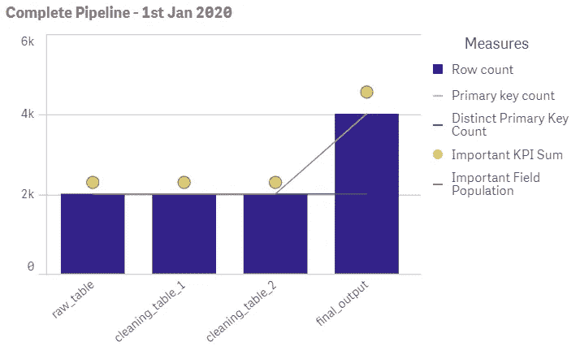
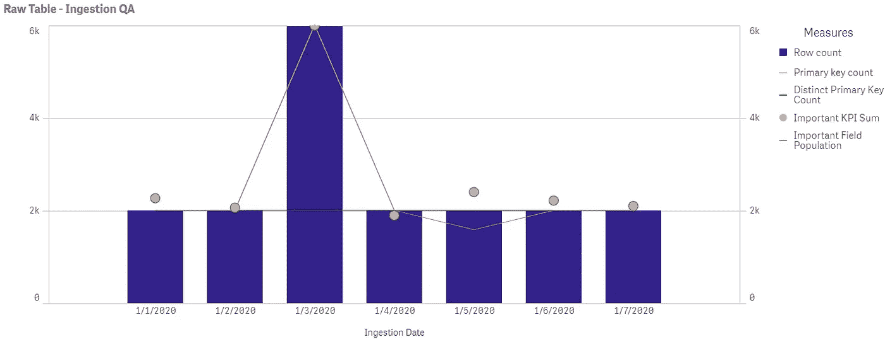

# 质量保证的力量——为 SQL 数据分析管道设计强大的质量保证流程

> 原文：<https://towardsdatascience.com/the-power-of-quality-assurance-designing-robust-qa-processes-for-sql-data-analysis-pipelines-2b85e9a3928a?source=collection_archive---------33----------------------->

## 如何构建完整的质量保证程序来保护您的分析管道

> “一毫克的预防抵得上一公斤的治疗”——约翰·罗伯特·科伦坡

错误时有发生。虫子似乎可以从任何地方出现。数据源可能会在一瞬间动摇，使您的整个分析管道失效。作为一个分析团队，最终解决这些问题并确保您的报告、交付成果和见解尽可能准确是您的责任。设计一个强大的质量保证(QA)流程对于巩固团队对产品的信心至关重要。

本文将概述设计一个健壮的 QA 过程以节省时间、金钱和资源的一些关键步骤；这将确保你通过分析产生最积极的影响。

# 为什么质量保证很重要？

有太多的理由说明为什么一个健壮的 QA 过程对你的企业和团队是无价的。以下是一个完整的质量保证过程的一些最有意义的结果:

*   确认业务决策是利用尽可能好的洞察力做出的
*   提高产出效率，减少重复工作
*   提高对数据问题的反应能力
*   维护利益相关者的信任和客户关系
*   提高分析师对输出的信心，允许更快的工作方式

基于虚假数据的商业决策对所有相关方来说都是昂贵的。这可能意味着工作重复，绩效下降，金钱损失，或者更重要的是，对你产出的信心受到打击。对你和你的团队所提供的见解和建议的信心，对于获得利益相关者的信任，以及对你的工作产生更大的影响是至关重要的。你不希望一个小错误影响你和你的团队未来的表现。大多数大型公司可以将整个团队投入到 QA 流程中，但是在无法访问此类资源的中小型公司中，分析团队作为一个集体，有责任确保构建适当的基础架构，以减少交付物中任何不必要的错误。强大的 QA 流程在预防任何此类问题方面提供了切实、可靠的价值，从而实现高效、有效的数据驱动型决策。

# 有效的质量保证方法

QA 不仅仅是检查你的代码。具有许多移动部件、不断变化的容量和第三方数据源的管道可能难以管理。形成一个考虑到任何直接挑战并考虑到未来错误情景的全面而稳健的 QA 流程，需要从多个角度解决这个问题:

1.  SQL 可读性和翻译
2.  单元和集成测试
3.  在管道的所有阶段监控数据流
4.  减少依赖性
5.  同行评审和优化

本文将概述每个阶段如此重要的原因，建议保持高性能的最佳实践，并确保您的时间花在提供尽可能多的价值上。

# SQL 可读性和翻译

通常，我们的绝对代码效率是我们的编码决策的最前沿。在复杂的查询中操作大量数据确实需要勤奋的思考，以节省处理资源的时间和金钱。但是，通常有机会在绝对性能和可读性之间进行权衡，以改进查询的计算方式。

使用一个简单的 SQL 示例，假设我们想要列出我的记录集合中所有的 vintage 记录的名称。我们可以使用以下查询来解决这个问题:

```
SELECT t_my.record_name 
FROM my_records t_my
INNER JOIN vintage_records t_vin
ON t_my.record_id = t_vin.record_id;
```

如果我拥有一个非常大的、完全不可能的数十亿条记录的集合，这可能接近最佳解决方案，而不是使用计算量更大的子查询。然而，如果我不得不把它交给一个朋友来运行同样的查询，它没有我们通过其他方式可能达到的一目了然的可读性。考虑新分析师在运行查询之前需要解决的问题:

*   查询的目的是什么？
*   vintage_records 的内容有哪些？
*   内部联接是否导致了任何重复？
*   record_id 是主键吗？

在这些情况下，增加这个查询的运行时间几毫秒，以换取一些更可转移、更可读的代码，这是一个非常值得的权衡。通过使用子查询重写并添加简单的注释，我们以非常相似的性能获得了更加清晰的结果:

```
--Returns ALL record names from my collection that are vintageWITH vintage_record_ids AS (SELECT DISTINCT record_id FROM vintage_record)SELECT record_name 
FROM my_records
WHERE record_id IN vintage_record_ids;
```

相同的结果，相似的性能和更好的可读性。注意:

1.  目的明确，便于快速解释
2.  使用 WITH 语句允许自上而下的可读性
3.  清除概述其内容的子查询表的名称
4.  消除了联接的需要，从而简化了代码

良好的可读性最佳实践包括注释掉查询的目的、利用 WITH 语句(cte)、大写函数、保持查询简短并具有清晰的处理逻辑。由于我们的更改，我们现在已经清楚了查询的许多细微差别。我们现在知道了它的用途，并且我们正在返回我的记录集合中的所有结果(不仅仅是唯一的结果)。由于有了子查询，我们可以更快地解释代码，而不必担心任何错误的连接逻辑。更慢但更干净的代码在这里绝对是赢家。

虽然看起来它在这样一个简单的查询上节省了很少的时间，但每次运行它时，它所获得的实际值都将继续得到回报。当您的 SQL 基础设施包含复杂的、数千行的脚本，并且这些脚本都相互集成时，以清晰的方式编写代码的回报将呈指数级增长。更不用说在较小的团队中经常被忽略的因素——当这些脚本的主要分析师休假或请病假时会发生什么？另一个分析师能有效接剧本吗？分析师对提高业务运营的效率有很大的贡献，因此将这一点应用到他们自己的过程和实践中也是至关重要的，以产生可读和可转移的代码的形式。

# 单元和集成测试

测试和重新测试任何生产脚本是最大的不可协商性。我们必须在隔离的片段中测试代码(单元测试)，并且测试这些隔离的片段在一起工作得有多好(集成测试)。例如，测试是否正确创建了临时表，然后确保任何使用临时表的查询都能正确地与它交互。

SQL 简单得令人难以置信，学会预测重复并习惯于诊断错误连接可以为您的日常分析带来更多安宁。注释掉代码以评估每个查询是否产生了预期的结果(单元测试)，并确保它们不会破坏您的任何其他依赖查询(集成测试)，这本身就是一项值得开发的技能。至少，您应该包括回答以下问题的单元测试查询和注释:

*   我的连接前后的计数是预期的吗？
*   我的任何主键被复制了吗？
*   我的联接字段格式相同吗？
*   我的 CASE WHEN 语句是否按预期工作？
*   这个结果有逻辑意义吗？

下一步是确保这些单独的查询与脚本中的任何其他查询协调工作。检查一段代码是否正常工作，但是未能测试该查询如何适应更大的数据管道会产生不必要的、容易避免的漏洞。

花点时间并**记录你的思考过程——**这将通过防止错误并确保错误被快速识别和解决而获得巨大回报。以清晰简洁的方式给出尽可能多的细节。如果结果是正确的，但与直觉相反——在评论中解释它！这里的目标是**使您的输出可重复，并允许其他人轻松验证结果。**在 SQL 脚本编写过程中概述上述内容将很快成为您的第二天性，您将对反复出现的错误形成自己的直觉。除了在我们的工作中建立更多的信心，我们也让我们的同行能够拿起剧本，理解其目的，并以最少的麻烦评估其功效。

# 监控您的数据流

令人难以置信的是，对数据接收的许多看似无关紧要的更改会影响您的数据管道。这里有一些例子:

*   由于贩运问题而出现的空值
*   日期格式、内部 id、国家代码在供应商之间变化
*   由于 API 故障而出现的重复
*   手工输入的数据填写不正确

这些问题中的任何一个都可能以看似模糊的方式影响多个查询，从导致连接失败、中断 NOT IN 语句到弄乱 WHERE 子句。如果在每个处理阶段都没有清晰的数据可见性，这些问题往往会被忽视，最终导致头痛。问题出现的时间越长，后果就越严重——尽早发现这些问题是顺利运营的关键。

清晰的数据可视化是解决这个问题的关键。一种简单的方法是创建一个管道监控表，在数据处理的每个阶段插入关键指标的计数，并在 BI 工具中可视化输出:

```
INSERT INTO qa_pipeline
(SELECT table_name
,CURRENT_TIMESTAMP() as run_timestamp
,count(*) as row_count 
,COUNT(primary_key) as primary_key_count
,COUNT(distinct_primary_key) as distinct_primary_key_count 
,COUNT(*) FILTER (WHERE important_field > '') as important_field_population
,SUM(important_kpi) as important_kpi_sum
FROM raw_table)
```

这是一个非常有用的，通用的格式，我们希望如何跟踪我们的数据。创建表的可视化，如 *qa_pipeline* ，并跟踪重要值，如行数、字段填充、KPI 总和以及查询之间的主键交互，可以实现快速调试。例如，在原始表中，主键总是唯一的。在您创建新表并加入额外信息的清理脚本中，如果我们现在看到主键计数增加，我们知道清理脚本导致了一些重复。相反，如果我们看到不同的主键计数减少，我们知道有些已经被过滤掉了:



2020 年 1 月 1 日完整数据管道的可视化示例(Qliksense)

上图展示了这些 *qa_pipeline* 表格的威力。显而易见，最终表格中的每个指标都加倍了，这表明脚本中产生 *final_output* 的逻辑有错误，这导致了重复。通过简单地**观察每个脚本或查询的真实输出**，可以发现许多问题。如果我们看到 *important_kpi_sum，*显著下降，这将表明在使用 *important_kpi* 时出现了错误，或者在聚合逻辑中出现了错误——这是应该审查代码的明显迹象。虽然对许多分析团队来说，定期手动检查整个输出可能需要太多的资源，但是每天早上快速检查这些汇总可视化将导致更主动的解决方案来诊断不正确的 SQL 脚本。

同一个表的另一个用例是确保您的数据被正确接收— **原始数据的质量将反映您的输出质量。**使用 *qa_pipeline* 表格可视化查看您的摄取表格指标，可以轻松监控您的数据是否符合预期格式。可以轻松快速地识别异常结果，如低行数、缺失天数和大量缺失字段:



一月第一周 *raw_table* 人口的可视化示例(Qliksense)

快速浏览一下，我们可以看到我们的 *raw_table* 存在一些摄取问题。在 1 月 3 日运行该脚本时，我们看到的行数是我们看到的不同主键的三倍，这表明数据可能被摄取了三次。此外，在 1 月 5 日，我们可以看到我们的 *important_field* 没有完全填充，这暗示了一些跟踪问题。只需看几秒钟的图像，我们就可以清楚地评估数据的质量并突出任何问题，进一步提高我们对问题做出反应并有效解决问题的能力。

在展示这些计数时发挥你的创造力，以适应你的业务用例。你的直觉在这里是一个有价值的资源——学会预测你的代码将如何影响你的数据，并将其与这些 *qa_pipeline* 表提供的可视化进行一致的比较。在接收时、数据清理期间和生成可交付结果之后设置这些 INSERT INTO 查询，可以让您对脚本的执行情况有一个端到端的清晰了解，从而节省调试和防止任何错误的宝贵资源。

# 减少依赖性

一个有能力的分析师可以解决任何问题。理论上，如果数据质量保持不变，所有代码都应该运行良好。然而，当管理来自不同来源的多个数据流的摄取时，这种数据质量从来没有得到保证。保持高质量数据的最简单方法可能是**自己控制它，当问题出现时，允许完全的自主性和更大的反应能力。**下次您接收第三方数据时，请考虑以下几点:

1.  如果我们发现了一个错误，那么源头能多快解决它？
2.  我可以通过在内部生成这些数据来获得自主权吗？
3.  是否有任何手动流程可以自动化以减少人为错误？
4.  我们如何利用这些资源来减少对它们的依赖？

考虑这个场景:

> “一个国际第三方正在以每日 excel 报告的形式提供时间序列数据。由于他们所在地区的夏令时，他们提供的时间戳都晚了一个小时，这意味着您在提供的报告中少了一个小时的数据。他们处于完全不同的时区，直到早上才能纠正问题，而客户要求在当天结束前提交一份重要报告。”

这可不是什么好玩的地方。你可以强有力地证明第三方甚至不是同谋，因为这个过程由于许多原因存在固有的缺陷。然而，如果我们对他们提供的数据有自主权，例如通过直接查询他们的 API 我们可以简单地再打一个电话，在几分钟内纠正时间框架。不再错过最后期限，不再有不满意的客户。

事实上，第三方可能没有您可能已经习惯的相同资源、基础架构、实践或方法。这种差异可能会导致摄取、处理或呈现中的错误，如果您出于任何原因需要请第三方重新格式化或再现数据，修复这些错误的速度可能会很慢。尽可能保持对数据的自主权，使您能够更快地应对变化，更快地找到解决方案，并将生产优化到您可以控制的水平。

# 同行评审和优化

在我的分析师生涯中，帮助我的一个关键因素是我向他人学习的能力。我真的很喜欢学习为什么人们在他们所做的事情上成功，以及他们所拥有的特质，我可以把这些运用到我自己的生活和事业中。来自他人的一致的、建设性的反馈确实可以加速你的学习，并激励你做得更好，在分析环境中，同行评审对此至关重要。让同事审查您的代码有很多好处:

*   为您的数据输出增添更多信心
*   创造学习新技术的机会
*   在团队和同事之间分享知识
*   提供另一个思考角度，引发对方法的讨论，并促进更具创新性的解决方案

一双新鲜的眼睛对改进你的代码有着不可思议的影响。让某人处理相同的问题，思考相同的过程并得出相同的结论，对于在过去两个小时内一直盯着同一个多重连接，无法确定它是否正常工作的人来说是非常有益的。我不记得有多少次我带着一个困扰我的 bug 走到队友桌前，只为了让他们在 30 秒内发现它，或者建议一个更有效的方法来达到预期的结果。其中一个最大的原因是，bug 或重复经常出现在最难注意到的、模糊的和不明显的 SQL 交互中，包括最不重要的情况。

作为一名分析师，您识别潜在边缘情况并对其进行解释的能力，最好是在它们发生之前，对于在它们成为现实之前防止任何问题是至关重要的。单独考虑每一个潜在的边缘情况是极其困难的，几乎是不可能的，所以利用你所拥有的最好的资源——与你的团队和同事进行富有成效的讨论。在您的工作流程中建立一致的同行评审，以确保没有任何代码在没有被至少一个同事看到的情况下投入生产，这对于增加您作为分析师的自信大有帮助，并且可以极大地加快工作的交付。

# 结论

确保你的交付品尽可能的高质量意味着尽可能多的考虑错误场景。一旦应用了上面的基础设施和 QA 过程，你会很快发现在 bug 检测、错误管理、交付质量和利益相关者满意度方面有了巨大的改进。我希望这篇文章对您有用，并且您可以应用其中的一些实践来改进您的数据管道过程。

如果你喜欢这篇文章，并想与我联系，请随时在 LinkedIn 上联系我:[https://www.linkedin.com/in/michael-gendy-a04263161/](https://www.linkedin.com/in/michael-gendy-a04263161/)