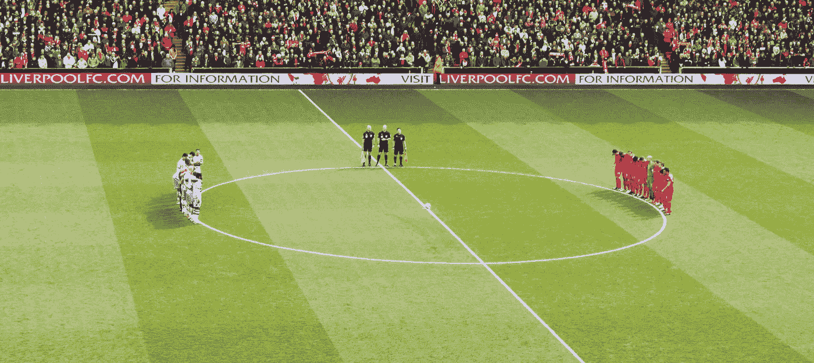
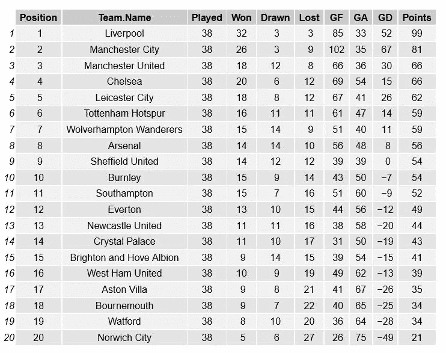
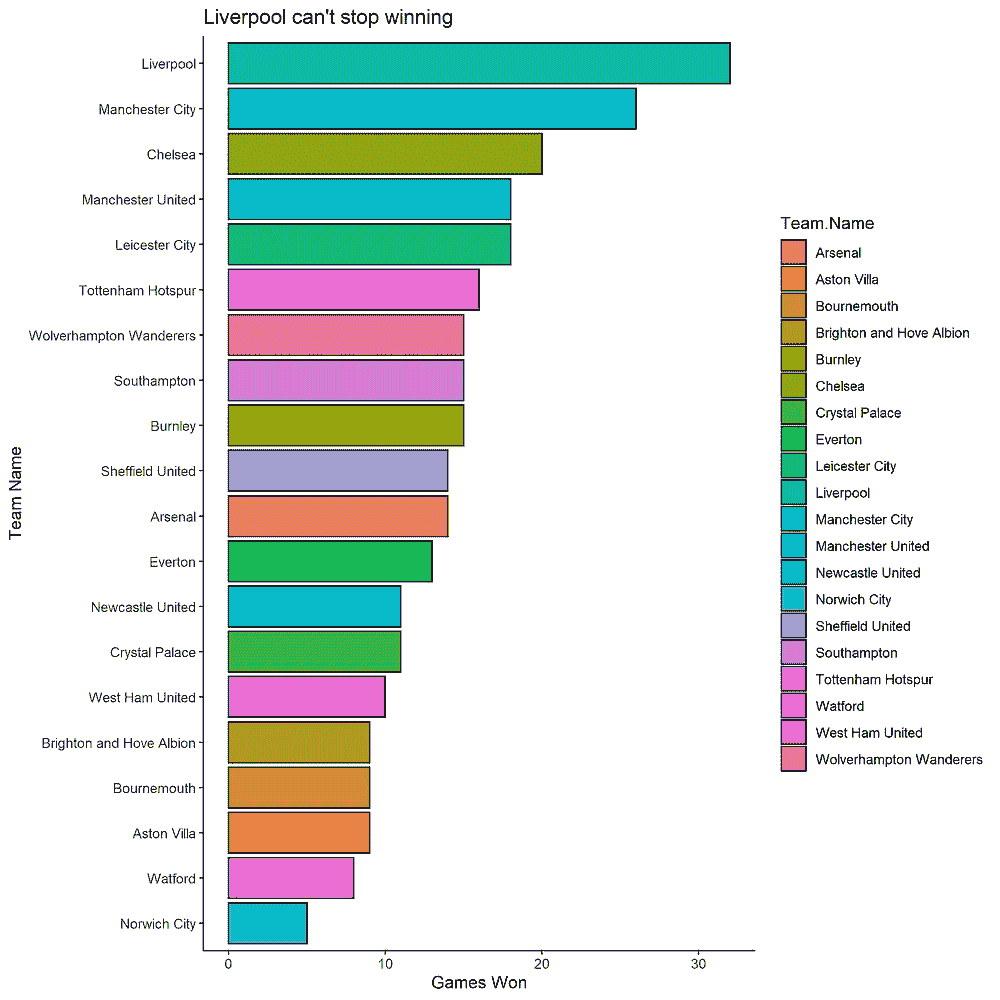
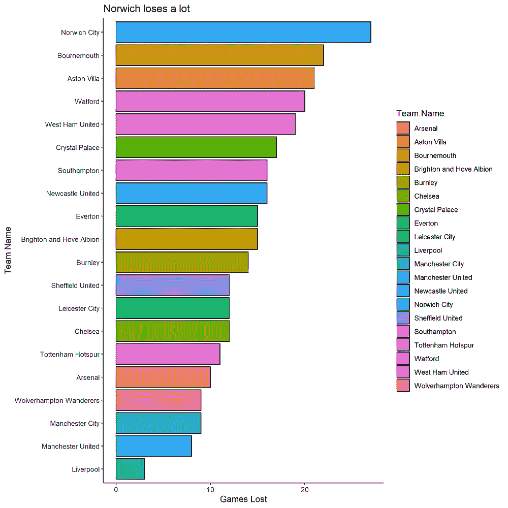
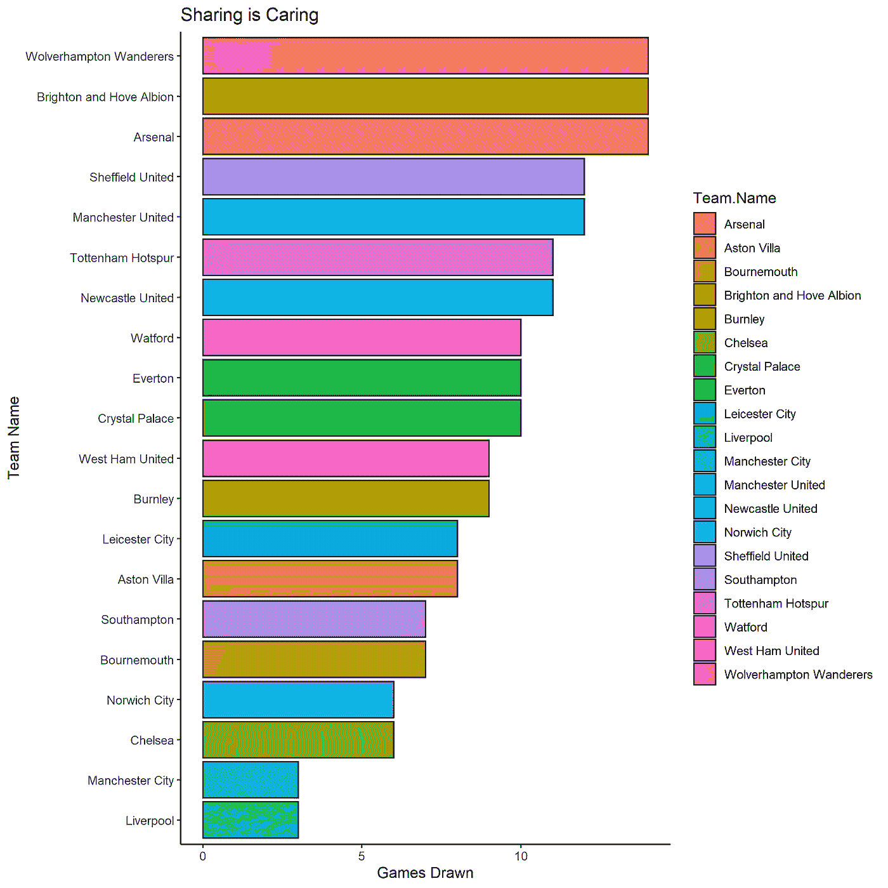
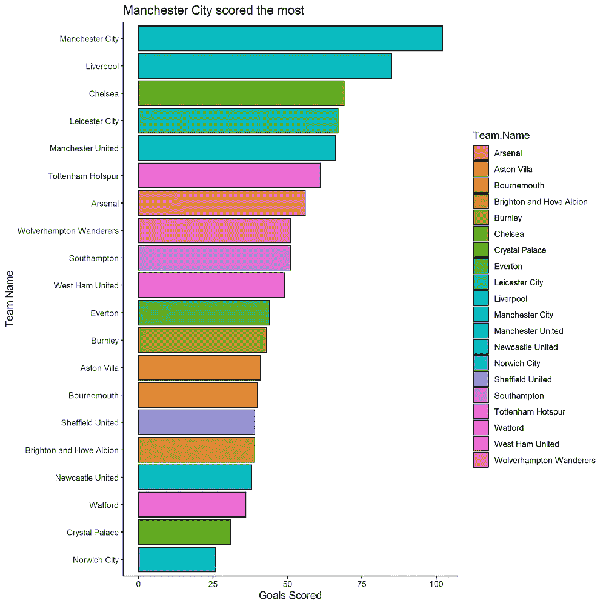
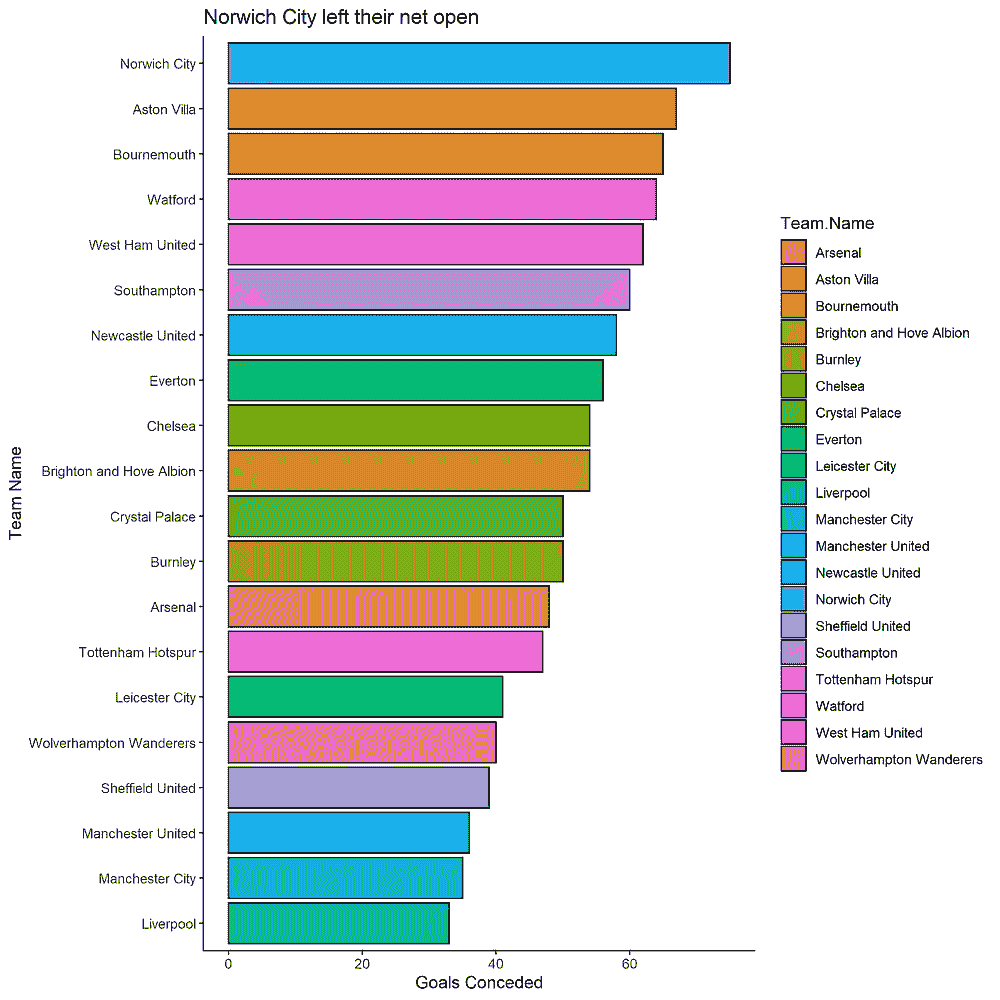
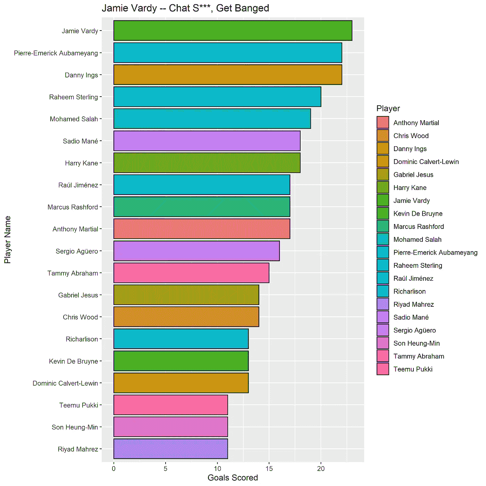
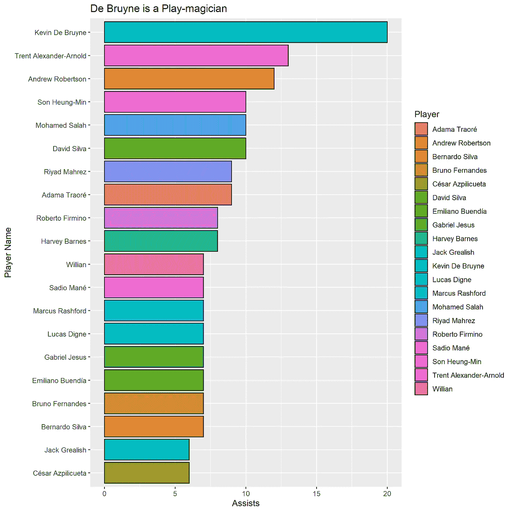
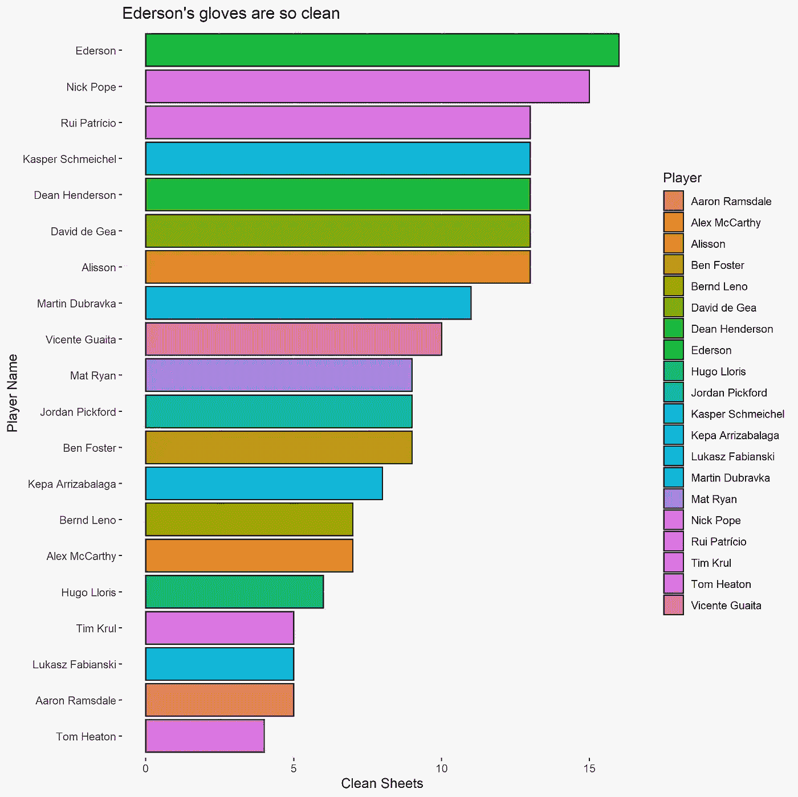

# 本赛季英超发生了什么。

> 原文：<https://towardsdatascience.com/the-premier-league-wrap-up-1cc60c89894e?source=collection_archive---------74----------------------->

图片来源:[https://www . pexels . com/photo/football-green-Liverpool-premier-league-104706/](https://www.pexels.com/photo/football-green-liverpool-premier-league-104706/)

## 世界上最具娱乐性的足球联赛分析

他的英超赛季直到最后一刻都充满了享受、悬念和戏剧性。利物浦以 99 分赢得联赛冠军，并打破了许多纪录，如在还剩 7 场比赛的情况下赢得联赛冠军。尽管曼城的表现高于平均水平，但仍落后冠军 18 分。

曼联在签下布鲁诺·费尔南德斯后踢出了一些令人惊叹的足球，布鲁诺·费尔南德斯已经被证明是*顶级球员*，并且与在弗兰克·兰帕德手下度过了一个不错赛季的切尔西一起获得了冠军联赛的参赛资格。对莱切斯特和布伦丹·罗杰斯来说太糟糕了，他们从第二名跌至第五名。

在赛季末，托特纳姆踢了一些精彩的足球，一些漂亮的团队合作，并在下赛季之前展示了一些惊人的前景。说到下赛季，阿森纳将永远是阿森纳，因为他们已经处于自 1995 年以来的最低点，他们没有希望了。

在冠状病毒爆发中经历了这个伟大的足球赛季后，我决定想象一下球队和球员在 2019/20 赛季英超联赛中的表现

# 英超联赛 2019/20 分析

收集了球队和球员赛季表现的数据，并使用 r 进行分析。最终的排行榜是通过这个[链接](https://www.premierleague.com/tables)获得的。

2019/20 赛季英超积分榜

新的冠军利物浦获得 99 分，距离曼城创造的 100 分的联赛纪录还差一分，曼城排名第二，在向欧足联提出上诉后，现在有资格参加冠军联赛。曼联和切尔西分别获得第三和第四名，曼联以净胜球领先。伯恩茅斯，沃特福德和诺维奇城在降级区结束后被降级到英冠。

## 最大赢家对最大输家

左图是以降序排列的获胜游戏条形图。右图是以降序排列的输了的游戏的条形图。

毫不奇怪，利物浦赢得了最多的胜利。在一个一边倒的赛季后，利物浦赢了 32 场比赛。曼城以 26 胜排名第二。切尔西以 20 胜排名第三，复兴的曼联 18 胜。在获胜图表的底部可以看到两支降级的球队:沃特福德和诺维奇城。

本赛季最大的输家是诺维奇，输了 27 场。那是毁灭性的。伯恩茅斯和阿斯顿维拉分别以 22 负和 21 负的成绩位列第二和第三。我的球队利物浦，输了最少的比赛，3 场。

## 本赛季最大的积分分享者

各队抽签游戏数量的条形图

具有讽刺意味的是，并列第一的是三支球队:阿森纳、狼队和布莱顿队。他们都平了 14 场比赛。谢菲尔德和曼彻斯特联队以 12 平的成绩位居第二。曼城和利物浦各三场比赛，平局最少。

## 进球与失球

左图是进球数柱状图，右图是失球数柱状图

曼城以 102 球进球数最多。利物浦在这一部分获得第二名，落后 17 球。切尔西第三，进了 69 个球，莱斯特第四，进了 67 个球。沃特福德，水晶宫和诺维奇城似乎失去了他们的射门靴，因为他们是最后三名。

不出所料，诺维奇城以 75 个失球成为失球最多的球队，平均每场比赛丢 2 个球。阿斯顿维拉和伯恩茅斯分别位居第二和第三，分别丢了 67 和 65 个球。利物浦队的防守再次被证明是严密的，因为他们丢了最少的球。

# 玩家分析

使用这个[链接](https://www.premierleague.com/stats)从英超联赛网站收集关于球员表现的信息。

## 最高得分者

2019/20 赛季进球最多的前 20 名球员

杰米·瓦尔迪在本赛季处于巅峰状态，进了 23 个球后获得了金靴奖。奥巴姆扬以 22 个进球位居第二。说到稳定性，这和他上赛季的进球数是一样的。Ings 也是第二名。斯特林在过去的几场比赛中进了很多球，他的总进球数达到了 20 个，并攀升至第四名。萨拉赫以 19 个进球排在第五位。

## 顶级组织核心

2019/20 赛季助攻最多的前 20 名球员

德布鲁恩已经做了一些工作，他平了蒂埃里·亨利单赛季 20 次助攻的纪录。这使他在助攻方面位居第一。紧随其后的是两位出色的利物浦组织核心。亚历山大·阿诺以 13 次助攻排名第二，罗伯逊以 12 次助攻排名第三。

## 最干净的床单

2019/20 赛季最干净的前 20 名球员

在确保 16 场零失球后，埃德松在后防线上非常强大。他赢得了本赛季的金手套奖。排在第二位的是尼克·波普，他这个赛季表现出色，15 场比赛没有失球。阿里森、德赫亚、舒梅切尔、帕特里西奥和亨德森都以 13 场零失球排名第三。

## 结论

这个赛季是我有史以来最好的英超赛季之一，因为利物浦终于举起了 30 年来的英超奖杯。为了确保前四名的位置和避免降级的底部都有战斗，这使得观看比赛直到最后都很有趣。

## 有趣的事实

利物浦足球俱乐部在过去三个赛季中输掉了 9 场比赛，这与曼城本赛季输掉的比赛数量相同。

**用于执行项目的完整版代码可以在这里看到******。****

**感谢您的阅读。**