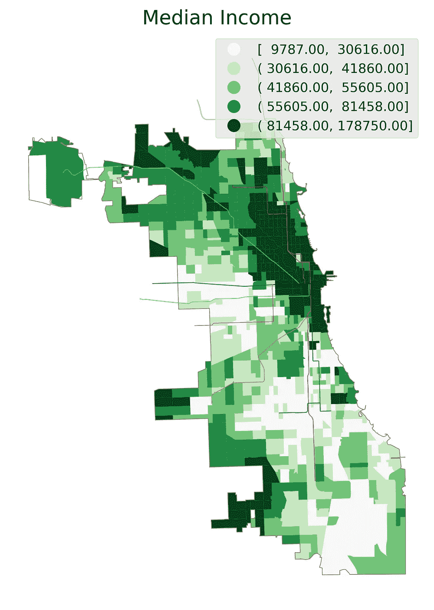
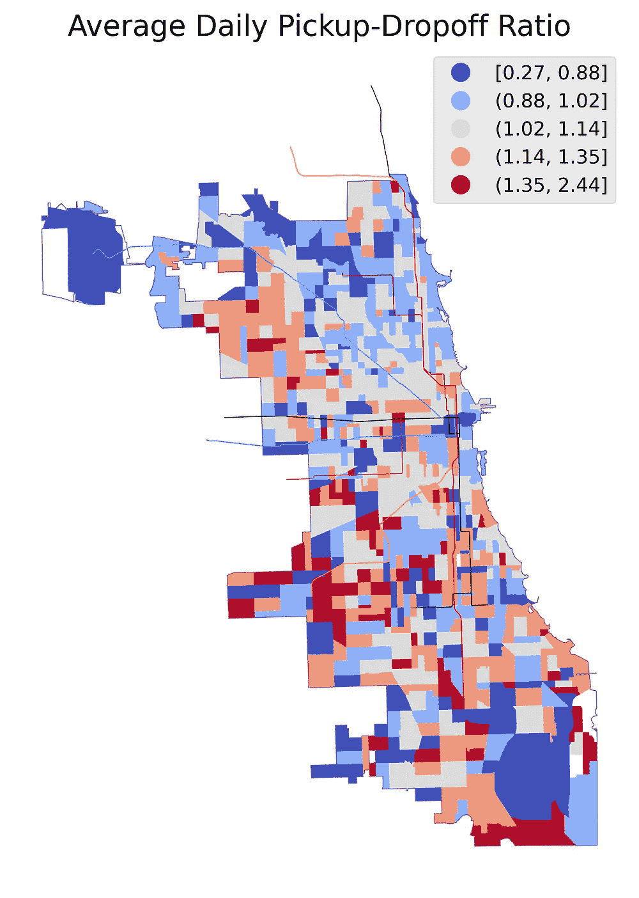
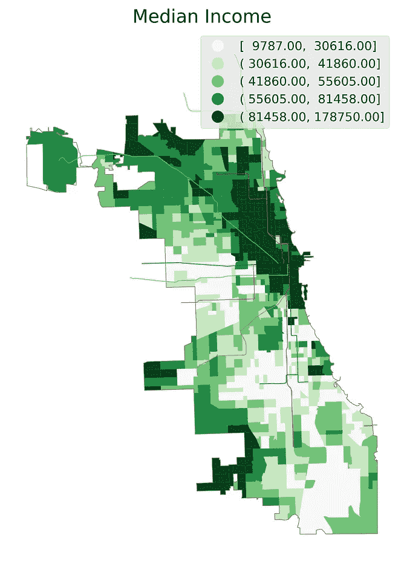
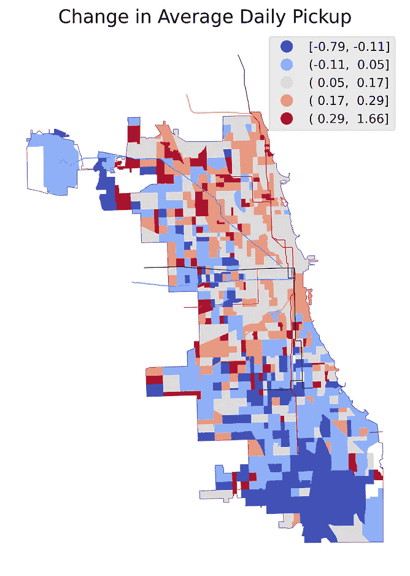
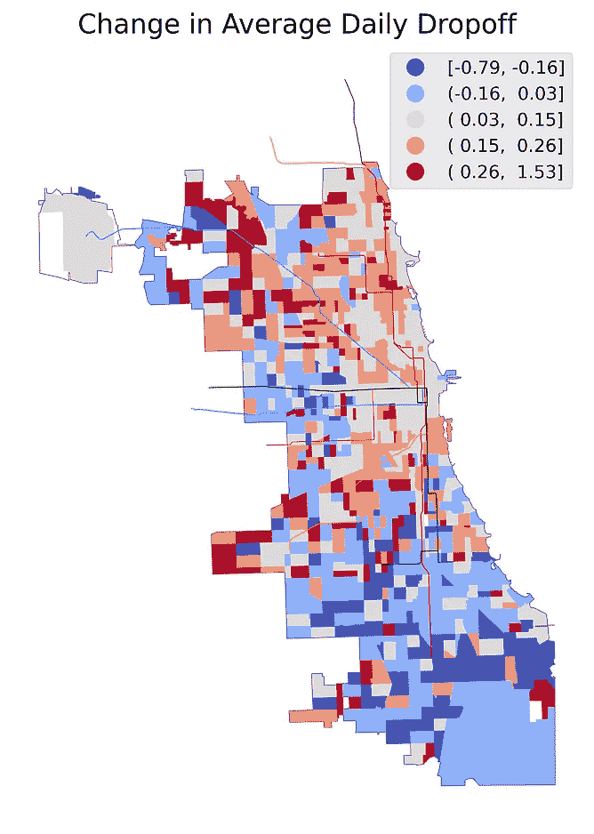
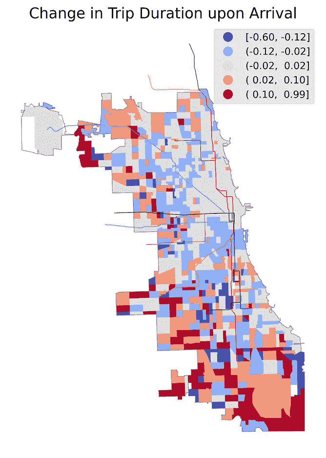
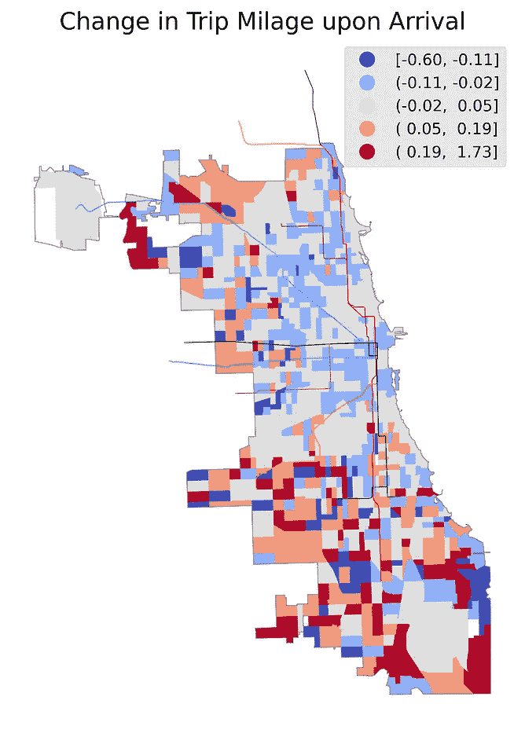
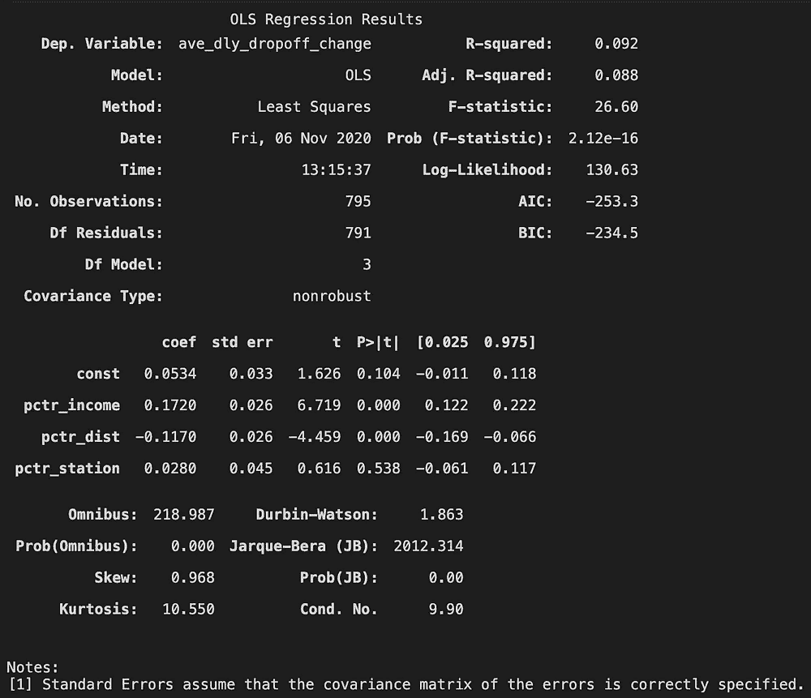
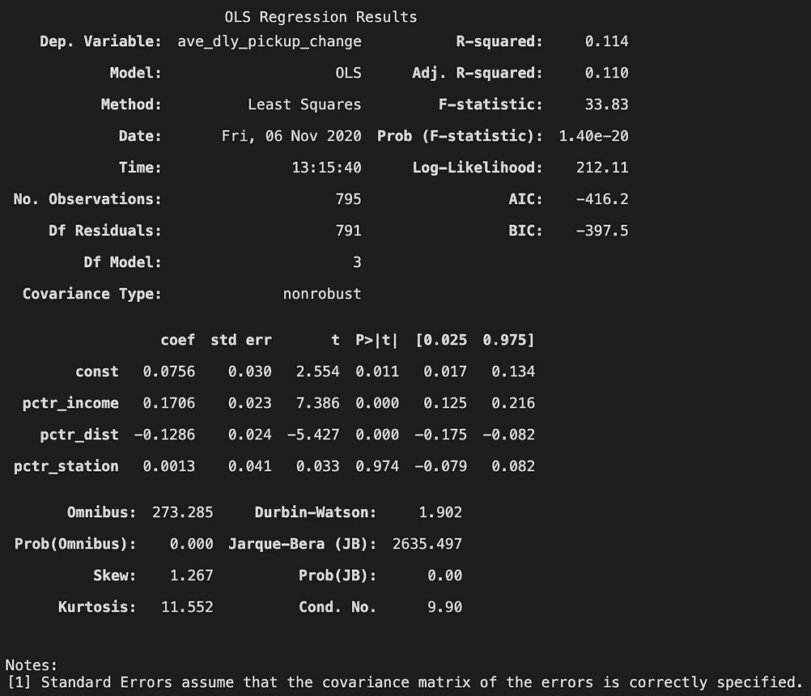

# 在风城搭车的特权

> 原文：<https://towardsdatascience.com/the-privilege-to-get-a-ride-in-the-windy-city-7431513004e?source=collection_archive---------55----------------------->

## 不出所料，富人骑得更频繁。

绰号“风城”的芝加哥无疑给人一种寒风刺骨的印象。平均而言，芝加哥的气温在 10 月份下降最为明显。2019 年万圣节，据[芝加哥论坛报](https://www.chicagotribune.com/weather/ct-viz-halloween-weather-in-chicago-htmlstory.html)报道“雪最大的万圣节”，气温特别低，达到 24 度。

除了独特的天气之外，芝加哥还以一个种族隔离的城市而闻名，那里有一些“明显的贫富分界线”([芝加哥商业](https://www.chicagobusiness.com/static/section/chicagos-wealth-divide.html))。根据同一篇文章，该市的中产阶级正在萎缩，“五分之四的前中产阶级成年人已经沦为低收入阶层。”


照片由[贾斯汀·艾斯纳](https://unsplash.com/@justinbeisner?utm_source=medium&utm_medium=referral)在 [Unsplash](https://unsplash.com?utm_source=medium&utm_medium=referral) 上拍摄

**在上述背景下，我有兴趣调查分层的芝加哥的拼车模式如何受到十月天气减少的影响，提供了由芝加哥拼车公司生成的** [**出行数据集**](https://data.cityofchicago.org/Transportation/Transportation-Network-Providers-Trips/m6dm-c72p) **。**本文的其余部分是对芝加哥市在其[数据门户](https://data.cityofchicago.org/)上提供的[交通网络提供商出行数据集](https://data.cityofchicago.org/Transportation/Transportation-Network-Providers-Trips/m6dm-c72p)的研究。我将介绍:

1.  假设和方法
2.  数据集分析
3.  形象化
4.  相关性的线性回归
5.  结论

# **假设和方法论**

从[数据集的在线仪表板](https://data.cityofchicago.org/Transportation/Transportation-Network-Providers-Trips-Dashboard/pvbr-dkbf)的可视化结果可以证明，10 月份拼车的使用有所增加。因此，我把我的问题集中在拼车模式是如何在整个城市发生空间变化的。我的假设是，拼车使用的变化对城市的影响是不均衡的:

*   较富裕的社区与较贫穷的社区表现出不同的模式，因为较富裕的社区有更高的可支配收入，因此在寒冷的天气里可以负担更频繁的拼车。
*   CTA“L”服务可以抵消邻近区域的增加，因为它提供了一种选择。

为了测试这一假设，我将比较 2019 年 10 月上半月和下半月的乘车份额模式。2019 年 10 月 17 日将是两个组的划分日期，我将想象每个人口普查区域的以下特征:

*   平均每日出发和到达次数
*   到达时的平均行程持续时间和行程里程

可视化将有助于确定 10 月份拼车模式的变化。绘制整个城市的变化图，我想在空间上将这些变化与中等家庭收入的分布和同一地区的铁路线进行比较。

涉及的其他数据集包括:

*   2010 年人口普查区域边界[Shapefile]。芝加哥市，可通过[芝加哥数据门户](https://data.cityofchicago.org/Facilities-Geographic-Boundaries/Boundaries-Census-Tracts-2010/5jrd-6zik)访问。
*   城市边界[Shapefile]。芝加哥市，可通过[芝加哥数据门户](https://data.cityofchicago.org/Facilities-Geographic-Boundaries/Boundaries-City/ewy2-6yfk)访问。
*   芝加哥 L(铁路)线[Shapefile]。芝加哥运输管理局，可通过[芝加哥数据门户](https://data.cityofchicago.org/Transportation/CTA-L-Rail-Lines-Shapefile/53r7-y88m)访问。
*   芝加哥 L(铁路)站[Shapefile]。芝加哥运输管理局，可通过[芝加哥数据门户](https://data.cityofchicago.org/Transportation/CTA-L-Rail-Stations-Shapefile/vmyy-m9qj)访问。
*   2018 年美国社区调查过去 12 个月收入 5 年预估[表格]。美国人口普查局，可通过[人口普查局网站](https://data.census.gov/cedsci/table?q=S19&tid=ACSST5Y2018.S1901)访问。

# 数据集分析

数据分析包括几个步骤:

***数据收集:*** 所有数据集均从上述链接站点获取。

***聚集:*** 经过一些初步的清理，旅行数据集以 10 月 17 日 00:00am 为时间点分为两组，上半年 16 天，下半年 15 天。通过表连接，每月上半月和下半月的以下拼车功能将汇总到人口普查区域级别:

*   平均每日接送
*   到达时行程持续时间和行程里程的平均值、中间值和标准偏差

***准备可视化:*** 将所有未投影的数据集投影到状态平面。连接表中设计了几个功能:

*   上半月平均每日接送率
*   平均每日接送百分比变化
*   中位行程持续时间和中位行程里程的百分比变化

百分比变化计算如下:(`second_half` - `first_half` ) / `first_half`

# 形象化

为了通过比较得出有意义的结论，本文中所有关于拼车的可视化都与城市中值收入分布的可视化并列。

***每日接送率，上半月***



作者图片

虽然城市的大部分地区显示出混合的接送率，但接送率似乎最稳定(约 12~15%)，并且集中在北部、东部的红线和西部的蓝线之间，与最富裕的社区相对应。

***日均接送百分比变化***



作者图片

总的来说，存在着南北分界线，这也与财富线相对应。灰色区域显示接送人数略有增加的趋势(≤ 15~17%)，而橙色区域增加显著(≥ 15%)。蓝色区域略有下降(≤11~16%)。

***中位行程持续时间和中位行程里程的百分比变化***



作者图片

关于旅行持续时间和里程的变化，模式不太明显。灰色区域显示行程持续时间和里程没有显著变化(5%以内)。浅蓝色显示略有下降(≤ 11~12%)，而橙色显示略有上升(≤ 10~19%)。

# 相关性的线性回归

鉴于可视化，我想测试之间的相关性变化接送与收入，距离市中心，以及车站的数量。我将通过线性回归测试它们的相关性:

```
Change = income + distance_downtown + number_station + constant
```

***距市中心距离:*** 粗略目测，选择市中心作为普查地段 8391 的质心。到市中心的距离计算为人口普查区域 8391 的质心和每个人口普查区域的质心之间的欧几里德距离。

***站点数量:*** 执行空间连接以计算落入每个普查区域的站点数量。

***标度:*** 收入、离市区的距离和站数都是百分排名。

***回归:*** 普通最小二乘回归使用包`statsmodel`:

```
import statsmodels.api as sm# same for dropoff and pickup
X = datamodel.dropna()[['income', 'distance', 'station']]
X = sm.add_constant(X)
Y_d = datamodel.dropna().change_dropoffmod_d = sm.OLS(Y_d, X).fit()
mod_d.summary()
```

***模式摘要:***



左图:衰减变化的模型总结；右图:皮卡变化的车型总结；作者图片

虽然调整后的 R 平方对于两个模型来说都非常低，但我们仍然可以认为收入和离市中心的距离都与下降或上升的变化**强烈**相关，由小 P 值支持。就系数而言，收入为正，而距离为负。

最后，站的数量相关性相当弱。

# 结论

我们可以得出结论，出行分担率变化的空间格局与收入分布和离市中心的距离相关。当天气变冷时，富人会更频繁地骑车。然而，贫困社区和远离市中心的地区乘客数量的下降却没有得到很好的解释。

虽然我没有测试旅行持续时间和里程，但他们的可视化并没有显示出城市大部分地区的太大变化。然而，两者在边缘地区的增长无疑表明了与市中心距离的相关性。

**本文是为哥伦比亚大学建筑、规划和保护研究生院城市规划系教授 Boyeong Hong 教授的课程*城市信息学*撰写的。**