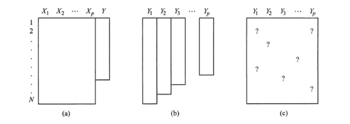

# 缺失数据的问题

> 原文：<https://towardsdatascience.com/the-problem-of-missing-data-9e16e37ef9fc?source=collection_archive---------30----------------------->

## 关于缺失数据的关键概念

全球范围内的数据生成正以指数级和分布式的方式增长。一些因素促成了这种情况，例如数据存储设备在存储空间和数据访问速度方面的发展，以及存储这种数据的方式。

美国犹他州一家名为 DOMO 的数据集成公司在 2018 年进行了一项名为“数据从不睡觉 6”的研究。它的主要目的是回答以下问题:我们每分钟产生多少数据？
他们得出结论，预计到 2020 年，每人每秒将产生 1.7 兆字节的数据，即每分钟 1020 兆字节。图 1 说明了一些公司在 2018 年产生的估计数据。

图 1:2018 年各公司每分钟产生的数据量图解。来源:改编自 Domo Inc [DOMO，2018]

已经开发了标准统计方法和/或机器学习算法来分析矩形和完整的数据集。通常，数据矩阵的行表示单元，根据上下文也称为案例、例子、观察或主题，列表示为每个单元测量的变量或特征。数据矩阵中的条目几乎都是实数，要么代表基本上连续的变量的值，如体重、身高和收入，要么代表可能有序(教育水平、社会阶层)或无序(性别、婚姻状况)的类别。

当数据矩阵中的某些条目没有被观察到时，就有一种现象叫做数据缺失。丢失数据的一些原因是，例如，拒绝回答调查中的一些问题，热或温度传感器故障。有一些处理缺失数据的策略，如通过为数据矩阵中未观察到的条目创建一个或多个特殊代码来识别未回复，如“不知道”或“拒绝回答”，另一种方法是排除具有缺失值的单元。这最后一个策略是非常不合适的，因为我们通常感兴趣的是对整个目标群体进行推断，而不是对某个数据集的目标群体的一部分进行推断。

# 缺失数据模式

当分析数据集的某些不易察觉的知识时，这些数据是以表格格式(矩形或矩阵)观察的。从这个意义上说，可以观察到缺失数据的一些模式。斯查费和格雷汉姆[2002]认为，识别这些缺勤模式是选择最佳技术来填充这些值并对这些模式进行一般(或随机)或特定分类的重要一步。

在缺乏一般(或随机)模式数据的情况下，正如分类本身所表明的，这种缺乏分散在数据集中的任何记录中。关于特定的缺席模式，这些被分为两个单变量和单调的亚型[斯查费和格雷厄姆，2002]。

在被分类为单变量的模式中，当单个变量出现在项目 *Y* 中时，存在指向单个变量的缺席分布，但是 *p* 其他项目 *X1，…，Xp* 的集合保持完整。这种模式还应该包括这样的情况，即 *Y* 表示一组完全观察到的或完全缺失的项目，简而言之，被限制到一个数据集变量。在单调模式中，在不止一个变量中观察到缺失，使得一组项目 *Y1，…，Yp* 在排序时，如果 Yj 包含缺失值，那么 *Yj + 1，…，p* 也将包含【斯查费和格雷厄姆，2002】。图 2 说明了这些概念。

图 2:矩形数据集中的缺失模式:(a)单变量模式，(b)单调模式和任意模式。在每种情况下，行对应于可观察的单位，列对应变量。来源:改编自[Schaferand Graham，2002 年]

# 缺失数据机制

应该观察的另一个特征是数据缺失的机制，换句话说，是什么导致了缺失。斯查费和格拉汉姆[2002]指出，根据统计文献，机制可能是一个过程，通过这个过程，一些数据产生，而另一些数据丢失。Little 和 Rubin [2019]认为该机制与数据丢失的过程有关，并指出了解数据缺失是否与数据集变量的潜在值有关的重要性。

Statistically Little 和 Rubin [2019]对它们的定义如下: *Y* 为完全数据集， *M* 为缺席集，缺席机制的特征是给定 *Y，f (M | Y，φ)* 的条件分布 *M* 其中， *φ* 表示未知参数。

Rubin [1976]定义了缺席机制的三种表现形式:完全随机(MCAR——完全随机缺席)、随机(马尔——随机缺席)和非随机(NMAR——非随机缺席)。

当数据缺失的真正原因未知，并且与任何其他数据集属性没有关系时，即当 *M* 不依赖于 *Y* 的值时，数据缺失被分类为完全随机的，因此如果对于所有的 *Y* ， *φ* ， *f (M | Y，φ) = f (M | φ)* ，数据缺失机制被分类为完全随机的。如果缺失值依赖于任何数据集属性，则被归类为随机。设 *Yobs* 为 *Y* 的完全观测子集， *Ymis* 为缺失数据的观测子集，对于随机的缺失机制， *Ymis* 必须依赖于 *Yobs* ，即对于每一个 *Ymis，φ* ，如果 *(M | Y，φ) = f (M | Yobs，φ)* 。还有第三种称为随机的缺失机制，在这种情况下，缺失分布 *M* 取决于由 *Ymis* 表示的缺失值。Graham 和 Donaldson [1993]将这种缺勤机制定义为不可使用，因为它不可测量，因此不可用于评估。

分析后，可以采取一些措施来解决缺失数据，忽略这种缺失是一种可能的措施，但用实际增加值代替缺失值是解决这一问题的一种非常合理的方法，Rubin [1988]。一篇即将发表的文章将讨论这个话题。

# 参考资料:

1.  DOMO(2018). data never sleeps 6.0 .[https://www.domo.com/assets/downloads/18](https://www.domo.com/assets/downloads/18)DOMO data never sleeps 6+verticals . pdf
2.  斯查费和格雷厄姆(2002 年)。缺失的数据:我们对技术现状的看法。心理学方法，7(2):147。
3.  Little，R. J .和 Rubin，D. B. (2019 年)。缺失数据的统计分析，第 793 卷。
4.  鲁宾博士(1976 年)。推断和缺失数据。生物计量学，63(3):581–592。
5.  格雷厄姆、J. W .和唐纳森(1993 年)。用差异营养评价干预:无反应机制的重要性和随访数据的使用。应用心理学杂志，78(1):119。
6.  鲁宾博士(1988 年)。多重插补概述。美国统计协会调查研究方法部分的进展，第 79-84 页。Citeseer。