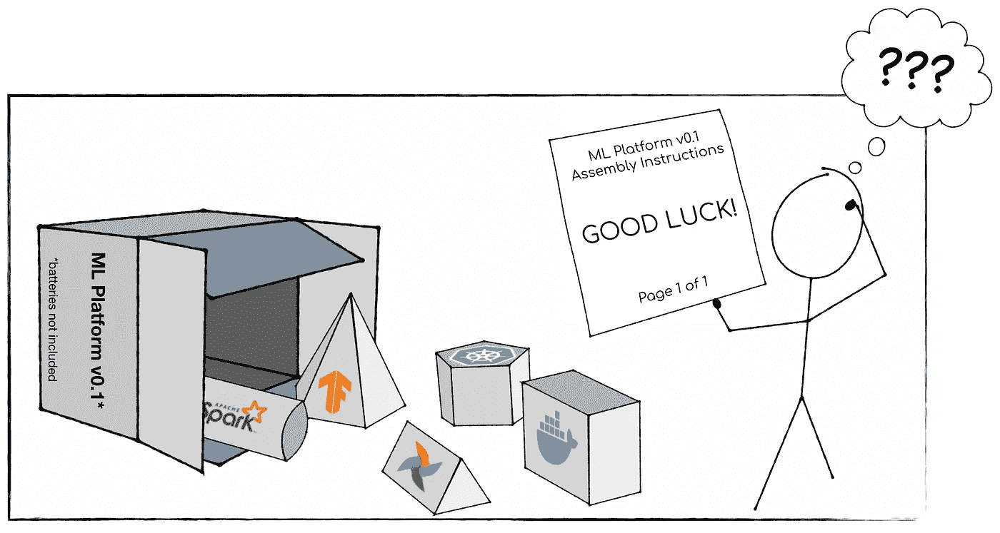

# 面向企业的人工智能开发工具的问题(以及宜家与它的关系)

> 原文：<https://towardsdatascience.com/the-problem-with-ai-developer-tools-for-enterprises-and-what-ikea-has-to-do-with-it-b26277841661?source=collection_archive---------7----------------------->

一年多前，我分享了我关于为什么大多数专注于企业深度学习工具的初创公司会失败的想法。这个帖子引起了很多关注(在[彼得·诺维格的帮助下，他发布了一个关于它的视频](https://www.linkedin.com/posts/pnorvig_startups-ml-artificialinteligence-activity-6496808747783065600-nokQ))，不止一个上述初创公司的创始人告诉我，他们的投资者让他们写了一份回应。我为造成的任何不便道歉，但在这个空间进行更多的审查肯定会有所帮助。

不幸的是，从那以后，情况并没有太大的变化。我亲切地描述这些天来大多数人工智能开发者栈的方式是，他们是*“就像 DIY 工艺包，缺少说明书和 70%的部件”*。创新需要时间。

为了解释我们如何走到这一步，并帮助指导我们需要去哪里，我总结了在技术创新生命周期的早期阶段常见的三个主要挑战。最重要的是，我们还没有为 ML 平台找到一个**主导的设计**，这导致了具有不明确接口的不同范围和形状的系统的扩散。因此，事实证明，为面向企业用户的人工智能开发工具创造**合适的外形**非常困难。最后，这就是宜家的用武之地，如今企业消费这些工具的主要方式不幸遭遇了**宜家效应**。

**图 1** : ML 平台通常缺少很多部件，几乎没有汇编指令(图片由作者提供，徽标来自开源项目 [Spark](https://github.com/apache/spark) 、 [TensorFlow](https://github.com/tensorflow) 、 [Airflow](https://github.com/apache/airflow) 、 [Kubernetes](https://github.com/kubernetes) 和 [Docker](https://github.com/docker)

> “今天的开发者书库就像 DIY 工艺包，缺少说明书和 70%的零件。”

# 人工智能开发工具缺乏主导设计

新技术的出现通常伴随着可能的解决方案设计数量的扩展和收缩。人工智能将改变许多行业，这不再是有争议的，往往会成为一种战略优势，甚至创造新的“人工智能优先”的商业模式和公司。因此，所有主要的云供应商(和无数的创业公司)都在堆积资源，将人工智能开发工具带给更广泛的受众，最重要的是大企业。所有这些供应商都试图解决相同的用户需求，但采用截然不同的方法和结果，导致不同设计的激增。

## **ML API 中的主导设计**

这种现象存在于堆栈的每一层，通常是自下而上的。作为 2016 年谷歌大脑团队的一名项目经理，我记得我试图合理化谷歌内部为 TensorFlow 出现的 20 多种不同的高级 Python APIs。最终，我们集中于估算器和层 API(在 TensorFlow 2.0 中与 Keras 合并)。

一旦某个设计的用户采用率远远超过其竞争对手，它就会成为标准(或“主导设计”)，该领域的其他参与者也会遵循它，例如，参见 PyTorch 中的等效 API。对主流设计的融合需求在平台产品中尤为明显，因为维护无数竞争设计的成本非常高，就像 ML 框架的情况一样，数据科学家、ML 工程师、ISV、教育工作者等等。无法应对成百上千的重叠和不兼容的 API。

## **ML 平台的主导设计**

当我们谈论“面向企业的人工智能开发工具”时，我们实际上是在谈论一种叫做“ML 平台”的新兴技术。事实上，我们缺少 ML 平台的主导设计也意味着没有普遍接受的定义，所以我只给你一个非常基本的定义:ML 平台是一种水平技术(即不特定于垂直用例)，它提供覆盖 ML 应用程序整个生命周期的所有功能。我之前的博客文章中的[图有助于说明这样一个平台的不同组成部分。](https://medium.com/thelaunchpad/your-deep-learning-tools-for-enterprises-startup-will-fail-94fb70683834)

**图 2** :被认为是 ML 平台一部分的不同组件的简单概述(图片由作者提供)

在这个时间点上，业界甚至没有就 ML 平台的范围达成广泛的一致，也就是说，它们在哪里开始和结束。例如，一些 ML 平台产品完全缺乏*预培训(数据准备)*类别的功能。

有几个原因可以解释为什么我们还没有达成一个 ML 平台的主导设计。仅举几个最重要的例子:

*   **底层技术尚未成熟**。ML 平台中利用的许多技术本身都处于其生命周期的早期。当用于所述模型的 ML 框架对其检查点格式进行向后不兼容的改变时，很难构建提供持续更新的 ML 模型的 ML 平台。想象一下，试图在没有定义后端 API 的情况下为 web 应用程序构建 UI。随着 API 的发展，你可能会不经意地回头修改一些东西，在 ML 领域，API 发展很快。
*   **ML 平台创造者不知道他们不知道的事情。**我花了无数时间与工程团队交谈，他们有构建规范 ML 平台的宏伟计划。在大多数情况下，他们的心智模型只有构建一个 ML 平台所需的大约 20%,因此，极大地低估了他们所从事的工作的难度。一个我过去在谷歌如何提出这一点的小故事可能会有所帮助:如果一个随机的谷歌工程师想要制造一辆无人驾驶汽车，并向他们的主管询问人数，典型的反应是*“这太难了，我们已经在这方面投入了大量资源；去 Waymo 工作"*。然而，如果一个随机的谷歌工程师想要建立一个 ML 平台，并向他们的主管询问人数，典型的反应是*“听起来不错，这里有两个工程师”*。当然，我们最终到达了这样一个点，即构建一个 ML 平台的努力被普遍认为更像是构建一辆无人驾驶汽车(在某种程度上有些夸张，以使我自己的工作听起来更重要)，Alphabet 的大多数人开始使用 [TFX](https://www.tensorflow.org/tfx) 。
*   **ML 平台消费者不知道自己不知道的。**特别是在企业领域，有许多公司购买了所谓的“ML 平台”,却不知道他们应该期待的功能或他们应该提出的问题。对于企业来说，评估这些产品几乎是不可能的，因为它们听起来都一样，但提供的功能却大相径庭。一位客户曾经这样对我说*“在 ML 平台领域存在等价性问题”*，这意味着他们推销的每一种产品听起来都是等价的，当他们意识到差异时已经太晚了。下面是我今年早些时候在 MLSys (以前的 SysML)的一次演讲中使用的一张图表来说明这一点。

**图 3** :半开玩笑地说明了 [TFX](https://www.tensorflow.org/tfx) 、[库伯弗洛](https://www.kubeflow.org/)和 [MLflow](https://mlflow.org/) 的感知重叠和实际重叠之间的差异(摘自我 2020 年 3 月在 MLSys 的演讲)(图片由作者提供)

# 人工智能开发工具有一个外形问题

对于细心的读者来说，前一节应该已经给他们带来了麻烦。如果我们还没有在一个主导的设计上达成一致，我们怎么能在合适的外形上达成一致呢？首先，让我解释一下我所说的*外形*的含义。通常，这个术语用来指电子元件(例如主板)，或者更接近我的用法，指技术如何为用户包装的不同体现。例如，iPhone 定义了智能手机的主要外形。我挪用这个术语来概括你在谈论“产品表面”、“用户体验”或“开发者体验”时会考虑的一切。当我们说开发人员在使用一个 ML 平台时，他们实际上在与什么进行交互？

现在，大多数人工智能开发工具的形式因素就像不同 API 表面和服务的狂野西部。让我举个例子来说明这一点。为了涵盖训练和部署 ML 模型所需的最小技术集，您可以:

1.  用 Spark 这样的数据工程产品来扯皮数据。
2.  使用像 TensorFlow 这样的库来训练你的 ML 模型。
3.  使用 Docker 打包这些模型。
4.  使用 Kubernetes 来编排这些 Docker 容器。

你可以提出这样的论点，应该将关注点分开；数据工程师应该编写数据管道，数据科学家应该训练模型，软件工程师应该编写部署系统；ML 平台不可能提供所有这些功能。但是，我在企业中一次又一次地看到，这种人为的关注点分离(这是在 ML 平台出现之前很久就划定的技术界限的结果)导致了 ML 项目的显著减速、代价高昂的错误和总体较高的失败率。

我们不能假设几十年前为软件工程创造的工具和过程可以神奇地转移到 ML。例如，您不应该仅仅将您的 ML 模型工件(其大小可能相当大，并且包含敏感数据)签入旨在用于代码的版本控制系统。这就是为什么在 Databricks，我们建立了 [MLflow 模型注册中心](https://www.mlflow.org/docs/latest/model-registry.html)来管理 ML 模型的版本和部署生命周期。如果您想让您的数据科学家或软件工程师能够管理整个 ML 生命周期，这些工具需要面向广泛的用户，而不仅仅是 DevOps 专家。在谷歌这样的公司，一个人拥有从数据管道到模型部署的整个生命周期并不罕见。其他人也意识到了这一点，并为此创造了一个广泛的“ML 工程师”角色。

> “我们不能假设几十年前为软件工程创造的工具和过程可以神奇地转移到 ML 上。”

## **尝试更一致的外形**

一些供应商意识到需要您掌握 Spark、TensorFlow、Docker 和 Kubernetes 的解决方案的目标受众是有限的，他们试图创建不同的形式因素来消除这种复杂性。然而，他们大多以痛苦的方式失败。让我举两个说明性的例子:

*   **SQL ML** :有一些产品声称它们*“让机器学习像编写 SQL 查询一样简单”*，在这篇文章中这些产品将保持匿名。然而，为了做到这一点，他们让你注册一个 Python 代码片段作为一个过程，或者他们简单地在 SQL 中镜像相同的 Python APIs(例如，在你的 SQL 查询中定义神经网络的层)。不用说，仅仅允许某人注册 Python 代码并从 SQL 调用它并不能真正实现任何新的东西。事实上，这只会让一切变得更加困难(比如调试 Python 代码)。如果您正在使用硬件加速器(例如 GPU)，您可以理解我所说的违反抽象层次的基本原则是什么意思:现在您的 SQL 查询将抛出特定于您运行它的硬件的错误。或者，更糟糕的是，它会无声无息地失败，而您不得不去寻找日志文件。
*   **所见即所得/UI ML** :另一类产品试图为所谓的公民数据科学家提供无代码解决方案。漂亮的基于 UI 的工作流程旨在引导用户完成典型的数据科学& ML 模型构建步骤。我观察到这类产品有两种常见的失败模式:(1)在工作流程中的一个或多个步骤，通常是建模步骤，它们要求用户指定低级参数，如 L1 正则化。要求了解什么是 L1 正则化，或者如何为它选择一个好的值，就错过了构建基于 UI 的 ML 产品的要点。(2)在大多数情况下，这些工具只解决最高层次的抽象，并不为用户达到极限时提供“逃生出口”。结果，许多企业发现基于 UI 的 ML 工具无法解决现实生活中的用例。这两个原因导致了典型的产品/市场不匹配，这一类别中的大多数工具除了玩具演示和概念验证之外并没有获得太多的吸引力。

这里的潜在问题当然是边界不明确(因为缺少主导设计)和不尊重抽象层次的新形式因素的创建。这在很大程度上与 ML 工具发展的速度有关，通常由研究发现和开源贡献驱动，损害了严格的工程原则(这会减慢进展)。灵活性和稳定性之间的平衡是技术生命周期中各个阶段的函数，这意味着随着这些工具的成熟，它们可能会有重大的变化。仅举一个我承担部分责任的例子:在 TensorFlow 中曾经有一个[tpuestimulator](https://www.tensorflow.org/api_docs/python/tf/compat/v1/estimator/tpu/TPUEstimator)。Estimator API 是相当高的级别，TPUEstimator 甚至没有试图隐藏它正在对它运行的硬件(TPUs)做出假设的事实；明显违反了抽象层次。在较新版本的 API 中，硬件分配发生在较低的 API 级别(作为一种[分发策略](https://www.tensorflow.org/guide/distributed_training?hl=en#tpustrategy))。

# 当你选择一个人工智能堆栈时，要小心宜家效应

最后，由于既没有占主导地位的设计，也没有合适的形式因素，难怪许多企业都在努力采用 ML 平台，更不用说将他们的公司转变为“人工智能优先”的商业模式了。那些尝试过的人经常遭受宜家效应。

人工智能开发工具正慢慢开始得到广泛使用。工程师喜欢建造东西，他们喜欢获得新技能。因此，许多工程师在网上学习水平太低的 ML 课程。我通常告诉任何想听的人，如今没有数据科学家或 ML 工程师需要知道像 [backprop](https://en.wikipedia.org/wiki/Backpropagation) 这样的事情实际上是如何工作的。然而，许多人参加网上课程，教授的正是这个。(公平地说，我也从零开始学习了如何编写大多数流行的 ML 算法。但是，话又说回来，我是 AI 开发者工具的 PM)。所有这些工程师，受到他们新获得的关于 ML 的本质细节的知识的鼓舞，然后走出去，试图将它们应用于他们的企业业务问题。这就是宜家效应的来源。

[宜家效应](https://www.hbs.edu/faculty/publication%20files/11-091.pdf)指的是人们赋予自己帮助创造的产品更多价值的现象。事实证明，这种效应广泛适用于各种产品(家具、蛋糕粉、玩具等)。).我的推测是，同样的效果在拥有强大工程文化的公司中占主导地位。一个从头开始构建自己的 ML 平台的工程团队，尽管可能有缺陷，也会比从供应商那里购买现成的东西更有价值。他们给它起了一个花哨的名字，写了关于它的博客，每个人都得到了提升。

当然，这同样适用于任何一种新技术。然而，现在没有人会说*“让我们从头开始建立我们自己的数据库”*。ML 平台的特殊挑战是，因为我们缺乏一个主导的设计和通用的形式因素，人们不知道他们不知道的东西，所以认为你可以只用几个工程师就能做出有意义的东西是太容易了。随着故事的发展，一个软件工程师去找他们的主管要人手来建立一个 ML 平台…

> “一个从头开始构建自己的 ML 平台的工程团队，尽管它可能有缺陷，但会比他们从供应商那里购买现成的东西更有价值。”

# 10 年后 AI 开发者工具会是什么样子？

最后你可能会问自己，10 年后人工智能开发工具会是什么样子？如果你有足够长的时间，你可能会说类似这样的话:“好的，我明白了，克莱门斯，这些都是任何新技术的常见问题。你可以在 20 年前写同样的关于分布式数据处理引擎的博文。我会说“*谢谢，这正是我的观点*”。如果你认为，10 年后，数百万人将使用低级 Python APIs 来指定他们确切的模型架构(*“我想知道 skiplayer 或卷积是否会有所帮助？”*)并且摆弄上百个参数，我敢打赌你是错的。事实上，在理想世界中，构建“数据驱动的应用程序”(这实际上是 ML 模型所属的更广泛的类别)的整个过程只是任何软件工程师工作的一个普通部分，而不必获得 AI 博士学位或 Kubernetes 硕士学位。

冒着说出显而易见的事实的风险，以下是我对未来几年将会发生什么来应对上述挑战的预期:

*   **我们将致力于 ML 平台的主流设计。**当我们谈论 ML 平台时，我们认为“盒子里面”是什么？今天，许多供应商只关注 ML 培训部分，忘记了 ML 中的大部分时间都花在数据争论上。最有可能的是，一个产品将获得牵引力，并引领定义类别的方式。许多其他供应商将退出市场，其他供应商将遵循主流设计。
*   **对于不同的目标受众，将会有一些有意义的外形规格。**我们不需要单一的外形。事实上，我认为拥有不同的抽象层是可取的。每一层都需要很好地定义，抽象不应该在层之间泄漏。我认为我们还没有看到最高抽象级别的好例子(例如，SQL 或基于 UI 的 ML)。
*   **企业客户会意识到，构建自己的 ML 平台并不是他们的比较优势。**当然，每个公司都可以雇佣一个工程团队，尝试搭建自己的 ML 平台。然而，随着主导设计的到位，这种努力是多么徒劳，这不是(也不应该是)大多数公司的核心竞争力，这一点将变得更加明显。对于大多数企业来说，价值来自于将 ML 平台应用于他们的业务问题，而不是来自于构建自己的 ML 平台并维护它们。

正如你可能猜到的，我对 ML 平台的主导设计和良好的外形有自己的看法。如果你对解决这些挑战感兴趣，并定义 ML 平台的未来，我碰巧正在招聘一名 ML 平台产品经理。

Clemens Mewald 领导 Databricks 的数据科学和机器学习产品团队。此前，他在谷歌大脑团队工作了四年，为 Alphabet 构建人工智能基础设施，包括 TensorFlow 和 TensorFlow Extended (TFX)。