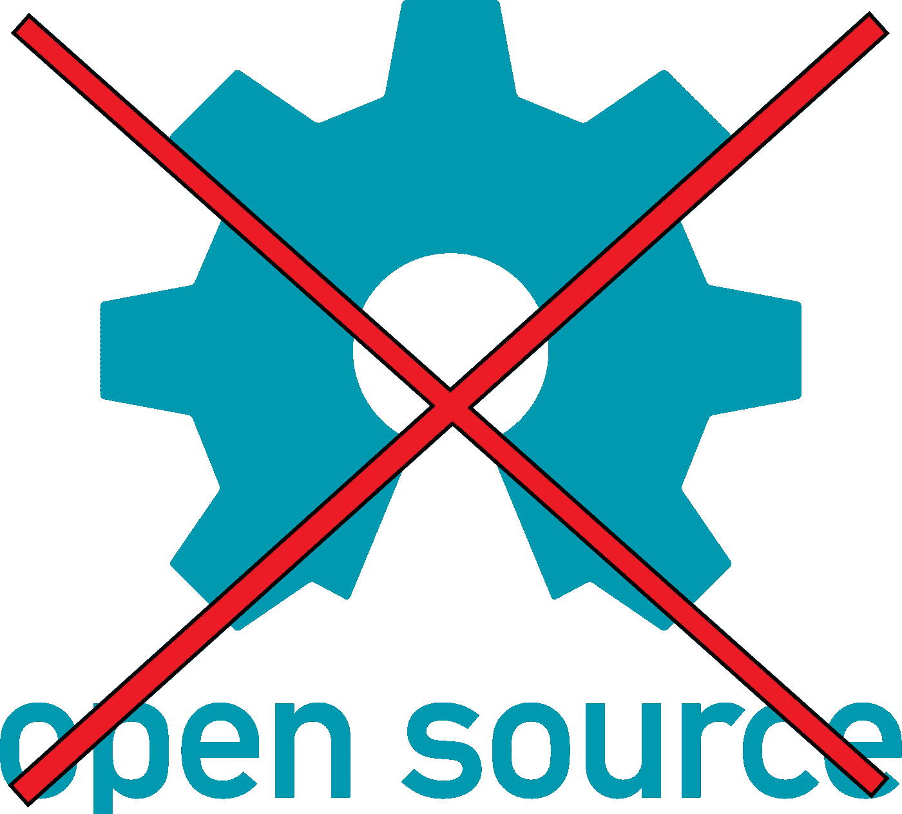
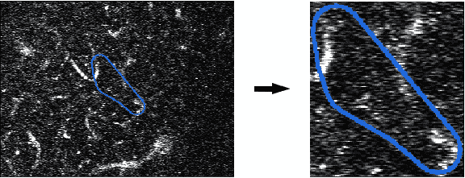
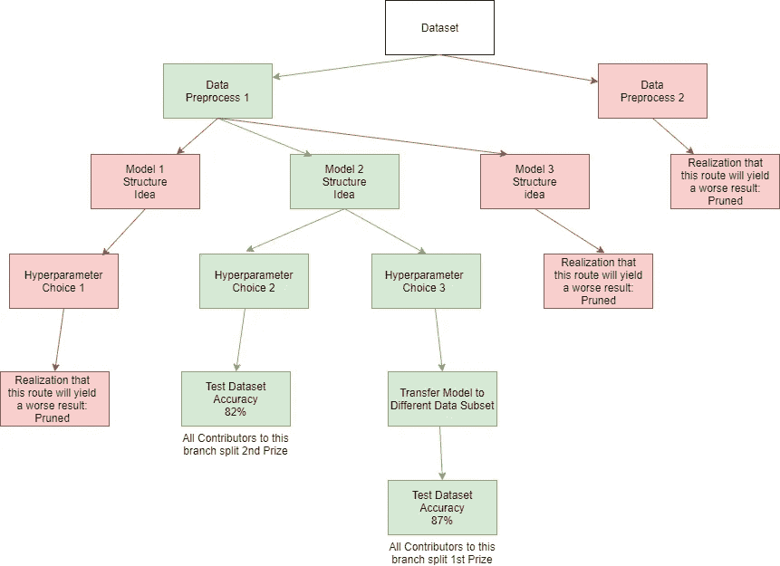

# 数据科学竞赛平台的问题

> 原文：<https://towardsdatascience.com/the-problem-with-data-science-competition-platforms-like-kaggle-a77bbca4a7c5?source=collection_archive---------42----------------------->

## 数据科学竞赛是否违反开源？—开放式思想传递和协作的案例

freebiesupply.com

正如任何数据科学家可能都熟悉的那样，互联网上存在一个广阔的预测建模竞赛世界。这些竞赛中有些是经济上的激励，有些只是出于好奇。几乎所有经济激励的竞赛的基本结构是，所有参与者(或参与者团队)在训练数据集上训练和开发模型，并提交他们的提交作为测试数据集上的预测，其标签对竞争者是隐藏的。随后,“最佳”模型会根据一些预先确定的准确性标准获得相应的奖金。关于这些预测建模竞赛的大多数观点是，基于财务激励的竞争创造了对聪明人发现难题解决方案的需求。虽然我最初同意这一观点，并且不反对他们的目标是正确的，但我已经注意到这些项目的内在问题，这些问题以一种非常可解决的方式阻碍了进展。毕竟，当一个组织为比赛中表现最好的模特提供 10，000 美元时，他们只是在众包他们问题的最佳解决方案，对吗？在本文中，让我讨论以下内容:数据科学竞赛的固有问题及其对开源伦理的违反，这些竞赛的重组建议，以及为什么这解决了当前结构的固有问题的案例。

# 固有问题:

## 1.大多数竞争者并不是为了赢而比赛

尽管这些比赛提供了丰厚的奖励作为激励，但从我的经验来看，我知道大多数参赛者并不是因为奖金才参加的。首先，如果这个观察是真的，那么它是一种与最初提供经济奖励的目的相违背的论点。如果许多竞争者不把奖金当作激励，那么奖金的价值，因为它关系到为提供组织生产的模型的质量，就会大大降低。让我解释一下。

也许你们中的一些人在阅读这篇文章之前已经接近数据科学竞赛的顶端，或者也许你们中的一些人接近中间。我鼓励你回忆一下这些立场是如何改变你为解决问题所付出的努力的。从我参与竞争和看到其他人参与竞争的经验来看，知道自己处于中游水平，又缺乏进一步改进的想法，往往会导致对财务激励的忽视，而且在大多数情况下，会变成类似于“好吧，至少我学到了一些东西”的想法。另一方面，那些看到自己的名字出现在排行榜顶端的人已经开始考虑他们会如何处理自己的那份奖金；结果会怎样呢？这些人全力以赴，坚持不懈地工作，以确保他们不会让自己的辛勤工作从指缝中溜走。这很棒，对吧？由于经济上的激励，我们有几十个聪明人不知疲倦地竞争，想出解决难题的办法。没错。但是，如果有一种方法，我们可以用同样的钱来激励所有的参与者，数百名数据科学家，这样会怎么样？

## **2。反开源——每个人都花时间解决相同(或相似)的问题**

对于那些不熟悉的人来说，使用开源框架就是决定将一个项目的所有源代码都提供给任何想看一眼或进一步改进想法的人。在我看来，走向开源是历史上加速技术发展的最伟大的运动之一，特别是当它涉及到一个有如此多善意和恶意用例的领域时，进入深度学习和人工智能。这些竞赛中的规定，比如取消团队之间共享代码的资格，导致了一个反开源的环境。基于经典数据科学竞赛的当前奖励结构，不存在任何人分享想法的激励。事实上，在内部储存好的想法，以防止其他人利用它们来击败你，这要有利得多。由于这种反开源的性质，当存在要解决的常见问题(如数据预处理或实验以找到正确的神经网络结构)时，基于每个人都必须自己解决相同问题的简单事实，无数的时间被浪费了。例如，我目前正在参加与[失速捕捉者项目](https://stallcatchers.com/main)的[老年痴呆症研究竞赛](https://www.drivendata.org/competitions/65/clog-loss-alzheimers-research/page/207/)，其中的数据集是大脑内血流的视频集合。由于这个数据集的性质，每个参赛者都必须编写一个脚本，将视频预处理成帧图像，随后在有问题的船只周围进行裁剪。我花了大约 3 个小时来创建一个函数，使视频的 Numpy 切片可以正常工作，并且通用于每个视频的每一帧。

DrivenData 竞赛数据预处理示例——感谢 [DrivenData](https://www.drivendata.org/) 和[人类计算研究所](https://humancomputation.org/)提供数据和使用权限。

让我们在这里处理一些数字。我们看到有 623 人参加了这场比赛，由于缺乏更多的信息，让我们假设我的 n=1 的观察值接近平均值。由于我们都必须以相同(或非常相似)的方式对数据进行预处理，我们总共花费了 1869 个小时进行预处理，如果只有少数人担任这一角色并与班上的其他人分享他们的工作，这些时间本可以被重新分配。如果是这样的话，这些时间可以用来建立网络，研究疾病，优化网络等。记住，这只是比赛的第一步。

## **3。付钱赢**

这一切都归结为一个简单的事实，即如果没有高端 GPU 和 TPU 这样的计算资源，即使是世界上最好的数据科学家也无法在足够短的时间内针对足够复杂的问题优化网络。此外，计算能力的每一次增加都会导致优化时间的减少，而优化时间可以用来追求更进一步的想法。我的主张并不是说这些竞争*都是由对计算资源的访问决定的；事实上，对我来说很明显，问题的知识和解决问题的有效方法是比计算资源更重要的资产。我只是在陈述这样一个事实，即存在一个处理速度障碍，如果不满足这个障碍，一个缺乏资源的杰出数据科学家就不可能获得某个奖金池。*

对我的论点的潜在反驳可能会声称，通过提及经常实施的计算限制，例如利用 TPU 的非法 GPU 运行时间限制或其他处理速度限制，一些竞争实际上是公平的。再次从经济的角度来看，如果一个组织“支付”(或提供奖励)一群人去寻找一个难题的最佳解决方案，我们为什么要限制这个群体已经拥有的计算资源池呢？出于这个原因，如果最终目标是达成可能的最佳解决方案，这些限制对我来说似乎是不可行的。此外，如果我们选择不使用现有的处理速度，这是对那些能够突破极限并构建出我们今天可以使用的尖端处理器这一惊人技术的工程师的诋毁。

# **重组——支链回报和自发修剪:**

简化的支链奖励树示例(使用 app.diagrams.net 网络工具创建)

**支链奖励结构**

支链奖励结构背后的想法是，与其每个人都独自工作并发现他们手头问题的最佳模型，不如我们有一个存放当前最佳工作模型的存储库。因此，贡献者可以专注于改进已经被证明是最佳解决方案的潜在线索的现有想法，而不是做其他人可能已经做的所有探索性建模。在这种结构下，竞争对手将筛选当前的模型和想法树，并根据他们对问题的了解，决定以两种方式之一做出贡献:

1.  他们扫描树以寻找最有希望的分支，并决定在树的任何级别创建他们自己的路径，其中他们希望分支到不同的、更好的方向。
2.  他们想要追求的想法并不存在于树上；从而让他们决定开创一个全新的分支，让其他人看到并为之做出贡献。

以这种方式，奖金可以不分配给单个团队或个人，而是平均分配给树的获胜分支的所有贡献者(第二名、第三名等也是如此。).

**自发修剪**

一个潜在的问题可能产生于一个基于先前想法的改进树，这个树的复杂性可能会变得如此之大，以至于几乎不可能辨认出哪个模型有潜力，哪个模型根本就不能工作。您可以想象一个场景，其中竞争对手必须测试数百个不同的分支模型变体，仅仅是为了确定他们最终将致力于哪个模型，或者他们可能会在层次结构的更基础的级别分支到他们自己的模型。为了简化这种潜在的复杂性，我建议在每个分支的每个节点上显示某种模型评估度量。这将使竞争对手清楚地看到哪些型号表现良好，以及每个型号的改进速度。通过这种方式，竞争者将被激励去忽略那些没有什么希望去竞争奖项的模特；因此，导致这些分支被自动从树上剪掉，因为它们被大多数竞争者忽略了。也就是说，除非竞争对手有突破性的想法为某个表现不佳的分支做出贡献。最终，这将导致最好的想法激增，而次等的想法被留下并最终消亡。

# **好处:**

1.  **工作时间分配的效率——“让您的钱花得更划算”**

向开源架构的转变允许人们考虑、学习和建立在彼此的想法之上，这将重新引导无数个小时的竞争者通过简单地允许他们作为一个集体使用彼此的工作并从彼此的错误中学习来解决相同的琐碎任务。这将提高解决问题的速度，允许竞争者在未解决的问题上花费更多的时间，并最终产生对由奖励提供组织提出的问题的更好的解决方案。

**2。大量积极、热情的贡献者**

如前所述，我相信在任何标准的数据科学竞赛中，都有一大群参赛者致力于解决问题，因为他们喜欢这样做，也许是因为他们想建立一个投资组合，但看不到任何闯入奖池的可能性。因此，有一小部分竞争者热情而不知疲倦地追求他们的想法，因为他们在排行榜上有足够高的地位，使他们的时间值得。在我看来，在奖励结构中，任何贡献者在通往获奖模式的道路上的任何一步都因其出色的想法贡献而获得奖励，这将把竞争对手从以前的随意学习者群体转移到后者充满激情和不知疲倦的工作群体中。此外，这种结构将激励积极的贡献，而不是拖延。也就是说，如果一个贡献者在想法层次结构的早期对模型的一个分支进行了更新，并为其他人奠定了基础，则该贡献成为多个优秀模型的基础的可能性会增加，从而允许竞争者获得多个奖项的一部分。这将使竞争对手迫不及待地开发新的想法，而不是在最后一刻构建并提交他们的模型。

**3。平等进入奖池(或至少更平等一点)**

目前有一种设备门槛，如果没有达到，就会将竞争对手排除在获奖提交的竞争之外(特别是在需要深度学习的比赛中)。显然，对于竞争对手来说，获得一台拥有最新、最棒的 TPU 的高端数据科学机器，或者有足够的钱购买类似的云计算产品，仍将是一个巨大的优势。不过，在这种拟议的结构下，只有一台 Macbook Pro、买不起更强大机器的大学生至少可以贡献一些想法，如创新的预处理方法或引入其他人可能忽略的神经网络结构。这将扩大解决问题的集体思维，再次产生更好的解决方案。

# 潜在缺点:

我相信有很多，但我想到了这种结构的一些潜在挑战:

1.  **什么被认为是“新想法”？**

例如，我们目前在树的一个分支上建立了一个模型，有人做了一个非常简单的调整，导致预测准确性的轻微增加。这是否被视为“新想法”并添加到树中？我认为要解决这个问题，我们必须定义一个“改进”,这个“改进”是由问题的相应评估标准量化的。如果我们创建一些规则，比如“如果得到的模型被改进了*个百分点，那么一个分支只能被扩展为对先前模型的‘改进’”，请填写空白的*个百分点。这样，我们对添加到树中的内容施加了某种限制，以确保琐碎的更改不会被考虑多次。

**2。使用不同的编程语言**

如果我们说不同的(编程)语言，我们如何相互协作？对于这个问题，我能想到的最好的解决方案是要么从一开始就宣布比赛的语言，要么可能将奖项分成几个不同的比赛，为最适合手头任务的少数几种语言中的每一种语言设立一个奖项。从好的方面来看，也许这可以帮助人们适应更多的编程语言，迫使他们探索其他语言，而不是让他们总是默认自己的偏好。

# 结论:

我希望作为这篇文章的结果，我不会被误导，不会被认为对数据科学竞赛有负面的看法；我一直很喜欢在线提供如此广泛的数据科学竞赛。我认为它们在解决问题和让研究人员从事他们感兴趣的项目方面都带来了巨大的好处。我最近在从事一项乏味的数据预处理工作时才想到，我目前花费数小时完成的任务已经或将被数百名其他竞争对手完成；但是由于比赛的性质，我们不允许互相帮助。我想，“我理解为什么我们不能为了竞争而分享想法，但是如果有一种方法可以让竞争完全开源，同时保持竞争方面的活力呢？这样，我们可以最大限度地提高效率，同时仍然允许金钱奖励来激励竞争对手解决问题，这也是奖励的目的。

这种结构可能存在一些我没有想到的问题，还有一些问题只有在实践中才会显现出来。但随着我们周围的一切越来越倾向于开源，并且在许多情况下产生了革命性的解决问题的效率，我不禁认为它在在线数据科学竞赛的世界中有一席之地。任何人在概念化这个想法后都可能有想法，请随意回应和分享，因为我知道有许多不同的途径可以探索。我很乐意听取社区的其他意见。