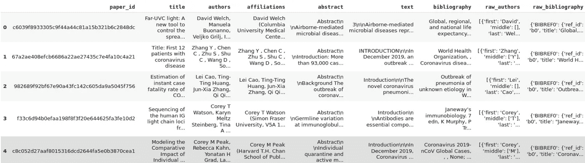
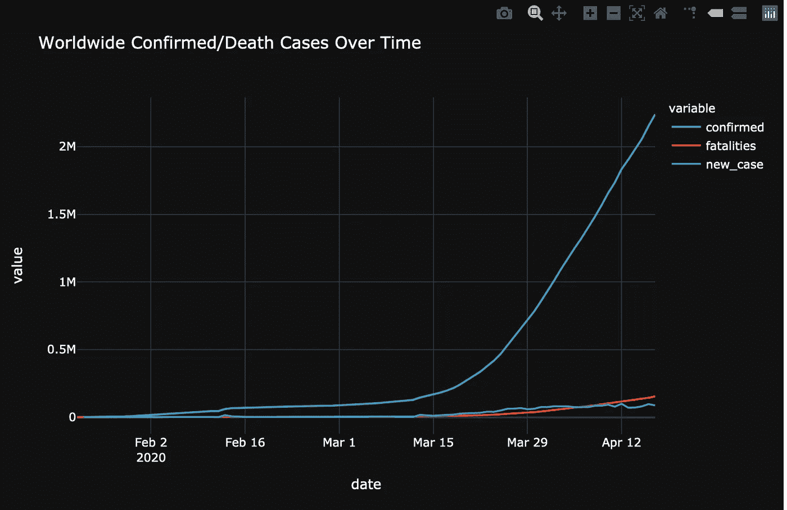
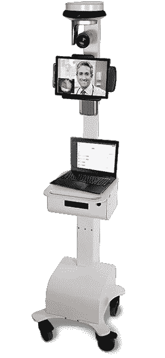

# 困难时期的数据承诺

> 原文：<https://towardsdatascience.com/the-promise-of-data-in-difficult-times-428d9619714d?source=collection_archive---------72----------------------->

***编者按:*** [*走向数据科学*](http://towardsdatascience.com) *是一份以数据科学和机器学习研究为主的中型刊物。我们不是健康专家或流行病学家，本文的观点不应被解释为专业建议。想了解更多关于疫情冠状病毒的信息，可以点击* [*这里*](https://www.who.int/emergencies/diseases/novel-coronavirus-2019/situation-reports) *。*

其他几个更有权威的作者也写过名为“新冠肺炎”的黑天鹅事件及其影响。当我写这篇文章的时候，全世界大约有 290 万病例，20 万人死亡。199 个国家的人民受到了影响。

近年来，技术和商业界非常重视人工智能——它是一只神奇的独角兽，将改变人类生活的方方面面。那么在目前的情况下，人工智能到底帮了多大的忙呢？

**早期赢家:**加拿大健康监测初创公司[蓝点](https://bluedot.global/)是世界上首批准确识别新冠肺炎病毒传播及其风险的公司之一，[据美国消费者新闻与商业频道报道。12 月下旬，这家初创公司的人工智能软件在中国武汉发现了一系列不寻常的肺炎病例，并预测了病毒下一步可能的去向。也许这些预测应该得到更多的关注。](https://www.cnbc.com/2020/03/03/bluedot-used-artificial-intelligence-to-predict-coronavirus-spread.html)

**数据科学拯救世界:**

[新冠肺炎开放研究数据集](https://www.geekwire.com/2020/ai2-microsoft-team-tech-leaders-use-ai-war-coronavirus/) (CORD-19)，一项基于西雅图艾伦人工智能研究所(AI2) [语义学者项目](https://pages.semanticscholar.org/coronavirus-research)的倡议，使用自然语言处理以前所未有的速度分析数万篇科学研究论文。该数据集为世界各地的数据科学家提供了展示其自然语言处理和文本挖掘能力的机会。

新冠肺炎开放研究数据集。来源:Kaggle

**理？医学研究人员和科学家必须从所有这些研究中迅速收集共同点，以找出病毒的解决方案。**

在该数据集于 3 月 16 日发布的四天内，它收到了超过 594，000 次浏览和 183 次分析。

**然后是 COVID global forecasting** —一个用于预测分析和数据可视化的数据分析巨头。“在这个挑战中，你将预测在未来*的*天，世界各地的*累计*确诊新冠肺炎病例数，以及由此导致的死亡人数。”

这又是一个数据专家应用所有奇妙的预测和预报技术的真实舞台。[让我们看一个例子](https://www.kaggle.com/corochann/covid-19-eda-with-recent-update-on-april):

使用 Matplotlib 创建的新冠肺炎一段时间内全球确诊病例和死亡病例图。信用:[https://www . ka ggle . com/corochann/新冠肺炎-EDA-with-recent-update-on-April](https://www.kaggle.com/corochann/covid-19-eda-with-recent-update-on-april)

**我，机器人**

一台 InTouch 宋含远程保健机器，就像在华盛顿州埃弗雷特治疗病人的机器。(InTouch 照片)

> 人们可以通过 Alexa 订购杂货，而无需踏进商店。机器人正在取代医院的临床医生，帮助消毒房间，提供远程医疗服务，以及处理和分析新冠肺炎测试样本。医生们甚至使用机器人来治疗华盛顿州埃弗雷特市第一个被诊断患有新冠肺炎的人。，[据守护](https://www.theguardian.com/us-news/2020/jan/22/coronavirus-doctors-use-robot-to-treat-first-known-us-patient)。

撇开机器人不谈:面对人员短缺和不堪重负的病人数量，越来越多的医院转向自动化工具来帮助他们管理疫情。

**例如，基于人工智能视觉的工具可以快速将 x 射线分为新冠肺炎阳性或阴性，可以节省专家的工作时间**，并节省患者更多的等待时间。具有元数据管理的端到端人工智能工作流可以更进一步，轻松地对已经推理的数据进行分类。[查看本次网络研讨会](https://event.on24.com/eventRegistration/console/EventConsoleApollo.jsp?&eventid=2266020&sessionid=1&username=&partnerref=sales&format=fhaudio&mobile=&flashsupportedmobiledevice=&helpcenter=&key=F188100A2338DEFA01CFC52292DB3066&newConsole=false&nxChe=true&text_language_id=en&playerwidth=748&playerheight=526&eventuserid=291126625&contenttype=A&mediametricsessionid=246314284&mediametricid=3205143&usercd=291126625&mode=launch)，内容是关于在中断时使用计算机视觉和元数据管理存储。

**科技巨头**

许多科技巨头已经提供了他们的数据产品和专业知识来帮助减轻危机的影响。例如:

**IBM 将免费提供沃森助手 90 天:**为了帮助解决新冠肺炎周围的情况，IBM 将免费提供沃森助手(用于构建虚拟助手的对话式人工智能平台)至少 90 天。它经过培训，能够直接利用美国疾病预防控制中心的指导，理解并回答常见的新冠肺炎问题，并且可以轻松集成到现有的网络或电话渠道中。

**微软正在**动员他们的[人工智能促进健康](https://blogs.microsoft.com/on-the-issues/2020/01/29/ai-for-health-child-mortality/)计划，专注于帮助那些在新冠肺炎研究第一线的人。这是一项慈善倡议，旨在加速医学研究，提供全球健康见解，并改善得不到充分服务的人群获得健康的机会。

谷歌最近推出了一个人工智能聊天机器人，名为[快速反应虚拟代理程序](https://cloud.google.com/blog/products/ai-machine-learning/support-for-contact-centers-during-covid-19)，它将提供信息与[新冠肺炎疫情](https://www.techrepublic.com/article/how-covid-19-is-disrupting-the-enterprise-and-what-you-can-do-about-it/)战斗，正如谷歌博客中宣布的那样。谷歌还与苹果合作开发了新冠肺炎联系人追踪技术。

脸书·艾**与纽约大学的库兰特数学科学研究所合作，创建了新冠肺炎病毒传播的本地化预测模型。这些本地预测可以帮助特定县的医疗服务提供者和紧急响应者决定如何最好地分配他们的资源(例如，决定何时调整诊所的人员安排以应对预期的患者增加)。**

在我们面临的最大的全球危机之一中，人工智能如何被用来帮助人类的例子还有很多。

**赢家——卫生纸？:\**

> 不要问数据科学能为你做什么，要问你能为数据科学做什么？

想想看:纸巾产品制造商金佰利公司的股价最近上涨了 2%，相比之下，道琼斯工业平均指数和标准普尔 500 指数分别下跌了两位数。这是因为危机期间卫生纸需求激增。

这场危机的一个影响或许更值得关注，那就是对预测模型的影响。新冠肺炎导致了对旅行和旅游、购物中心和餐馆/酒吧的需求出现大规模异常的负峰值。另一方面，对卫生纸、消毒剂、方便面和杂货等商品的需求出现了异常增长。问题是:如果公司一直使用历史数据来预测销售、库存需求和人员配备，这些峰值会如何影响预测？

我将在以后的博客中探讨这个话题。

现在，让我们恭敬地得出结论，数据正在实现其帮助人类应对异常困难时期的承诺。