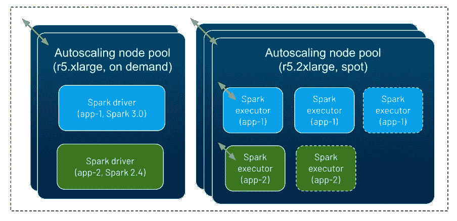
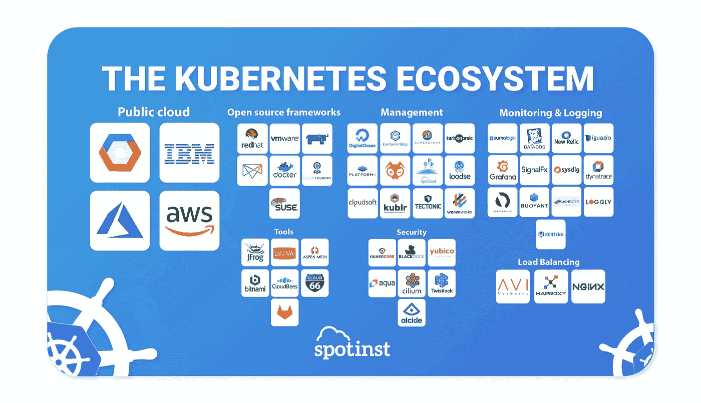
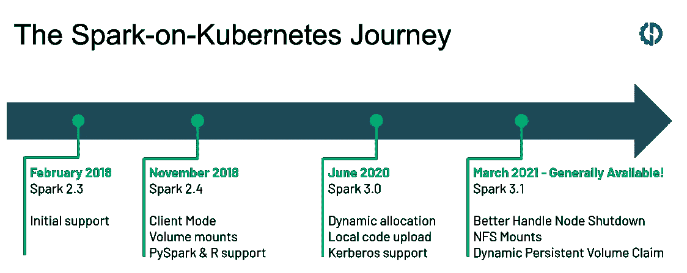

# 在 Kubernetes 上运行 Apache Spark 的利与弊

> 原文：<https://towardsdatascience.com/the-pros-and-cons-of-running-apache-spark-on-kubernetes-13b0e1b17093?source=collection_archive---------12----------------------->

## Kubernetes 对 Spark 的支持是最近才添加的。它与其他部署模式相比如何，是否值得？

传统软件工程正在向 k8s 转移。Spark 会跟进吗？(照片由[法比奥](https://unsplash.com/@fabioha)、[昂斯佩什](https://unsplash.com/)拍摄)

[Apache Spark](https://www.datamechanics.co/apache-spark) 是一个开源的分布式计算框架。在几行代码(Scala、Python、SQL 或 R)中，数据科学家或工程师定义了可以处理大量数据的应用程序，引发了在一个机器集群上并行化工作的关注。

Spark 本身并不管理这些机器。它需要一个集群管理器(有时也称为*调度器*)。主要的集群管理器有:

*   独立:简单的集群管理器，功能有限，内置 Spark。
*   Apache Mesos:一个开源集群管理器，曾经流行于大数据工作负载(不仅仅是 Spark ),但在过去几年中逐渐衰落。
*   Hadoop YARN:基于 JVM 的 Hadoop 集群管理器，于 2012 年发布，是迄今为止最常用的集群管理器，用于内部部署(例如 Cloudera、MapR)和云部署(例如 EMR、Dataproc、HDInsight)。
*   Kubernetes:从 Spark 2.3 (2018)版本开始，Spark 就在 Kubernetes 上原生运行。这种部署模式正迅速获得企业的支持(谷歌、Palantir、红帽、彭博、Lyft)。Spark-on-k8s 被标记为实验性的(从 Spark 3.0 开始)，但将在 Spark 3.1 中宣布量产就绪(将于 2020 年 12 月发布)！

作为这个街区的新成员，Kubernetes 有很多宣传。在本文中，我们将解释 Spark-on-k8s 的核心概念，并评估这种新部署模型的优点和缺点。

# 核心概念

你可以使用 spark-submit 或者使用 spark-operator 提交 Spark 应用程序——后者是我们的首选，但是我们将在未来的教程帖子中讨论它。该请求包含您的完整应用程序配置，包括要运行的代码和依赖项(打包为 docker 映像或通过 URIs 指定)、基础设施参数(例如分配给每个 Spark 执行器的内存、CPU 和存储卷规格)以及 Spark 配置。

Kubernetes 接受这个请求，并在一个 [Kubernetes pod](https://kubernetes.io/docs/concepts/workloads/pods/pod/) 中启动 Spark 驱动程序(一个 k8s 抽象，在本例中只是一个 docker 容器)。然后，Spark 驱动程序可以直接与 Kubernetes master 对话，请求 executor pods，如果启用了动态分配，就可以根据负载在运行时放大和缩小它们。Kubernetes 负责将 pod 打包到 Kubernetes 节点(物理虚拟机)上，并将动态扩展各种节点池以满足需求。

> 再深入一点，Kubernetes 对 Spark 的支持主要依赖于位于 Spark 驱动程序中的[KubernetesClusterSchedulerBackend](https://github.com/apache/spark/blob/master/resource-managers/kubernetes/core/src/main/scala/org/apache/spark/scheduler/cluster/k8s/KubernetesClusterSchedulerBackend.scala)。
> 
> 这个类跟踪当前注册的执行器数量，以及期望的执行器总数(从固定大小的配置或从动态分配)。每隔一段时间(由**spark . kubernetes . allocation . batch . delay**配置)，它将请求创建或删除 executor pods，并在发出其他请求之前等待该请求完成。因此，这个类实现了 Kubernetes 爱好者所珍视的“期望状态原则”,更喜欢声明性语句而不是命令性语句。

# Spark 对 Kubernetes 的利弊

## 1.集装箱化

向容器(Docker containers)的转移是 Kubernetes 最初如此受欢迎的原因。软件工程世界中容器化的好处同样适用于大数据世界和 Spark。它们使您的应用程序更具可移植性，它们简化了依赖项的打包，它们支持可重复且可靠的构建工作流。

为 Spark 使用 Docker 容器的三大好处:
1)一次构建依赖项，随处运行(本地或大规模)
2)使 Spark 更加可靠和经济。
3)将您的迭代周期加快 10 倍(在 Data Mechanics，我们的用户定期报告[将他们的 Spark 开发工作流程从 5 分钟或更长时间缩短到不到 30 秒](https://www.datamechanics.co/blog-post/spark-and-docker-your-spark-development-cycle-just-got-ten-times-faster))

我最喜欢的好处是依赖管理，因为众所周知，Spark 非常痛苦。您可以选择为每个应用程序构建一个新的 docker 映像，或者使用一个较小的 docker 映像集来打包您所需的大多数库，并在上面动态添加您特定于应用程序的代码。告别每次应用程序启动时编译 C-library 的冗长的 init 脚本。

**更新(2021 年 4 月)**:我们已经公开了优化的 Docker 图像，供任何人使用。它们包含最常用数据源的连接器——我们希望它们开箱即用！查看我们的[博客文章](/dockerImages)和我们的 [Dockerhub](https://hub.docker.com/r/datamechanics/spark) 页面了解更多详情？

## 2.高效的资源共享带来巨大的成本节约

在其他集群管理器(YARN、Standalone、Mesos)上，如果您想为并发 Spark 应用程序重用同一个集群(出于成本原因)，您必须在隔离性上做出妥协:

*   依赖隔离。您的应用程序将拥有一个全球 Spark 和 python 版本，共享库和环境。
*   性能隔离。如果其他人开始一项大工作，我的工作可能会运行得更慢。

因此，许多平台(Databricks、EMR、Dataproc 等)都推荐为生产作业运行瞬态集群。启动群集，运行作业，终止群集。这种方法的问题是，您需要支付安装/拆卸成本(通常大约 10 分钟，因为正确安装 YARN 需要很多时间)，并且您没有获得任何资源共享。使用这种方法很容易出错并浪费大量计算资源。

Spark-on-Kubernetes 为您提供了两个世界的精华:完全隔离和强大的资源共享。

Kubernetes 上的 Spark 为您提供了两个世界的精华。您可以在一个 Kubernetes 集群上运行所有应用程序，每个应用程序都可以选择自己的 Spark 版本、python 版本和依赖关系——您可以控制 Docker 映像。在 10 秒钟内，Kubernetes 可以拆除一个应用程序的容器，并将资源重新分配给另一个应用程序。这非常高效——在 Data Mechanics，当客户从其他平台迁移时，我们通常可以为他们节省 50%到 75%的成本。

也很方便。有了集群自动扩展(完全在 Data Mechanics 平台上为您管理)，您可以不必再考虑集群和虚拟机，只需以无服务器的方式使用 Spark。告别复杂的集群管理、队列和 YARN 部署的多租户权衡！

## 3.丰富生态系统中的集成

由 [Spotinst](https://spot.io/) 建造的丰富的 Kubernetes 生态系统的代表

在 Kubernetes 上部署 Spark 可以免费为您提供强大的功能，例如使用名称空间和配额进行多租户控制，以及基于角色的访问控制(可以选择与您的云提供商 IAM 集成)来实现细粒度的安全性和数据访问。

如果您有 k8s 范围之外的需求，该社区非常活跃，您很可能会找到满足这一需求的工具。如果您已经将 Kubernetes 用于堆栈的其余部分，这一点尤为重要，因为您可能会重用现有的工具，例如用于基本日志记录和管理的 k8s dashboard，以及用于监控的 Prometheus + Grafana。

# 中性火花性能是相同的

我们运行了基准测试，证明在 Kubernetes 上运行 Spark 和在 YARN 上运行 Spark 之间没有性能差异。

在我们的博客帖子— [**中，Apache Spark 性能基准测试显示 Kubernetes 已经赶上了 YARN**](https://www.datamechanics.co/blog-post/apache-spark-performance-benchmarks-show-kubernetes-has-caught-up-with-yarn) —我们回顾了基准测试的设置、结果以及在 Kubernetes 上运行 Spark 时最大化 shuffle 性能的关键技巧。

尽管 Spark 的原始性能是相同的，但正如我们前面提到的，通过迁移到 Kubernetes 上的 Spark，您可以节省大量成本。[阅读一位客户的故事](https://www.datamechanics.co/blog-post/migrating-from-emr-to-spark-on-kubernetes-with-data-mechanics)，他通过从 YARN (EMR)迁移到 Spark-on-Kubernetes(数据力学)降低了 65%的成本。Kubernetes 上 Spark 的缺点

## 1.让 Spark-on-k8s 大规模可靠需要时间和专业知识

如果你是 Kubernetes 的新手，它引入的新语言、抽象和工具可能会让你感到害怕，并让你偏离你的核心任务。即使你已经有了 Kubernetes 的专业知识，还有很多东西需要建立:

*   创建和配置 Kubernetes 集群及其节点池
*   设置 spark-operator 和 k8s 自动定标器(可选，但推荐)
*   设置 docker 注册表，并创建一个过程来打包您的依赖项
*   建立一个 Spark 历史服务器(在一个应用完成后查看 Spark UI，尽管 [Data Mechanics Delight](https://www.datamechanics.co/delight) 可以避免这个麻烦)
*   设置您的日志记录、监控和安全工具
*   为 Kubernetes 优化应用配置和 I/O
*   在集群上启用定点/可抢占节点(可选，但推荐)
*   构建与您的笔记本电脑和/或日程安排程序的集成

这就是我们建立数据机制的原因——负责所有的设置，并使 Kubernetes 上的 Spark 易于使用且具有成本效益。查看[Kubernetes 开源平台上的数据机制如何改进 Spark](https://www.datamechanics.co/blog-post/spark-on-kubernetes-made-easy-how-data-mechanics-improves-on-spark-on-k8s-open-source)以了解我们的平台在开源基础上提供了什么。

# 2.您应该运行最新的 Spark 版本

库伯内特斯星火项目的改进时间表

Kubernetes 上对 Spark 的最初支持始于 2018 年 2 月的 Spark 2.3，但该版本缺乏关键功能。在 Data Mechanics，我们只支持 Spark 2.4 及以上版本。我们强烈建议使用:

*   Spark 3.0 及以上版本:受益于动态分配——每个 Spark 应用程序能够根据负载动态添加和删除 Spark 执行器。如果你打算以交互方式(从笔记本)使用 Spark，这个特性非常重要。这是使它们具有成本效益的唯一方法。
*   Spark 3.1 及更高版本:Spark-on-Kubernetes 已正式宣布正式上市，并准备好投入生产——阅读我们的文章深入了解 Spark 3.1 版本。除了强大的功能之外，它还带来了关键的稳定性和性能改进，如 Spark 能够预测定点清除，并在执行器被中断之前优雅地关闭执行器(不会丢失它们的 shuffle 和缓存数据)。

# 结论——你应该开始吗？

过去几年，传统软件工程已经转向云原生容器化，不可否认的是，大数据工作负载也在发生类似的转变。事实上，随着即将到来的 Spark 版本(3.1，将于 2020 年 12 月发布)，Kubernetes 上的 Spark 将在官方文件中标记为正式可用和生产就绪。

是否意味着每个数据团队都应该成为 Kubernetes 专家？不，这是我们建立[数据机制](https://www.datamechanics.co)的原因，这是一个托管的 Spark 平台，部署在我们客户云账户(AWS、GCP 和 Azure)内的 Kubernetes 上。

我们已经帮助许多客户在 Kubernetes 上运行 Spark，无论是为新的 Spark 项目，还是作为从基于 YARN 的基础设施迁移的一部分。我们负责所有的设置和维护，我们的平台在开源版本的基础上添加了直观的用户界面、笔记本和调度程序集成以及动态优化[，使 Kubernetes 上的 Spark 更易于使用，更具成本效益。](https://www.datamechanics.co/blog-post/spark-on-kubernetes-made-easy-how-data-mechanics-improves-on-spark-on-k8s-open-source)

好奇想了解更多？访问我们的[网站](https://www.datamechanics.co)和[与我们一起预订一个演示](https://calendly.com/datamechanics/demo)来开始吧。

更喜欢用开源的方式自己构建这个？查看我们关于如何[在 Kubernetes](https://www.datamechanics.co/blog-post/setting-up-managing-monitoring-spark-on-kubernetes) 上设置、管理&监视器 Spark 的高级指南。