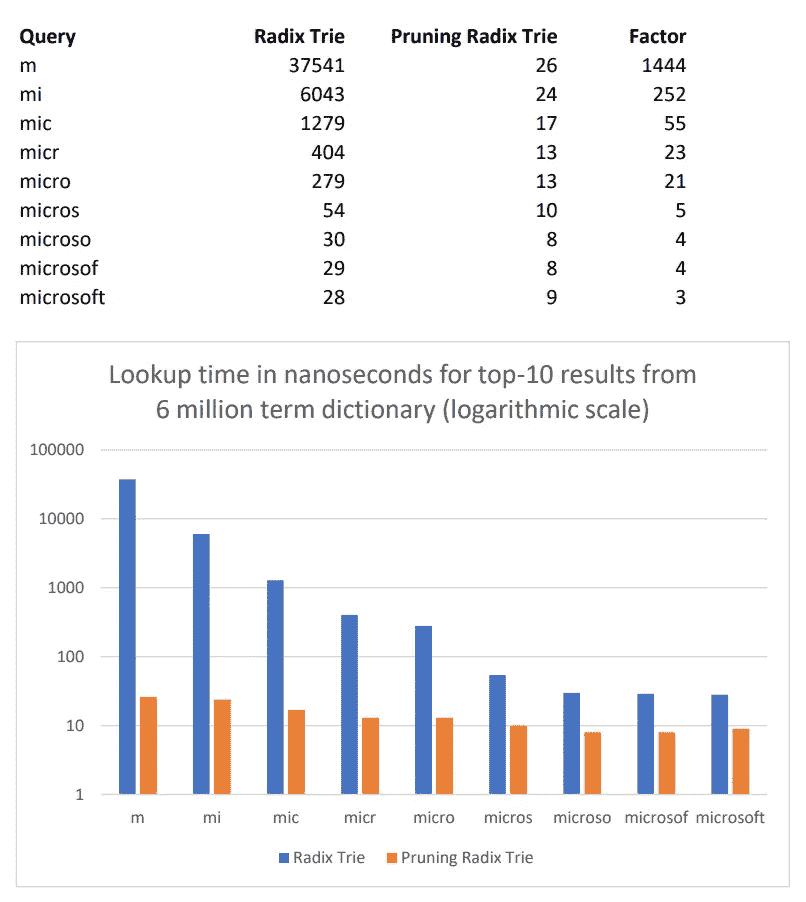

# 修剪基数 Trie——类固醇上的基数 Trie

> 原文：<https://towardsdatascience.com/the-pruning-radix-trie-a-radix-trie-on-steroids-412807f77abc?source=collection_archive---------42----------------------->

照片由 [niko photos](https://unsplash.com/@niko_photos)

**修剪基数三叉树是一种新的数据结构，从基数三叉树派生而来，但是速度快了 3 个数量级。**

在我发表了 [**SymSpell**](https://github.com/wolfgarbe/SymSpell) (一种非常快速的拼写纠正算法)之后，我经常被问到它是否也可以用于自动补全。不幸的是，尽管速度很快，SymSpell 并不是自动完成的好选择。基数 Trie 似乎是自动完成的自然选择。但是在大字典中查找一个小前缀——导致大量的候选字——速度不够快。因此，我设计了修剪基数 Trie -一个自动完成的解决方案的速度与 SymSpell。

一个[基数 Trie](https://en.wikipedia.org/wiki/Radix_tree) 或 Patricia Trie 是一个空间优化的 Trie(前缀树)。运行基数 trie 的 P
算法**是一种新的基数 trie 算法，它允许**修剪基数 trie 的**和**提前终止查找的**。**

在基数 Trie 中，**查找是 O(k)** ，其中 k 是密钥的长度。虽然这非常快，但不幸的是，这仅适用于单个术语查找。查找给定前缀的所有术语(或最相关的前 k 个)是**更昂贵的**——这是自动完成所需的操作。

特别是对于短前缀，我们必须遍历整个树的重要部分，以便**找到所有的**或**识别前 k 个最相关的**候选。

包含数百万条短前缀建议的完整结果集对自动补全毫无帮助。这就是为什么在大多数情况下，我们对给定前缀的所有子词的完整集合不感兴趣，而只对最相关的前 k 个词感兴趣。我们可以利用这一事实来实现 top-k 结果的查找时间的**大幅减少。通过用关于所有其子节点的最大等级的附加信息来扩充 trie 节点数据结构，我们可以实现 trie 遍历的修剪和提前终止。**

> 通过在每个节点中存储其所有子节点的最大等级来实现查找加速。通过将该最大子等级与迄今检索到的结果的最低等级进行比较，我们可以**大量修剪 trie** 并对具有低子等级的无希望分支进行**提前终止查找**。

更新:*在一个* [*Reddit 评论*](https://www.reddit.com/r/programming/comments/gum6v4/pruningradixtrie_1000x_faster_radix_trie_for/) *有一种误解，认为对于前 10 条建议，人们只需要在字典中查找 10 次。小心，没那么简单！为了获得前 10 个最相关的自动完成建议，仅仅在 600 万条目字典中进行 10 次查找是不够的。在 trie 的默认教科书实现中，对于作为输入的单字符前缀“m ”,我们必须遍历整个树的重要部分，并且* ***评估以“m”开头的所有 459，735 个候选项*** *,因为* ***我们不想要仅仅 10 个随机建议*******而是那些具有最高等级的****(T24)这就是修剪基数 trie 的改进之处。通过存储和利用一个节点的所有子节点的最大等级，我们可以大规模地修剪 trie 并进行提前终止。这使我们可以减少我们必须遍历的节点数，我们可以减少候选节点数，从 459，735，T34，T36 到 T37，T38，T39，110，T40，T41，T42！**

# *词典*

*Terms.txt 包含 600 万个来源于英文维基百科标题的**单字母词**和**双字母词**，使用术语频率计数进行排名。但是你可以为你选择的任何语言和领域使用任何频率字典。*

# *表演*

**

> ***修剪基数 Trie** 比普通基数 Trie**快 1000 倍**。*

# *应用:*

*PruningRadixTrie 非常适合自动完成或查询完成。*

*虽然对于一个**单用户**来说，37 毫秒的自动完成时间似乎足够快了，但如果我们必须并行地为数以千计的**用户提供服务，例如在搜索引擎和[搜索 API](https://seekstorm.com) 中，情况就完全不同了。那么大型字典中的自动完成查找只有在比普通的基数 trie 快得多的情况下才变得可行。***

# *自动完成与拼写纠正*

*这两个概念是相关的，而且有些相似。这就是为什么有时很容易使用一种旨在解决拼写纠正的数据结构来实现自动完成，反之亦然。但这不是个好主意。*

***滥用拼写纠正来实现自动完成***

*通常，我们期望从**自动完成的**中为任何给定的前缀找到最可能的单词，即使**前缀是短的**，而**完成的单词是长的**。然后输入和输出之间的**编辑距离**变大——当试图使用自动完成的拼写校正算法时，这会导致两个问题:*

1.  ***查找时间变得不可行巨大**，因为用 **Levenshtein 算法**计算大编辑距离非常耗时。即使是像 [SymSpell](/symspell-vs-bk-tree-100x-faster-fuzzy-string-search-spell-checking-c4f10d80a078) 这样速度极快的拼写纠正算法，也很难在合理的时间内返回“Microsoft Windows”作为“mi”前缀，并且不会用数千个无意义的候选项稀释返回的建议。*
2.  *对于一个大的最大编辑距离，返回的候选人数量**压倒性**违背了提供帮助的目的。由于最大编辑距离将大于给定输入前缀的长度，**大多数返回的候选项甚至没有一个与输入前缀相同的字母。***

***滥用自动完成功能进行拼写纠正***

*另一方面，从**拼写纠正，**我们期望纠正所有错误，直到最大编辑距离，甚至**如果错误出现在第一个字母**中。则根本没有公共前缀，使得使用 trie(前缀树)进行拼写纠正变得不可能。*

***拼写纠正自动完成的组合***

*最终，我们可以将两种算法结合起来，例如在 SeekStorm 这样的[搜索引擎的查询领域。但如何有效地做到这一点，那是另一回事。](https://seekstorm.com)*

# *其他选项*

*除了使用修剪基数 Trie 之外，还有其他方法可以加速自动建议:*

*   *仅在前缀长度阈值(例如≥3)以上时启用自动完成，因为在 trie 中查找短前缀的时间特别长，并且候选建议的精度很低。*
*   *对低于前缀长度阈值(例如≤3)的每个前缀使用具有预先计算的 top-k 建议的哈希映射，因为短前缀的查找时间特别长，并且前缀的数量有限，并且哈希映射中的存储器消耗是可管理的*

# *源代码*

*在 Github[Github](https://github.com/wolfgarbe/PruningRadixTrie)的 MIT 许可下，C#代码已经作为开源代码发布*