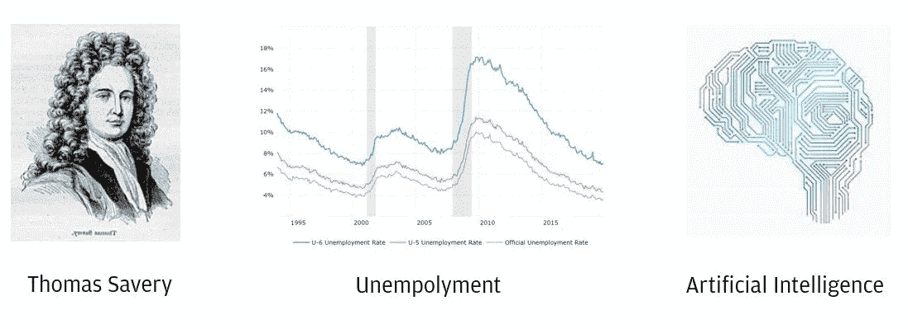
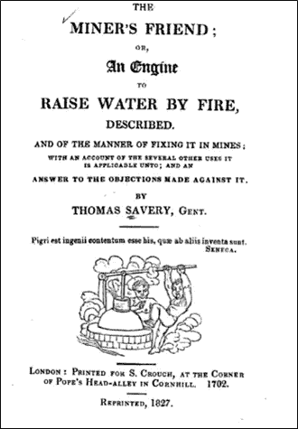
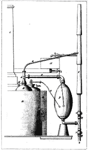
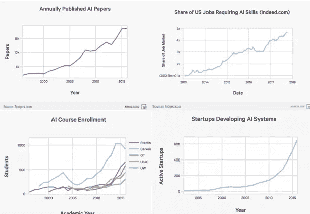

# 水泵和人工智能:人工智能会扼杀还是创造就业机会？

> 原文：<https://towardsdatascience.com/the-pump-and-ai-will-ai-kill-or-create-jobs-97f42485bcd2?source=collection_archive---------23----------------------->

## 关注工业革命可以帮助我们理解人工智能的前景和下个世纪的就业市场。

如何调和人工智能创新和有史以来最低的失业率？

美国失业率创历史新低，甚至包括不包括在官方失业率中的兼职和沮丧的工人。经济学家称这种情况为充分就业——每个愿意工作的人实际上都在工作。但是随着人工智能的出现，这种情况可持续吗？

为了分析未来，我们需要回顾过去。整整 322 年前的 1698 年，第一台自动化机器被制造出来。它彻底改变了世界，标志着工业革命的开始。发明者是英国工程师托马斯·萨弗里，他申请了专利并制造了一台蒸汽泵。萨弗里称之为“矿工的朋友”。名字设计得很好。

萨维里写给国王的书，书中他回答了对他发明的反对意见。

随着地下采矿过程的进行，这种泵被用来将水从矿井中抽出。以前，水是由数百名工人用水桶运出去的。挑战在于如何让工人和政府相信新机器不会扼杀就业机会。萨维里给英格兰国王写了一本书，他在书中写道:“我的设计不是……通过这项发明来歧视工匠或……任何种类的人；相反，是为了全人类的利益和好处，特别是我自己国家的人民；”[【1】](#_ftn1)

萨弗里的机器不成功也不实用。但他的继任者，如托马斯·纽科门，在 1712 年改进了，这是蒸汽动力和后来的内燃机新时代的开始。

矿工的朋友:萨弗里的蒸汽泵

因此，回顾三个世纪前，我们可以问自己这样一个问题:萨弗里是对的吗——他的发明对他的国家有帮助吗？此外，它没有伤害工人吗？

有很多方法可以解决这些问题，但不可否认的是，没有泵或发动机，现代世界是不可能的，对吗？这些机器是最重要的工具，广泛用于帮助工人和家庭旅行、建造房屋和摩天大楼，甚至帮助治疗疾病。

工业革命无疑改变了工作类型、贸易关系、社会组织，并引入了城市生活。然而，工业革命期间的失业率大多很低，包括臭名昭著的童工。蒸汽泵创造了一个环境，它被用作解决现实世界问题的工具。

艾是我们今天矿工的朋友。人工智能将改变一切，引入自主革命，就像工业革命中创造的蒸汽泵一样。在我看来，失业问题已经解决——人工智能将改变就业市场，但不会扼杀就业。当然，在过渡期和周期性阶段，失业率将会上升(这是必须的，因为它不可能进一步下降)。

人工智能图表趋势。从各方面来看，人工智能都在上升。

人工智能发表的论文创历史新高，人工智能工作岗位创历史新高，人工智能课程注册人数飙升，开发人工智能的初创公司呈指数增长。尽管如此，失业率仍处于历史最低水平。

AI 不能承担失业的责任，但缺乏忽视技术教育重要性的政策和创造人与企业之间流动关系的法规。重要的问题不是人工智能是否会扼杀就业，而是我们如何确保人工智能将被用于社会进步，以及如何创造这些条件。

[【1】](#_ftnref1)托马斯·萨弗里。(1702). [*矿工的朋友*](http://books.google.com/books?id=v_-yJ5c5a98C&printsec=frontcover&dq=miner's+friend&hl=en&ei=HOatTauPLKGy0QGCqaGiCw&sa=X&oi=book_result&ct=result&resnum=2&ved=0CCwQ6AEwAQ) *:或者是一台以火升水的发动机。伦敦:为 s .克劳奇印刷，在康希尔教皇头巷的拐角处；再版，1827 年。*