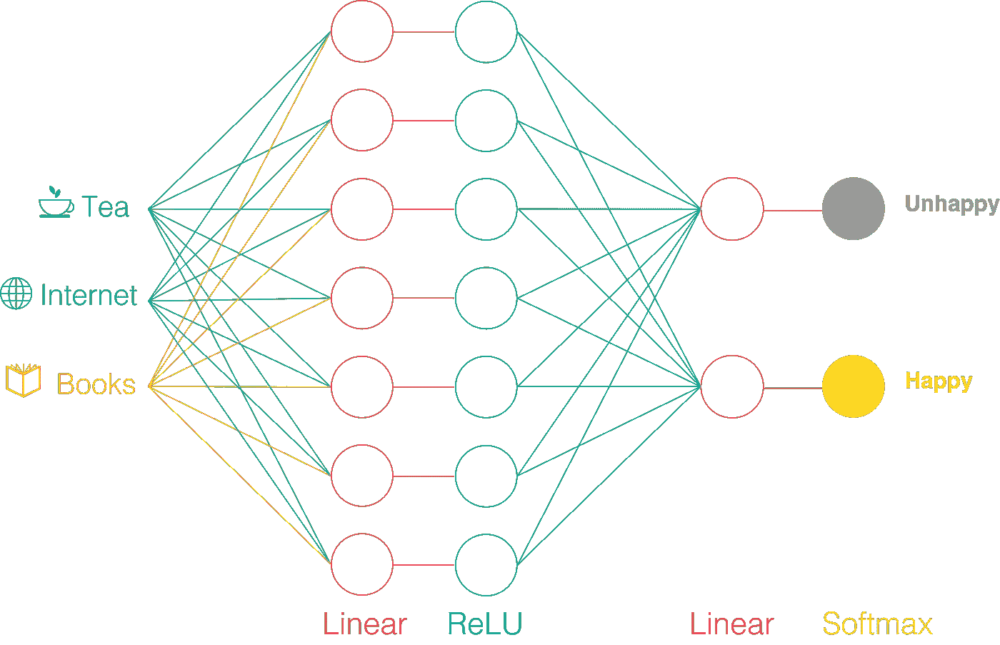
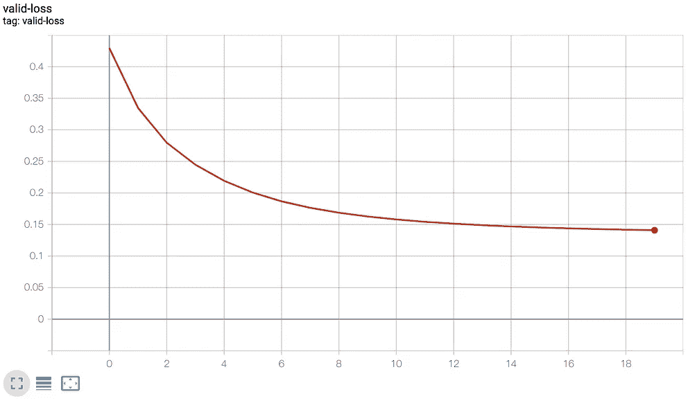
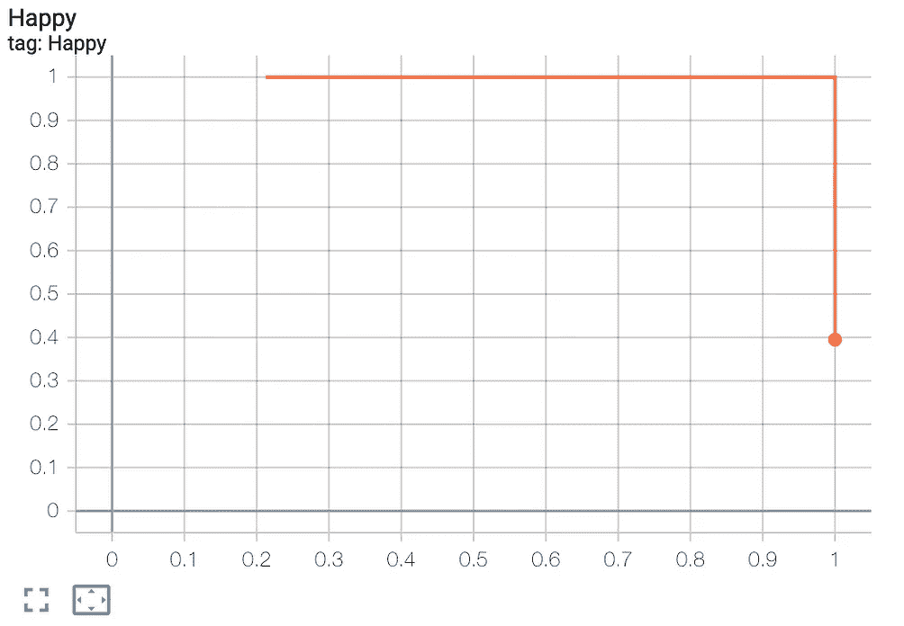
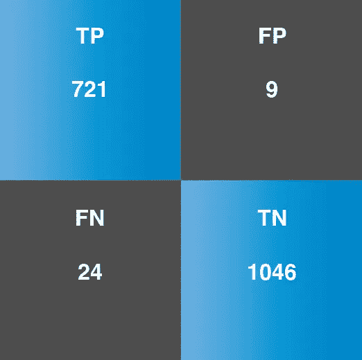
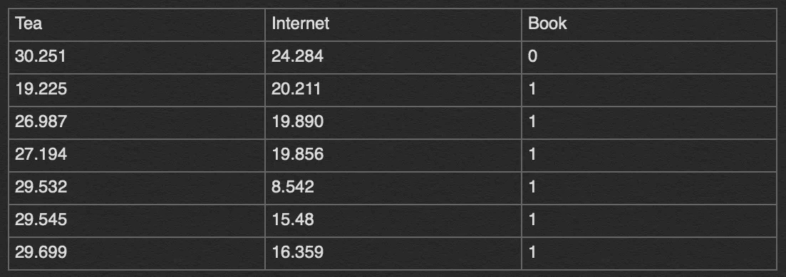
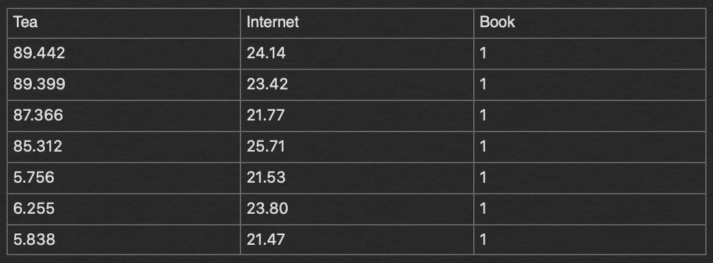

# 受限人工神经网络对幸福的追求

> 原文：<https://towardsdatascience.com/the-pursuit-of-happiness-for-the-confined-artificial-neural-network-bd39f04c6313?source=collection_archive---------37----------------------->

## 学会在茶、书和网络中快乐。反思我们对幸福的追求。PyTorch、NumPy、Scikit-learn 和 TensorBoard 的有趣项目。

我的桌子。一个宁静的时刻。

# 动机

灰尘总是会找到它的路，来到被遗弃的地方，被遗忘已久的书架，旧书，以及这个世界已经离开的所有被忽视的空间。在硬盘的虚拟世界中，这肯定没有什么不同。被遗忘的文件夹里的旧文件肯定有一层层看不见的灰尘覆盖着。

当我终于再次拿起这个项目时，感觉好像灰尘已经积满了它。不是因为疏忽，我只是走了很多弯路才最终回到我离开的地方。

它最初完全在 NumPy 中实现，并打算成为我的从头开始的神经网络项目的一部分。但是那个项目的范围已经够大了。在那个项目结束后，我经历了一场我认为是自己造成的信任危机。我有什么资格宣称可以教任何人任何东西？这驱使我在我的白板上走上了一条狂热的分化之路，几天来，我在雅各宾派的行列之间理清我的道路，几天来，让 PyTorch 签名作证，因为我向自己证明了我的价值。

最重要的是，我最终向自己证明，我的努力一定有更高的目标。这让我重新开始写作。不是因为我觉得我值得教书。而是因为我看到了我想改变的东西。我看到来自不同背景的人渴望学习人工智能，但对涉及的数学感到害怕。一般来说，人们很乐意学习，只要这些材料是可访问的。所以我写了这篇文章，试图让[神经网络的数学读者友好和容易理解。我写了在这个项目中我们将在神经网络内部使用的所有函数。我解释了如何区分它们，它们的输入和输出看起来像什么和意味着什么，以及如何从头开始实现它们或使用 PyTorch。](/dismantling-neural-networks-to-understand-the-inner-workings-with-math-and-pytorch-beac8760b595)

在完成了这个项目所需要的基础知识之后，我觉得回到这个项目上来才是正确的。这是我让学习变得有趣的持续旅程。因为生活已经够艰难了，你不需要为了学习而承受更多的痛苦。

我们将创建自己的数据集，并建立一个神经网络，根据幸福所拥有的东西对幸福进行分类。这也将是一种深刻的内省，反思追求幸福对我们意味着什么。我所有的欢呼和希望，你喜欢这个旅程。

# 创建“坐月子的快乐”数据集

> “我多年来一直在寻找理想的地方。我得出的结论是，我能找到它的唯一方法就是成为它。”——[***【艾伦瓦***](https://www.alanwatts.org/3-2-4-net-of-jewels-part-4/)

通常情况下，感到幸福是一个人做出的选择。当我们既不快乐也不悲伤时，定义快乐的任务就落在了我们身上。这些术语因人而异。虽然我们中的一些人认为真正的幸福是无条件的，但许多人在追求幸福的过程中还需要满足一长串条件。

对于我们项目的神经网络来说，生活简单得足以让以下条件成为通往快乐的唯一垫脚石:

*   茶的理想温度区间。
*   快速互联网连接。
*   有趣的书。

如果这三项中至少有两项得到满足，神经网络应该会输出一个快乐的状态。更具体地说，我们将理想的茶温度定义为大于或等于 30℃且低于 60℃

30°C 的阈值是任意选择的。相比之下，这项研究支持 60 摄氏度的阈值，该研究发现偏好高于 60 摄氏度的热饮与消化系统疾病有关。

我们将网速定义为大于或等于 20 Mbps。再次任意选择，欢迎你选择不同的门槛。

关于书籍，我们会说有两类。神经网络喜欢的书会被标为 1。而它不喜欢的书将被标记为 0。

表达我们的感受不是一件容易的事情。许多感觉每时每刻都交织在一起。每种感觉都有自己的子感觉谱。看着[尝试](http://feelingswheel.com/)将感情的连续空间离散化，确实令人着迷。然而，为了简单起见，我们将假设我们的神经网络将快乐视为二进制。不是开心就是不开心。我们给不快乐贴上 0 的标签。我们用 1 来标记幸福。

记住这些原则，我们可以实现生成数据集的代码。以下代码随机生成 2000 个冷、热、烧茶温度。然后 3000 慢和快网速措施。其次是另外 3000 本不喜欢和喜欢的书。最后是 500 个不开心和开心的标签。

创建数据集时的一个主要关注点是使其平衡。我们必须确保每种特征的组合都被同等地表现出来。一个茶温，一个网速，一种书，有 12 种可能的组合。我们将为每个组合创建 500 个实例。然后，根据一个实例是否具有多数理想属性，我们将分配相应的幸福标签。因此，我们的数据集将有 4 列要素和 6000 行实例。

下面的代码可以分为两个主要部分:列的垂直连接，后面是行的水平连接。在第一部分中，创建了 12 个特征组合，每个组合有 500 行。在第二部分中，所有行的最终连接为我们提供了一个包含 6000 行的完整数据集。这里可以找到详细的实现[。](https://gist.github.com/Mehdi-Amine/145609f7e8bc91fe5160b4c1b57aedaf)

## 分割数据集

我们现在将数据集分成训练集、验证集和测试集。Scikit-learn 的方法 [train_test_split()](https://scikit-learn.org/stable/modules/generated/sklearn.model_selection.train_test_split.html) 将为我们的数据行提供额外的好处。

## 使标准化

为了标准化我们的数据集，我们将使用 Scikit-learn 中的类 [StandardScaler](https://scikit-learn.org/stable/modules/generated/sklearn.preprocessing.StandardScaler.html) 。我们必须小心，仅在训练集上安装标准缩放器。我们也不想标准化一次性编码的分类列。因此，下面的代码标准化了前两列(茶水温度和互联网速度)。然后将标准化输出与最后两列(书籍和快乐)连接起来。

## 将 NumPy 转换为 PyTorch 数据加载器

在我们认为我们的数据已经完全准备好之前，只剩下几个步骤:

*   我们必须使我们的数据集与我们的神经网络可以接受的输入兼容。
*   我们必须能够从用于训练的训练集，以及用于评估的验证和测试集中加载小批量的神经网络。

我们首先将数据从 NumPy 数组转换为 PyTorch 张量。之后，我们将使用每个张量创建一个 TensorDataset。最后，我们将把每个 TensorDataset 转换成一个具有特定小批量大小的[数据加载器](https://pytorch.org/docs/stable/data.html#torch.utils.data.DataLoader)。

坐月子的快乐数据集已经准备好了。我们已经准备好最终见到受限的神经网络。

# 受限神经网络

架构:3 个输入，带 ReLU 激活的线性层，带 Softmax 激活的线性层，2 个输出。

受限神经网络将具有输入层，接着是线性层和 ReLU 激活，接着是另一个线性层和 Softmax 激活。第一个输出神经元将存储输入描述不愉快状态的概率。第二个神经元将存储快乐状态的等效概率。

以下代码将该架构实现为一个名为 *Network* 的类:

**注意:**你可能已经注意到了*网络*类不包括任何 Softmax 激活。原因是在 PyTorch 中， [CrossEntropyLoss](https://pytorch.org/docs/stable/nn.functional.html#cross-entropy) 在计算其负 log loss 之前先计算 Softmax。我们将在下一节讨论这个问题。

## 培养

在我们继续训练神经网络之前，我们必须选择一个学习速率和若干个时期。我们还必须定义一个优化算法和一个损失函数。损失函数将是交叉熵损失。现在，我们从随机梯度下降优化器开始。

也许这里最令人兴奋的部分是，我们将使用 [TensorBoard](https://www.tensorflow.org/tensorboard/get_started) 来可视化我们的神经网络的训练。作为 PyTorch 的狂热用户，得知我仍然可以利用 TensorBoard 进行可视化对我来说是个好消息。更让我兴奋的是，我得知 TensorBoard 的一个扩展将它集成到了 Colab 笔记本中。

如果你有兴趣学习如何在 Colab 笔记本中设置 TensorBoard，我强烈建议你查看我的[笔记本](https://colab.research.google.com/drive/1Pt3krEQ6h4MWbDSvYrVeCkihW6UCb4SF#scrollTo=UdqtdO1gK48l)中标题为 TensorBoard 的部分。以下代码训练我们的神经网络，并可视化训练和验证损失的进度:

你会注意到在上面的代码中，我们使用一个名为 *summary* 的对象来调用方法 *scalar* 。使用 TensorBoard 的基本思想是首先指定一些日志目录。在这些目录中，我们创建了将被 TensorBoard 读取的文件。这些文件被称为[摘要文件编写者](https://www.tensorflow.org/api_docs/python/tf/summary/create_file_writer)。在上面的代码中， *train_summary_writer* 和 *valid_summary_writer* 都是摘要文件编写器。通过调用方法 *scalar* ，我们在适当的摘要文件中写入每个时期的损失值。然后，TensorBoard 读取该文件，并通过交互式界面方便地显示出来。

TensorBoard:训练和验证损失。

**一些可以尝试的改进:**

*   增加纪元的数量。
*   增加隐藏层的大小。
*   用 Adam 优化替换 SGD。

你可以在这里找到这些改进的详细实现[。](https://colab.research.google.com/drive/1Pt3krEQ6h4MWbDSvYrVeCkihW6UCb4SF#scrollTo=F4Pq9qzZOA7K&line=4&uniqifier=1)

## 估价

在本节中，我们将重点关注使用不同的指标来评估我们的模型。

*   我们首先对测试集中的一小批进行预测，以检查我们的模型的性能。
*   接下来，我们对整个测试集进行预测，并聚合输出概率和预测。
*   然后我们使用 TensorBoard 为我们的类绘制精确召回曲线。
*   我们实现了自己的混淆矩阵方法，不仅返回通常的矩阵，还返回模型出错的实例的索引。
*   我们计算模型的精确度、召回率和准确度。
*   最后，我们使用从我们的混淆矩阵方法返回的指标来检查不正确的情况，并了解神经网络的弱点。

**做预测**

除了对测试集进行预测之外，我们还对检查我们模型的输出和理解幕后发生的事情感兴趣。为了实现这两个目标，我们实施了以下步骤:

1.  我们为测试集创建一个批量大小为 3 的数据加载器。我们将批量限制为 3 个，这样我们就可以检查而不会感到不知所措。
2.  我们将 3 个实例前馈到我们的网络，并将结果存储在一个名为 *linout* 的变量中，表示模型的第二个线性输出。
3.  我们使用 PyTorch 方法 [*softmax*](https://pytorch.org/docs/stable/nn.functional.html#softmax) 计算每个实例的概率。softmax 的输出存储在名为 *prob* 的变量中。
4.  我们希望我们的模型预测概率最高的类别。方法 [*max*](https://pytorch.org/docs/master/generated/torch.max.html) 可以返回最高概率及其指标。我们只对索引感兴趣，它存储在变量 *pred* 中。

我们的结果看起来很有希望。前三个预测是正确的，softmax 概率表明该模型对正确的输出非常有信心。

与其说是实际需要，不如说是为了学习，让我们为我们的类绘制精确召回曲线。我们对测试集的其余部分应用上述步骤，然后我们连接每批的所有概率和所有预测。有了这些概率和预测，我们可以很容易地用方法 [*add_pr_curve*](https://pytorch.org/docs/stable/tensorboard.html#torch.utils.tensorboard.writer.SummaryWriter.add_pr_curve) 为我们的类绘制精确召回曲线。我依靠这个官方 PyTorch [教程](https://pytorch.org/tutorials/intermediate/tensorboard_tutorial.html#assessing-trained-models-with-tensorboard)来完成以下剧情的[实现](https://colab.research.google.com/drive/1Pt3krEQ6h4MWbDSvYrVeCkihW6UCb4SF#scrollTo=d5K8yT4RqgsH&line=35&uniqifier=1):

每一类的精确召回曲线。

我们的结果再一次非常理想。我们得到了一个[完美分类器](https://classeval.wordpress.com/introduction/introduction-to-the-precision-recall-plot/#:~:text=A%20precision-recall%20curve%20of%20a%20perfect%20classifier&text=A%20perfect%20classifier%20shows%20a,the%20ratio%20is%201:3.)的精确召回曲线。善意的提醒，这是一个有趣且感觉良好的项目，这里的目的是在娱乐的同时学习和实践。

**混淆矩阵**

计算混淆矩阵已经很有见地了，但是我们还要更进一步。我们的方法将返回带有真阳性、假阳性、真阴性和假阴性的常见混淆矩阵。此外，它还将返回错误案例的索引，以供以后检查。

为了避免代码过多，这里有一个[链接](https://colab.research.google.com/drive/1Pt3krEQ6h4MWbDSvYrVeCkihW6UCb4SF#scrollTo=rYcSAAXaQJzR&line=8&uniqifier=1)到混淆矩阵方法的实现。该方法的输出是:

神经网络的混淆矩阵。

**精确度、召回率和准确度**

根据混淆矩阵方法的结果，我们可以很容易地计算出我们的神经网络的精确度、召回率和准确度。

*   我们模型的精度是 0.9877
*   我们车型的召回率是 0.9678
*   我们模型的精度是 0.9817

**错误案例**

只有当我们反思自己的缺点时，我们才能进步。所以观察模型出错的例子是很有趣的。我们已经有了错误案例的索引。然而，如果我们在测试集上使用它们，我们将得到标准化的值，并且我们不能从标准化的数据中得出任何结论。

我们首先需要将实例转换回它们的初始比例。值得庆幸的是，Scikit-learn 为其[*【standard scaler】*](https://scikit-learn.org/stable/modules/generated/sklearn.preprocessing.StandardScaler.html?highlight=standardscaler#sklearn-preprocessing-standardscaler)*提供了一个名为 [*的逆 _ 变换*](https://scikit-learn.org/stable/modules/generated/sklearn.preprocessing.StandardScaler.html?highlight=standardscaler#sklearn.preprocessing.StandardScaler.inverse_transform) 的方法。*我们将使用这种方法将缩放比例恢复正常。

当我们检查假阳性和假阴性时，很快就会发现它们是边缘情况。在每个实例中，至少有一个属性值接近定义的阈值。

有些病例接近其定义的阈值。

在其他情况下，神经网络的决策会受到茶温度极值的影响。刚刚超过好阈值的互联网速度、一本好书、但是非常高或非常低的茶水温度的组合导致了一些不愉快的预测。

在某些情况下，极端的茶水温度淹没了恰到好处的网速和一本好书。

我们可以争辩说，这些都是小错误，我们已经达到了优秀的评估分数。但这将是一个错误和无力的论点，因为我们在这里的旅程中积累了疲惫。最终，一个模型的价值只有在边缘情况下才能得到真正的评估。为了改进我们的模型，我们可以使用更多的边缘案例来训练它。然而，这只是我们已经做的重复。所以我把它留给你作为一个练习，如果你想复制和改进我的工作:加入[快乐游乐场](https://colab.research.google.com/drive/1Pt3krEQ6h4MWbDSvYrVeCkihW6UCb4SF#scrollTo=tUw3IK28bOXS)。

至于我，我就此打住。因为尽管神经网络仍然有缺陷，但这些缺陷是值得反思的。我们可以从中获得关于自己的宝贵见解的缺陷，以及我们如何认为我们所拥有的是理所当然的。

# 结论

> “以一种对生命的稳定的优越感活着——不要害怕不幸，也不要渴望幸福；毕竟，都是一样的:苦不会永远持续，甜也不会把杯子装满。”——[**亚历山大·索尔仁尼琴**](https://www.goodreads.com/quotes/6169196-live-with-a-steady-superiority-over-life-don-t-be-afraid-of)

你上一次意识到自己不快乐是什么时候？你有没有意识到，尽管你几乎没有你需要的东西，但你还是拥有一些东西，这比一无所有要多得多。你不会想陷入错误的悲观主义者的可悲困境。就像你不想不知不觉地被无知的幸福带走一样。

生活不仅仅是快乐。我们意识到我们的死亡，容易生病，容易衰老，暴露于我们环境的任意变化。追求的是意义而不是幸福。这意味着在我们艰难的时候支持我们。因为我们也是足够强大的生物，能够承受我们悲惨的生存环境。

# 参考

米（meter 的缩写））胺。 [*禁闭中的幸福 Colab 笔记本。*](https://colab.research.google.com/drive/1Pt3krEQ6h4MWbDSvYrVeCkihW6UCb4SF#scrollTo=tUw3IK28bOXS) (2020)。

米（meter 的缩写））安德鲁。 [*如何在 Google Colab*](https://medium.com/looka-engineering/how-to-use-tensorboard-with-pytorch-in-google-colab-1f76a938bc34) 中配合 PyTorch 使用 Tensorboard。(2019).

T.斋藤和 m .雷姆斯迈尔。 [*精准召回剧情简介*](https://classeval.wordpress.com/introduction/introduction-to-the-precision-recall-plot/#:~:text=A%20precision%2Drecall%20curve%20of%20a%20perfect%20classifier&text=A%20perfect%20classifier%20shows%20a,the%20ratio%20is%201%3A3.) *。* (2017)。

**NumPy 文档:** [*数组操作例程。*](https://numpy.org/doc/stable/reference/routines.array-manipulation.html#array-manipulation-routines) (2020)。

**PyTorch 教程和文档:**

*   [*py torch 深度学习:60 分钟闪电战*](https://pytorch.org/tutorials/beginner/deep_learning_60min_blitz.html) *。* (2020)。
*   [*用 TensorBoard*](https://pytorch.org/tutorials/intermediate/tensorboard_tutorial.html#assessing-trained-models-with-tensorboard) *可视化模型、数据、训练。* (2020)。
*   [*文献*](https://pytorch.org/docs/stable/index.html#pytorch-documentation) *。* (2020)。

**Scikit-learn 文档:** [*数据集转换*](https://scikit-learn.org/stable/data_transforms.html) *。* (2020) *。*

**冲浪板教程:** [*冲浪板入门*](https://www.tensorflow.org/tensorboard/get_started) *。* (2020)。