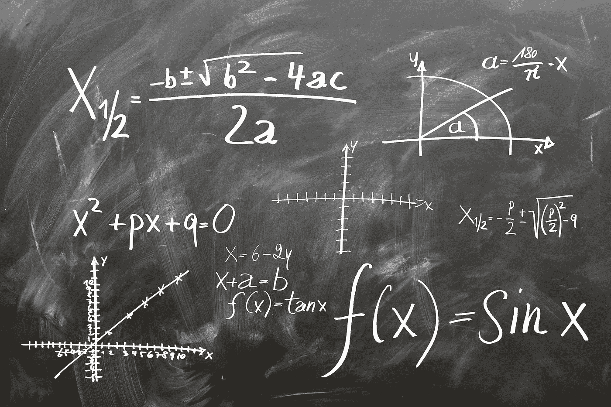
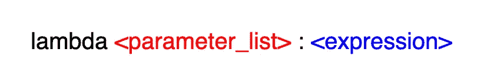
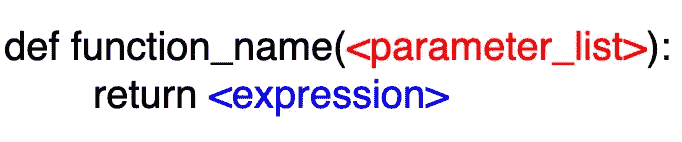
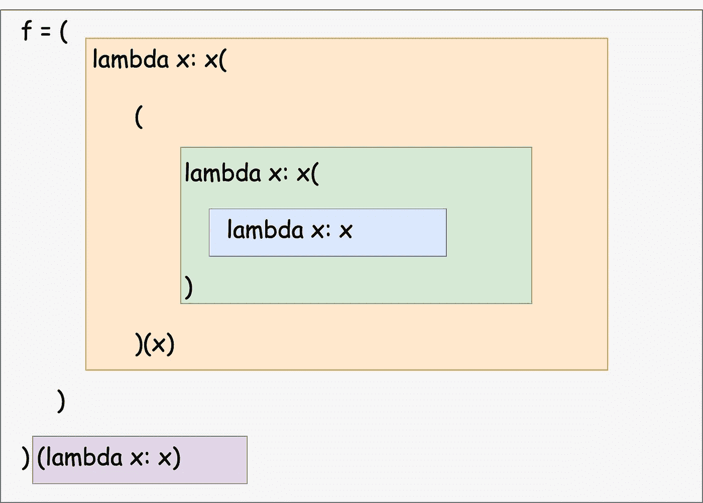
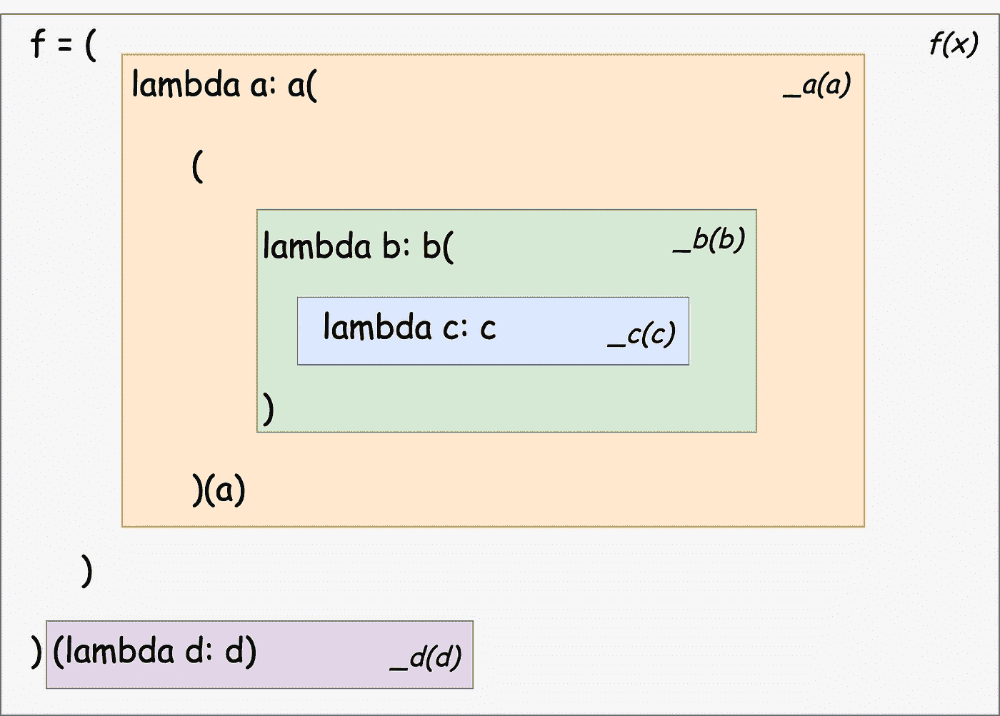
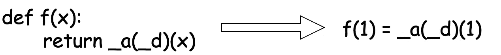
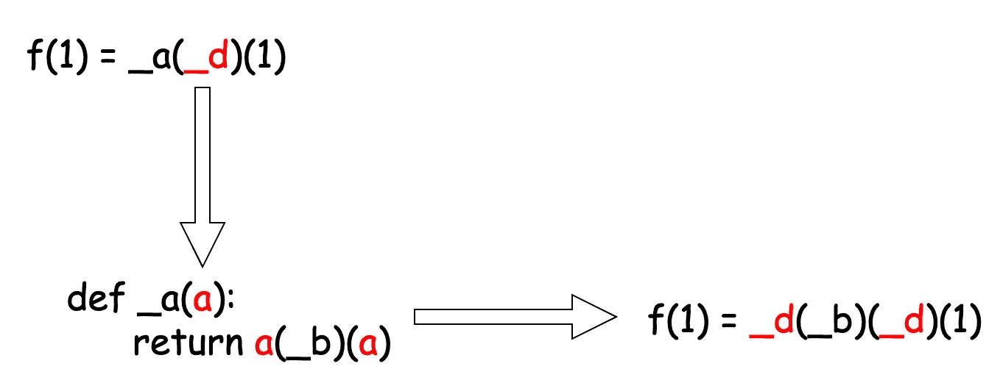
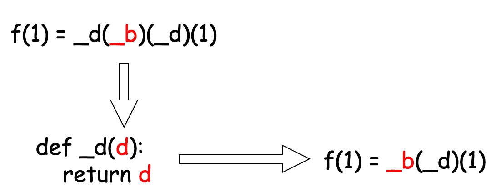
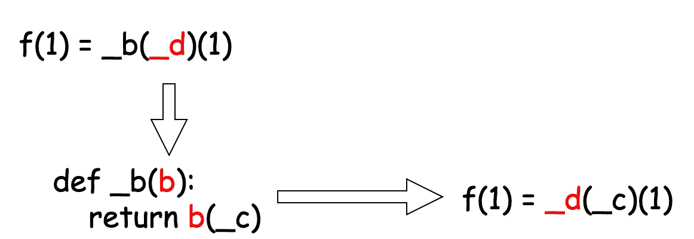
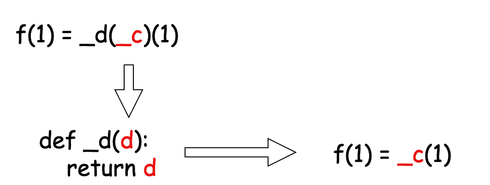

# Python Lambda 函数已经变成了魔鬼

> 原文：<https://towardsdatascience.com/the-python-lambda-function-has-become-a-devil-d0340404abcb?source=collection_archive---------26----------------------->


由 [Clker-Free-Vector-Images](https://pixabay.com/users/clker-free-vector-images-3736/) 在 [Pixabay](https://pixabay.com/vectors/devil-demon-satan-reclining-evil-33932/) 上拍摄的照片

## 讨论从一个测验问题开始…

如果你不是 Python 新手，我打赌你一定知道 Lambda 函数。我不得不说，我喜欢在某些情况下使用 Lambda 函数。比如熊猫数据帧`apply()`函数、`map()`或`filter()`函数，它们天然兼容 Lambda 函数，让我们的生活变得更轻松。我们不需要逐字声明一个显式函数。相反，只需定义一个内嵌的逻辑。

然而，在今天的这篇文章中，我将说一些关于 Lambda 函数的负面的东西。我不是说停止使用它，但肯定的是，这是一个问题。这种担心源于我从一个年轻朋友那里看到的一个问题，他正在世界排名前 20 的大学学习。

> f =(λx:x((λx:x(λx:x))(x)))(λx:x)
> 
> 给定这个函数`*f*`，请说出`*f(1)*`的输出是什么。

顺便说一下，你不允许使用 Python 解释器，只需通过阅读和思考来获得答案，因为这是一个有时间限制的在线测验:)

# 前。一些背景



照片由 [geralt](https://pixabay.com/users/geralt-9301/) 在 Pixabay 上拍摄

我相信有人可能知道在某些特定场景下如何使用 Lambda 函数，但可能不了解其中的机制。让我简单解释一下，lambda 函数是由什么组成的。



如果很混乱也不用担心。事实上，我们可以将 lambda 函数重写为我们熟悉的格式。



正如我们所见，lambda 函数和普通 Python 函数有两个主要区别:

1.  Lambda 函数是匿名的，我们不必用函数名来定义它。
2.  Lambda 函数只能有一个表达式，而普通函数可以有无限个表达式来定义一系列复杂得多的过程。

我们喜欢 lambda 函数，因为有时它简单明了。作为一名数据科学家，我使用 lambda 函数最频繁的场景可能是与 Pandas data frames `apply()`函数结合使用，因为它需要一个“函数”作为参数，而 lambda 函数可以只是作为参数的“函数”。

```
df['col'].apply(lambda x: x+1)
```

这相当于下面使用一个普通的函数。

```
def plus_one(x):
    return x+1df['col'].apply(plus_one)
```

# 1.理解函数的结构


由[在](https://pixabay.com/users/free-photos-242387/) [Pixabay](https://pixabay.com/photos/painter-paint-cans-brush-paintbrush-1246619/) 上的自由照片拍摄的照片

嗯，不要忘记我在本文开始时提出的一个问题。在我们批评这样一个荒谬的函数之前，让我们先一起推导出它的输出。

由于这个函数非常混乱，为了更容易理解，让我们添加一些缩进并重新格式化它。



现在，它变得更清晰了。至少，从上面的图解中，我们可以看到有 4 个 lambda 函数，以及它们的边界。

最重要的是，我们需要知道这些λ函数中的`x`是孤立的。换句话说，虽然都叫`x`，但它们不是一回事。

为了减少混乱，我们用`a`、`b`、`c`和`d`来代替这些`x`。此外，我们知道 lambda 函数是匿名的，但是让我们为下一步给它们指定一个名称。我只想让命名约定尽可能简单。我们把这样的函数`lambda d: d`称为`_d(d)`。

这是一幅精致的插图。



请注意，整个复杂的东西是一个函数，这是已知的，我们知道它被称为`f(x)`，可以接受一个数字作为参数。

# 2.重写所有 Lambda 函数


图片由 [picjumbo_com](https://pixabay.com/users/picjumbo_com-2130229/) 在 [Pixabay](https://pixabay.com/photos/child-kid-play-study-color-learn-865116/) 上拍摄

好了，现在我们已经知道了整个函数的结构，但是仍然不清楚如何求解这个函数。这是因为 lambda 函数有时可读性不是很好，在这种情况下，简直不可读。

你还记得我们可以把任何 lambda 函数改写成普通 Python 函数的形式吗？让我们现在就做吧。

对于函数`_c(c)`和`_d(d)`来说非常简单，因为它们只是简单地返回它们参数的值。

```
def _c(c):
    return cdef _d(d):
    return d
```

然后，我们再来看函数`_b(b)`。这个开始有点棘手，但是不要忘记冒号之前的所有内容都是参数，而冒号之后的所有内容都是函数体。不管参数以什么形式出现，它就是参数，即使它可以是一个函数。

换句话说，参数可以是一个函数。

```
def _b(b):
    return b(_c)
```

是的，函数`_b(b)`相当于说:“嘿！给我一个函数`b(x)`，我将`_c`作为参数`x`传递。

同样，虽然更复杂，但我们可以重新编写函数`_a(a)`，最后是`f(x)`。

```
def _a(a):
    return a(_b)(a)def f(x):
    return _a(_d)(x)
```

在进行最后一步之前，让我们把所有的东西放在一起。

# 3.导出 f(x)的输出


照片由 [stevepb](https://pixabay.com/users/stevepb-282134/) 在 [Pixabay](https://pixabay.com/photos/binoculars-birdwatching-spy-glass-431488/) 上拍摄

通过在没有实际运行的情况下导出输出，我们可以说我们完全理解了它(我相信创建这个问题的讲师会这样说)。

现在，我们有了上面所有的函数，所以我们现在可以开始推导了。既然要求它派生`f(1)`，那么函数`f(x)`就会有它的`x = 1`。



不要在这个阶段开始处理`_d`。很明显`_a(_d)`会是一个函数，数字`1`就是它的参数。所以，我们需要遵循“从左到右”的原则。



在这一步，我们扩展了函数`_a(a)`，参数`a`被函数`_d`替换。所以，我们最终得到了一个新的函数。现在，我们需要插入函数`_d(d)`的参数`_b`。



表达式`_d(_b)`就是简单的`_b`，因为函数`_d`已经被定义为无论传入什么都返回原始参数。下一步就是展开`_b`。



函数`_b`将一个函数`b`作为它的参数，这里传入的参数是`_d`。作为参数传入的函数将把`_c`作为参数。下一步很容易，因为我们又拿到了`_d`。



同样，`_d`将返回传入的任何内容，不做任何更改。最后我们得到了表达式`_c(1)`。如下所示的函数`_c(c)`也将简单地返回任何传入的内容，就像函数`_d(d)`一样。

```
def _c(c):
    return c
```

所以，很明显，`_c(1) = 1`。

因此`f(1) = 1`。

# 一些想法


照片由 [josealbafotos](https://pixabay.com/users/josealbafotos-1624766/) 在 [Pixabay](https://pixabay.com/photos/suitcase-woman-girl-waiting-1488516/) 上拍摄

如果你一直读到这里，非常感谢你。现在让我们深呼吸一下。我知道阅读答案甚至很困难，那么解决问题怎么样？还有，这个问题是针对一个大学生而不是一个非常有经验的开发者？也许，即使像我这样有经验的 Python 开发者也需要花一些时间来弄清楚。

现在，我知道吉多·范·罗苏姆(Python 的创始人)为什么要去掉 lambda 函数了[1]。当它用单行函数表达式解决问题时，确实是一件令人惊叹的事情。同时，如果一个人混淆使用它，它也可能是邪恶的。本文中展示的例子只是一个极端的例子，但是我们可以想象在实践中或多或少会发生一些没有经验的程序员想要炫耀他们的“技能”的情况。

最后，我明白大学科目的考试一定有一些难题，因为我曾经是其中的一部分，正如我在这篇文章中所说的:

[](/what-if-the-exam-marks-are-not-normally-distributed-67e2d2d56286) [## 考试成绩不呈正态分布怎么办？

### 数据转换-使用 Python Scikit 实现标准化和规范化-学习

towardsdatascience.com](/what-if-the-exam-marks-are-not-normally-distributed-67e2d2d56286) 

然而，我不得不说，这篇文章中论证的这样一个问题，对学生来说几乎没有任何价值。此外，它可能会对学生产生负面影响。例如，我提到的那种家伙，过去常常用这种“技能”来“炫耀”并编写这种令人困惑的代码，可能通过这种问题从大学获得这种“技能”。

[](https://medium.com/@qiuyujx/membership) [## 通过我的推荐链接加入 Medium 克里斯托弗·陶

### 作为一个媒体会员，你的会员费的一部分会给你阅读的作家，你可以完全接触到每一个故事…

medium.com](https://medium.com/@qiuyujx/membership) 

如果你觉得我的文章有帮助，请考虑加入 Medium 会员来支持我和成千上万的其他作者！(点击上面的链接)

# 参考

[1] G，罗森公司。Python 3000 中 reduce()的命运。*万物蟒*。2020 年 10 月 4 日检索到[https://www.artima.com/weblogs/viewpost.jsp?thread=98196](https://www.artima.com/weblogs/viewpost.jsp?thread=98196)