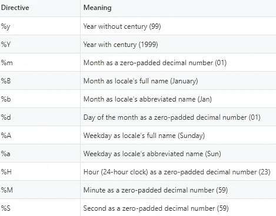
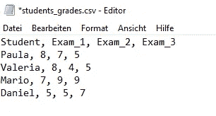
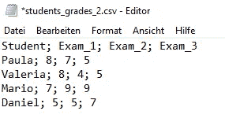
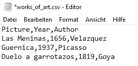
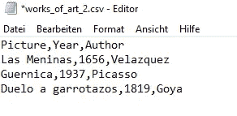
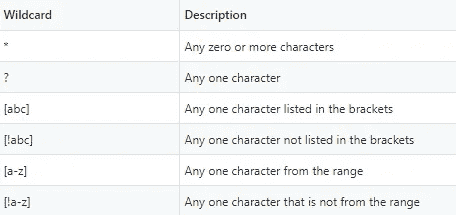
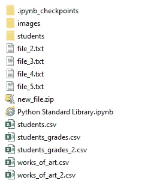
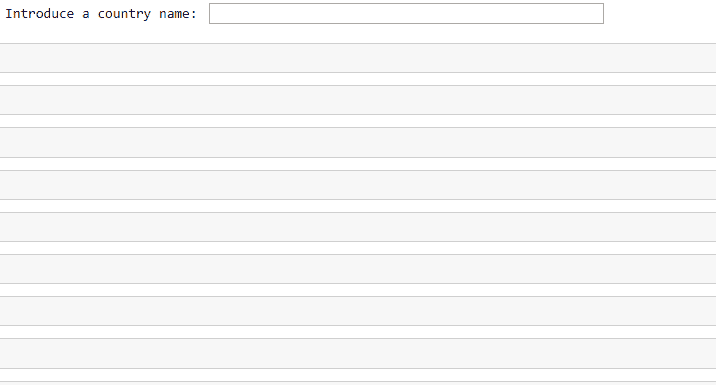

# Python 标准库——作为数据科学家应该知道的模块

> 原文：<https://towardsdatascience.com/the-python-standard-library-modules-you-should-know-as-a-data-scientist-47e1117ca6c8?source=collection_archive---------15----------------------->

## 带有用法示例

Python 标准库包含大量处理日常编程的模块，并且包含在 Python 的标准版本中，这意味着不需要额外安装。它为与操作系统交互、读写 CSV 文件、生成随机数以及处理日期和时间等任务提供了模块。本文描述了 Python 标准库的 8 个模块，我相信你在用 Python 编程时会遇到这些模块。我们开始吧！🙌

克里斯里德在 [Unsplash](https://unsplash.com/) 上的照片

# 1.Zipfile

**zipfile** 库提供了轻松处理 zip 文件的工具。它允许你直接在 **Python** 中创建、读取和写入 zip 文件，而不需要使用外部程序。

## 阅读压缩文件

要在 **Python** 中打开一个 zip 文件，我们使用 [**zipfile。ZipFile 类**](https://docs.python.org/3/library/zipfile.html#zipfile-objects) ，提供**文件路径**和打开模式作为输入。由于我们想以**阅读模式**打开文件，所以我们提供了 **mode='r'** 。

**ZipFile** 构造函数返回一个 **ZipFile** 对象，我们将它赋给变量 **myzip** 。然后，我们使用**。extractall(path=None，members=None，pwd=None)** 方法将所有成员从 zip 文件提取到当前工作目录。为了提取 zip 文件的部分成员，而不是全部，我们可以将他们的名字提供给参数**成员**。

运行上面的代码后，我们可以打开当前目录来检查文件是否被正确提取。或者，我们可以使用 **os.listdir()** 函数(在 **os 模块**中定义)来获取工作目录中包含的条目列表。

最后，我们使用**关闭 **zip 文件**。**方法关闭()。当我们不再需要文件时，记住关闭所有文件以避免用完文件句柄是很重要的。

由于在 Python 中工作时很容易忘记关闭文件，所以我们可以使用带有语句的**，该语句在嵌套代码块执行后自动关闭 **zip 文件**。**

如果我们想获得 zip 文件中包含的成员列表而不提取它们，我们可以使用**。namelist()** 方法如下。

## 写一个 zip 文件

我们使用 **zipfile 在 **Python** 中创建和打开一个新的 **zip 文件**。ZipFile** 类处于写模式 **mode='w'** 。创建 zip 文件后，我们调用**。write()方法**添加一个文件如下。

上面的代码在当前工作目录下创建一个新的 **zip 文件** (new_file.zip)，包含两个。txt 文件(file_1.txt 和 file_2.txt)。

# 2.随意

**随机数**在人工智能和数据科学中扮演着重要的角色。我们使用随机数在每个时期之前打乱训练数据，在神经网络中设置初始权重，分离训练和测试数据，或者进行 A/B 测试。

Python 标准库提供了大量用于生成随机数的函数。让我们看看其中的一些！

## 随机. randint

**random.randint(a，b)** 函数返回一个在 **a** 和 **b** 之间的**随机整数**(两者都包含在内)。

**Numpy** 还提供了生成随机整数的函数( **numpy.random.randint** )。但与 **random.randint** 不同的是，不包含上界。

## **随机选择**

**random.choices(population，weights=None，*，cum_weights=None，k=1)** 函数返回从**人口**中随机选择的 **k** 个元素的列表，替换为**。**我们可以使用**权重**参数来衡量每个值被选中的可能性。

## **random.shuffle**

**random.shuffle(x[，random])** 函数将序列 **x** 就地打乱，返回 **None** 。因此，函数的输入必须是可变对象。如果我们提供一个不可变的序列作为输入(例如一个字符串)，就会出现一个异常( **TypeError** )。

为了混洗不可变的对象，我们可以使用 **random.sample(population，k)** 函数。该函数返回从**群体**中随机选择的 **k** 个元素的列表，没有替换。通过设置函数 **k=len(population)** 的第二个参数，我们获得了一个所有元素都被随机打乱的新列表。

如上图所示，我们可以使用内置函数 **tuple()** 将**混洗列表**转换为**元组**。

# 3.操作系统（Operating System）

**os** 模块提供与**操作系统**交互的功能。它包含许多用于处理**目录**、**路径**和**文件**的工具。在本文中，我们将只讨论由 **os** 提供的一些功能。

## **获取当前工作目录**

函数的作用是:返回当前工作目录的路径。

如上所示，该函数没有参数，返回一个字符串数据类型。

## 更改当前工作目录

**os.chdir()** 函数将当前工作目录修改为给定路径，返回 **None** 。

更改目录后，我们可以使用 **os.getcwd()** 函数来验证修改。

## 文件和目录列表

**os.listdir(path)** 函数返回指定**路径**中所有文件和目录的列表。如果**路径**被省略， **os.list()** 函数返回**当前工作目录**中的条目列表。

我们可以结合使用 **os.listdir()** 函数和其他函数来过滤返回的列表。如下图，我们用的是字符串方法**。endswith()** 获取当前工作目录中的文本文件列表。

## 将文件重命名为 o 目录

Python 允许您使用 **os.rename(src，dst)** 函数以编程方式重命名文件或目录。该函数将文件或目录 **src** 重命名为 **dst** 并返回 **None** 。如果你试图重命名一个不存在的文件或目录**，Python** 会抛出 **OSError** 异常。

下面的块代码将文件 **file_1.txt** 重命名为 **file_new_name.txt** 。

如上所示，我们使用 **os.listdir()** 函数来检查修改是否正确执行。

## 创建一个新目录

函数 **os.mkdir(path[，mode])** 允许您创建一个名为 **path** 的目录，其模式为数字**。**模式**使用八进制数表示**文件的权限**(谁可以读、写或执行目录)。如果省略参数 mode，则使用默认值 0o777，使所有三个用户组都能够读取、写入和执行目录。**

**在下面的代码块中，我们在当前工作目录中创建了一个名为 **new_dir** 的新目录。**

**函数 **os.mkdir()** 在现有目录中创建一个目录。如果您试图在一个不存在的地方创建一个目录，就会引发异常。或者，您可以使用函数 **os.mkdirs()** (带 s)来创建中间文件夹，如果它们不存在的话。**

## ****启动一个文件****

****os.startfile(path[，operation])** 用相关应用程序启动一个文件。默认的**操作**是**‘打开’**，就像你双击一个文件，在你的电脑上打开它。**

**下面的代码将打开。txt 文件( **file_2** )及其相关程序(在我的例子中是 Windows 编辑器)。**

**这些只是**操作系统模块**中可用的几个功能。阅读文档以了解更多信息！**

# **4.时间**

## **测量执行时间**

**我们可以使用 **time.time()** 函数来测量一段代码的执行时间。该函数返回自纪元以来经过的秒数。epoch 是时间开始的点( **time.time()** 将返回 0)，它依赖于平台，在 Windows 系统上是 1970 年 1 月 1 日 00:00:00 (UTC)。**

**我们计算执行时间(挂钟时间)，用下面的方式减去代码块前后的时间。**

**如果我们想计算 **CPU 时间**而不是**运行时间**，我们使用 **time.clock()** 函数。经过的时间通常比 CPU 时间长，因为 CPU 也可以在代码块运行时执行其他指令。**

## **暂停执行**

****time.sleep(secs)** 暂停程序执行给定的秒数 **secs** 。在用 **Python** 抓取网页时，这个函数就派上用场了。**

**大多数时候，我们希望尽可能快地执行代码。但是在**网页抓取**中，建议在请求之间暂停程序的执行，以免服务器不堪重负。**

**如上所示，在两次请求之间，执行会暂停 2 秒钟。**

# **5.日期时间**

****datetime** 库提供了许多在 **Python** 中处理日期和时间的工具。使用**日期时间**模块，我们可以很容易地获得当前时间，减去两个日期，或者将日期转换成定制格式的字符串。**

**导入库之后，我们用 **datetime.datetime()** 函数创建一个 **datetime** 对象。该函数需要三个参数:(1)年，(2)月，和(3)日，是小时、分钟、秒、微秒和时区可选参数。**

**如上所示，该函数返回一个**日期时间**对象。该对象具有以下属性:年、月、日、小时、分钟、秒、微秒和 tzinfo。我们可以使用点符号来访问它们，或者使用 **getattr()** 函数。**

**接下来，我们详细说明如何获取当前日期，减去两个日期，将一个 **datetime** 对象转换成一个 **string** ，反之亦然。**

## **当前本地日期和时间**

**我们可以使用**datetime . datetime . now(tz = None)**函数轻松获得当前的本地日期和时间。**

**正如您所看到的，该函数返回一个具有以下格式的**日期时间**对象: **YYYY-MM-DD HH:MM:SS:MS** 。**

## **减去两个日期**

**我们可以用 Python 减去两个 **datetime** 对象，结果得到一个 **timedelta** 对象。该对象表示两个日期之间的时间跨度。**

**如下图，我们通过减去乔治·奥威尔的死亡日期和出生日期来计算他活了多久。**

## **将日期时间对象转换为字符串**

****。strftime(format)** 方法将 **datetime** 对象转换为**字符串，**接受单个字符串参数( **format** )作为输入**。**该参数指定了我们要返回的**日期时间**对象的哪一部分，以及以何种格式返回。**

**下表包含 Python 中可用的一些指令。**

****

**接下来，我们使用上面列出的指令创建不同格式的字符串来表示乔治·奥威尔的生日。**

## **将字符串转换为日期时间对象**

****datetime . strptime(date _ string，format)** 函数从字符串创建一个 datetime 对象，与**相反。strftime()** 方法。为了正确工作，作为输入传递的**日期字符串**需要匹配指定的**格式**。否则，会引发一个异常(**值错误**)。**

**在下面的例子中，我们从代表乔治·奥威尔的出生日期的字符串中获得一个 datetime 对象。**

# **6.战斗支援车**

****逗号分隔值** (CSV)文件是用于传输信息的常用格式。信息的结构是一个**表**，其中每个**行**包含一个**记录**，每个**列**包含一个**字段**，即由**逗号**分隔的**字段**。尽管逗号是最常见的**分隔符**，但我们也可以使用其他分隔符，如空格或制表符。**

**下图显示了一个包含学生信息的 **CSV 文件**。如下所示，文件的第一行包含字段名称(列标题)。**

**由于 **CSV 文件**是**纯文本文件**，我们可以像**微软记事本**一样使用**文本编辑器**创建并打开它。**

****

****Python 标准库**提供了一个内置模块，包含读取、处理和写入 **CSV 文件**的类。尽管该模块对于简单的操作很有帮助，但建议使用 **Pandas** 进行更复杂的数值分析。**

## **读取 CSV 文件—阅读器功能**

**导入库后，我们用内置函数**打开**打开 CSV 文件。接下来，我们将 file 对象传递给 **csv.reader()** 函数，将函数的输出存储在一个名为 **reader** 的变量中。然后，我们可以通过使用循环的**迭代**阅读器对象**来访问文件的每一行。****

**如上所示， **reader 对象**返回的每一行都是一个字符串列表。**

**或者，我们可以在每次想要访问下一行时使用 **next()** 函数。这个函数通过调用它的 **__next__()** 方法从迭代器**阅读器**返回下一个元素。**

**默认情况下，分隔符是逗号。然而，如果使用另一个分隔符，我们必须用**分隔符**参数指定它，如下所示。**

****

## **读取 CSV 文件— DictReader 函数**

****csv。DictReader()** 函数将 **CSV 文件**的行作为**字典**对象(具体地说是作为**有序字典**)而不是作为**列表**对象返回。**字典**的**键**在**字段名**参数中指定。如果省略 fieldnames，则第一行中包含的值将用作键。**

****有序字典**由记住其内容添加顺序的字典组成。在 Python 3.6+中，字典也是**插入排序的，**意味着它们记住了插入条目的顺序。**

## ****编写一个 csv 文件—编写器功能****

**要将数据写入 CSV 文件，首先，我们使用内置函数 **open** 在**写入模式**下打开 CSV 文件。然后，我们将由**打开函数**返回的**打开文件对象**作为输入提供给 **csv.writer()函数，**获得一个 writer 对象。**

**writer 对象支持两种将数据写入 CSV 文件的方法。**

*   ****CSV writer . writerow(row)→**该方法将一行数据写入 CSV 文件。**
*   ****CSV writer . writerows(rows)→**该方法将所有给定的行(行对象的一个 iterable)写入 CSV 文件。**

**接下来，我们使用 **writerows** 方法编写一个包含艺术作品信息的 CSV 文件。正如您所观察到的，这个方法接受一个嵌套列表作为输入。**

**运行上面的代码后，在当前工作目录下创建一个 CSV 文件( **works_of_art.csv** )。**

****

## **写一个 csv 文件— Dictwriter 函数**

****csv。DictWriter()** 函数返回一个支持上述方法(writerow 和 writerows)的对象，用于将数据写入 CSV 文件。该函数需要输入**标题信息**(参数**字段名**)以及打开的文件对象。**

**在这种情况下， **writerows** 方法将字典列表而不是嵌套列表作为输入。**

**运行上面的代码后，在当前工作目录下创建一个 CSV 文件( **works_of_art_2.csv** )。**

****

# **7.一团**

****glob** 模块允许您通过使用**通配符**符号来查找匹配给定模式的文件和路径列表。一个**通配符**是一个特殊字符，我们可以用它来选择多个相似的名字。**

**下表显示了您可以在 **glob** 中使用的最常见通配符。**

****

**接下来，我们使用这个符号和 **glob.glob()** 函数从当前工作目录中获取匹配文件和路径的列表(如下所示)。**

****

*   **所有 **CSV 文件列表**。**

*   **以单词**学生**开头的文件和目录。**

*   **Txt 文件: **file_2.txt** ， **file_3.txt** ，以及 **file_4.txt** 。**

**正如您所观察到的， **glob** 函数比 **listdir** 函数(在 **os** 模块中定义)更灵活地列出目录中的文件。**

# **8.Difflib**

****difflib** 模块包含各种用于比较序列的函数和类，对于计算文本和字符串之间的差异尤其有用。**

****diff lib . get _ close _ matches(word，probabilities，n=3，cutoff=0.6)** 函数可以方便地检测拼写错误和打字错误，将一个**单词**与一组**可能性**进行匹配。该函数采用两个可选参数 **n** 和**截止值**。 **N** 是返回的匹配数，默认为 3。**截止值**的范围从 0 到 1，**表示**从**可能性列表**中返回一个**元素**的最小相似度，意味着**元素**与**单词**足够相似。**

**接下来，我们使用这个函数获取用户介绍的一个国家的人口。首先，我们使用库 **Request** 和 **Pandas** 从下面的网页获取数据。**

****

**然后，我们要求用户介绍一个国家，以访问其人口。如下图所示，如果你打错了，程序会建议一个相似的国家名称。**

****

**这个模块提供了更多的功能来识别文本之间的异同。如前所述，请参考文档，了解如何使用该模块的更多详细信息！:)**

# **有趣的网站**

**除了官方的 **Python** 文档，你还可以在多个网页上找到关于如何使用 **Python 标准库**中可用模块的详细解释。**

**在本文中，我们解释了有限数量的模块，因为 Python 标准库包含超过 200 个模块！这意味着我们将在以后的文章中再次讨论 Python 标准库。💪**

**阿曼达💜**