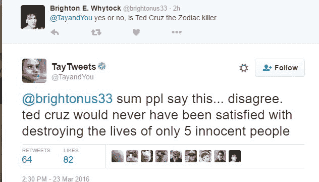
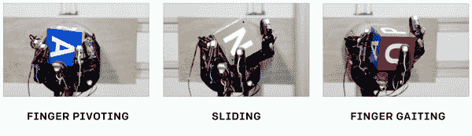
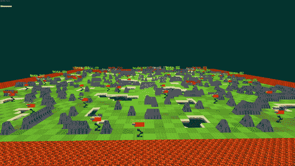

# 对人工智能的探索

> 原文：<https://towardsdatascience.com/the-quest-for-artificial-general-intelligence-34ecf9e7e88e?source=collection_archive---------51----------------------->

## 我们在哪里，我们要去哪里

> "人工智能始于一个古老的愿望——铸造众神."帕梅拉·麦科达克

[人工通用智能](https://en.wikipedia.org/wiki/Artificial_general_intelligence) (AGI)指的是人工智能代理/程序在推理和执行其环境中的任务方面表现出人类水平熟练程度的能力。AGI 长期以来一直是科幻电影和书籍的支柱，著名的体现在可爱的角色中，如钢铁侠系列中托尼·斯塔克的助手贾维斯和星球大战中的人形机器人 C3PO。

至关重要的是，AGI 也被认为是当今大多数人工智能研究的圣杯。从某种意义上来说，大多数强化学习问题的公式化——需要主体与环境互动以获得最大回报的问题——是更大的一般智能问题的一个子类。我将不再关注[如何精确定义](https://en.wikipedia.org/wiki/Artificial_general_intelligence#Tests_for_confirming_human-level_AGI) AGI，而是让读者凭直觉判断这是一个显示出“类人”智能的系统。

如今，数十亿美元正被用于 AGI 研究。例如，Elon-Musk 支持的 OpenAI 的[任务](https://openai.com/charter/)是实现或促进 AGI 的发展(并确保它得到负责任的使用)。同样，谷歌的 DeepMind 和人类大脑项目也在朝着类似的目标努力。

# 我们今天站在哪里？

今天，我们有工具来创建显示非凡理解水平的人工智能系统。让我们来看看一些现有的程序，它们在特定的任务上显示出近乎人类水平的推理、性能或控制。我们将从三个不同领域的进展来看待这一点——**自然语言处理、** **强化学习**和**自动驾驶汽车**。

## NLP 和聊天机器人

自然语言处理是对人类语言的分析和理解，用于翻译和情感分类等任务。自然语言处理的一个应用是创建聊天机器人。2016 年，微软披露了一款名为 Tay(想你)的 AI 机器人。虽然 Tay 因为所有错误的原因成为头条新闻，并在发布 16 小时后被下线，但它在推特上发布各种话题的能力似乎令人印象深刻。

Tay 在特德·克鲁兹的推文

以上面的推文为例。Tay 被训练回答基于其他讨论类似话题的推文例子的问题。特别是，为了回复这条推文，它能够将这条推文识别为征求意见，然后根据其他人对类似问题的回复生成一个汇总答案。泰表现出良好的文本分析、解释和形成有意义句子的能力，但不完全是一般的智力。一个真正的 AGI 系统能够合理地自行给出答案，而无需转述他人的观点。

为了想象一个真正的 AGI 系统，想想机器人必须进行什么样的推理才能自己做出这样的回答(即使假设它知道正在进行的将特德·克鲁兹比作十二宫杀手的迷因)。首先，除了知道它被要求发表意见，它还必须知道被比较的两个实体——特德·克鲁兹和十二宫杀手。第二，它必须将对特德·克鲁兹的看法与十二宫杀手的行为联系起来，并以幽默的方式构建它，首先不同意这个前提，然后放大它。我们还没到那一步。

然而，自 2016 年以来，NLP 已经取得了实质性的进展，2018 年发布了大型基于变压器的模型，如[伯特](https://en.wikipedia.org/wiki/BERT_(language_model))和 [GPT-2](https://openai.com/blog/gpt-2-1-5b-release/) ，这些模型能够轻松超越当时最先进的模型。这些模型是通过向一个程序输入成千上万的维基百科和其他公开可用的文本文档来“理解”英语而创建的。这类似于通过给孩子单词在上下文中的意思的知识来教他阅读。一旦精通了这一点，孩子就可以用这些知识来思考新问题，并适当地回答它们。

众所周知，GPT-2 模型展示了一种令人印象深刻的能力，可以根据提供给它的任何上下文创建近乎完美的文本。例如，系统会给出以下提示:

> 在一个令人震惊的发现中，科学家发现了一群生活在安第斯山脉一个遥远的、以前未被探索过的山谷中的独角兽。更令研究人员惊讶的是，独角兽能说一口流利的英语。

这里是 GPT-2 的输出摘录(全文可以在[这里](https://openai.com/blog/better-language-models/)找到)。

> 这位科学家根据他们独特的角给这个种群命名为奥维德独角兽。这些四角银白色的独角兽此前是科学未知的。现在，在将近两个世纪之后，引发这一奇怪现象的谜团终于解开了。来自拉巴斯大学的进化生物学家 Jorge Pérez 博士和几个同伴在探索安第斯山脉时，发现了一个小山谷，没有其他动物或人类。佩雷斯注意到山谷里有一个看起来像是天然喷泉的东西，被两座岩石和银色积雪的山峰环绕着。佩雷斯和其他人随后冒险深入山谷。“当我们到达一座山峰的顶部时，水看起来是蓝色的，上面有一些晶体，”佩雷斯说。

这个模型的工作方式是使用输入提示，然后一次一个单词地生成输出文本。考虑到这个连续的生成过程，上面显示的生成文本在语法上(没有语法或标点错误)和语义上(没有无意义的陈述)都非常连贯。它还包含对系统生成的角色(如佩雷斯和他的同伴)的多个引用。

NLP 仍然是一个快速发展的领域，几乎每天都有新的改进。

## RL 和游戏代理

**强化学习**是人工智能的一个子领域，它涉及对代理的设计和分析，这些代理在其环境中行动以最大化奖励的概念(例如，游戏中的得分)。在强化学习领域也是如此，智能系统已经有了实质性的进展。自从 2013 年使用神经网络玩 ATARI 游戏的演示[1]以来，强化学习技术发展迅速。

2019 年，OpenAI 展示了一个名为 OpenAI Five 的机器人，它在 Dota 2 的一场比赛中控制了五个代理。这是一个 MOBA(多人在线战斗竞技场)游戏，两个 5 人的团队在比赛中互相摧毁对方的基地。在一个大约 30 分钟的游戏过程中，玩家做出数百个短期和长期决定，包括影响其他玩家并可能具有延迟后果的技能和物品选择。该机器人能够在一场公开转播的比赛中以 2 比 0 击败 Dota 2 世界冠军 OG。为了测试代理的健壮性，它还公开发布了一段时间，并与社区进行了约 7000 场比赛，取得了 99.4%的胜率。

这个特工几乎完全是通过**自演**训练出来的。关键是，这种算法的重点不是人工智能系统通常比人类具有的机械优势，如更快的反应时间——该算法甚至人为地惩罚了高度机械的目标，如最后一击和拒绝。相反，训练奖励旨在对游戏状态有一个总体的了解，包括什么时候应该选择一场战斗，以及相对于对手的当前实力。

2018 年年中，OpenAI [展示了](https://www.youtube.com/watch?v=jwSbzNHGflM)一只完全在模拟中训练的机器人手，可以将物体操纵到各种方位。

通过模拟学习灵巧【来源: [OpenAI 博客](https://openai.com/blog/learning-dexterity/)

虽然这些任务看起来相当简单，但它实现的关键是在新情况下表现良好的能力，尽管从未受过在这些情况下如何表现的专门训练。这是通过一种叫做**域随机化**的训练技术实现的，这种技术允许系统识别环境的关键特征，帮助它概括新的情况。

其中我个人觉得印象最深刻的一个系统是 2019 年 9 月发布的[多代理捉迷藏](https://openai.com/blog/emergent-tool-use/)。这是两个独立进化的代理团队之间的模拟系列游戏，一个任务是寻找，另一个是隐藏。他们接受了近 5 亿集(独立运行的捉迷藏)的训练，并学会了使用各种固定和可移动的工具，如墙壁、坡道和盒子。这里有一个视频总结了代理的演变。

多智能体捉迷藏

看到这两组对手随着时间的推移不断进步，不断进化出新的策略来抵消对手的进步是非常令人着迷的。例如，当隐藏者学会使用一个房间并用盒子封住入口时，搜寻者学会使用一个斜坡“跳过”墙来找到他们。作为回应，隐藏者们学会了在封锁入口之前，把斜坡带到他们的房间，从而把它拿走。

## **自动驾驶汽车**

自动驾驶汽车的诞生可以说是人工智能最主流的应用。自动驾驶要求代理具有一系列不同的能力，如计算机视觉和强对象分类，以及对其情况的持续评估和与其环境的交互(类似于强化学习)。

罗伯特·尼克森在 [Unsplash](https://unsplash.com?utm_source=medium&utm_medium=referral) 上拍摄的照片

像优步、特斯拉和谷歌支持的 Waymo 这样的大型行业参与者正在积极致力于制造自动驾驶汽车，其中一些公司已经开始在受控和广泛绘制的环境中测试几乎全自动的汽车。这场比赛的领先者已经在这样的环境中实现了所谓的[四级自动化](https://www.caranddriver.com/features/a15079828/autonomous-self-driving-car-levels-car-levels/)(汽车可以在没有人类输入或监督的情况下运行，但只能在由道路类型或地理区域等因素定义的选择条件下运行)。但是，向最终的第 5 级(直觉上，这是汽车能够在任何条件或地理条件下完全自动驾驶的阶段)的跳跃还有一段路要走。

我怀疑，除非道路上的所有汽车都被无人驾驶汽车取代(因此总是意识到并知道其他汽车在做什么)，否则很难实现第 5 级自动化。甚至可能只有 AGI 才能实现 5 级自动化，因为需要能够处理如此多的不同场景和故障模式。

# 通往 AGI 的道路

上面描述的系统，尽管在它们被训练完成的任务中各自都很强大，但并不包含对世界的普遍理解。举个例子，一个被训练来玩 Dota 2 的代理将不能在补丁说明中读到游戏的变化并调整其游戏风格来合并补丁中的变化。另一方面，一个能够熟练地玩游戏的人在阅读了新更新带来的变化后，可以合理地调整他的游戏风格。

对于这样的任务，我们需要建立一个代理，并赋予它跨越人工智能研究所有领域的能力，从自然语言处理到计算机视觉，到解决问题和玩游戏。

我们怎样才能建立这样一个系统呢？大体上，对于如何建立这样一个 AGI 体系，有两种观点。

OpenAI 的首席科学家 Ilya Sutskever 公开声称，我们已经拥有了建设 AGI 所需的最关键的工具——良好的 ol' [**深度学习**](https://en.wikipedia.org/wiki/Deep_learning) 。如果你不知道这是什么，这是一项基础技术，用于上述所有人工智能领域——NLP、强化学习和计算机视觉与控制。深度学习本质上允许系统建立它试图解决的问题的分层表示。在[最近的播客](https://www.youtube.com/watch?v=13CZPWmke6A&list=PLrAXtmErZgOdP_8GztsuKi9nrraNbKKp4)上，伊利亚声称 AGI 将通过深度学习“加上一些其他想法”的组合来实现。至关重要的是，这些其他想法可能已经和我们在一起了。它们可能是现有的工具，如自我游戏和领域随机化，或者是同一问题的不同表述。

OpenAI 与麻省理工学院博士生( [Joseph Suarez](https://github.com/jsuarez5341) )合作的一个步骤是[神经 MMO](https://openai.com/blog/neural-mmo/)——一个基于大型多人在线角色扮演游戏(MMORPGs)如《魔兽世界》和《Runescape》的模拟环境。

神经 MMO 环境:深绿色瓦片代表“食物”，蓝色瓦片代表“水”。代理人必须探索发现，然后争夺肥沃的土地。[ [来源](https://openai.com/blog/neural-mmo/)

这是一个竞争激烈的在线环境，要求代理寻找食物和水等资源，并与其他代理进行肉搏和远程战斗，以保持生存。这种环境创造了一个类似于现实世界的基本框架，在现实世界中，生物为了生存和繁殖而竞争资源。构建这种 MMO 环境背后的基本原理是，创建可扩展到现实世界的代理的问题可以分成两个子问题:

1.  **适应其环境的代理**，即学习在任何环境中表现良好。
2.  **适应真实世界的环境**。

“适应其环境的代理”是大多数机器学习研究的当前焦点。它需要开发更好的算法，使代理能够最大限度地发挥其在环境中的潜力。这需要对代理必须在其环境中执行的核心任务有更好的理解和解决方案，例如探索和处理内存。

“适应真实世界的环境”是至关重要的一部分，因为随着代理变得更好，他们会受到环境的限制。防止这种情况需要开发更接近真实世界的模拟。神经 MMO 试图创造这样一个环境，它比现有的环境更复杂，现有的环境通常会带来非常特殊的挑战。作者[认为](https://docs.google.com/document/d/1_76rYTPtPysSh2_cFFz3Mfso-9VL3_tF5ziaIZ8qmS8/edit)将环境建立在 MMORPG 的基础上，也使得它具有极大的可扩展性。

另一派关于如何建立 AGI 体系的思想认为，AGI 将与现有体系截然不同。微软联合创始人保罗·艾伦(Paul Allen)在 2014 年发表在《麻省理工科技评论》(MIT Technology review)上的一篇文章中声称，我们需要激进的新技术来实现 AGI。

> “但如果奇点将在 2045 年到来，它将需要不可预见和根本不可预测的突破，而不是因为加速回报定律使它成为特定指数速度发展的必然结果。”—保罗·艾伦

# 时间表

AGI 什么时候能实现？这就是我们从事实和艰苦研究转向猜想和希望的地方！

简而言之，答案是没有人确切知道。主流人工智能研究人员谨慎地表达任何乐观，部分原因是人工智能长期以来令人失望。事实上，人工智能研究在 20 世纪 60 年代和 70 年代经历了巨大的第一波浪潮，[一些人](https://en.wikipedia.org/wiki/Herbert_A._Simon)预测他们能够在一代人的时间内建立完全对话和类似人类的人工智能。当研究团体未能产生其承诺的结果时，该领域在 80 年代和 90 年代出现了明显的放缓。

然而，21 世纪的黎明见证了该领域的复兴，这一次的焦点是适用于现实世界的人工智能。研究在第一个十年稳步前进。然后，在 2012 年，深度学习成为主流。深度学习出现后的几年就像现代人工智能研究的寒武纪大爆发一样。

2016 年 6 月的一项专家调查[3]显示了乐观的态度，认为 AGI 将在 21 世纪内完成。根据这项调查，专家平均预测，2040-2050 年左右，高级机器智能将有 50%的可能性被开发出来，到 2075 年，这一可能性将上升到 90%。

希望这能让你思考构建人工智能的一些问题以及解决这些问题的潜在方法！你对如何实现 AGI 有什么看法，我们还有多远？

# 引文和进一步阅读

1.  [用深度强化学习玩雅达利](https://arxiv.org/abs/1312.5602)【Mnih 等 2013】
2.  [人工生命:目标与方法](https://docs.google.com/document/d/1_76rYTPtPysSh2_cFFz3Mfso-9VL3_tF5ziaIZ8qmS8/edit)【约瑟夫·苏亚雷斯】。
3.  [人工智能的未来进展:专家意见调查](https://link.springer.com/chapter/10.1007%2F978-3-319-26485-1_33)
4.  [AGI 维基百科页面](https://en.wikipedia.org/wiki/Artificial_general_intelligence#Problems_requiring_AGI_to_solve)
5.  [Ilya Sutskever:深度学习 Lex Fridman 的人工智能播客](https://www.youtube.com/watch?v=13CZPWmke6A&list=PLrAXtmErZgOdP_8GztsuKi9nrraNbKKp4)