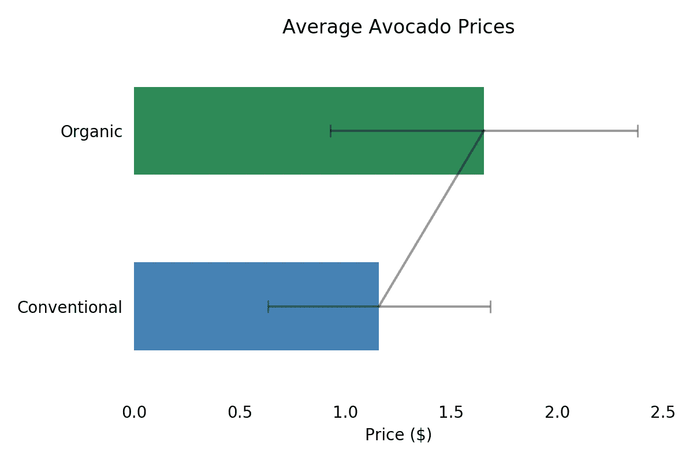
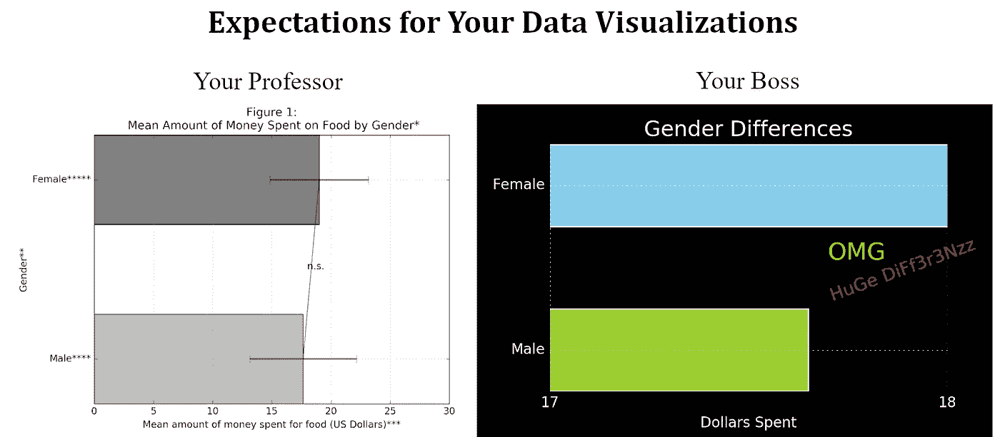
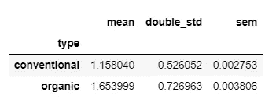
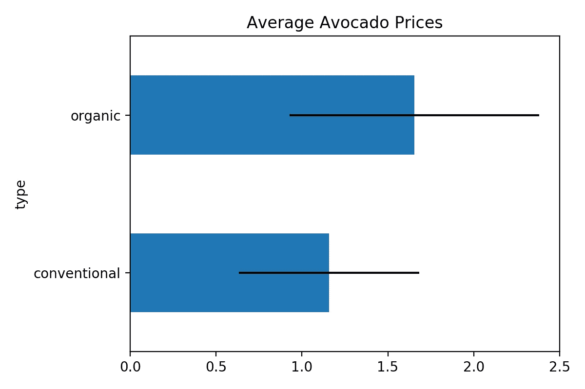
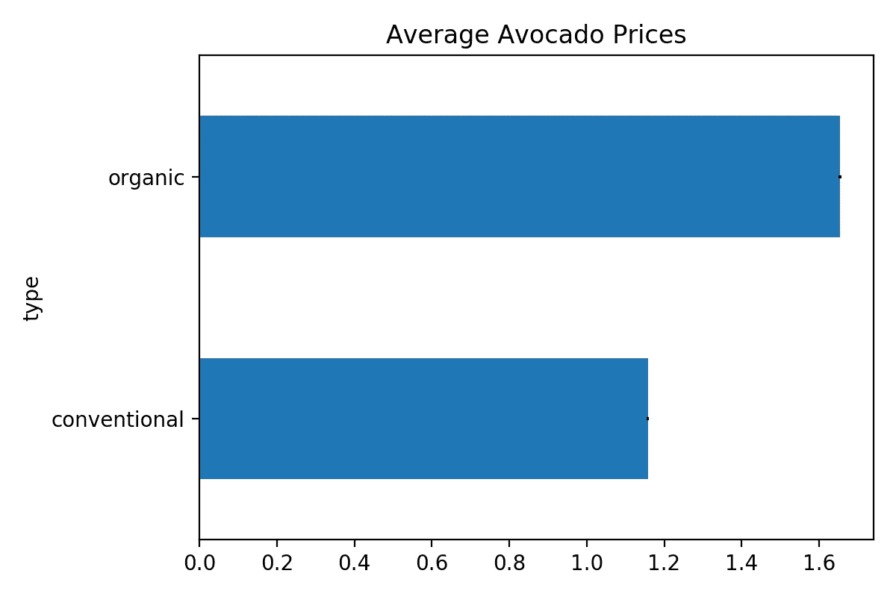

# 使用 Pandas 在 Python 中快速简单地绘制误差线

> 原文：<https://towardsdatascience.com/the-quick-and-easy-way-to-plot-error-bars-in-python-using-pandas-a4d5cca2695d?source=collection_archive---------8----------------------->

## 不需要一行额外的代码！



# 为什么你需要学习这个

在科学研究中，在你的描述性可视化中显示误差线是不可避免的。它们包含了关于数据可变性的信息，是对平均分数的必要补充。然而，科学形象的内在往往比外在更美丽。

作为**的数据科学家**，我们被教导使用有吸引力的可视化来讲述故事。任何分散观众注意力的东西都应该被删除。这非常有意义，因为经理和客户通常既没有很好地掌握统计数据，也没有太多的时间和精力花在你的可视化上。

要解释误差线，您需要:

*   对描述性统计的基本理解
*   显示哪种误差线的信息(通常是标准差或标准误差)

这两个假设都与数据故事讲述者的目的相冲突。你希望**任何人**理解结果**而**不必通读八行音符。

数据故事讲述者将误差线视为障碍，因为它们妨碍了对数据的简单、舒适和统一的解释。另一方面，科学家被训练显示所有必要的信息，并让读者自己解释结果。这两种方法都不优越。在技术报告或数据团队会议中过分简化结果，就像用自发的统计学讲座来烦你的经理和客户一样，都是不利的。



> 对于任何愿意证明其数据科学职称中的“科学”的人来说，学习何时以及如何使用误差线是不可避免的！

当我为我的第一篇科学文章创建可视化时，我尝试了许多不同的方法。让我节省你一些时间，给你介绍一下我找到的又快又简单的方法。按照这篇文章并自己应用该方法，您需要的只是一些统计学、python 和 pandas 库的基础知识。

# C计算

有两个主要参数适用于误差线。

1.  (2x)标准偏差
2.  标准误差

我强烈建议您熟悉这些参数，这样您就可以做出明智的决定，为您的可视化使用哪个参数。在克劳迪娅·克莱门特的这篇文章中，这些概念以一种完美压缩的方式被解释。

首先，我们需要导入我们的库并加载我们的数据。我们将使用来自 kaggle 的[鳄梨价格数据集。你不需要太了解数据集。我们只想知道常规鳄梨和有机鳄梨(“类型”列)的价格是否不同(“平均价格”列)。](https://www.kaggle.com/neuromusic/avocado-prices)

```
# Imports
import pandas as pd
import numpy as np # for calculating standard deviation and mean
import scipy.stats as sp # for calculating standard error
import matplotlib.pyplot as plt # for improving our visualizations# Read data
avocado = pd.read_csv("avocado.csv")
```

执行我们的计算最简单的方法是使用熊猫 [**df.groupby**](https://pandas.pydata.org/pandas-docs/stable/reference/api/pandas.DataFrame.groupby.html) **函数。**这个函数有许多有用的应用，但在这种情况下，我们将使用它进行统计参数的聚合计算。下面，你可以看到代码原型。

```
df.groupby("col_to_group_by").agg([func_1, func_2, func_3])
```

> 我们使用 df.groupby.agg 来快速简便地计算组比较的统计参数。

我们已经有了要分组的数据帧和列，所以我们现在需要找到正确的函数。记住，我们需要平均值，标准差 x 2 和标准差。这些是我们需要的功能:

**NumPy**

*   平均:np .平均
*   标准差:np.std

**SciPy**

*   标准错误:scipy.stats.sem

因为 df.groupby.agg 函数只接受一个函数列表作为输入，所以我们不能只使用 np.std * 2 来得到我们的双倍标准差。但是，我们可以只写自己的函数。

```
def double_std(array):
 return np.std(array) * 2
```

现在，让我们使用原型代码并填充占位符。

```
# df.groupby("col_to_group_by").agg([func_1, func_2, func_3])
avocado_prices = 
avocado.groupby("type").agg([np.mean, double_std, sp.sem])
```

不错！现在，让我们只选择“AveragePrice”列，因为我们不需要其余的。

```
avocado_prices = avocado_prices["AveragePrice"]
```

avocado_prices.head()现在给出了以下输出:



表 1 — df.groupby.agg 输出

太好了！现在我们有了所有需要的数据。

# **可视化**

Pandas 有一个非常有用的功能，可以让我们快速获得第一次可视化，而无需经历整个 matplotlib 过程: [**df.plot**](https://pandas.pydata.org/pandas-docs/version/0.23.4/generated/pandas.DataFrame.plot.html)

这基本上是熊猫内部的 matplotlib 表示。

为了得到没有任何误差线的第一个图，我们只需要**一行代码**:

```
avocado_prices.plot(kind = "barh", y = "mean", legend = False, title = "Average Avocado Prices")
```

**输出:**


图 1-没有误差线

我们可以看到，有机鳄梨的平均价格高于传统鳄梨。但这是真正的差异还是只是随机传播？正如我在副标题中承诺的，**我们不需要一行额外的代码**来使用误差线回答这个问题。我们需要做的就是将我们的统计参数赋给 xerr 参数。让我们从“double_std”参数开始:

```
avocado_prices.plot(kind = "barh", y = "mean", legend = False, title = "Average Avocado Prices", xerr = "double_std")
```

**输出:**



图 2 —标准偏差 x 2 误差线

他们在那里！即使没有深入了解如何解释这些误差线，我们也可以看到价格的可变性相当高，并且每个误差线与另一个误差线相接触。也许这种差异并不像我们从第一个情节中所预期的那样明显和巨大？同样，我不会深入解释标准差和标准误差，因为这是一个实用指南。只是注意这个剧情给我们留下的印象和上一个不一样。

如果我们接下来画出标准误差，会发生什么？

```
avocado_prices.plot(kind = "barh", y = "mean", legend = False, title = "Average Avocado Prices", xerr = "sem")
```

**输出:**



图 3 —标准误差线

什么？误差线几乎看不见。标准误差对样本大小很敏感，因为它在大样本中比在小样本中低。鳄梨样本有超过 250，000 次观察，所以结果是合理的。这第三个情节又给人留下了完全不同的印象！

> 你是否以及如何使用误差线对你的可视化所讲述的“故事”有很大的影响。理解误差线背后的统计数据对于正确使用和解释它们是至关重要的。

到目前为止，我们从一行代码中得到了**非常好的结果。如果我们花更多的时间来改进我们的可视化，我们可以得到类似图 4 的东西。**

```
ax = avocado_prices.plot(kind = "barh", y = "mean", legend = False, title = "Average Avocado Prices", colors = ["steelblue", "seagreen"]) # no error bars added here# X
ax.set_xlabel("Price ($)")# Y
ax.set_ylabel("")
ax.set_yticklabels(["Conventional", "Organic"])# Overall
for key, spine in ax.spines.items():
    spine.set_visible(False)
ax.tick_params(bottom = False, left = False)
ax.errorbar(avocado_prices["mean"], avocado_prices.index, xerr = avocado_prices["double_std"], 
            linewidth = 1.5, color = "black", alpha = 0.4, capsize = 4)
```

**输出:**


图 4 —最终图

用 python 创建误差线非常简单！使用一些高级的 pandas 函数，我们可以只用两行代码就从数据帧到有(或没有)误差线的可视化！但是，如果您还没有学习误差线背后的统计数据，您需要先学习一下。您看到了三个图(无误差棒线对虚线标准差对标准差)看起来有多么不同。起初这可能看起来很可怕，但是一旦你学会了，它是你数据科学技能组合中另一个非常有用的工具。

**感谢阅读！**